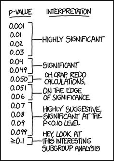

---
output:
  beamer_presentation:
    keep_tex : true
    includes: 
      in_header: anderson_header_samplesize.txt
      before_body: anderson_beforebody.txt
---

```{r setup, include=FALSE}
knitr::opts_chunk$set(echo = TRUE)
library(dplyr)
library(tidyr)
library(ggplot2)
library(gridExtra)
library(memisc)
```

## Course notes and reading

\begin{block}{Course notes}
A pdf of these coursenotes can be downloaded at: \\ \medskip
\url{https://github.com/geanders/GuestLectures/blob/master/AdvancedEpi/sample_size.pdf}
\end{block}

\begin{block}{Required reading}
Required reading for this lecture is: \\ \medskip
Woodward. 2014. Sample size determination. Chapter 8 of \textit{``Epidemiology: Study Design and Data Analysis."} Third Edition, Chapman \& Hall, Boca Raton, FL. \\ \medskip
Examples in this lecture come from this reading. 
\end{block}

## Example: Smoking prevalence in a country

\begin{block}{Smoking prevalence in a county}
A country's government is interested in determining if the prevalence of smoking among males in the country is 30\%, or if it is higher. They plan to conduct a survey about smoking status in a simple random sample of 5,000 males in the population. A difference in smoking prevalence of 2 percentage points or more would be considered medically significant significant. The government would like to use a test with 5\% significance. Before running the study, the government would like to determine its anticipated power.
\end{block}

\footnotesize{\textit{Sources: Based on an example in Woodward (2014).}}

## Example: Smoking prevalence in a country

\begin{block}{Smoking prevalence in a county}
A country's government is interested in determining \textbf{if the prevalence of smoking among males in the country is 30\%}, or if it is higher. They plan to conduct a survey about smoking status in a simple random sample of 5,000 males in the population. A difference in smoking prevalence of 2 percentage points or more would be considered medically significant significant. The government would like to use a test with 5\% significance. Before running the study, the government would like to determine its anticipated power.
\end{block}

The null hypothesis for the study is that the prevalence of smoking in the population ($\pi$) is 30%:

$$
H_0 : \pi = \pi_0 = 0.30
$$

## Example: Smoking prevalence in a country

\begin{block}{Smoking prevalence in a county}
A country's government is interested in determining if the prevalence of smoking among males in the country is 30\%, \textbf{or if it is higher}. They plan to conduct a survey about smoking status in a simple random sample of 5,000 males in the population. A difference in smoking prevalence of 2 percentage points or more would be considered medically significant significant. The government would like to use a test with 5\% significance. Before running the study, the government would like to determine its anticipated power.
\end{block}

The alternative hypothesis is that the prevalence of smoking in the population ($\pi$) is higher than 30%:

$$
H_1 : \pi > 0.30
$$

## Example: Smoking prevalence in a country

\begin{block}{Smoking prevalence in a county}
A country's government is interested in determining if the prevalence of smoking among males in the country is 30\%, or if it is higher. They plan to conduct a survey about smoking status in \textbf{a simple random sample of 5,000 males} in the population. A difference in smoking prevalence of 2 percentage points or more would be considered medically significant significant. The government would like to use a test with 5\% significance. Before running the study, the government would like to determine its anticipated power.
\end{block}

The sample will be a simple random sample, with a sample size ($n$) of 5,000:

$$
n = 5000
$$

## Example: Smoking prevalence in a country

\begin{block}{Smoking prevalence in a county}
A country's government is interested in determining if the prevalence of smoking among males in the country is 30\%, or if it is higher. They plan to conduct a survey about smoking status in a simple random sample of 5,000 males in the population. \textbf{A difference in smoking prevalence of 2 percentage points or more would be considered medically significant significant.} The government would like to use a test with 5\% significance. Before running the study, the government would like to determine its anticipated power.
\end{block}

The size of the effect we'd like to detect ($d$) is two percentage points:

$$
d = 0.02
$$

## Example: Smoking prevalence in a country

\begin{block}{Smoking prevalence in a county}
A country's government is interested in determining if the prevalence of smoking among males in the country is 30\%, or if it is higher. They plan to conduct a survey about smoking status in a simple random sample of 5,000 males in the population. A difference in smoking prevalence of 2 percentage points or more would be considered medically significant significant. \textbf{The government would like to use a test with 5\% significance.} Before running the study, the government would like to determine its anticipated power.
\end{block}

The desired Type I error rate ($\alpha$) is 5%:

$$
\alpha = 0.05
$$

## Example: Smoking prevalence in a country

Next, let's think about the hypothesis test that we plan to conduct on the data that results from this study. 

In this case, an appropriate test of this hypothesis is a one-sided test of proportion. If we use a normal approximation to the binomial distribution, we can calculate the test statistic as: 

$$
z = \frac{p - \pi_0}{\sqrt{\pi_0(1-\pi_0)/n}} = \frac{p - 0.30}{\sqrt{0.30(0.70)/5000}}
$$

We can then compare this z-score to a critical value of $z_{0.05} = 1.6449$ (the critical value based on a desired significance of 5% for a one-sided hypothesis test). If $z > z_{0.05}$, we will reject $H_0$. 

\footnotesize{\textit{If you need a review of this, see Ch. 6.1 of OpenIntro Statistics.}}

## Example: Smoking prevalence in a country

Estimating the power of a study involves some "what if" thinking. Given the parameters of the study design and planned analysis, what might your data look like and what results might your analysis draw? 

The first "what if" to lay out are two hypotheses, a **null hypothesis** ($H_0$), that the true population prevalence is a certain value ($\pi_0$), and a specific **alternative hypothesis** ($H_a$), that the true population prevalence is a different value ($\pi_a$). 

$$ 
H_0 : \pi = \pi_0 = 0.30
$$
$$ 
H_a: \pi = \pi_a = \pi_0 + d = 0.32
$$

These hypotheses describe two different scenarios of true smoking prevalence in the full population. The difference, $d$, is the size of the effect we'd like to be able to detect. 

## Example: Smoking prevalence in a country

If there were no sampling variation in the prevalence of smoking in a sample compared to the prevalence in the population, here is how the survey results of the planned study might look under each of the two scenarios: 

\begin{table}[htbp]
  \centering
  \begin{tabular}{llD{.}{.}{0}D{.}{.}{0}D{.}{.}{0}}
    \toprule && \multicolumn{3}{c}{Smoking status}\\
    \cmidrule{3-3}\cmidrule{4-4}\cmidrule{5-5}Under H\textsubscript{0} && \multicolumn{1}{c}{Yes}&\multicolumn{1}{c}{No}&\multicolumn{1}{c}{Total}\\
    \midrule
    Number &&  1,500 & 3,500 & 5,000 \\
    Proportion && 30\% & 70\% & 100\% \\
    \bottomrule
  \end{tabular}
\end{table}

\begin{table}[htbp]
  \centering
  \begin{tabular}{llD{.}{.}{0}D{.}{.}{0}D{.}{.}{0}}
    \toprule && \multicolumn{3}{c}{Smoking status}\\
    \cmidrule{3-3}\cmidrule{4-4}\cmidrule{5-5}Under H\textsubscript{a} && \multicolumn{1}{c}{Yes}&\multicolumn{1}{c}{No}&\multicolumn{1}{c}{Total}\\
    \midrule
    Number &&  1,600 & 3,400 & 5,000 \\
    Percent && 32\% & 68\% & 100\% \\
    \bottomrule
  \end{tabular}
\end{table}

## Example: Smoking prevalence in a country

However, there *will* be some sampling variation in the measured prevalence in the surveyed sample of the population compared to the true prevalence in the whole population. 

This sample is large and we can probably assume that sample observations are independent. We will assume that the sampling distribution of $p$ (the prevalence of smoking in the sample) can be approximated by a normal distribution, centered at the true population prevalence ($\pi$), with standard error of $\sqrt{\pi(1-\pi)/n}$:

$$
p \sim N\left(\pi, \sqrt{\frac{\pi(1-\pi)}{n}}\right)
$$

## Example: Smoking prevalence in a country

Imagine we conducted 10,000 surveys, each with a random sample of 5,000 men, under the scenarios the prevalence in the true population was either 0.30 ($H_0$) or 0.32 ($H_a$). Here are histograms of how the estimated prevalence in the samples might be distributed: 

```{r echo = FALSE, warning = FALSE, message = FALSE, out.height = "0.6\\textheight", fig.align = "center", fig.height = 4, fig.width = 6}
h_0 <- 0.30
h_1 <- 0.32
n <- 5000
n_sims <- 10000

sim_df <- data_frame(H_0 = rnorm(n = n_sims, mean = h_0, sd = sqrt((h_0 * (1 - h_0)) / n)),
           H_a = rnorm(n = n_sims, mean = h_1, sd = sqrt((h_1 * (1 - h_1)) / n))) %>% 
  gather(key = alternative, value = sample_proportion) 

sim_df %>% 
  ggplot(aes(x = sample_proportion)) + 
  geom_histogram(color = "black", fill = "gray") + 
  theme_classic() + 
  geom_vline(data = data_frame(alternative = c("H_0", "H_a"), true = c(h_0, h_1)), 
             aes(xintercept = true), color = "red", linetype = 2) +
  facet_wrap(~ alternative, ncol = 1) + 
  labs(x = "Proportion smoking in the sample population (n = 5,000)",
       y = "Number of simulated samples out of 10,000 total")
```

## Example: Smoking prevalence in a country

Because of this sampling variation, under the $H_0$ scenario our study data could easily look like this: 

\begin{table}[htbp]
  \centering
  \begin{tabular}{llD{.}{.}{0}D{.}{.}{0}D{.}{.}{0}}
    \toprule && \multicolumn{3}{c}{Smoking status}\\
    \cmidrule{3-3}\cmidrule{4-4}\cmidrule{5-5}Under H\textsubscript{0} && \multicolumn{1}{c}{Yes}&\multicolumn{1}{c}{No}&\multicolumn{1}{c}{Total}\\
    \midrule
    Number &&  1,520 & 3,480 & 5,000 \\
    Proportion && 30.4\% & 69.6\% & \\
    \bottomrule
  \end{tabular}
\end{table}

or this:

\begin{table}[htbp]
  \centering
  \begin{tabular}{llD{.}{.}{0}D{.}{.}{0}D{.}{.}{0}}
    \toprule && \multicolumn{3}{c}{Smoking status}\\
    \cmidrule{3-3}\cmidrule{4-4}\cmidrule{5-5}Under H\textsubscript{0} && \multicolumn{1}{c}{Yes}&\multicolumn{1}{c}{No}&\multicolumn{1}{c}{Total}\\
    \midrule
    Number &&  1,470 & 3,530 & 5,000 \\
    Proportion && 29.4\% & 70.6\% & \\
    \bottomrule
  \end{tabular}
\end{table}

## Example: Smoking prevalence in a country

While under the $H_a$ scenario, our study data could easily look like this: 

\begin{table}[htbp]
  \centering
  \begin{tabular}{llD{.}{.}{0}D{.}{.}{0}D{.}{.}{0}}
    \toprule && \multicolumn{3}{c}{Smoking status}\\
    \cmidrule{3-3}\cmidrule{4-4}\cmidrule{5-5}Under H\textsubscript{a} && \multicolumn{1}{c}{Yes}&\multicolumn{1}{c}{No}&\multicolumn{1}{c}{Total}\\
    \midrule
    Number &&  1,655 & 3,345 & 5,000 \\
    Proportion && 33.1\% & 66.9\% & \\
    \bottomrule
  \end{tabular}
\end{table}

or this:

\begin{table}[htbp]
  \centering
  \begin{tabular}{llD{.}{.}{0}D{.}{.}{0}D{.}{.}{0}}
    \toprule && \multicolumn{3}{c}{Smoking status}\\
    \cmidrule{3-3}\cmidrule{4-4}\cmidrule{5-5}Under H\textsubscript{a} && \multicolumn{1}{c}{Yes}&\multicolumn{1}{c}{No}&\multicolumn{1}{c}{Total}\\
    \midrule
    Number &&  1,560 & 3,440 & 5,000 \\
    Proportion && 31.2\% & 68.8\% & \\
    \bottomrule
  \end{tabular}
\end{table}

## Example: Smoking prevalence in a country

Next, we can apply our planned analysis to the data in each of the 20,000 simulated surveys. For each simulated survey, we can measure $p$ (prevalence of smoking in the sample) and then calculate the test statistic ($z$):

$$
z = \frac{p - \pi_0}{\sqrt{\pi_0(1-\pi_0)/n}} = \frac{p - 0.30}{\sqrt{0.30(0.70)/5000}}
$$

We can then compare this z-score to a critical value of $z_{0.05} = 1.6449$ (the critical value based on a desired significance of 5% for a one-sided hypothesis test). If $z > z_{0.05}$, we will reject $H_0$. 

## Example: Smoking prevalence in a country

Here are the simulated samples again, but this time the color shows which samples result in a rejection of $H_0$:

```{r echo = FALSE, warning = FALSE, message = FALSE, out.height = "0.7\\textheight", fig.align = "center", fig.height = 4, fig.width = 6}
h_0 <- 0.30
h_1 <- 0.32
n <- 5000
n_sims <- 10000

sim_df <- sim_df %>% 
  mutate(test_statistic = (sample_proportion - h_0) / sqrt(h_0 * (1 - h_0)/n),
         reject_H_0 = test_statistic >= 1.6449) 
fig_smoke_sim <- sim_df %>% 
  ggplot(aes(x = sample_proportion)) + 
  geom_histogram(color = "black", aes(fill = reject_H_0)) + 
  theme_classic() + 
  geom_vline(data = data_frame(alternative = c("H_0", "H_a"), true = c(h_0, h_1)), 
             aes(xintercept = true), color = "red", linetype = 2) +
  facet_wrap(~ alternative, ncol = 1) + 
  labs(x = "Proportion smoking in the sample population (n = 5,000)",
       y = "Number of simulated samples out of 10,000 total",
       fill = "Reject H_0?") + 
  theme(legend.position = "top")
fig_smoke_sim
```

## Example: Smoking prevalence in a country

In these simulated samples, we can measure the percent of samples that rejected the null under each scenario ($H_0$ and $H_a$):

```{r echo = FALSE}
sim_df %>% 
  group_by(alternative) %>% 
  summarize(perc_reject_h0 = mean(reject_H_0),
            perc_fail_reject_h0 = 1 - perc_reject_h0) %>% 
  mutate(perc_reject_h0 = sprintf("%2.1f", 100 * perc_reject_h0),
         perc_reject_h0 = paste0(perc_reject_h0, "%"),
         perc_fail_reject_h0 = sprintf("%2.1f", 100 * perc_fail_reject_h0),
         perc_fail_reject_h0 = paste0(perc_fail_reject_h0, "%")) %>% 
  dplyr::select(alternative, perc_fail_reject_h0, perc_reject_h0) %>% 
  dplyr::rename(Scenario = alternative,
                `% rejecting H_0` = perc_reject_h0,
                `% failing to reject H_0` = perc_fail_reject_h0) %>% 
  knitr::kable(align = "c")
```


- The **Type I error rate** ($\alpha$) of our planned study is about 5%
- The **Type II error rate** ($\beta$) of our planned study is about 8%
- The **power** *($1 - \beta$) of our planned study is about 92%

## Example: Smoking prevalence in a country

We can expand this "what if" exercise to see what power we would expect for different sample sizes. For different sample sizes between 100 and 10,000, we can simulate sample data for many samples from the population under the $H_a$ scenario and figure out in what percent of these samples we would reject $H_0$. 

The result is a **power curve**:

```{r echo = FALSE, fig.align = "center", fig.width = 5, fig.height = 2.5, out.width = "0.8\\textwidth"}
sim_smoke_study <- function(n, h_0 = 0.30, h_1 = 0.32, n_sims = 10000){
  sim_h1 <- rnorm(n = n_sims, mean = h_1, sd = sqrt((h_1 * (1 - h_1)) / n))
  se_h0 <- sqrt(h_0 * (1 - h_0) / n)
  test_statistic_h1 <- (sim_h1 - h_0) / se_h0
  sim_power <- mean(test_statistic_h1 >= 1.64)
  return(sim_power)
}

multi_sims <- data_frame(n_samples = c(1:100 * 100)) %>% 
  mutate(power = sapply(n_samples, sim_smoke_study))
multi_sims %>% 
  ggplot(aes(x = n_samples, y = power)) + 
  geom_line() + 
  geom_hline(yintercept = 0.9, color = "red", linetype = 3) +
  ylim(c(0, 1)) + 
  theme_classic() + 
  labs(x = "# in survey sample", y = "Power (% of simulated samples\nfrom H_1 that rejected H_0)")
```


## Hypothesis testing-- A brief review

\begin{columns}
\begin{column}{0.65\textwidth}
\begin{block}{Hypothesis testing}
\begin{enumerate}
  \item Establish a null hypothesis.
  \item Collect sample data to test that null hypothesis.
  \item Calculate an appopriate \textit{test statistic} given the study design and hypothesis test (e.g., z-score).
  \item Compare the test statistic to to an appropriate \textit{critical value}, based on a predetermined level of significance and using a critical value from the appropriate distribution.
  \item If the test statistic is more extreme than the critical value, reject the null hypothesis.
\end{enumerate}
\end{block}
\end{column}

\begin{column}{0.35\textwidth}
```{r echo = FALSE, fig.align = "center", out.width = "\\textwidth"}

```
\footnotesize{Source: \url{http://xkcd.com}}
\end{column}
\end{columns}

## Hypothesis testing-- A brief review

\begin{columns}
\begin{column}{0.5\textwidth}
```{r echo = FALSE, fig.align = "center", out.width = "\\textwidth"}
knitr::include_graphics("images/reject_null.jpeg")
```
\end{column}

\begin{column}{0.5\textwidth}
\begin{block}{Hypothesis tests are not infallible}
\begin{itemize}
  \item Occasionally, a study will reject the null hypothesis when the population value is the null value. 
  \item Occasionally, a study will fail to reject the null hypothesis when the population value has an effect equal or larger than the effect size to be detected. (Bland and Altman: ``Absence of evidence is not evidence of absence.")
\end{itemize}
\end{block}
\end{column}
\end{columns}

## Type I and Type II errors

There are two ways to be wrong in a hypothesis test: 

```{r echo = FALSE, fig.align = "center", out.width = "0.8\\textwidth"}

```
- Type I error: Reject the null hypothesis when the null hypothesis is true 
- Type II error: Accepting the null hypothesis when the null hypothesis is false

\footnotesize{Figure source: \url{http://unbiasedresearch.blogspot.com}}

## Type I and Type II errors

Revisiting our simulated samples for the smoking prevalence example, we can divide the samples into three groups: 

- No error: Red in the samples from the $H_0$ scenario and blue in the samples from the $H_a$ scenario
- Type I error: Blue in the samples from the $H_0$ scenario
- Type II error: Red in the samples from the $H_a$ scenario

```{r echo = FALSE, warning = FALSE, message = FALSE, out.height = "0.5\\textheight", fig.align = "center", fig.height = 4, fig.width = 8}
fig_smoke_sim
```

## Definition of power

\begin{block}{Definition of ``power"}
In statistical studies, the \textbf{power} of a hypothesis test is \textbf{the probability of rejecting the null hypothesis when the null hypothesis is false. It is one minus the Type II error rate.} 
\end{block}

A hypothesis test's power typically varies with: 

- The design of the study and planned analysis (including if the hypothesis test will be one-sided or two-sided)
- The size of the effect being tested
- The desired Type I error rate for the test
- The number of observations
- Variation in observations

Depending on the study design and planned analysis, there are also other factors than can affect power. 

## Why calculate power?

If we conduct a study with low power (an *underpowered study*) in the example study, we would be likely to fail to reject the null hypothesis even when the true prevalence of smoking in the population is meaningfully higher than 30%. 

If we conduct a study with extremely high power (an *overpowered study*) in the example study, we would survey many more people than we need to and the study would be more expensive than necessary.

- Too few samples is a total waste
- Too many samples is a partial waste

\footnotesize{Adapted from Karl Broman, \url{https://www.biostat.wisc.edu/~kbroman/talks/acuc_ho.pdf}}

## Why calculate power?

For the example of estimating smoking prevalence, what would we expect if we planned to survey 500 people instead of 5,000?

```{r echo = FALSE, warning = FALSE, message = FALSE, out.height = "0.7\\textheight", fig.align = "center", fig.height = 4, fig.width = 6}
h_0 <- 0.30
h_1 <- 0.32
n <- 500
n_sims <- 10000

sim_df <- data_frame(H_0 = rnorm(n = n_sims, mean = h_0, sd = sqrt((h_0 * (1 - h_0)) / n)),
           H_1 = rnorm(n = n_sims, mean = h_1, sd = sqrt((h_1 * (1 - h_1)) / n))) %>% 
  gather(key = alternative, value = sample_proportion) 
sim_df <- sim_df %>% 
  mutate(test_statistic = (sample_proportion - h_0) / sqrt(h_0 * (1 - h_0)/n),
         reject_H_0 = test_statistic >= 1.64) 
sim_df %>% 
  ggplot(aes(x = sample_proportion)) + 
  geom_histogram(color = "black", aes(fill = reject_H_0)) + 
  theme_classic() + 
  geom_vline(data = data_frame(alternative = c("H_0", "H_1"), true = c(h_0, h_1)), 
             aes(xintercept = true), color = "red", linetype = 2) +
  facet_wrap(~ alternative, ncol = 1) + 
  labs(x = "Proportion smoking in the sample population (n = 500)",
       y = "Number of simulated samples out of 10,000 total",
       fill = "Reject H_0?") + 
  theme(legend.position = "top")
```

## Why calculate power?

- A study that is underpowered is unlikely to be funded. 
- A study that is overpowered may detect results that are statistically significant but not medically significant.
- There are ethical reasons to avoid conducting both underpowered and overpowered studies.
- Power calculations are often required in grant proposals and for IRB approval.
- Including a power calculation in the design phase of an experiment can help with optimizing the study design. 

## Why calculate power?

If a research area is prone to underpowered studies, it can threaten the reliability of research in that field: 

- Publication bias is more likely with underpowered studies
- A study that is underpowered has a lower *positive predictive value* (i.e., a reduced probability that the effect is real if the null is rejected)
- Effect sizes from underpowered studies that reject the null are likely to be inflated (*Winners' curse*)

\footnotesize{Button et al. (2013) Power failure: why small sample size undermines the reliability of neuroscience. \textit{Nature Reviews} 14:365--376.}

## Ways to increase a study's power

\begin{columns}
\begin{column}{0.6\textwidth}
\begin{block}{Ways to increase a study's power}
\begin{itemize}
  \item Increase number of observations.
  \item Increase the effect size to be detected.
  \item Accept a higher Type I error rate. 
  \item Decrease variance in observations.
\end{itemize}
\end{block}
\end{column}

\begin{column}{0.4\textwidth}
```{r echo = FALSE, fig.align = "center", out.width = "\\textwidth"}

```
\end{column}
\end{columns}

## Related calculations

You can estimate the value of any of these elements while holding the others constant:

- **Power**: Given set values for effect size, Type I error rate, sample size, and variation in measurements, how likely will the study be to reject the null hypothesis when the null hypothesis is false?
- **Sample size determination**: Given set values for effect size, Type I error rate, power, and variation in measurements, how many observations (samples) do you need? 
- **Minimum detectable difference**: Given set values for the sample size, Type I error rate, power, and variation in measurements, what is the smallest effect size you are likely to be able to detect?

## Tools for calculating power

There are a number of tools available for calculating power, including:

- Formulae (evaluate "by hand")
- Sample size tables
- Software
- Rules of thumb
- Simulations

With all these tools, it is critical to remember that you must select a tool that is appropriate for the study design and the analysis you plan to conduct. Also keep in mind that, for a very complex analysis, there may not be an available method for calculating power. 

## Formulae

Formulae that can be calculated by hand exist for many simple hypothesis tests that use a normal distribution or approximation, including: 

- Test of a single proportion
- Test of a single mean
- Test of difference between two means in unpaired data
- Test of difference between two means in paired data
- Test of difference in proportions in unmatched data
- Test of difference in proportions in matched data

\begin{block}{}
\begin{quotation}"Most hand calculations diabolically strain human limits, even for the easiest formula."\end{quotation}

\footnotesize{Schulz and Grimes. (2005) Sample size calculations in randomised trials: mandatory and mystical. \textit{Lancet} 365:1348--53.}
\end{block}

## Formulae-- Test of a single proportion

For a one-sided hypothesis test of a single proportion, a z-score for Type II error, $z_{\beta}$, can be calculated as:

$$
z_{\beta} = \frac{d\sqrt{n}-z_{\alpha}\sqrt{\pi_0(1-\pi_0)}}{\sqrt{\pi_1(1 - \pi_1)}}
$$

where $\pi_0$ is the population proportion under the null hypothesis, $\pi_1$ is the population proportion under the alternative hypothesis, $d$ is the difference you wish to detect ($\pi_1 - \pi_0$), $n$ is the sample size, and $z_{\alpha}$ is the critical value based on the desired Type I error rate. You can compare $z_{\beta}$ to a standard normal distribution to get $\beta$ and then calculate $1 - \beta$ to determine power.

## Example: Smoking prevalence in a country

For the smoking prevalence example we started the lecture with, this equation becomes: 

$$
z_{\beta} = \frac{d\sqrt{n}-z_{\alpha}\sqrt{\pi_0(1-\pi_0)}}{\sqrt{\pi_1(1 - \pi_1)}}
$$

$$
z_{\beta} = \frac{0.02\sqrt{5000}-1.64\sqrt{0.30(1-0.30)}}{\sqrt{0.32(1 - 0.32)}} = 1.42
$$

This value for $z_{\beta}$ results in an estimated power of 92.2% for the planned study. This calculated power estimate agrees with the value we estimated from the simulation earlier in the lecture. 

## Example: Smoking prevalence in a country

You can use this equation to create a power curve of sample size as a function of power, holding $\pi_0$, $\pi_1$, and $z_{\alpha}$ constant:

```{r echo = FALSE, fig.align = "center", fig.width = 5, fig.height = 2.5, out.width = "0.8\\textwidth"}
theor_smoke_study <- function(n, h_0 = 0.30, h_1 = 0.32){
  z <- ((h_1 - h_0) * sqrt(n) - 1.64 * sqrt(h_0 * (1 - h_0))) / (sqrt(h_1 * (1 - h_1)))
  theor_power <- pnorm(z)
  return(theor_power)
}

multi_sims <- multi_sims %>% 
  mutate(theor_power = sapply(n_samples, theor_smoke_study))
multi_sims %>% 
  ggplot(aes(x = n_samples, y = power)) + 
  geom_line(size = 1.2, alpha = 0.5) + 
  geom_line(aes(y = theor_power), color = "blue", alpha = 0.5, size = 1.2) +
  geom_hline(yintercept = 0.9, color = "red", linetype = 3) +
  ylim(c(0, 1)) + 
  theme_classic() + 
  labs(x = "# in survey sample", y = "Power (% of simulated samples\nfrom H_1 that rejected H_0)")
```

## Formulae-- Test of a single proportion

If you rearrange this equation, you can also get an equation for determing the sample size required given a desired power (all constants are defined as in the previous equation): 

$$
n = \frac{1}{d^2}\left(z_{\alpha}\sqrt{\pi_0(1-\pi_0)} + z_{\beta}\sqrt{\pi_1(1-\pi_1)}\right)^2
$$

The reading for today's course includes the formulae for power calculations, and examples of their use, for a number of other hypothesis tests. 

## Software

There are several software programs that can be used to calculate power for some types of study designs and planned analysis. These include functions within more general software (e.g., SAS, Stata, R) and programs more customized to power calculations. Some options are:

- OpenEpi (http://www.openepi.com/Menu/OE_Menu.htm)
- Epi Info (https://www.cdc.gov/epiinfo/index.html)
- NQuery Advisor (from https://www.statcon.de/)
- PASS (http://www.ncss.com/pass.html)

## Software

Advantages of using software include: 

- Many of the formulae for power calculations can "diabolically strain human limits" (Shulz and Grimes)
- Many of the formulae require normal approximations, while software can allow exact methods

However, it is **critical** to remember that there are many different equations for calculating power, and when using software you **must** pick the appropriate one for the planned study design and analysis. 

Also, note that statistical power calculations tend to be limited to simpler study designs and hypothesis tests.

## Software

Using software for a power calculation must be done thoughtfully. When using software for a power calculation, you should take the following steps: 

- Identify your study design
- Outline the hypothesis test you plan to conduct on the resulting data
- Determine if there is software to conduct a power analysis for that type of study design and hypothesis test
- Collect required information to input in software
- Read software documentation closely to determine the assumptions and methods used by the software for the power calculation you are conducting
- Plug the required inputs into the software to generate an estimate of the study's power (or required sample size or minimum detectable difference)

## Required information-- Testing a relative risk in a cohort study

The required inputs for a power calculation or sample size determination for a hypothesis test comparing two proportions (e.g., a test of a relative risk) for a cohort study, cross-sectional survey, or randomized clinical trial are (you need all but one): 

- Proportion (risk) in unexposed
- Proportion (risk) in exposed *or* risk ratio
- Sample size in unexposed and in exposed *or* ratio of unexposed to exposed in the sample
- Desired Type I error rate
- Desired power

## Software-- Example

\begin{block}{Cohort study of smoking and heart disease}
A research group is going to conduct a cohort study of smoking and death from coronary heart disease (CHD) in men, selecting a random sample of men from the population of interest. The men will be surveyed about smoking status and then monitored over 5 years for relevant health outcomes. The researchers would like to be 90\% sure of detecting a relative risk for CHD of 1.4 for smokers versus non-smokers, using a two-sided test with 5\% significance. Based on the literature, non-smokers have a average annual CHD death rate of 413 per 100,000. Assuming equal numbers of smokers and non-smokers will be surveyed, what should the total sample size be?
\end{block}

\footnotesize{\textit{Source: Based on an example in Woodward (2014).}}

## Software-- Example of using OpenEpi

From the information given, we can calculate:

- Proportion (risk) in unexposed: $5 * 413 / 100000 = 0.02065$
- Risk ratio: $1.4$
- Ratio of unexposed to exposed in the sample: $1.0$
- Desired Type I error rate: $\alpha = 0.05$
- Desired power: $0.90$

We can use OpenEpi to calculate the total sample size required for the study. 

## Software-- Example of using OpenEpi

```{r echo = FALSE, fig.align = "center", out.width = "\\textwidth"}

```

## Software-- Example

```{r echo = FALSE, fig.align = "center", out.width = "\\textwidth"}

```

## Required information-- Testing an odds ratio in a case-control study

The required inputs for a power calculation or sample size determination for a hypothesis test testing an odds ratio for an unmatched case-control study are (you need all but one): 

- Number of controls
- Number of cases *or* ratio of controls to cases
- Percent of controls that are exposed
- Percent of cases that are exposed *or* odds ratio
- Desired Type I error rate
- Desired power

## Required information-- Testing an odds ratio in a case-control study

Some software can also calculate power or required sample size for tests of an odds ratio in a case-control study when the analysis will adjust for confounders. 

However, as the planned analysis gets more complex, the number of inputs required increases. In this case, the software would also require inputs of additional assumptions, including the probability of exposure at different levels of each confounder, the probability of a participant being in different levels of the confounder, and the odds ratio of disease and confounder level.

\footnotesize{Edwardes (2001) Sample size requirements for case-control study designs. \textit{BMC Medical Research Methodology} 1:11.}

## Getting required information for power calculations

- Type I error rate ($\alpha$) is commonly set to 0.05. Values of 0.01 or 0.001 are also used sometimes. 
- Power is often set to 0.80, 0.90, or 0.95. 
- Power and the Type I error rate can be selected based on the risks and rewards of the study. For example, a higher rate of Type I error may be acceptable, and a lower rate of Type II error desired, in a clinical trial if the new treatment being tested has low risks and high advantages (e.g., few side effects, low cost, and better efficacy than the standard treatment).

## Getting required information for power calculations

- For estimates of baseline prevalence, or estimates of variance in continuous measurements, you can try to find relevant estimates in the literature
- You could also try to estimate these values in a pilot study
- For estimates of the effect size you would like to detect, you should consult with subject matter expertise. An important question is what result would be medically or clinically significant?
- For all parameters of the power test, it may make sense to test a few reasonable values and see how much the calculated power or required sample size changes. 

## Getting required information for power calculations

Schulz and Grimes give an example of the difficulty of collecting required information:

> "We needed to estimate an event rate for pelvic inflammatory disease in users of intrauterine devices in a family planning population in Nairobi, Kenya. Government officials estimated 40%; the clinicians at the medical center thought that estimate was much too high and instead suggested 12%. We conservatively planned on 6%, but the placebo group in the actual randomised trial yielded 1.9%. The first estimate was off by more than 20-fold, which enormously affects sample size calculations."

\footnotesize{Schulz and Grimes. (2005) Sample size calculations in randomised trials: mandatory and mystical. \textit{Lancet} 365:1348--53.}

## Rules of thumb and simulations

With more complex study designs or planned analysis, it may be hard to find either a formula or software that can be used for an appropriate power calculation. 

- Complex sampling design (stratified sampling, cluster sampling)
- Samples that violate the independence assumption
- Analyses that will adjust for confounding or test interactions
- Analyses that will incorporate many hypothesis tests (e.g., 'omics studies)

In some cases, statisticians have developed "rules of thumb" to provide guidance in more complex power calculations. In other cases, the only approach may be a simulation study, and even that might be very complex to conduct. 

## Rules of thumb and simulations

\begin{block}{Cluster sampling}
Section 8.8 of the reading for today gives a rule of thumb for sample size determination when the data was collected using cluster sampling, by calculating and using a design effect (\textit{deff}). The steps are: 
\begin{enumerate}
  \item Determine the sample size required if the data were collected as a simple random sample. 
  \item Calculate the design effect (\textit{deff}) for the sampling. This is a function of the number of individuals per cluster and the intracluster correlation coefficient. 
  \item Increase the estimate of the required sample size by a factor of the value calculated for deff. 
\end{enumerate}
\end{block}

## Rules of thumb and simulations

A few rules of thumb exist for sample size determination when including confounders in the planned data analysis.

\begin{block}{Rule of 10}
For logistic and Cox regression, include at least 10 \textit{events} (e.g., in a study of risk of mortality, at least 10 deaths) per predictor variable. 
\footnotesize{Vittinghoff and McCulloch. (2007) Relaxing the rule of ten events per variable in logistic and Cox regression. \textit{American Journal of Epidemiology} 165:710--718.}
\end{block}

\begin{block}{From Section 8.9 of reading}
\begin{enumerate}
  \item Determine the sample size if the data analysis were going to be unadjusted
  \item Multiply this estimated sample size by $\frac{1}{1-R^2}$, where $R^2$ is the coefficient of determination from a regression model of the index variable regressed on the confounders. 
\end{enumerate}
\end{block}

## Rules of thumb and simulations

Keep in mind that these rules of thumb are very, very broad guidelines. They may provide a useful back-of-the-envelope check, but you shouldn't put heavy weight on them. 

In theory, a simulation study could be conducting to determine the power or calculate the required sample size for almost any study. However, as the study design and planned analysis increase in complexity, the simulation would require more and more assumptions and inputs. 


## Take-home messages

```{r echo = FALSE, fig.align = "center", out.width = "0.6\\textwidth"}

```

\begin{itemize}
  \item Hypothesis tests are not infallible. Type I error rates ($\alpha$) and Type II error rates ($\beta$) give probabilities of how often we expect a hypothesis test to fail in one of the two ways it can fail.
\end{itemize}

## Take-home messages

- Results of power tests and sample size determinations are **ballpark** estimates. They rely on many assumptions that may not be appropriate. They are also probabilities, so they give no guarantee that a study will result in rejecting the null, even if there is a true effect.
- Power tends to increase with increased sample size, increased size in the effect to detect, and decreased variance in the observations. 
- Different equations and tools should be used for different study designs and analysis plans. Many of the available tools are limited to fairly simple study designs and analysis plans. 
- If you need to do a power calculation for a complex study design or analysis plan, review current literature and / or talk to a statistician. 

## In-class exercise

Your research group will be given a pair of dice. You want to test if they are trick dice (rather than regular dice). If they are trick dice, you expect to role a 7 50% of the time (Group 1) or to roll an 11 50% of the time (Group 2). 

- Decide how you plan to conduct a study. What will you do to collect data?
- Decide on the hypothesis test you will conduct. What are your null and alternative hypotheses? What is an appropriate test statistic and how will you calculate it?
- For a power analysis, what is the effect size you want to be able to detect (i.e., what is your value for $d$)?

## In-class exercise

- If you roll the dice 10 times, what is the estimated power of your study?
- How many times do you need to roll the dice to conduct a study with 95% power?
- For a given number of dice rolls, whose study will have more power, your group's or the other group's? Why?