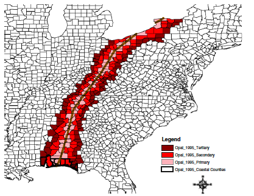
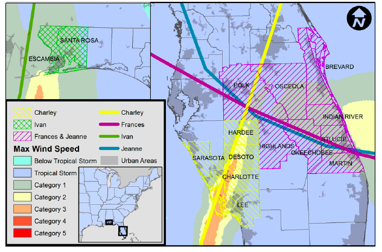

---
output:
  beamer_presentation:
    keep_tex : true
    includes: 
      in_header: anderson_header.txt
      before_body: anderson_beforebody.txt
---

```{r setup, include=FALSE, message = FALSE, warning = FALSE}
knitr::opts_chunk$set(echo = FALSE, warning = FALSE, message = FALSE)
library(ggplot2)
library(dplyr)
library(lubridate)
library(gridExtra)
library(tidyr)
library(stringr)

library(hurricaneexposuredata)
library(hurricaneexposure)
library(countyweather)
```

## Health risks associated with Hurricane Sandy (2012)

\begin{columns}

\begin{column}{0.45\textwidth}
```{r echo = FALSE, fig.align = "center", out.width = "\\textwidth"}
knitr::include_graphics("sandy_satellite.jpg")
```
\vspace{-0.5cm}
\begin{center}
\scriptsize Source: NOAA / NASA GOES Project
\end{center}
\end{column}

\begin{column}{0.55\textwidth}
\small
\begin{block}{Health risks in storm-affected areas}
\begin{itemize}
  \item Change in patterns of emergency department visits (Kim et al. 2016)
  \item Increased outpatient cases of food and waterborne disease among elderly (Bloom et al. 2016)
  \item Increased rate of myocardial infarctions (Swerdel et al. 2014)
  \item Increased hospitalizations for dehydration (Lee et al. 2016)
  \item Difficulty obtaining medical care, medications, and medical equipment (Davidow et al. 2016)
\end{itemize}
\end{block}
\end{column}

\end{columns}

## Hazard-specific tropical storm metrics

\begin{columns}
\begin{column}{0.5\textwidth}
\begin{block}{Tropical storm hazard metrics}
   \begin{itemize}
    \item Distance from the storm
    \item High winds
    \item Rainfall
    \item Storm surge
    \item Flood events
    \item Tornado events
   \end{itemize}
\end{block}
\end{column}
\begin{column}{0.5\textwidth}  
    \vspace{-0.25cm}
    \begin{center}
     \includegraphics[width=0.8\textwidth]{storm_hazards.png}
     \end{center}
     \vspace{-0.25cm}
     \scriptsize{Image sources: Los Angeles Times, NBC}
\end{column}
\end{columns}

## Assessing tropical storm exposure

\begin{block}{Challenge for epidemiological research}
How should we determine whether a county was exposed to a tropical storm for epidemiological research?
\end{block}

\vspace{-0.3cm}

\pause

```{r out.width = "\\textwidth", fig.align = "center"}
knitr::include_graphics("previous_exposure_metrics.pdf")
```

## Assessing exposure

\begin{columns}
\begin{column}{0.7\textwidth}
```{r echo = FALSE, fig.align = "center", out.width = "\\textwidth"}

```
\vspace{-0.5cm}
\begin{center}
\footnotesize Czajkowski et al. 2011
\end{center}
\end{column}
\begin{column}{0.3\textwidth}
\small
\begin{block}{Example exposure assessment}
Czajkowski et al. (2011) classified counties based on distance to storm tracks to study mortality risks.
\end{block}
\end{column}
\end{columns}

## Assessing exposure

\begin{columns}
\begin{column}{0.7\textwidth}
```{r echo = FALSE, fig.align = "center", out.width = "\\textwidth"}

```
\vspace{-0.6cm}
\begin{center}
\footnotesize McKinney et al. 2011
\end{center}
\end{column}
\begin{column}{0.3\textwidth}
\small
\begin{block}{Example exposure assessment}
McKinney et al. (2011) classified counties based on distance to storm tracks, evacuations, and wind to study mortality risk.
\end{block}
\end{column}
\end{columns}

## Project aims

\begin{block}{Project aims}
\begin{itemize}
  \item Develop exposure classifications of all U.S. Atlantic basin tropical storms, 1988--2011, based on reasonable measurements of tropical storm hazards
  \item Make exposure assessments accessible to other researchers for epidemiological and other impact studies 
  \item Assess agreement between hazard-based classifications for (1) storm severity and (2) county-specific classification
  \item Investigate mortality risks associated with tropical storm exposures in U.S. communities
\end{itemize}
\end{block}

# Assessing exposure to tropical storms

## Distance from storm

\large Tropical storm "Best Track" data
\vspace{-0.7cm}

\begin{columns}
\begin{column}{0.7\textwidth}
```{r echo = FALSE, out.width = "\\textwidth"}
knitr::include_graphics("finding_closest_point.pdf")
```
\end{column}
\begin{column}{0.3\textwidth}
\small
\begin{block}{Distance metric}
We matched storm tracks to county population mean centers to determine the closest approach and date of closest approach of each storm to each county.
\end{block}
\end{column}
\end{columns}

## Wind exposure

\begin{columns}
\begin{column}{0.7\textwidth}
```{r echo = FALSE, out.width = "\\textwidth", fig.width = 6, fig.height = 4}
map_tracks("Katrina-2005", padding = 2, plot_points = TRUE) + 
  coord_map()
```
\end{column}
\begin{column}{0.3\textwidth}
\small
\begin{block}{Wind metric}
We modeled county winds with a wind model based on a Willoughby et al. paper. This model inputs storm location and maximum wind from best tracks data. 
\end{block}
\end{column}
\end{columns}

## Wind exposure

```{r echo = FALSE, out.width = "\\textwidth", message = FALSE, warning = FALSE, fig.width = 6, fig.height = 4, fig.align = "center"}
map_tracks("Katrina-2005", padding = 0, 
           plot_object = map_counties("Katrina-2005", metric = "wind")) + 
  coord_map() + 
  ggtitle("Modeled winds, Katrina, 2005")
```


## Rain exposure

\begin{columns}
\begin{column}{0.7\textwidth}  
    \vspace{-0.25cm}
    \begin{center}
    Rain during Tropical Storm Lee
    \end{center}
    \begin{center}
     \includegraphics[width=\textwidth]{nldas2_ts_lee.png}
     \end{center}
     \begin{center}
         \vspace{-0.4cm}
     \scriptsize{Image source: Goddard Earth Sciences DISC}
     \end{center}
\end{column}
\begin{column}{0.3\textwidth}
\footnotesize
\begin{block}{Rain metric}
We used NLDAS-2 precipitation data to assess county rainfall. We summed rain from two days before to one day after the storm. We include a distance threshold for the rain metric.
\end{block}
\end{column}
\end{columns}

## Rain exposure

```{r frances_rain_example, echo = FALSE, fig.width = 6, fig.height = 4, fig.align = "center", out.width = "0.9\\textwidth", warning = FALSE, message = FALSE}
storm <- "Frances-2004"
map_tracks(storms = storm, plot_points = FALSE, 
                plot_object = map_counties(storm = storm, 
                                           metric = "rainfall")) + 
        ggtitle("Rainfall during Frances, 2004")
```

## Flood and tornado events

```{r echo = FALSE, out.width = "\\textwidth"}
knitr::include_graphics("noaastormevents.png")
```

Website: https://www.ncdc.noaa.gov/stormevents/

## Flood and tornado events

```{r floyd_flood_example, echo = FALSE, fig.width = 6, fig.height = 4, fig.align = "center", out.width = "0.9\\textwidth", warning = FALSE, message = FALSE}
storm <- "Floyd-1999"
map_tracks(storms = storm, plot_points = FALSE, 
                plot_object = map_event_exposure(storm = storm, 
                                           event_type = "flood")) + 
        ggtitle("Flood events during Floyd, 1999")
```

## Flood and tornado events

```{r ivan_tornado_example, echo = FALSE, fig.width = 6, fig.height = 4, fig.align = "center", out.width = "0.9\\textwidth", warning = FALSE, message = FALSE}
storm <- "Ivan-2004"
map_tracks(storms = storm, plot_points = FALSE, 
                plot_object = map_event_exposure(storm = storm, 
                                           event_type = "tornado")) + 
        ggtitle("Tornado events during Ivan, 2004")
```

## Project software

\footnotesize
\begin{block}{`hurricaneexposure`}
Create county-level exposure time series for tropical storms in U.S. counties. Exposure can be determined based on several hazards (e.g., distance, wind, rain), with user-specified thresholds. On CRAN.
\end{block}

```{r echo = TRUE, eval = FALSE}
county_rain(counties = c("22071", "51700"), rain_limit = 100, 
            start_year = 1995, end_year = 2005, dist_limit = 100,
            days_included = c(-1, 0, 1))
```

```{r echo = FALSE}
county_rain(counties = c("22071", "51700"), rain_limit = 100, 
            start_year = 1995, end_year = 2005, dist_limit = 100,
            days_included = c(-1, 0, 1)) %>%
  slice(1:4) %>%
  select(storm_id, fips, closest_date, storm_dist, tot_precip)
```

## Project software

\begin{columns}
\begin{column}{0.3\textwidth}
\footnotesize
\begin{block}{`stormwindmodel`}
Model storm winds from Best Tracks data at U.S. locations. Includes modeling sustained and gust winds, as well as duration of sustained and gust winds above a specified threshold. On CRAN.
\end{block}
\end{column}
\begin{column}{0.7\textwidth}
```{r echo = FALSE, out.width = "\\textwidth", fig.align = "center"}
knitr::include_graphics("census_track_modeled_winds.png")
```
\end{column}
\end{columns}

## Project software

\footnotesize
\begin{block}{`countyweather`, `countyfloods`}
Download weather monitor data through NOAA and USGS APIs by U.S. county. Includes functions to map available monitors / gages for each county. On CRAN.
\end{block}

\footnotesize
\begin{block}{`noaastormevents`}
Download and explore listings from the NOAA Storm Events database. Includes the ability to pull events based on a tropical storm, using events listed close in time and distance to the storm's tracks. On CRAN.
\end{block}

\footnotesize
\begin{block}{`countytimezones`}
Convert time-stamps from UTC to local time zones for U.S. counties based on county FIPs. Facilitates merging weather observations with locally measured data, including health outcomes. On CRAN.
\end{block}


# Agreement between exposure metrics

## Storm exposure

\footnotesize
```{r}
data_frame(
  `Exposure metric` = c("Distance",
                        "Rain",
                        "Wind",
                        "Flood",
                        "Tornado"),
  `Criterial for exposure` = c("County population mean center within 100 km of storm track",
                               "County received 75 mm or more rain over the period from two days before to one day after the storm's closest approach and the storm passed within 500 km of the county",
                               "Modeled wind speed at county's population mean center met or exceeded 15 m / s during the storm",
                               "Flood event listed with a start date within two days of the storm's closest approach and county within 500 km of storm track",
                               "Tornado event listed with a start date within two days of the storm's closest approach and county within 500 km of storm track")
  ) %>%
  pander::pander(justify = "ll", split.cells = c(15, 50))
```

## Storm exposure 

```{r}
my_fips <- unique(closest_dist$fips)
distance_exposure <- county_distance(counties = my_fips, start_year = 1988,
                                     end_year = 2011, dist_limit = 100) %>%
  select(storm_id, fips) %>%
  mutate(distance_exposed = TRUE,
         storm_id = as.character(storm_id))
rain_exposure <- county_rain(counties = my_fips,
                             start_year = 1988, end_year = 2011,
                             rain_limit = 75, dist_limit = 500) %>%
  select(storm_id, fips) %>%
  mutate(rain_exposed = TRUE,
         storm_id = as.character(storm_id))
wind_exposure <- county_wind(counties = my_fips, start_year = 1988,
                             end_year = 2011, wind_limit = 15) %>%
  select(storm_id, fips) %>%
  mutate(wind_exposed = TRUE,
         storm_id = as.character(storm_id))
flood_exposure <- county_events(counties = my_fips,
                              start_year = 1996, end_year = 2011,
                              event_type = "flood") %>%
  select(storm_id, fips) %>%
  mutate(flood_exposed = TRUE,
         storm_id = as.character(storm_id))
tornado_exposure <- county_events(counties = my_fips,
                              start_year = 1996, end_year = 2011,
                              event_type = "tornado") %>%
  select(storm_id, fips) %>%
  mutate(tornado_exposed = TRUE,
         storm_id = as.character(storm_id))
total_exposure <- distance_exposure %>%
  full_join(rain_exposure, by = c("storm_id", "fips")) %>%
  full_join(wind_exposure, by = c("storm_id", "fips")) %>%
  full_join(flood_exposure, by = c("storm_id", "fips")) %>%
  full_join(tornado_exposure, by = c("storm_id", "fips")) %>%
  gather(metric, exposed, 
         -storm_id, -fips, na.rm = FALSE) %>%
  mutate(exposed = ifelse(is.na(exposed), FALSE, exposed)) 
```

```{r}
total_exposure %>%
  group_by(storm_id, metric) %>%
  dplyr::summarize(n_exposed = sum(exposed)) %>%
  dplyr::ungroup() %>%
  dplyr::group_by(metric) %>%
  dplyr::summarize(median_exposure2 = median(n_exposed),
                   iqr_exposure = paste(quantile(n_exposed, c(0.25, 0.75)),
                                              collapse = ", "), 
                   median_exposure = paste0(median_exposure2, " (",
                                                  iqr_exposure, ")"),
                   max_exposure = max(n_exposed),
                   which_max_exposure = storm_id[which.max(n_exposed)],
                   which_max_exposure = gsub("-", ", ", which_max_exposure),
                   max_exposure = paste0(which_max_exposure, " (",
                                               max_exposure, ")")) %>%
  arrange(desc(median_exposure2)) %>%
  dplyr::select(-iqr_exposure, -which_max_exposure, -median_exposure2) %>%
  mutate(metric = str_replace(metric, "_exposed", ""),
         metric = str_to_title(metric)) %>%
  rename(`Exposure metric` = metric,
         `Median number of exposed counties (IQR)` = median_exposure,
         `Storm with most counties exposed` = max_exposure) %>%
  pander::pander(justify = "lcc")
```

\footnotesize{\textsuperscript{*}Note: Flood and Tornado events only include storms in 1996--2011. All other event listings cover storms in 1988--2011.}

<!-- ## Storm-specific extent -->

<!-- \begin{block}{Assessing agreement in storm severity across metrics} -->
<!-- \begin{itemize} -->
<!-- \item For this assessment, we measured \textbf{storm-specific extent} as the number of counties classified as exposed by a given metric for a given storm -->
<!-- \item We measured this storm-specific extent for every storm and every metric (1988--2011 for distance, rain, wind; 1996--2011 for flood and tornado) -->
<!-- \item We measured the rank correlation (Kendall's $\tau$) between storm severity for each pair of exposure metrics  -->
<!-- \end{itemize} -->
<!-- \end{block} -->

## Storm-specific extent

\begin{center}
\large Rank correlation in storm extent for exposure metrics
\end{center}

```{r echo = FALSE}
library(psych)
storm_severity <- total_exposure %>%
  mutate(metric = str_replace(metric, "_exposed", ""),
         metric = str_to_title(metric)) %>%
  group_by(storm_id, metric) %>%
  summarize(exposed_counties = sum(exposed)) %>%
  spread(metric, exposed_counties) %>% 
  ungroup()

storm_cor <- cor(storm_severity[, c("Distance", "Rain", "Wind",
                                    "Flood", "Tornado")],
    method = "kendall") 

storm_cor <- corr.test(storm_severity[ , c("Distance", "Rain", "Wind", "Flood", "Tornado")], method = "kendall", adjust = "bonferroni")$r
storm_cor <- apply(storm_cor, 1, function(x){ sprintf("%.2f", x)})
row.names(storm_cor) <- c("Distance", "Rain", "Wind", "Flood", "Tornado")
for(i in 1:nrow(storm_cor)){
  for(j in 1:ncol(storm_cor)){
    if(i <= j){storm_cor[i, j] <- "-"}
  }
}
storm_cor %>%
 pander::pander(round = 2)
```

```{r eval = FALSE}
corr.test(storm_severity[ , c("Distance", "Rain", "Wind", "Flood", "Tornado")], method = "kendall", adjust = "bonferroni")$p
```

```{r eval = FALSE}
cor.ci(storm_severity[ , c("Distance", "Rain", "Wind", "Flood", "Tornado")], method = "kendall", plot = FALSE)
```

\footnotesize The table gives Kendall's $\tau$ for each pair of exposure metrics. All comparisons that include flood or tornado metrics are limited to storms since 1996. 


## County-level exposure to Hurricane Ivan (2004)

\vspace{-0.6cm}
```{r echo = FALSE, out.height="0.75\\textheight", fig.align = "center"}
knitr::include_graphics("ivanexposurepresentation.pdf")
```

\vspace{-0.5cm}
\scriptsize Criteria for exposure classifications: \textbf{Distance:} Within 100 kms of storm track. \textbf{Rain:} $\ge$ 75 mm of rain total for two days before to one day after storm. \textbf{Wind:} Modeled wind of $\ge$ 15 m/s. \textbf{Flood, Tornado:} Listed event in NOAA Storm Events database.


## County-level agreement in storm exposure 

\begin{block}{Assessing agreement in county classifications}
For each storm and each pair of metrics, we measured the \textit{Jaccard index} as a measure of county-level agreement in exposure classification for a storm:

\begin{equation*}
J = \frac{X_1 \cap X_2}{X_1 \cup X_2}
\end{equation*}

where $X_1$ is the set of counties exposed to a storm based on the first metric and $X_2$ is the set of counties exposed to the storm based on the second metric. 

\end{block}

## County-level agreement in storm exposure 

\vspace{-0.3cm}

```{r fig.align = "center", out.height = "0.87\\textheight"}
knitr::include_graphics("jaccard_heatmap_presentation.pdf")
```

## Tropical storm exposure in U.S. counties

\begin{centering}
\small Storm hits per county per decade based on rain (left) and wind (right) exposure metrics.
\end{centering}

```{r echo = FALSE, fig.align = "center", out.width = "0.95\\textwidth"}
knitr::include_graphics("hurricane_exposure.png")
```

\vspace{-0.7cm}
\scriptsize Criteria for exposure classifications: \textbf{Rain:} $\ge$ 75 mm of rain total for two days before to one day after storm. \textbf{Wind:} Modeled wind of $\ge$ 15 m/s. 

# Tropical storms and mortality risks

## Hurricane Maria example

```{r echo = FALSE, out.width="0.9\\textwidth", fig.align = "center"}
knitr::include_graphics("maria_excess_deaths.png")
```

\vspace{-0.2cm}

\footnotesize

Source: The New York Times

<!-- ## Reporting cause of death -->

<!-- ```{r echo = FALSE, out.width="0.8\\textwidth", fig.align = "center"} -->
<!-- knitr::include_graphics("icd_disaster_codes.png") -->
<!-- ``` -->

## Reporting cause of death

```{r echo = FALSE, out.width="\\textwidth", fig.align = "center"}
knitr::include_graphics("cdc_direct_death.png")
```

\vspace{-0.5cm}

\footnotesize

Source: https://www.cdc.gov/nchs/data/dvs/hurricane_certification.pdf

## Reporting cause of death

```{r echo = FALSE, out.width="\\textwidth", fig.align = "center"}
knitr::include_graphics("cdc_indirect_death.png")
```

\vspace{-0.5cm}

\footnotesize

Source: https://www.cdc.gov/nchs/data/dvs/hurricane_certification.pdf

## Hurricane Maria example

```{r echo = FALSE, out.width="0.9\\textwidth", fig.align = "center"}
knitr::include_graphics("maria_timeseries.png")
```

\vspace{-0.2cm}

\footnotesize

Source: The New York Times

## Study storms and communities

\centering
\small{Storms and communities considered, 1988--2005}

\vspace{-0.2cm}

```{r echo = FALSE, out.width="0.85\\textwidth", fig.align = "center"}

```

<!-- ## Study storms and communities -->

<!-- \centering -->
<!-- Number of communities and storms identified as exposed by different exposure metrics. -->

<!-- \begin{table}[] -->
<!-- \centering -->
<!-- \begin{tabular}{@{}lcc@{}} -->
<!-- \toprule -->
<!-- Exposure metric              & \# of communities & \# of community storms \\ \midrule -->
<!-- Wind (\textgreater 21 m / s) & 26                & 83                     \\ -->
<!-- Rain (\textgreater 125 mm)   & 26                & 50                     \\ -->
<!-- Distance (\textless 25 km)   & 44                & 79                     \\ -->
<!-- Flood events                 & 51                & 180                    \\ -->
<!-- Tornado events               & 22                & 53                     \\ \bottomrule -->
<!-- \end{tabular} -->
<!-- \end{table} -->

<!-- \footnotesize{Note: For wind, rain, and distance, the most stringent thresholds considered are shown here.} -->

## Identifying matched days for comparison

\centering
\small{For each storm, we identified matched comparison days in the same community and time of the year.}

\vspace{-0.2cm}

```{r echo = FALSE, out.width="0.75\\textwidth", fig.align = "center"}
knitr::include_graphics("Andrew_Miami_CalendarPlot.pdf")
```

## Relative risk of mortality associated with storm exposure

\begin{block}{Relative risk of mortality associated with storm exposure}
We aimed to measure the \textit{relative risk (RR)} of mortality during the storm compared to what would have been expected the same days if there had not been a storm:

\begin{equation*}
RR = \frac{\text{\# deaths during storm}}{\text{Expected \# of deaths without storm}}
\end{equation*}

We assessed this relative risk for (1) specific days during the storm period (two days before to seven days after storm's closest approach) and (2) the total storm period. 

\end{block}

## Relative risk of mortality during storms

\centering
\small{Relative risks of mortality associated with tropical storm exposures, as determined by maximum windspeed > 21 m / s}

\begin{table}[]
\centering
\begin{tabular}{@{}lcc@{}}
\toprule
Cause of death & RR on closest day    & RR over storm period                                             \\ \midrule
All-cause      & 1.42 (1.36, 1.49)    & 1.90 (1.58, 2.29)      \\
\ \ Cardiovascular & 1.15 (1.06, 1.24)    & 1.30 (0.97, 1.76)      \\
\ \ Respiratory    & 1.13 (0.92,1.38)     & 1.54 (0.70, 3.39)      \\
\ \ Accidental     & 12.03 (10.87, 13.32) & 161.41 (61.62, 422.80) \\ \bottomrule
\end{tabular}
\end{table}

## Mortality risks by day during storm period

\begin{columns}
\begin{column}{0.6\textwidth}  
    \begin{center}
     \includegraphics[width=\textwidth]{all_cause_lags.png}
     \end{center}
\end{column}
\begin{column}{0.4\textwidth}
\footnotesize
\begin{block}{Risks by day}
\footnotesize
\begin{itemize}
  \item For all-cause deaths, RRs were highest on storm's closest day
  \item There was some evidence of elevated risk before and after the storm
  \item Lag patterns were similar for cardiovascular and accidental deaths
\end{itemize}
\end{block}
\end{column}
\end{columns}

## Mortality risk by exposure metric

```{r echo = FALSE, out.width="\\textwidth", fig.align = "center"}
knitr::include_graphics("rrs_by_metric.png")
```

## Continuing / future work

- Improving flood exposure metric
- Improving wind model for inland locations
- Influence of most notable storms on mortality risk estimates
- Effect modification of power outages
- Hospitalization impacts among Medicare beneficiaries

## Acknowledgements

\small

\begin{block}{Funding}
This work was supported in part by grants from the National Institute of Environmental Health Sciences (R00ES022631), the National Science Foundation (1331399), and a NASA Applied Sciences Program/Public Health Program Grant (NNX09AV81G).
\end{block}

\begin{block}{Collaborators}
Meilin Yan, Joshua Ferreri, Ander Wilson, Roger Peng, Dirk Eddelbuettel, Mohammad Al-Hamdan, William Crosson, Andrea Schumacher, Seth Guikema, and Steven Quiring collaborated on research and software shown here.
\end{block}

## Wind exposure

\begin{block}{Assessment}
To assess results of the storm wind model, we compared modeled results with wind radii from the Extended Best Tracks for each storm. 
\end{block}
\vspace{-0.5cm}
```{r echo = FALSE, out.width = "0.75\\textwidth", fig.align = "center"}
knitr::include_graphics("ext_tracks_2.png")
```

## Wind exposure

\begin{center}
Comparison of modeled wind versus wind radii, Katrina, 2005
\end{center}
\vspace{-1cm}

```{r echo = FALSE, out.width = "1.08\\textwidth", fig.align = "left"}

```

## Wind exposure

\begin{center}
Comparison of modeled wind versus wind radii, Ike, 2008
\end{center}
\vspace{-1cm}

```{r echo = FALSE, out.width = "1.05\\textwidth", fig.align = "left"}

```

## Rain exposure

\small
\begin{block}{Assessment}
To assess this rain metric, we compared it to rainfall measured at weather stations. X-axis: Rainfall summed for days near storm; y-axis: average of summed rain at each monitor for the same days.
\end{block}

```{r compare_rain_ex_counties, echo = FALSE, fig.width = 9, fig.height = 2.75, fig.align = "left", out.width = "1.05\\textwidth"}
plot_county_rain_compare <- function(ex_fips, ex_dir, ex_title, 
                                     get_data = FALSE){
        if(get_data){
                write_daily_timeseries(ex_fips, coverage = 0,
                                       date_min = "1988-01-01",
                                       date_max = "2011-12-31",
                                       var = "PRCP",
                                       out_directory = ex_dir,
                                       keep_map = FALSE)
        }
        
        check_dates <- closest_dist %>%
                dplyr::filter(fips == ex_fips) %>%
                dplyr::select(-storm_dist) %>%
                dplyr::mutate(closest_date = ymd(closest_date)) %>%
                dplyr::rename(day_0 = closest_date) %>%
                dplyr::mutate(fips = as.integer(fips),
                              day_0 = day_0 + days(0),
                              day_b1 = day_0 - days(1),
                              day_b2 = day_0 - days(2),
                              day_a1 = day_0 + days(1)) %>%
                dplyr::select(storm_id, day_b2, day_b1, day_0, day_a1) %>%
                tidyr::gather(key = lag, value = day, -storm_id) %>%
                dplyr::rename(date = day)
        all_dates <- unique(check_dates$date)
        
        ex_weather <- readRDS(paste0(ex_dir, ex_fips, ".rds"))
        ex_weather <- as.data.frame(ex_weather$daily_data)
        
        ex_weather <- ex_weather %>%
                dplyr::filter(date %in% all_dates) %>%
                dplyr::right_join(check_dates, by = "date") %>%
                dplyr::group_by(storm_id) %>%
                dplyr::summarize(prcp = sum(prcp),
                                ave_n = mean(prcp_reporting))
        
        ex_rain <- county_rain(counties = ex_fips,
                               start_year = 1988, end_year = 2011,
                               rain_limit = 0, dist_limit = 500) %>%
                full_join(ex_weather, by = "storm_id") %>%
                filter(!is.na(prcp) & !is.na(tot_precip)) %>%
                mutate(prcp = prcp / 10) ## Units for countyweather are now 10ths
                                         ## of millimeters for precipitation
        
        ave_n <- round(mean(ex_rain$ave_n, na.rm = TRUE))
        n_storms <- nrow(ex_rain)
        ex_title <- paste0(ex_title, "\n(storms: ", n_storms,
                           "; monitors: ", ave_n, ")")
        
        plot_range <- range(ex_rain[ , c("prcp", "tot_precip")],
                            na.rm = TRUE)
        
        ex_plot <- ggplot(ex_rain, aes(x = tot_precip, y = prcp)) +
                geom_hline(aes(yintercept = 75), color = "lightgray") +
                geom_vline(aes(xintercept = 75), color = "lightgray") +
                geom_abline(aes(intercept = 0, slope = 1), color = "gray",
                    alpha = 0.5) +
                geom_point(alpha = 0.5, color = "red") +
                theme_classic() +
                scale_size_continuous(guide = "none") +
                xlab("Rainfall (mm)  from\nNLDAS-2 data") +
                ylab("Rainfall (mm)\nfrom monitors") +
                xlim(plot_range) + ylim(plot_range) + 
                ggtitle(ex_title)
        return(ex_plot)
}

a <- plot_county_rain_compare(ex_fips = "12086", ex_dir = "dade_data/",
                         ex_title = "Miami-Dade, FL",
                         get_data = FALSE)

b <- plot_county_rain_compare(ex_fips = "42101",
                              ex_dir = "philadelphia_data/",
                         ex_title = "Philadelphia County, PA",
                         get_data = FALSE)

c <- plot_county_rain_compare(ex_fips = "48201", ex_dir = "harris_data/",
                         ex_title = "Harris County, TX",
                         get_data = FALSE)


grid.arrange(a, b, c, ncol = 3)
```

## Rain exposure

```{r ike_rain_example, echo = FALSE, fig.width = 6, fig.height = 4, fig.align = "center", out.width = "0.9\\textwidth", warning = FALSE, message = FALSE}
storm <- "Ike-2008"
map_tracks(storms = storm, plot_points = FALSE, 
                plot_object = map_counties(storm = storm, 
                                           metric = "rainfall")) + 
        ggtitle("Rainfall during Ike, 2008")
```

## Rain exposure

```{r lee_rain_example, echo = FALSE, fig.width = 6, fig.height = 4, fig.align = "center", out.width = "0.9\\textwidth", warning = FALSE, message = FALSE}
storm <- "Lee-2011"
map_tracks(storms = storm, plot_points = FALSE, 
                plot_object = map_counties(storm = storm, 
                                           metric = "rainfall")) + 
        ggtitle("Rainfall during Lee, 2011")
```

