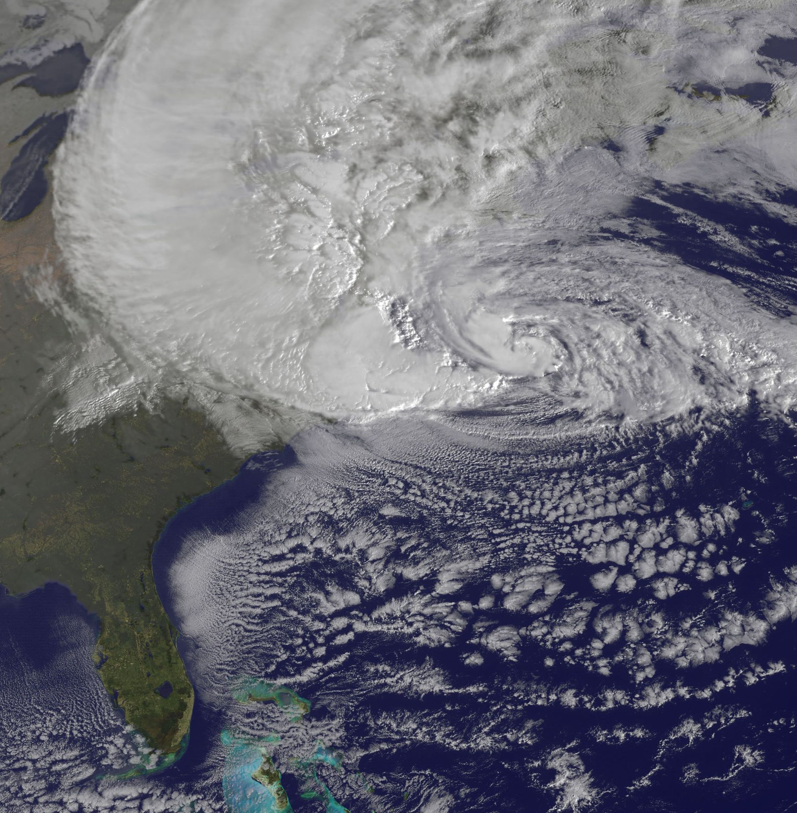

---
output:
  beamer_presentation:
    includes:
      in_header: header.tex
      before_body: anderson_beforebody.txt
fontsize: 10pt
---

```{r setup, include=FALSE}
knitr::opts_chunk$set(echo = FALSE, warning = FALSE, message = FALSE)

library(dplyr)
library(tidyr)
library(stringr)
library(tibble)
library(lubridate)

library(ggplot2)
library(viridis)
library(ggrepel)
library(scales)

library(sf)
library(maps)
library(tigris)
options(tigris_class = "sf")
options(tigris_use_cache = TRUE)

library(kableExtra)

library(hurricaneexposuredata)
library(hurricaneexposure)

data(state)
state <- data_frame(state = state.name, 
                    abbr = state.abb)
data(hurr_tracks)
data(closest_dist)
data(storm_winds)

our_states <- c("ME", "NH", "VT", "MA", "RI", "CT", "NY", 
                "PA", "NJ", "OH", "MI", "WV", "VA", "DE", 
                "MD", "KY", "IN", "IL", "NC", "SC", "GA",
                "AL", "FL", "MS", "LA", "AR", "TN", "MO", 
                "TX", "OK", "KS", "IA", "WI", "DC")
us_counties <- counties(state = our_states, 
                        cb = TRUE,
                        resolution = "20m",
                        year = 2010)
us_states <- st_as_sf(map("state", plot = FALSE, fill = TRUE)) %>% 
  mutate(ID = str_to_title(ID)) %>% 
  inner_join(state, by = c("ID" = "state")) %>% 
  filter(abbr %in% our_states) %>% 
  st_transform(crs = 4269)
```

## Acknowledgements

\small

\begin{columns}

\begin{column}{0.49\textwidth}

\textit{Colorado State University}
\begin{itemize}
\item \textbf{Meilin Yan}
\item Ander Wilson
\item Joshua Ferreri
\item Andrea Schumacher
\end{itemize}

\textit{NASA Marshall Space Flight Center}
\begin{itemize}
\item Mohammad Al-Hamdan
\item William Crosson
\end{itemize}

\textit{Debian / University of Illinois}
\begin{itemize}
\item Dirk Eddelbuettel
\end{itemize}

\end{column}

\begin{column}{0.49\textwidth}

\textit{Johns Hopkins (Public Health)}
\begin{itemize}
\item Roger Peng
\end{itemize}

\textit{Harvard (Public Health)}
\begin{itemize}
\item Francesca Dominici
\item Yun Wang
\end{itemize}

\textit{University of Michigan}
\begin{itemize}
\item Seth Guikema
\end{itemize}

\textit{Ohio State University}
\begin{itemize}
\item Steven Quiring
\end{itemize}


\end{column}

\end{columns}

# Motivation

## Impacts in excess of official death tolls

Evidence from Hurricane Maria in Puerto Rico of extensive mortality impacts. 

```{r echo = FALSE, out.width="0.9\\textwidth", fig.align = "center"}
knitr::include_graphics("figures/maria_excess_deaths.png.png")
```

\footnotesize Source: The New York Times

## Impacts in excess of official death tolls

Evidence from Hurricane Maria in Puerto Rico. 

```{r out.width = "\\textwidth"}
knitr::include_graphics("figures/maria_timeseries.png")
```

\footnotesize Source: The New York Times

## Health risks associated with Hurricane Sandy (2012)

\begin{columns}

\begin{column}{0.45\textwidth}
```{r echo = FALSE, fig.align = "center", out.width = "\\textwidth"}

```
\vspace{-0.5cm}
\begin{center}
\scriptsize Source: NOAA / NASA GOES Project
\end{center}
\end{column}

\begin{column}{0.55\textwidth}
\small
\begin{block}{Health risks in storm-affected areas}
\begin{itemize}
  \item Change in patterns of emergency department visits (Kim et al. 2016)
  \item Increased outpatient cases of food and waterborne disease among elderly (Bloom et al. 2016)
  \item Increased rate of myocardial infarctions (Swerdel et al. 2014)
  \item Increased hospitalizations for dehydration (Lee et al. 2016)
  \item Difficulty obtaining medical care, medications, and medical equipment (Davidow et al. 2016)
\end{itemize}
\end{block}
\end{column}

\end{columns}

## Study goals

- Investigate how cardiorespiratory Medicare hospitalization risks change during severe tropical cyclone exposures
- Quantify the association between tropical cyclone exposure and cardiorespiratory Medicare hospitalization risks within a large set of exposures and counties
- Explore the temporal pattern in risks in the days surrounding the storm
- Investigate how estimated associations change with changing definitions of tropical cyclone exposure

# Methods and Results

## All study storms and counties

```{r fig.width = 6, fig.height = 4.3, out.width = "0.9\\textwidth", fig.align = "center"}
study_counties <- readRDS("data/med_eastern_counties.rds") %>% 
  select(fips)

study_counties <- us_counties %>% 
  mutate(fips = paste(STATEFP, COUNTYFP, sep = "")) %>% 
  semi_join(study_counties, by = "fips")

ggplot() + 
  geom_sf(data = us_states, color = "white", fill = "lightgray") +  
  geom_sf(data = study_counties, alpha = 0.7, fill = "red", color = "darkred") +
  geom_text(aes(x = -72, y = 30, label = "# of counties = 180"), color = "white") + 
  theme_dark() + 
  theme(legend.position = "right",
        axis.title = element_blank(),
        axis.text = element_blank(),
        axis.ticks = element_blank()) + 
  ggtitle("Counties considered in our study",
          subtitle = "Data from the Medicare Cohort Air Pollution Study (MCAPS)")
  
```

## Assessing tropical storm exposure

**Challenge for epidemiological research**

How should we determine whether a county was exposed to a tropical storm for epidemiological research?


## Assessing exposure

\begin{columns}
\begin{column}{0.7\textwidth}
```{r echo = FALSE, fig.align = "center", out.width = "\\textwidth"}
knitr::include_graphics("figures/coastal_inland_mortality_figure.png")
```
\begin{center}
\footnotesize Czajkowski et al. 2011
\end{center}
\end{column}
\begin{column}{0.3\textwidth}
\small
Czajkowski et al. (2011) investigated classifying counties based on distance to storm tracks to study inland mortality.
\end{column}
\end{columns}

## Assessing exposure

\begin{columns}
\begin{column}{0.7\textwidth}
```{r echo = FALSE, fig.align = "center", out.width = "\\textwidth"}
knitr::include_graphics("figures/florida_direct_indirect_mortality_figure.png")
```
\begin{center}
\footnotesize McKinney et al. 2011
\end{center}
\end{column}
\begin{column}{0.3\textwidth}
\small
McKinney et al. (2011) classified counties based on distance to storm tracks, evacuations, and wind to study mortality risk.
\end{column}
\end{columns}

## Wind exposure

\begin{columns}
\begin{column}{0.7\textwidth}
```{r echo = FALSE, out.width = "\\textwidth", fig.width = 6, fig.height = 4}
map_tracks("Katrina-2005", padding = 2, plot_points = TRUE) + 
  coord_map()
```
\end{column}
\begin{column}{0.3\textwidth}
\small
We modeled county winds with a wind model based results from Willoughby et al. This model inputs storm location and maximum wind from best tracks data. 
\end{column}
\end{columns}

## Wind exposure

```{r echo = FALSE, out.width = "\\textwidth", message = FALSE, warning = FALSE, fig.width = 6, fig.height = 4, fig.align = "center"}
map_counties("Katrina-2005", metric = "wind") + 
  coord_map() + 
  ggtitle("Modeled winds, Katrina, 2005")
```

## Rain exposure

\begin{columns}
\begin{column}{0.7\textwidth}  
    \begin{center}
    Rain during Tropical Storm Lee
    \end{center}
    \begin{center}
     \includegraphics[width=\textwidth]{figures/nldas2_ts_lee.png}
     \end{center}
     \begin{center}
     \scriptsize{Image source: Goddard Earth Sciences DISC}
     \end{center}
\end{column}
\begin{column}{0.3\textwidth}
\footnotesize
We used NLDAS-2 precipitation data to assess county rainfall. We summed rain from one day before to one day after the storm. We include a distance threshold for the rain metric.
\end{column}
\end{columns}

## Date of storm's closest approach

\begin{columns}
\begin{column}{0.75\textwidth}
```{r echo = FALSE, out.width = "\\textwidth"}
knitr::include_graphics("figures/finding_closest_point2.pdf.pdf")
```
\end{column}
\begin{column}{0.25\textwidth}
\small
We matched storm tracks to county population mean centers to determine the date of closest approach of each storm to each county.
\end{column}
\end{columns}

## Rain exposure

```{r frances_rain_example, echo = FALSE, fig.width = 6, fig.height = 4, fig.align = "center", out.width = "\\textwidth", warning = FALSE, message = FALSE}
storm <- "Floyd-1999"
map_tracks(storms = storm, plot_points = FALSE, 
                plot_object = map_counties(storm = storm, 
                                           metric = "rainfall",
                                           days_included = c(-1, 0, 1))) + 
        ggtitle("Rainfall during Floyd, 1999")
```

## Top 10 wind-based exposures in our study

```{r message = FALSE, warning = FALSE}
top_storms <- hurr_tracks %>% 
  tbl_df() %>% 
  filter(storm_id %in% c("Wilma-2005", "Charley-2004", "Ike-2008",
                         "Katrina-2005", "Frances-2004", "Irene-1999")) %>% 
  filter(24 <= latitude & latitude <= 48 & 
           -110 <= longitude & longitude <= -65) %>% 
  select(-date) %>% 
  separate(storm_id, c("storm_name", "storm_year"), sep = "-") %>% 
  st_as_sf(coords = c("longitude", "latitude"),
           crs = 4269) 
top_storm_tracks <- top_storms %>% 
  group_by(storm_name, storm_year) %>% 
  summarize(max_wind = max(wind), do_union=FALSE) %>% 
  st_cast("LINESTRING")

storm_labels <- top_storms %>% 
  group_by(storm_name, storm_year) %>% 
  slice(n()) %>% 
  ungroup() 

top_counties <- us_counties %>% 
  mutate(fips = paste(STATE, COUNTY, sep = "")) %>% 
  filter(fips %in% c("12099", "12071", "12095", "48201", 
                     "12127", "12011"))
```

```{r fig.width = 7, fig.height = 5, out.width = "\\textwidth", fig.align = "center"}
ggplot() +
  geom_sf(data = us_states, color = "white", fill = "lightgray") + 
  geom_sf(data = top_storm_tracks, color = "red", alpha = 0.4) + 
  geom_sf(data = top_storms, aes(color = wind), alpha = 0.7) + 
  geom_sf(data = top_counties, alpha = 0.7, fill = "cyan4", color = "cyan3") + 
  geom_label_repel(data = storm_labels, aes(label = storm_name, geometry = geometry),
    stat = "sf_coordinates", min.segment.length = 0, alpha = 0.7, color = "white",
    fontface = "bold", fill = "red") +
  geom_label_repel(data = top_counties, aes(label = NAME, geometry = geometry),
    stat = "sf_coordinates", min.segment.length = 0, color = "cyan4",
    fontface = "bold", fill = "white", alpha = 0.7) + 
  scale_color_viridis(name = "Wind\n(knots)", option = "B", direction = -1) + 
  theme_dark() + 
  theme(legend.position = "right",
        axis.title = element_blank(),
        axis.text = element_blank(),
        axis.ticks = element_blank()) + 
  ggtitle("Storms and counties for top 10 wind-based exposures",
          subtitle = "Color of points corresponds to storm's maximum 1-minute sustained surface winds")
```


## Potential for confounding

It is important to control for potential community-level and seasonal confounding because: 

- There are strong seasonal and community patterns in many **health outcomes**
- There are strong seasonal and community patterns in **tropical cyclone exposures**

\medskip

Given this potential for confounding, we used **a matched analysis** to ensure that a community 
was compared with itself and that
the seasonal distribution was similar for exposed and unexposed days, matching
across years within a community. 

## Selecting matched unexposed days

```{r fig.width = 7, fig.height = 5, out.width = "\\textwidth"}
all_dates <- data_frame(date = seq(from = ymd("1999-01-01"), to = ymd("2010-12-31"), by = 1)) %>% 
  mutate(year = year(date), 
         yday = yday(date))

closest_date <- closest_dist %>% 
  filter(storm_id == "Wilma-2005", fips == "12099") %>% 
  select(storm_id, closest_date) %>% 
  rename(date = closest_date) %>% 
  mutate(date = ymd(date),
         year = year(date), 
         yday = yday(date)) 

a <- ggplot(all_dates, aes(x = yday, y = year)) + 
  geom_path(aes(group = year), alpha = 0.5, color = "lightgray") + 
  labs(x = "Day in year", y = "Year in study") + 
  scale_y_reverse() + 
  geom_point(data = closest_date, color = "red") + 
  theme_dark()
a + 
  geom_label_repel(data = closest_date, aes(label = storm_id),
                   fill = "red", color = "white", fontface = "bold",
                   alpha = 0.7) + 
  ggtitle("1. Identify the day-of-year of the storm",
          subtitle = "Example for Hurricane Wilma in Palm Beach County, FL")
```

## Selecting matched unexposed days

```{r fig.width = 7, fig.height = 5, out.width = "\\textwidth"}
a + 
  annotate("rect", xmin = 294, xmax = 300, ymin = 1998.75, ymax = 2010.25,
        alpha = .2, fill = "cyan") + 
  ggtitle("2. Create a seven-day window centered on the storm's day-of-year",
          subtitle = "Example for Hurricane Wilma in Palm Beach County, FL") 
```

## Selecting matched unexposed days

```{r fig.width = 7, fig.height = 5, out.width = "\\textwidth"}
matched_days <- data_frame(
  year = c(sample(c(1999:2004, 2006:2010), 5, replace = FALSE)),
  yday = c(sample(294:300, 5, replace = TRUE))
)

a + 
  annotate("rect", xmin = 294, xmax = 300, ymin = 1998.75, ymax = 2010.25,
        alpha = .2, fill = "cyan") + 
  geom_point(data = matched_days, color = "lightyellow") + 
  ggtitle("3. Randomly pick a set of unexposed days from other years within window",
          subtitle = "Example for Hurricane Wilma in Palm Beach County, FL")
```

## Selecting matched unexposed days

```{r fig.width = 7, fig.height = 5, out.width = "\\textwidth"}
matched_days <- matched_days %>% 
  mutate(start = yday - 2,
         end = yday + 7)

a + 
  annotate("rect", xmin = 294, xmax = 300, ymin = 1998.75, ymax = 2010.25,
        alpha = .2, fill = "cyan") +
  geom_point(data = matched_days, color = "lightyellow") +
  geom_errorbarh(data = matched_days, 
                 aes(xmax = yday + 7, xmin = yday - 2), 
                 color = "lightyellow", height = 0, size = 1.5) + 
  geom_errorbarh(data = closest_date, 
                 aes(xmin = yday - 2, xmax = yday + 7),
                 color = "red", height = 0, size = 1.5) + 
  ggtitle("4. Determine the number of hospitalizations for a period around each day",
          subtitle = "Example for Hurricane Wilma in Palm Beach County, FL")
```

## Estimating tropical cyclone-hospitalization associations

We then used this matched data to fit a generalized linear model of hospitalization rates in association with tropical cyclone exposure: 

$$
log[E(Y_T)] = log(n_T) + \alpha + \beta x_T + \delta Z_T
$$
\small
where:

- $Y_T$ is the total count of hospital admissions in the 10-day period $T$
- $n_T$ is an offset for the number of unhospitalized Medicare beneficiaries in the county in period $T$
- $\alpha$ is the model intercept
- $x_T$ is an indicator variable for storm exposure, with associated coefficient $\beta$
- $Z_T$ is the year of period $T$, fit as a linear term and with associated coefficient $\delta$

## Respiratory hospitalizations

\centering Respiratory hospitalization risks during the top 10 wind-based storm exposures compared to matched unexposed days

\small

```{r}
resp_hosps <- tribble(
  ~ storm, ~ county, ~ wind, ~ percincreasenum, ~ percincrease, 
  "Wilma (2005)", "Palm Beach County, FL", 51.5,  38, "38 (-3, 95)",
  "Charley (2004)", "Lee County, FL", 45.3, 25, "25 (-10, 73)",
  "Charley (2004)", "Orange County, FL", 41.2, 44, "44 (4, 99)",
  "Ike (2008)", "Harris County, TX", 38.7, 44, "44 (25, 65)",
  "Charley (2004)", "Volusia County, FL", 37.0, 8, "8 (-15, 38)",
  "Wilma (2005)", "Broward County, FL", 36.7, 66, "66 (36, 104)",
  "Katrina (2005)", "Broward County, FL", 33.5, 36, "36 (19, 57)",
  "Frances (2004)", "Palm Beach County, FL", 33.3, 35, "35 (15, 59)",
  "Irene (1999)", "Broward County, FL", 33.3, 10, "10 (-14, 41)",
  "Irene (1999)", "Palm Beach County, FL", 33.2, 40, "40 (-3, 100)"
)

resp_hosps %>% 
  mutate(wind = cell_spec(round(wind), "latex", bold = TRUE, color = "white",
                          background = spec_color(round(wind), end = 0.9, direction = -1, option = "A")),
         percincrease = cell_spec(percincrease, "latex", bold = TRUE, 
                                   color = spec_color(percincreasenum, end = 0.9, 
                                                      direction = -1))) %>% 
  select(storm, county, wind, percincrease) %>% 
  kable("latex", booktabs = TRUE, escape = FALSE, align = "c", linesep = "",
        col.names = linebreak(c("Tropical cyclone", "County", "Wind[note]", "Percent increase[note]"))) %>% 
  add_footnote(c("Modeled maximum sustained surface wind (m/s) at county center",
                 "Percent increase in hospitalizations compared to matched unexposed days"),
               escape = TRUE)
```

## Cardiovascular hospitalizations

\centering Cardiovascular hospitalization risks during the top 10 wind-based storm exposures compared to matched unexposed days

\small

```{r}
resp_hosps <- tribble(
  ~ storm, ~ county, ~ wind, ~ percincreasenum, ~ percincrease, 
  "Wilma (2005)", "Palm Beach County, FL", 51.5,  -1, "-1 (-16, 17)",
  "Charley (2004)", "Lee County, FL", 45.3, 7, "7 (-6, 21)",
  "Charley (2004)", "Orange County, FL", 41.2, 20, "20 (2, 41)",
  "Ike (2008)", "Harris County, TX", 38.7, -7, "-7 (-22, 10)",
  "Charley (2004)", "Volusia County, FL", 37.0, 23, "23 (-5, 60)",
  "Wilma (2005)", "Broward County, FL", 36.7, 0, "0 (-15, 18)",
  "Katrina (2005)", "Broward County, FL", 33.5, 15, "15 (9, 21)",
  "Frances (2004)", "Palm Beach County, FL", 33.3, 8, "8 (-8, 26)",
  "Irene (1999)", "Broward County, FL", 33.3, -11, "-11 (-27, 9)",
  "Irene (1999)", "Palm Beach County, FL", 33.2, -14, "-14 (-30, 7)"
)

resp_hosps %>% 
  mutate(wind = cell_spec(round(wind), "latex", bold = TRUE, color = "white",
                          background = spec_color(round(wind), end = 0.9, direction = -1, option = "A")),
         percincrease = cell_spec(percincrease, "latex", bold = TRUE, 
                                   color = spec_color(percincreasenum, end = 0.9, 
                                                      direction = -1))) %>% 
  select(storm, county, wind, percincrease) %>% 
  kable("latex", booktabs = TRUE, escape = FALSE, align = "c", linesep = "",
        col.names = linebreak(c("Tropical cyclone", "County", "Wind[note]", "Percent increase[note]"))) %>% 
  add_footnote(c("Modeled maximum sustained surface wind (m/s) at county center",
                 "Percent increase in hospitalizations compared to matched unexposed days"),
               escape = TRUE)
```

## Wind-based exposures in study counties

```{r fig.width = 7, fig.height = 4, out.width = "\\textwidth"}
study_hurr_tracks <- hurr_tracks %>%
  mutate(year = str_sub(date, 1, 4)) %>% 
  filter(1999 <= year & year <= 2010) %>%
  filter(24 <= latitude & latitude <= 48 & 
           -110 <= longitude & longitude <= -65) %>% 
  st_as_sf(coords = c("longitude", "latitude"),
           crs = 4269) %>% 
  group_by(storm_id) %>% 
  summarize(max_wind = max(wind), do_union = FALSE) %>% 
  st_cast("LINESTRING")

study_storm_winds <- storm_winds %>% 
  filter(fips %in% study_counties$fips) %>% 
  filter(storm_id %in% study_hurr_tracks$storm_id) %>% 
  filter(vmax_sust >= 12)

study_storm_winds_fips <- study_storm_winds %>% 
  group_by(fips) %>% 
  summarize(highest_wind = max(vmax_sust)) %>% 
  left_join(mutate(us_counties, fips = paste(STATEFP, COUNTYFP, sep = "")), by = "fips")

study_storm_winds_tracks <- study_storm_winds %>% 
  group_by(storm_id) %>% 
  summarize(highest_wind = max(vmax_sust)) %>% 
  left_join(study_hurr_tracks, by = "storm_id")

ggplot() + 
  geom_sf(data = us_states, color = "white", fill = "lightgray") +  
  #geom_sf(data = study_storm_winds_tracks, aes(color = highest_wind),
   #       alpha = 0.2) +
  geom_sf(data = study_storm_winds_tracks, aes(geometry = geometry), color = "ivory", alpha = 0.2) + 
  geom_sf(data = study_storm_winds_fips, aes(geometry = geometry, fill = highest_wind)) +
  theme_dark() + 
  scale_fill_viridis(name = "Most severe wind\nexposure (m/s)", option = "A", direction = -1) + 
  # scale_color_viridis(name = "Most severe wind\nexposure (m/s)", option = "A", direction = -1) +
  theme(legend.position = "right",
        axis.title = element_blank(),
        axis.text = element_blank(),
        axis.ticks = element_blank()) + 
  ggtitle("All tropical cyclone wind exposures",
          subtitle = "Counties and storms with at least one exposure of 12 m/s or higher")
```

## Estimating tropical cyclone-hospitalization associations

We then used this matched data to fit a generalized linear mixed-effect model of hospitalization rates in association with tropical cyclone exposure: 

$$
log[E(Y_t^c)] = log(n_t^c) + \alpha + \alpha_c + \sum_{l=-2}^7\beta_{l} x_{t-l}^c + \delta Z_t + \gamma D_t
$$
\small
where:

- $Y_t$ is the total count of hospital admissions on day $t$ in community $c$
- $n_T^c$ is an offset for the number of unhospitalized Medicare beneficiaries in the county on day $t$ in community $c$
- $\alpha$ is the model intercept
- $\alpha_c$ is a random effect for study county
- $x_{t-l}$ is an indicator variable for storm exposure, with associated lag-specific coefficients $\beta_l$
- $Z_t$ is the year of day $t$, fit as a factor and with associated coefficient $\delta$
- $D_t$ is the day of week of day $t$, with associated coefficient $\gamma$


## Hospitalization risks by lag day

```{r fig.width = 7, fig.height = 4.5, out.width = "\\textwidth"}
wind_lag_ests <- readRDS("data/wind21_resp_est_July2018.rds")
wind_lags <- data_frame(lag = -2:7,
                        rr = wind_lag_ests$pred$matRRfit[1, ],
                        low_ci = wind_lag_ests$pred$matRRlow[1, ],
                        high_ci = wind_lag_ests$pred$matRRhigh[1, ])

ggplot(wind_lags, aes(x = lag, y = (rr - 1))) +
  annotate("rect", xmin = -0.5, xmax = 0.5, ymin = -0.05, ymax = 0.55,
        alpha = .2, fill = "cyan") +
  geom_text(x = 0, y = 0.48, label = "Storm\nday") +
  geom_hline(yintercept = 0, linetype = 3) +
  geom_line() + 
  geom_point(color = "white") + 
  geom_errorbar(aes(ymin = (low_ci - 1), ymax = (high_ci - 1)), 
                width = 0, color = "white") + 
  theme_dark() + 
  scale_x_continuous(name = "Day since storm's closest approach", breaks = -2:7) + 
  scale_y_continuous(name = "Percent increase in hospitalizations\ncompared to matched unexposed days",
                     label = percent) + 
  ggtitle("Respiratory hospitalization risks by lag day",
          subtitle = "Storm exposure assessed as maximum sustained winds in the county of 21 m/s or higher")
```

## Hospitalization risks by lag day

```{r fig.width = 7, fig.height = 4.5, out.width = "\\textwidth"}
wind_lag_ests <- readRDS("data/wind21_cvd_est_July2018.rds")
wind_lags <- data_frame(lag = -2:7,
                        rr = wind_lag_ests$pred$matRRfit[1, ],
                        low_ci = wind_lag_ests$pred$matRRlow[1, ],
                        high_ci = wind_lag_ests$pred$matRRhigh[1, ])

ggplot(wind_lags, aes(x = lag, y = (rr - 1))) +
  annotate("rect", xmin = -0.5, xmax = 0.5, ymin = -0.15, ymax = 0.2,
        alpha = .2, fill = "cyan") +
  geom_text(x = 0, y = 0.18, label = "Storm\nday") +
  geom_hline(yintercept = 0, linetype = 3) +
  geom_line() + 
  geom_point(color = "white") + 
  geom_errorbar(aes(ymin = (low_ci - 1), ymax = (high_ci - 1)), 
                width = 0, color = "white") + 
  theme_dark() + 
  scale_x_continuous(name = "Day since storm's closest approach", breaks = -2:7) + 
  scale_y_continuous(name = "Percent increase in hospitalizations\ncompared to matched unexposed days",
                     label = percent) + 
  ggtitle("Cardiovascular hospitalization risks by lag day",
          subtitle = "Storm exposure assessed as maximum sustained winds in the county of 21 m/s or higher")
```

## Negative control analysis

To check for residual confounding by season and year, we conducted a 
negative control analysis, where we tested our methods using as a 
negative control the day **two weeks before** each real storm day.

```{r out.width = "\\textwidth"}
knitr::include_graphics("figures/negativeControl_wind.pdf")
```


## Cumulative risks by storm exposure threshold

```{r fig.width = 7, fig.height = 4.5, out.width = "\\textwidth"}
library(forcats)
wind_cumul_ests <- readRDS("data/overall_rr_Nov2018.rds") %>% 
  filter(str_detect(metric, "wind")) %>% 
  filter(cause == "resp") %>% 
  mutate(threshold = str_extract(metric, "[0-9]+"),
         threshold = as.numeric(threshold),
         # cause = str_remove(cause, " mortality"),
         cause = fct_relevel(cause, 
                             "Cardiovascular", "Respiratory", 
                             "Accidental")) %>% 
  rename(rr = overall_RR,
         low_ci = low,
         high_ci = high) %>% 
  mutate(n = c(558, 338, 217, 123)) 

ggplot(wind_cumul_ests, aes(x = (rr - 1), y = threshold)) + 
  geom_vline(xintercept = 0, linetype = 2) + 
  geom_errorbarh(aes(xmin = (low_ci - 1), xmax = (high_ci - 1)), height = 0, color = "white") + 
  geom_point(color = "white") + 
  geom_text(aes(label = paste("N =", n)), color = "lightgray", nudge_y = -0.5) +
  scale_x_continuous(name = "Percent increase in hospitalizations\ncompared to matched unexposed days",
                     label = percent) + 
  scale_y_continuous(name = "Wind threshold used to\nidentify storm exposure",
                     breaks = c(12, 15, 18, 21), labels = c("12 m/s", "15 m/s", "18 m/s", "21 m/s")) + 
  theme_dark() + 
  ggtitle("Cumulative respiratory hospitalization risks by storm exposure definition",
          subtitle = "Number of storm exposures under each definition are shown with labels") + 
  expand_limits(x = 0)
```

## Cumulative risks by storm exposure threshold

```{r fig.width = 7, fig.height = 4.5, out.width = "\\textwidth"}
wind_cumul_ests <- readRDS("data/overall_rr_Nov2018.rds") %>% 
  filter(str_detect(metric, "wind")) %>% 
  filter(cause == "cvd") %>% 
  mutate(threshold = str_extract(metric, "[0-9]+"),
         threshold = as.numeric(threshold),
         # cause = str_remove(cause, " mortality"),
         cause = fct_relevel(cause, 
                             "Cardiovascular", "Respiratory", 
                             "Accidental")) %>% 
  rename(rr = overall_RR,
         low_ci = low,
         high_ci = high) %>% 
  mutate(n = c(558, 338, 217, 123)) 

ggplot(wind_cumul_ests, aes(x = (rr - 1), y = threshold)) + 
  geom_vline(xintercept = 0, linetype = 2) + 
  geom_errorbarh(aes(xmin = (low_ci - 1), xmax = (high_ci - 1)), height = 0, color = "white") + 
  geom_point(color = "white") + 
  geom_text(aes(label = paste("N =", n)), color = "lightgray", nudge_y = -0.5) +
  scale_x_continuous(name = "Percent increase in hospitalizations\ncompared to matched unexposed days",
                     label = percent) + 
  scale_y_continuous(name = "Wind threshold used to\nidentify storm exposure",
                     breaks = c(12, 15, 18, 21), labels = c("12 m/s", "15 m/s", "18 m/s", "21 m/s")) + 
  theme_dark() + 
  ggtitle("Cumulative cardiovascular hospitalization risks by storm exposure definition",
          subtitle = "Number of storm exposures under each definition are shown with labels") + 
  expand_limits(x = 0)
```

## Differences in exposures by hazard

The counties assessed as "exposed" to tropical cyclones can differ substantially based on the hazard metrics considered in assessing exposure. 

```{r echo = FALSE, fig.width = 8, out.width = "\\textwidth", fig.align = "center"}
storm <- "Ivan-2004"
a <- map_tracks(storms = storm, plot_points = FALSE, 
                plot_object = map_rain_exposure(storm = storm,
                                                rain_limit = 50, dist_limit = 500)) + 
        ggtitle("Rain exposures during Ivan, 2004")
b <- map_tracks(storms = storm, plot_points = FALSE, 
                plot_object = map_wind_exposure(storm = storm,
                                                wind_limit = 12)) + 
        ggtitle("Wind exposures during Ivan, 2004")
gridExtra::grid.arrange(a, b, ncol = 2)
```

\footnotesize Exposures for Hurricane Ivan based on rain measurements (left) and modeled maximum sustained winds (right).

## Cumulative risks under rain-based exposure

```{r fig.width = 7, fig.height = 4.5, out.width = "\\textwidth"}
rain_cumul_ests <- readRDS("data/overall_rr_Nov2018.rds") %>% 
  filter(str_detect(metric, "rain")) %>% 
  filter(cause == "resp") %>% 
  mutate(threshold = str_extract(metric, "[0-9]+"),
         threshold = as.numeric(threshold),
         # cause = str_remove(cause, " mortality"),
         cause = fct_relevel(cause, 
                             "Cardiovascular", "Respiratory", 
                             "Accidental")) %>% 
  rename(rr = overall_RR,
         low_ci = low,
         high_ci = high) %>% 
  mutate(n = c(919, 505, 267, 133)) 

ggplot(rain_cumul_ests, aes(x = (rr - 1), y = threshold)) + 
  geom_vline(xintercept = 0, linetype = 2) + 
  geom_errorbarh(aes(xmin = (low_ci - 1), xmax = (high_ci - 1)), height = 0, color = "white") + 
  geom_point(color = "white") + 
  geom_text(aes(label = paste("N =", n)), color = "lightgray", nudge_y = -3) +
  scale_x_continuous(name = "Percent increase in hospitalizations\ncompared to matched unexposed days",
                     label = percent) + 
  scale_y_continuous(name = "Rain threshold used to\nidentify storm exposure",
                     breaks = c(50, 75, 100, 125), labels = c("50 mm", "75 mm", "100 mm", "125 mm")) + 
  theme_dark() + 
  ggtitle("Cumulative respiratory hospitalization risks by storm exposure definition",
          subtitle = "Number of storm exposures under each definition are shown with labels") + 
  expand_limits(x = 0)
```

## Cumulative risks under rain-based exposure

```{r fig.width = 7, fig.height = 4.5, out.width = "\\textwidth"}
rain_cumul_ests <- readRDS("data/overall_rr_Nov2018.rds") %>% 
  filter(str_detect(metric, "rain")) %>% 
  filter(cause == "cvd") %>% 
  mutate(threshold = str_extract(metric, "[0-9]+"),
         threshold = as.numeric(threshold),
         # cause = str_remove(cause, " mortality"),
         cause = fct_relevel(cause, 
                             "Cardiovascular", "Respiratory", 
                             "Accidental")) %>% 
  rename(rr = overall_RR,
         low_ci = low,
         high_ci = high) %>% 
  mutate(n = c(919, 505, 267, 133)) 

ggplot(rain_cumul_ests, aes(x = (rr - 1), y = threshold)) + 
  geom_vline(xintercept = 0, linetype = 2) + 
  geom_errorbarh(aes(xmin = (low_ci - 1), xmax = (high_ci - 1)), height = 0, color = "white") + 
  geom_point(color = "white") + 
  geom_text(aes(label = paste("N =", n)), color = "lightgray", nudge_y = -3) +
  scale_x_continuous(name = "Percent increase in hospitalizations\ncompared to matched unexposed days",
                     label = percent) + 
  scale_y_continuous(name = "Rain threshold used to\nidentify storm exposure",
                     breaks = c(50, 75, 100, 125), labels = c("50 mm", "75 mm", "100 mm", "125 mm")) + 
  theme_dark() + 
  ggtitle("Cumulative cardiovascular hospitalization risks by storm exposure definition",
          subtitle = "Number of storm exposures under each definition are shown with labels") + 
  expand_limits(x = 0)
```

# Discussion

## Delayed association with morbidity outcomes 

\centering

\small

Example of another study that found the largest association between tropical cyclone exposure and morbidity outcomes (emergency department visits among patients with diabetes)

```{r out.width = "0.8\\textwidth", fig.align = "center"}

```
\vspace{-0.2cm}
\footnotesize
*Source: Lee et al. 2016, BMJ Open Diabetes Research and Care.*

## Potential role of power outages

```{r eval = FALSE, out.width= "0.5\\textwidth", fig.align = "center"}

```

\begin{columns}
\begin{column}{0.5\textwidth}
\includegraphics[width = \textwidth]{figures/power_outage_study}
\end{column}
\begin{column}{0.5\textwidth}
Risks of respiratory hospitalizations during major New York power outages. \bigskip

\footnotesize
\textit{Source: Dominianni et al. 2018, Environmental Health Perspectives.}
\end{column}
\end{columns}

## Understanding variation across storms in health effects

```{r out.width = "\\textwidth", fig.align = "center"}

```
\vspace{-0.2cm}
\footnotesize
*Source: Lee De Cola*

----

```{r out.width = "\\textwidth", fig.align = "center"}

```
\vspace{-0.2cm}
\footnotesize
*Source: Howtoons*


## Understanding variation across storms in health effects

\centering
Tropical Storm Allison (2001) caused extensive flooding in Houston, TX

```{r out.width = "0.8\\textwidth", fig.align = "center"}

```
\vspace{-0.2cm}
\footnotesize
*Source: National Oceanic and Atmospheric Administration*

## Other related research in our lab

We have a number of related research projects ongoing in our lab: 

- Estimating associations between tropical cyclone exposures and human mortality risks (all-cause, cardiovascular, respiratory, accidental)
- Exploring how the associations between tropical cyclone exposure and health outcomes change across definitions of tropical cyclone exposure
- Enabling access to county-level tropical cyclone exposure data for multiple storm hazards (wind, rain, floods, tornadoes)
- Developing methods for epidemiological research on climate-related disasters
- Quantifying health-related risks for other climate-related disasters, especially extreme temperatures and heat waves

## `hurricaneexposure` package

\footnotesize
\begin{block}{`hurricaneexposure` package}
\medskip
Create county-level exposure time series for tropical storms in U.S. counties. Exposure can be determined based on several hazards (e.g., distance, wind, rain), with user-specified thresholds. On CRAN.
\end{block}

\bigskip

```{r echo = TRUE, eval = FALSE}
county_rain(counties = c("22071", "51700"), rain_limit = 100, 
            start_year = 1995, end_year = 2005, dist_limit = 100,
            days_included = c(-1, 0, 1))
```

```{r echo = FALSE}
county_rain(counties = c("22071", "51700"), rain_limit = 100, 
            start_year = 1995, end_year = 2005, dist_limit = 100,
            days_included = c(-1, 0, 1)) %>%
  slice(1:4) %>%
  select(storm_id, fips, closest_date, storm_dist, tot_precip)
```

## `hurricaneexposure` package

The `hurricaneexposure` package can also be used to map exposures for specific storms:

```{r fig.align = "center", echo = TRUE, fig.width = 5, out.width="\\textwidth"}
map_counties(storm = "Floyd-1999", metric = "rainfall")
```


## Questions?

```{r out.width = "0.9\\textwidth", fig.align = "center"}

```
\vspace{-0.3cm}
\footnotesize
*Source: The New Yorker*

