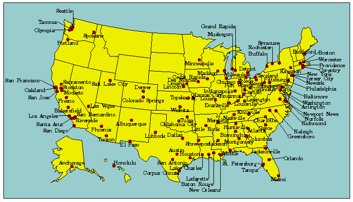

---
output:
  beamer_presentation:
    includes: 
      in_header: anderson_header.txt
      before_body: anderson_beforebody.txt
---

```{r echo = FALSE, message = FALSE}
library(knitr)
library(ggplot2)
library(ggthemes)
library(gridExtra)
library(dplyr)
library(tidyr)
library(lubridate)
library(openair)
library(png)
library(grid)
library(splines)
library(gridExtra)
knitr::opts_chunk$set(fig.path='figures/feb_13_2018/plot-', eval = FALSE, error = TRUE)
```


# Overview

## Community-wide effects of ambient exposures

Today, I'll talk about two popular study designs for studying the **community-wide effects** of **ambient environmental exposures** on human health outcomes. 

The two study designs are: 

- **Time series**
- **Case-crossover**

## 1952 "London Fog"

```{r echo = FALSE, fig.align = "center", eval = TRUE}

```

\vspace{-0.1in}

\footnotesize

Source: \textit{The Crown, Season 1, Episode 4, Netflix} 

## 1952 "London Fog"

```{r echo = FALSE, fig.align = "center", out.width = "\\textwidth", eval = TRUE}

```

\vspace{-0.1in}

\footnotesize

Source: Bell and Davis, 2001 

## 2013 Beijing "Airpocalypse"

```{r echo = FALSE, fig.align = "center", out.width = "\\textwidth", eval = TRUE}
knitr::include_graphics("figures/beijing_airpocalypse.png")
```

\vspace{-0.3in}

\footnotesize

Source: https://www.npr.org/

## 2017 Hurricane Maria

```{r echo = FALSE, fig.align = "center", out.width = "\\textwidth", eval = TRUE}
knitr::include_graphics("figures/maria_timeseries.png")
```

\vspace{-0.1in}

\footnotesize

Source: The New York Times

## Samet editorial

```{r echo = FALSE, fig.align = "center", out.width = "\\textwidth", eval = TRUE}

```

## NMMAPS

```{r echo = FALSE, fig.align = "center", out.width = "\\textwidth", eval = TRUE}

```

\vspace{-0.1in}

\footnotesize

Source: www.ihapss.jhsph.edu

## Community-wide effects of ambient exposures

- Inform policy choices
- Evaluate effectiveness of interventions or policy changes
- Gives clues to biological mechanism

## Impact of NMMAPS 

Research impacts of NMMAPS package

- As of November 2011, 67 publications had been published using this
data, with 1,781 citations to these papers 
- Research using NMMAPS has been used by the US EPA in creating
  regulatory impact statements for air pollution (particulates and
  ozone) 
- "Thanks to NMMAPS, there is probably no other country in the
  world with a greater understanding of the health effects of air
  pollution and heat waves in its population.""

\footnotesize

Source: Barnett, Huang, and Turner, 2012

## Community-wide effects of ambient exposures

> "NMMAPs [a large study of the acute effects of air pollution] played a central role in the Environmental Protection Agency's development of national ambient air quality standards for the six 'criteria' pollutants'."

\footnotesize

Source: Peng et al, 2006

## Community-wide effects of ambient exposures

> "The critical role of the NMMAPs in the development of the air quality standards attracted intense scrutiny from the scientific community and industrial groups regarding the statistical models that are used and the methods that are employed for adjusting for potential confounding."

\footnotesize

Source: Peng et al, 2006

## Community-wide effects of ambient exposures

```{r echo = FALSE, fig.align = "center", out.height = "0.9\\textheight", eval = TRUE}

```

# Example data: Chicago NMMAPS

## `chicagoNMMAPS` data

For the examples in this lecture, I'll use some data from Chicago on mortality, temperature, and air pollution. These data are available as part of the `dlnm` package. You can load them in R using the following code:

```{r message = FALSE, warning = FALSE, eval = TRUE}
library(dlnm)
data("chicagoNMMAPS")
```

## `chicagoNMMAPS` data

To make the data a little easier to use, I'll rename the data frame as `chic`:

```{r, eval = TRUE}
chic <- chicagoNMMAPS
chic[1:3, c("date", "cvd", "temp", "dptp", "pm10")]
```

## `chicagoNMMAPS` data

To find out more about this data, you can look at its help file:

```{r}
?chicagoNMMAPS
```

# Concept: Time series studies

## Model design

```{r, echo = FALSE, eval = TRUE, out.height = "0.9\\textheight", fig.align = "center"}
knitr::include_graphics("figures/ModelFigure2.pdf")
```

## Model design

```{r, echo = FALSE, eval = TRUE, out.height = "0.9\\textheight", fig.align = "center"}
knitr::include_graphics("figures/ModelFigure3.pdf")
```

## Model design

```{r, echo = FALSE, eval = TRUE, out.height = "0.9\\textheight", fig.align = "center"}
knitr::include_graphics("figures/ModelFigure4.pdf")
```

## Model design

The model we fit is: 

$$
Y(t) \sim Quasipoisson(\mu_t, \sigma^2)
$$
$$
log(\mu_t) = \beta_{0} + \beta_{1}PM_{t} + f(t) + Z(t)
$$

where: 

- $Y(t)$: Daily mortality count in community $t$
- $PM_t$: Daily $PM_{10}$ count
- $f(t)$: Smooth function of time
- $Z(t)$: Other confounders

## Confounders

```{r echo = FALSE, fig.width = 6, fig.height = 5, eval = TRUE, warning = FALSE, fig.align = "center", out.width = "\\textwidth"}
a <- chic[ , c("date", "doy", "dow", "death", "cvd", "resp", "temp",
          "dptp", "rhum", "pm10", "o3")] %>% 
  filter(ymd("1987-01-01") <= date & date <= ymd("1991-12-31")) %>% 
  ggplot(aes(x = date, y = death)) + 
  geom_point(alpha = 0.5, size = 0.75, color = "darkcyan") + 
  theme_classic() + 
  labs(x = "Date", y = "# of deaths") + 
  geom_smooth(se = FALSE, color = "red", method = "loess", span = 0.2)

b <- chic[ , c("date", "doy", "dow", "death", "cvd", "resp", "temp",
          "dptp", "rhum", "pm10", "o3")] %>% 
  filter(ymd("1987-01-01") <= date & date <= ymd("1991-12-31")) %>% 
  ggplot(aes(x = date, y = pm10)) + 
  geom_point(alpha = 0.5, size = 0.75, color = "darkcyan") + 
  theme_classic() + 
  labs(x = "Date", y = expression(PM[10]*" concentration")) + 
  geom_smooth(se = FALSE, color = "red", method = "loess", span = 0.2)

grid.arrange(a, b, ncol = 1)
```

\footnotesize

\centering

Temporal trends in daily mortality and particulate matter, Chicago, IL

## Confounders

```{r echo = FALSE, fig.width = 6, fig.height = 5, eval = TRUE, warning = FALSE, fig.align = "center", out.width = "\\textwidth"}
library(ggbeeswarm)
a <- chic[ , c("date", "doy", "dow", "death", "cvd", "resp", "temp",
          "dptp", "rhum", "pm10", "o3")] %>% 
  filter(date <= "1989-12-31") %>% 
  ggplot(aes(x = dow, y = death)) + 
  geom_beeswarm(alpha = 0.3, color = "darkcyan") + 
  theme_classic() + 
  labs(x = "Day of the week", y = "# of deaths") +
  stat_summary(fun.y = mean, fun.ymin = mean, fun.ymax = mean, 
               geom = "crossbar", width = 0.7, color = "red") + 
  ylim(c(75, 150))

b <- chic[ , c("date", "doy", "dow", "death", "cvd", "resp", "temp",
          "dptp", "rhum", "pm10", "o3")] %>% 
  filter(date <= "1989-12-31") %>% 
  ggplot(aes(x = dow, y = pm10)) + 
  geom_beeswarm(alpha = 0.3, color = "darkcyan") + 
  theme_classic() + 
  labs(x = "Day of the week", y = expression(PM[10]*" concentration")) +
  stat_summary(fun.y = mean, fun.ymin = mean, fun.ymax = mean, 
               geom = "crossbar", width = 0.7, color = "red") + 
  ylim(c(0, 100))

grid.arrange(a, b, ncol = 1)
```

\footnotesize

\centering

Day-of-week trends in daily mortality and particulate matter, Chicago, IL

## Confounders

- Measured confounders
    - Temperature
    - Dew point temperature
    - Day of the week 
- Unmeasured confounders
    - Long-term time trends
        - Changing population size
        - Changing population demographics
    - Seasonal time trends
        - Respiratory infections
        - Influenza
        

## Controlling for confounders

Some cofounders you might want to fit using a more complex form. For example, the relationship between temperature and mortality is often non-linear, with the lowest risk at mild temperatures and increasing risk as temperature gets colder or hotter. 


## Splines

```{r echo = FALSE, eval = TRUE, fig.align = "center", out.height = "0.7\\textheight"}
knitr::include_graphics("figures/Spline.png")
```

\footnotesize

Source: Wikipedia

## Convergence: "GAM-gate"

```{r echo = FALSE, eval = TRUE, fig.align = "center", out.width = "0.9\\textwidth"}

```

\hyperlink{cc}{\beamerskipbutton{Skip Implementation}}

# Implementation: Time series studies

## Overdispersed Poisson example

For example, say we wanted to fit an overdispersed Poisson regression for the `chic` data of whether cardiovascular mortality is associated with particulate matter (note: in this simplified example, I'm not controlling for many things we normally would, like season and temperature).

```{r eval = TRUE}
mod_d <- glm(cvd ~ pm10, data = chic,
             family = quasipoisson())
summary(mod_d)$coef[ , c(1, 2, 4)]
```

## Overdispersed Poisson example

Here, the model coefficient gives the **log relative risk** of cardiovascular mortality associated with a unit increase in PM\textsubscript{10} concentration.

## Controlling for confounders

We usually want to control for other confounders. For example, when we look at the association between PM\textsubscript{10} and cardiovascular mortality, we probably want to control for things like day of the week, seasonal and long-term mortality trends, and temperature. 

We can control for these potential confounders by adding them in to the right-hand side of the formula: 

```{r eval = FALSE}
# Note: This is pseudocode
[health outcome] ~ [exposure of interest] + 
                   [confounder1] + [confounder 2] ...
```

## Controlling for confounders

For example, we usually want to control for day of the week as a factor. To do that, first make sure that day of the week has the class `factor`:

```{r eval = TRUE}
class(chic$dow)
```

## Controlling for confounders

If so, you can include it in your model:

```{r eval = TRUE}
mod_e <- glm(cvd ~ pm10 + dow, data = chic,
             family = quasipoisson())
summary(mod_e)$coef[ , c(1, 2, 4)] %>% head(4)
```

## Controlling for confounders

You can use `ns()` from the `splines` package to fit temperature using a spline. Here, I am fitting a spline with four degrees of freedom:

```{r eval = TRUE}
library(splines)
mod_e <- glm(cvd ~ pm10 + dow + ns(temp, 4),
             data = chic,
             family = quasipoisson())
summary(mod_e)$coef[c(1:2, 9:10), c(1, 2, 4)]
```

## Controlling for confounders

Controlling for seasonal and long-term trends is similar. Often, we will use a spline with around 7 degrees of freedom per year. To fit this, first find out how many years are in your data:

```{r eval = TRUE}
length(unique(chic$date)) / 365
```

## Controlling for confounders

Then add a column for `time`:

```{r eval = TRUE}
chic$time <- scale(chic$date, scale = FALSE,
                   center = TRUE)
chic$time[1:3]
```


## Controlling for confounders

Now you can fit the model:

```{r eval = TRUE}
mod_e <- glm(cvd ~ pm10 + dow + ns(temp, 4) +
             ns(time, 7 * 14),
             data = chic,
             family = quasipoisson())
summary(mod_e)$coef[c(1:2, 13:15), c(1, 2)]
```

## Controlling for convergence problems

One way to account for "GAM-gate" is to change the convergence default threshold using the `control` option in `glm`:

```{r eval = TRUE}
mod_e <- glm(cvd ~ pm10 + dow + ns(temp, 4) + 
                   ns(time, 7 * 14),
             data = chic,
             family = quasipoisson(),
             control = glm.control(epsilon=10E-8,
                                 maxit = 10000))
```

Generally, it is good practice to include this when modeling air pollution-health relationships.

## Interpreting model coefficients

You can pull the model coefficient you're interested in from the model summary using this code:

```{r eval = TRUE}
pm_coef <- summary(mod_e)$coefficients["pm10", ]
pm_coef
```

## Interpreting model coefficients

Alternatively, you can use the `tidy` function from the `broom` package:

```{r eval = TRUE}
library(broom)
mod_e %>% 
  tidy() %>% 
  filter(term == "pm10")
```


## Interpreting model coefficients

Remember that this model coefficient is the **log** relative risk, since we fit a quasi-Poisson model. To get a relative risk estimate, you'll need to take the exponent:

```{r eval = TRUE}
exp(pm_coef[1])
```

Therefore, there is a relative risk of `r exp(pm_coef[1])` for each increase of 1 $\mu{g}/m^3$ PM\textsubscript{10}. 


## Interpreting model coefficients

Often, epidemiology studies will present relative risk for a 10-unit, rather than 1-unit, increase in exposure (e.g., per 10 $\mu{g}/m^3$ PM\textsubscript{10}). To estimate this, you need to multiple the coefficient by 10 *before* taking the exponential:

```{r eval = TRUE}
exp(10 * pm_coef[1])
```

Therefore, there is a relative risk of `r exp(10 * pm_coef[1])` for an increase of 10 $\mu{g}/m^3$ PM\textsubscript{10}. 

## Interpreting model coefficients

Sometimes, epidemiology studies will present results as % increase in mortality instead of relative risk. You can calculate this as:

% increase = 100 * (RR - 1)

For our example model, you could calculate:

```{r eval = TRUE}
100 * (exp(10 * pm_coef[1]) - 1)
```

Therefore, there is a `r round(100 * (exp(10 * pm_coef[1]) - 1), 3)`% increase in mortality for an increase of 10 $\mu{g}/m^3$ PM\textsubscript{10}. 


# Concept: Case-crossover studies

## Case-crossover models

\label{cc}

Case-crossover model designs are based on the idea of matched case-control studies. For these, instead of comparing averages of exposure for cases versus controls, you compare the average difference across each matched set of case and control(s).

```{r echo = FALSE, fig.width = 8, fig.height = 3}
x <- rnorm(10)
y <- x - rnorm(10, mean = 2, sd = 0.25)
z <- rnorm(10) - 2
pos <- rnorm(n = 10, mean = 0, sd = 0.05)

ex <- data.frame(x, y, z, pos) %>%
        gather(name, value, -pos) %>%
        mutate(pos = pos + rep(c(1, 2, 2),
                               each = 10))
ex_a <- filter(ex, name != "z")
ex_a_sum <- group_by(ex_a, name) %>%
        summarize(mean = mean(value)) %>%
        mutate(position = c(1, 2),
               low_pos = position - 0.2,
               high_pos = position + 0.2)

a <- ggplot(ex_a, aes(x = pos, y = value,
                      color = name)) + 
        geom_point(alpha = 0.9) +
        scale_x_continuous(name = "",
                           limits = c(0.5, 2.5),
                           breaks = c(1, 2),
                           labels = c("Cases",
                                     "Controls")) +
        ylab("Weather variable") + 
        scale_color_discrete(guide = FALSE) + 
        theme_few() + 
        theme(axis.ticks = element_blank(),
              axis.text.y = element_blank()) + 
        geom_line(data = ex_a_sum,
                  aes(x = position, y = mean,
                      group = NA),
                  color = "gray", size = 2,
                  alpha = 0.5) + 
        geom_segment(data = ex_a_sum,
                      aes(x = low_pos,
                          xend = high_pos,
                          y = mean, yend = mean),
                     color = "black", size = 1.25) +
        ggtitle("Case-control")

ex_a$group <- factor(rep(1:10, length.out = 20))

b <- ggplot(ex_a, aes(x = pos, y = value,
                      color = name)) + 
        geom_point(alpha = 0.9) +
        scale_x_continuous(name = "",
                           limits = c(0.5, 2.5),
                           breaks = c(1, 2),
                           labels = c("Cases",
                                     "Controls")) +
        scale_color_discrete(guide = FALSE) + 
        theme_few() + 
        ylab("Weather variable") + 
        theme(axis.ticks = element_blank(),
              axis.text.y = element_blank()) + 
        geom_line(aes(x = pos, y = value, 
                      group = group),
                  color = "gray") +
        ggtitle("Matched case-control")

grid.arrange(a, b, ncol = 2)
```

## Types of case-crossover designs

```{r echo = FALSE, eval = TRUE, fig.align = "center"}
knitr::include_graphics("figures/CaseCrossTypes.jpg")
```

\footnotesize

Source: Sorock et al. 2001, Injury Prevention

## Strata for case-crossover

```{r echo = FALSE, fig.width = 8, fig.height = 3, eval = TRUE, message = FALSE, warning = FALSE}
library(viridis)
data(mydata)
mydata <- subset(mydata, 
        format(mydata$date, "%Y") == "2003" & 
        format(mydata$date, "%m") %in% c("05",
                                         "06",
                                         "07",
                                         "08"))
mydata$stratum <- format(mydata$date,
                         "%Y-%b-%a")
mydata$stratum <- factor(mydata$stratum,
                levels = unique(mydata$stratum))
mydata$stratum_num <- as.numeric(mydata$stratum)
calendarPlot(selectByDate(mydata,
                          month = c(5:9),
                          year = 2003),
             pollutant = "stratum_num",
             annotate = "date",
             year = 2003,
             cols = "Accent",
             main = "Strata for a case-crossover: Year, month, day of week",
             key.header = "")
```

## Concept of case-crossover

For each death in the dataset: Given that the death happened on one of the days in its strata, what is the probability that it happened on the day it did?

$$
Pr(Death | Stratum, Exposure)
$$

## Conditional logistic vs. GLM

```{r, eval = TRUE, fig.align = "center", echo = FALSE, out.width="0.9\\textwidth"}

```

## Conditional logistic vs. GLM

> "In this paper, we show that case-crossover using conditional logistic regression is a special case of time series analysis **when there is a common exposure** such as in air pollution studies. This equivalence provides computational convenience for case-crossover analyses and a better understanding of time series models."

*Source: Lu and Zeger Biostatistics 2007*

## Conditional logistic vs. GLM

Case-crossover fit using a GLM:

$$
Y(t) \sim Quasipoisson(\mu_t, \sigma^2)
$$
$$
log(\mu_t) = \beta_{0} + \beta_{1}PM_{t} + \beta_{2}Stratum_{t} + Z(t)
$$

where: 

- $Y(t)$: Daily mortality count in community $t$
- $PM_t$: Daily $PM_{10}$ count
- $Stratum_{t}$: The stratum to which the day belongs
- $Z(t)$: Other confounders

## Conditional logistic vs. GLM

```{r eval = TRUE, echo = FALSE, fig.align = "center", out.width = "0.9\\textwidth"}

```

\footnotesize

Source: Armstrong et al. BMC Medical Research Methodology 2014

## Conditional logistic vs. GLM

```{r eval = TRUE, echo = FALSE, fig.align = "center"}

```

\footnotesize

Source: Armstrong et al. BMC Medical Research Methodology 2014


# Implementation: Case-crossover studies

## GLM method

To code using a GLM, first you need to create a column with the stratum. In R, you can use `format`  with the date to do this easily, and then convert the formatted date for a `factor` class:

```{r eval = TRUE}
chic$casecross_stratum <- format(chic$date, "%Y-%m-%a")
chic$casecross_stratum <- factor(chic$casecross_stratum)
head(chic$casecross_stratum, 3)
```

## Case-crossover

Now you can include this factor in your model (note: this takes the place of model control for time trends and day of week in a typical time series model):

```{r eval = TRUE}
mod_f <- glm(cvd ~ pm10 + ns(temp, 4) + casecross_stratum,
             data = chic,
             family = quasipoisson())
summary(mod_f)$coef[c(1:2, 7:10), c(1, 2)]
```

## Case-crossover

You can interpret the coefficients now in the same way as with the time series model: 

```{r eval = TRUE}
pm_coef <- summary(mod_f)$coefficients["pm10", ]
100 * (exp(10 * pm_coef[1]) - 1)
```

Therefore, for this model, there is a `r round(100 * (exp(10 * pm_coef[1]) - 1), 3)`% increase in mortality for an increase of 10 $\mu{g}/m^3$ PM\textsubscript{10}. 

## Case-crossover

There are also other methods for fitting case-crossover models: 

- Armstrong et al. (Conditional Poisson models: a flexible alternative to conditional logistic case cross-over analysis) suggest using a conditional Poisson regression model (`gnm()`) to speed up computational time.
- The `casecross` function in the `season` package by Adrian Barnett uses 28-day strata (rather than by month) and a Cox proportional hazards regression model to fit the model.

If you are using this method for a paper, it is worthwhile testing the different methods to see if you get similar results.

## Case-crossover

Using a conditional Poisson model:

```{r eval = TRUE}
library(gnm)
mod_g <- gnm(cvd ~ pm10 + ns(temp, 4),
             eliminate = casecross_stratum,
             data = chic,
             family = quasipoisson())
pm_coef <- summary(mod_g)$coefficients["pm10", ]
100 * (exp(10 * pm_coef[1]) - 1)
```


