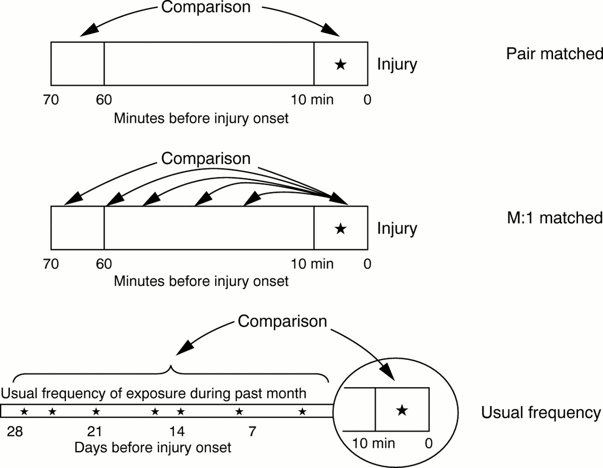
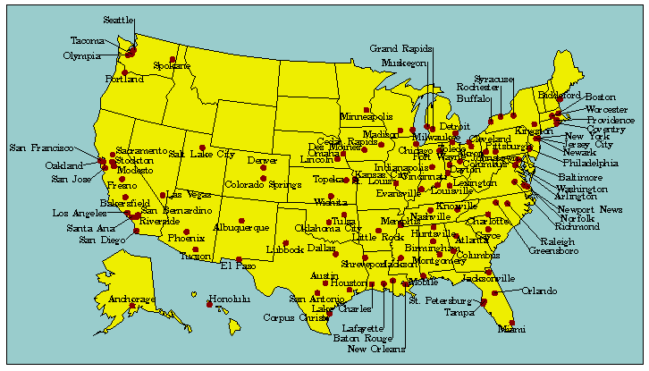

```{r echo = FALSE, message = FALSE}
library(knitr)
library(ggplot2)
library(ggthemes)
library(gridExtra)
library(dplyr)
library(tidyr)
library(openair)
library(png)
library(grid)
library(splines)
knitr::opts_chunk$set(fig.path='figures/feb_4_2016/plot-')
```

# Example data: Chicago NMMAPS

## `chicagoNMMAPS` data

For the examples in this lecture, I'll use some data from Chicago on mortality, temperature, and air pollution. These data are available as part of the `dlnm` package. You can load them in R using the following code:

```{r}
library(dlnm)
data("chicagoNMMAPS")
```

## `chicagoNMMAPS` data

To make the data a little easier to use, I'll rename the data frame as `chic`:

```{r}
chic <- chicagoNMMAPS
chic[1:3, c("date", "death", "cvd", "temp", "dptp", "pm10", "o3")]
```

## `chicagoNMMAPS` data

To find out more about this data, you can look at its help file:

```{r}
?chicagoNMMAPS
```

# Concept: Time series studies

## Model design


## Model design


## Model design


## Model design


# Implementation: Time series studies

## Overdispersed Poisson example

For example, say we wanted to fit an overdispersed Poisson regression for the `chic` data of whether cardiovascular mortality is associated with particulate matter (note: in this simplified example, I'm not controlling for many things we normally would, like season and temperature).

```{r}
mod_d <- glm(cvd ~ pm10, data = chic,
             family = quasipoisson())
summary(mod_d)$coef
```

## Overdispersed Poisson example

Here, the model coefficient gives the **log relative risk** of cardiovascular mortality associated with a unit increase in PM10 concentration.

## Controlling for confounders

We usually want to control for other confounders. For example, when we look at the association between PM10 and cardiovascular mortality, we probably want to control for things like day of the week, seasonal and long-term mortality trends, and temperature. 

We can control for these potential confounders by adding them in to the right-hand side of the formula: 

```{r eval = FALSE}
# Note: This is an example of code structure-- it will not run
[health outcome] ~ [exposure of interest] + [confounder 1] + [confounder 2] ...
```

## Controlling for confounders

For example, we usually want to control for day of the week as a factor. To do that, first make sure that day of the week has the class `factor`:

```{r}
class(chic$dow)
```

## Controlling for confounders

If so, you can include it in your model:

```{r}
mod_e <- glm(cvd ~ pm10 + dow, data = chic,
             family = quasipoisson())
summary(mod_e)$coef
```

## Controlling for confounders

Other cofounders you might want to fit using a more complex form. For example, the relationship between temperature and mortality is often non-linear, with the lowest risk at mild temperatures and increasing risk as temperature gets colder or hotter. Because of that, we often are interested in including temperature in the model using a natural cubic spline.

## Controlling for confounders

You can use `ns()` from the `splines` package to fit temperature using a spline. Here, I am fitting a spline with four degrees of freedom:

```{r}
library(splines)
mod_e <- glm(cvd ~ pm10 + dow + ns(temp, 4), data = chic,
             family = quasipoisson())
summary(mod_e)$coef[c(1:2, 9:12), ]
```

## Controlling for confounders

Controlling for seasonal and long-term trends is similar. Often, we will use a spline with around 7 degrees of freedom per year. To fit this, first find out how many years are in your data:

```{r}
length(unique(chic$date)) / 365
```

## Controlling for confounders

Then add a column for `time`:

```{r}
chic$time <- scale(chic$date, scale = FALSE, center = TRUE)
chic$time[1:3]
summary(chic$time)
```


## Controlling for confounders

Now you can fit the model:

```{r}
mod_e <- glm(cvd ~ pm10 + dow + ns(temp, 4) + ns(time, 7 * 14),
             data = chic,
             family = quasipoisson())
summary(mod_e)$coef[c(1:2, 13:15), ]
```

## Controlling for convergence problems

Dominici et al. found that there could be some problems with convergence for air pollution coefficients ("gam-gate"). One way to prevent this is to change the convergence default threshold using the `control` option in `glm`:

```{r}
mod_e <- glm(cvd ~ pm10 + dow + ns(temp, 4) + ns(time, 7 * 14),
             data = chic,
             family = quasipoisson(),
             control=glm.control(epsilon=10E-8, maxit = 10000))
summary(mod_e)$coef[2, ]
```

Generally, it is good practice to include this when modeling air pollution-health relationships.

## Choosing degrees of freedom

From Peng and Dominici, "Statistical Methods for Environmental Epidemiology with R": 

> "An alternate approach is to use a fixed degrees of freedom, perhaps based
on biological knowledge or previous work. For multisite studies, this approach
leads to fitting the same model to data from each location. One can explore
the sensitivity of $\hat{\beta}$ by varying the df used in the model(s) and examining the associated changes in $\hat{\beta}$."

We will re-visit this sensitivity analysis later when we talk about functions and loops. 

# Interpreting model coefficients

## Interpreting model coefficients

You can pull the model coefficient you're interested in from the model summary using this code:

```{r}
pm_coef <- summary(mod_e)$coefficients["pm10", ]
pm_coef
```

## Interpreting model coefficients

Remember that this model coefficient is the **log** relative risk, since we fit a quasi-Poisson model. To get a relative risk estimate, you'll need to take the exponent:

```{r}
exp(pm_coef[1])
```

Therefore, there is a relative risk of `r exp(pm_coef[1])` for each increase of 1 $\mu{g}/m^3$ PM10. 

## Interpreting model coefficients

Often, epidemiology studies will present relative risk for a 10-unit, rather than 1-unit, increase in exposure (e.g., per 10 $\mu{g}/m^3$ PM10). To estimate this, you need to multiple the coefficient by 10 *before* taking the exponential:

```{r}
exp(10 * pm_coef[1])
```

Therefore, there is a relative risk of `r exp(10 * pm_coef[1])` for an increase of 10 $\mu{g}/m^3$ PM10. 

## Interpreting model coefficients

Sometimes, epidemiology studies will present results as % increase in mortality instead of relative risk. You can calculate this as:

% increase = 100 * (RR - 1)

For our example model, you could calculate:

```{r}
100 * (exp(10 * pm_coef[1]) - 1)
```

Therefore, there is a `r round(100 * (exp(10 * pm_coef[1]) - 1), 3)`% increase in mortality for an increase of 10 $\mu{g}/m^3$ PM10. 


# Concept: Case-crossover studies

## Case-crossover models

Case-crossover model designs are based on the idea of matched case-control studies. For these, instead of comparing averages of exposure for cases versus controls, you compare the average difference across each matched set of case and control(s).

```{r echo = FALSE, fig.width = 8, fig.height = 3}
x <- rnorm(10)
y <- x - rnorm(10, mean = 2, sd = 0.25)
z <- rnorm(10) - 2
pos <- rnorm(n = 10, mean = 0, sd = 0.05)

ex <- data.frame(x, y, z, pos) %>%
        gather(name, value, -pos) %>%
        mutate(pos = pos + rep(c(1, 2, 2),
                               each = 10))
ex_a <- filter(ex, name != "z")
ex_a_sum <- group_by(ex_a, name) %>%
        summarize(mean = mean(value)) %>%
        mutate(position = c(1, 2),
               low_pos = position - 0.2,
               high_pos = position + 0.2)

a <- ggplot(ex_a, aes(x = pos, y = value,
                      color = name)) + 
        geom_point(alpha = 0.9) +
        scale_x_continuous(name = "",
                           limits = c(0.5, 2.5),
                           breaks = c(1, 2),
                           labels = c("Cases",
                                     "Controls")) +
        ylab("Weather variable") + 
        scale_color_discrete(guide = FALSE) + 
        theme_few() + 
        theme(axis.ticks = element_blank(),
              axis.text.y = element_blank()) + 
        geom_line(data = ex_a_sum,
                  aes(x = position, y = mean,
                      group = NA),
                  color = "gray", size = 2,
                  alpha = 0.5) + 
        geom_segment(data = ex_a_sum,
                      aes(x = low_pos,
                          xend = high_pos,
                          y = mean, yend = mean),
                     color = "black", size = 1.25) +
        ggtitle("Case-control")

ex_a$group <- factor(rep(1:10, length.out = 20))

b <- ggplot(ex_a, aes(x = pos, y = value,
                      color = name)) + 
        geom_point(alpha = 0.9) +
        scale_x_continuous(name = "",
                           limits = c(0.5, 2.5),
                           breaks = c(1, 2),
                           labels = c("Cases",
                                     "Controls")) +
        scale_color_discrete(guide = FALSE) + 
        theme_few() + 
        ylab("Weather variable") + 
        theme(axis.ticks = element_blank(),
              axis.text.y = element_blank()) + 
        geom_line(aes(x = pos, y = value, 
                      group = group),
                  color = "gray") +
        ggtitle("Matched case-control")

grid.arrange(a, b, ncol = 2)
```

## Types of case-crossover designs



Source: Sorock et al. 2001, Injury Prevention

## Strata for case-crossover

```{r echo = FALSE, fig.width = 8, fig.height = 3}
data(mydata)
mydata <- subset(mydata, 
        format(mydata$date, "%Y") == "2003" & 
        format(mydata$date, "%m") %in% c("05",
                                         "06",
                                         "07",
                                         "08"))
mydata$stratum <- format(mydata$date,
                         "%Y-%b-%a")
mydata$stratum <- factor(mydata$stratum,
                levels = unique(mydata$stratum))
mydata$stratum_num <- as.numeric(mydata$stratum)
calendarPlot(selectByDate(mydata,
                          month = c(5:9),
                          year = 2003),
             pollutant = "stratum_num",
             annotate = "value",
             year = 2003,
             cols = "RdYlBu",
             main = "Strata for a case-crossover: Year, month, day of week",
             key.header = "")
```

# Implementation: Case-crossover studies

## GLM method

One way to fit this type of model is using a GLM, but with control by strata of year-month-day of week. 

Case-crossover fit using a GLM:

$$
E(log(Y_{t})) \sim \beta_{0} + \beta_{1}PM_{t} + \beta_{2}Stratum_{t}
$$

## GLM method

To code this, first you need to create a column with the stratum. In R, you can use `format`  with the date to do this easily, and then convert the formatted date for a `factor` class:

```{r}
chic$casecross_stratum <- format(chic$date, "%Y-%m-%a")
chic$casecross_stratum <- factor(chic$casecross_stratum)
head(chic$casecross_stratum, 3)
```

## Case-crossover

Now you can include this factor in your model (note: this takes the place of model control for time trends and day of week in a typical time series model):

```{r}
mod_f <- glm(cvd ~ pm10 + ns(temp, 4) + casecross_stratum,
             data = chic,
             family = quasipoisson())
summary(mod_f)$coef[c(1:2, 7:10), ]
```

## Case-crossover

You can interpret the coefficients now in the same way as with the time series model: 

```{r}
pm_coef <- summary(mod_f)$coefficients["pm10", ]
100 * (exp(10 * pm_coef[1]) - 1)
```

Therefore, for this model, there is a `r round(100 * (exp(10 * pm_coef[1]) - 1), 3)`% increase in mortality for an increase of 10 $\mu{g}/m^3$ PM10. 

## Case-crossover

There are also other methods for fitting case-crossover models: 

- Armstrong et al. (Conditional Poisson models: a flexible alternative to conditional logistic case cross-over analysis) suggest using a conditional Poisson regression model (`gnm()`) to speed up computational time.
- The `casecross` function in the `season` package by Adrian Barnett uses 28-day strata (rather than by month) and a Cox proportional hazards regression model to fit the model.

If you are using this method for a paper, it is worthwhile testing the different methods to see if you get similar results.

## Case-crossover

Using a conditional Poisson model:

```{r}
library(gnm)
mod_g <- gnm(cvd ~ pm10 + ns(temp, 4),
             eliminate = casecross_stratum,
             data = chic,
             family = quasipoisson())
pm_coef <- summary(mod_g)$coefficients["pm10", ]
100 * (exp(10 * pm_coef[1]) - 1)
```

## Case-crossover

Using a Cox proportional hazards regression model:

```{r message = FALSE, warning = FALSE}
library(season)
mod_h <- casecross(cvd ~ pm10 + temp,
                   matchdow = TRUE,
                   data = chic)
pm_coef <- mod_h$c.model$coefficients[1]
100 * (exp(10 * pm_coef[1]) - 1)
```

# Multi-city studies

## NMMAPS



*Source: www.ihapss.jhsph.edu*

## NMMAPS package


## Impact of NMMAPS 

Research impacts of NMMAPS package

- As of November 2011, 67 publications had been published using this
data, with 1,781 citations to these papers 
- Research using NMMAPS has been used by the US EPA in creating
  regulatory impact statements for air pollution (particulates and
  ozone) 
- "Thanks to NMMAPS, there is probably no other country in the
  world with a greater understanding of the health effects of air
  pollution and heat waves in its population.""

*Source: Barnett,
  Huang, and Turner, ``Benefits of Publicly Available Data'', 
  Epidemiology 2012*