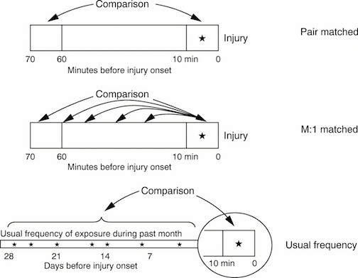

```{r echo = FALSE, message = FALSE}
library(knitr)
library(ggplot2)
library(ggthemes)
library(gridExtra)
library(dplyr)
library(tidyr)
library(openair)
library(png)
library(grid)
library(splines)
knitr::opts_chunk$set(fig.path='figures/feb_4_2016/plot-')
```

# Concept

## Case-crossover models

Case-crossover model designs are based on the idea of matched case-control studies. For these, instead of comparing averages of exposure for cases versus controls, you compare the average difference across each matched set of case and control(s).

```{r echo = FALSE, fig.width = 8, fig.height = 3}
x <- rnorm(10)
y <- x - rnorm(10, mean = 2, sd = 0.25)
z <- rnorm(10) - 2
pos <- rnorm(n = 10, mean = 0, sd = 0.05)

ex <- data.frame(x, y, z, pos) %>%
        gather(name, value, -pos) %>%
        mutate(pos = pos + rep(c(1, 2, 2),
                               each = 10))
ex_a <- filter(ex, name != "z")
ex_a_sum <- group_by(ex_a, name) %>%
        summarize(mean = mean(value)) %>%
        mutate(position = c(1, 2),
               low_pos = position - 0.2,
               high_pos = position + 0.2)

a <- ggplot(ex_a, aes(x = pos, y = value,
                      color = name)) + 
        geom_point(alpha = 0.9) +
        scale_x_continuous(name = "",
                           limits = c(0.5, 2.5),
                           breaks = c(1, 2),
                           labels = c("Cases",
                                     "Controls")) +
        ylab("Weather variable") + 
        scale_color_discrete(guide = FALSE) + 
        theme_few() + 
        theme(axis.ticks = element_blank(),
              axis.text.y = element_blank()) + 
        geom_line(data = ex_a_sum,
                  aes(x = position, y = mean,
                      group = NA),
                  color = "gray", size = 2,
                  alpha = 0.5) + 
        geom_segment(data = ex_a_sum,
                      aes(x = low_pos,
                          xend = high_pos,
                          y = mean, yend = mean),
                     color = "black", size = 1.25) +
        ggtitle("Case-control")

ex_a$group <- factor(rep(1:10, length.out = 20))

b <- ggplot(ex_a, aes(x = pos, y = value,
                      color = name)) + 
        geom_point(alpha = 0.9) +
        scale_x_continuous(name = "",
                           limits = c(0.5, 2.5),
                           breaks = c(1, 2),
                           labels = c("Cases",
                                     "Controls")) +
        scale_color_discrete(guide = FALSE) + 
        theme_few() + 
        ylab("Weather variable") + 
        theme(axis.ticks = element_blank(),
              axis.text.y = element_blank()) + 
        geom_line(aes(x = pos, y = value, 
                      group = group),
                  color = "gray") +
        ggtitle("Matched case-control")

grid.arrange(a, b, ncol = 2)
```

## Types of case-crossover designs



Source: Sorock et al. 2001, Injury Prevention

## Strata for case-crossover

```{r echo = FALSE, fig.width = 8, fig.height = 3}
data(mydata)
mydata <- subset(mydata, 
        format(mydata$date, "%Y") == "2003" & 
        format(mydata$date, "%m") %in% c("05",
                                         "06",
                                         "07",
                                         "08"))
mydata$stratum <- format(mydata$date,
                         "%Y-%b-%a")
mydata$stratum <- factor(mydata$stratum,
                levels = unique(mydata$stratum))
mydata$stratum_num <- as.numeric(mydata$stratum)
calendarPlot(selectByDate(mydata,
                          month = c(5:9),
                          year = 2003),
             pollutant = "stratum_num",
             annotate = "value",
             year = 2003,
             cols = "RdYlBu",
             main = "Strata for a case-crossover: Year, month, day of week",
             key.header = "")
```

# Implementation

## `chicagoNMMAPS` data

For the examples in this lecture, I'll use some data from Chicago on mortality, temperature, and air pollution. These data are available as part of the `dlnm` package. You can load them in R using the following code:

```{r}
library(dlnm)
data("chicagoNMMAPS")
```

## `chicagoNMMAPS` data

To make the data a little easier to use, I'll rename the data frame as `chic`:

```{r}
chic <- chicagoNMMAPS
chic[1:3, c("date", "death", "cvd", "temp", "dptp", "pm10", "o3")]
```

## `chicagoNMMAPS` data

To find out more about this data, you can look at its help file:

```{r}
?chicagoNMMAPS
```

## GLM method

One way to fit this type of model is using a GLM, but with control by strata of year-month-day of week. 

Case-crossover fit using a GLM:

$$
E(log(Y_{t})) \sim \beta_{0} + \beta_{1}PM_{t} + \beta_{2}Stratum_{t}
$$

## GLM method

To code this, first you need to create a column with the stratum. In R, you can use `format`  with the date to do this easily, and then convert the formatted date for a `factor` class:

```{r}
chic$casecross_stratum <- format(chic$date, "%Y-%m-%a")
chic$casecross_stratum <- factor(chic$casecross_stratum)
head(chic$casecross_stratum, 3)
```

## Case-crossover

Now you can include this factor in your model (note: this takes the place of model control for time trends and day of week in a typical time series model):

```{r}
mod_f <- glm(cvd ~ pm10 + ns(temp, 4) + casecross_stratum,
             data = chic,
             family = quasipoisson())
summary(mod_f)$coef[c(1:2, 7:10), ]
```

## Case-crossover

You can interpret the coefficients now in the same way as with the time series model: 

```{r}
pm_coef <- summary(mod_f)$coefficients["pm10", ]
100 * (exp(10 * pm_coef[1]) - 1)
```

Therefore, for this model, there is a `r round(100 * (exp(10 * pm_coef[1]) - 1), 3)`% increase in mortality for an increase of 10 $\mu{g}/m^3$ PM10. 

## Case-crossover

There are also other methods for fitting case-crossover models: 

- Armstrong et al. (Conditional Poisson models: a flexible alternative to conditional logistic case cross-over analysis) suggest using a conditional Poisson regression model (`gnm()`) to speed up computational time.
- The `casecross` function in the `season` package by Adrian Barnett uses 28-day strata (rather than by month) and a Cox proportional hazards regression model to fit the model.

If you are using this method for a paper, it is worthwhile testing the different methods to see if you get similar results.

## Case-crossover

Using a conditional Poisson model:

```{r}
library(gnm)
mod_g <- gnm(cvd ~ pm10 + ns(temp, 4),
             eliminate = casecross_stratum,
             data = chic,
             family = quasipoisson())
pm_coef <- summary(mod_g)$coefficients["pm10", ]
100 * (exp(10 * pm_coef[1]) - 1)
```

## Case-crossover

Using a Cox proportional hazards regression model:

```{r message = FALSE, warning = FALSE}
library(season)
mod_h <- casecross(cvd ~ pm10 + temp,
                   matchdow = TRUE,
                   data = chic)
pm_coef <- mod_h$c.model$coefficients[1]
100 * (exp(10 * pm_coef[1]) - 1)
```
