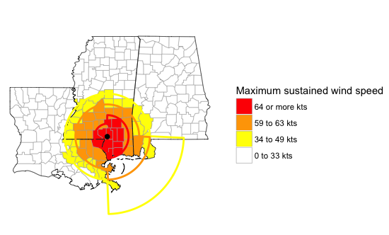
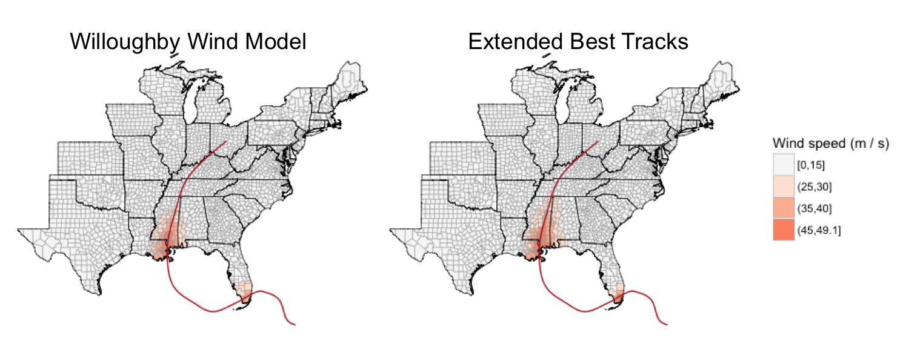
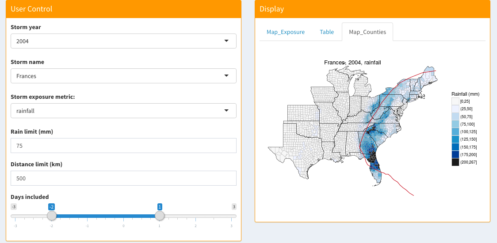
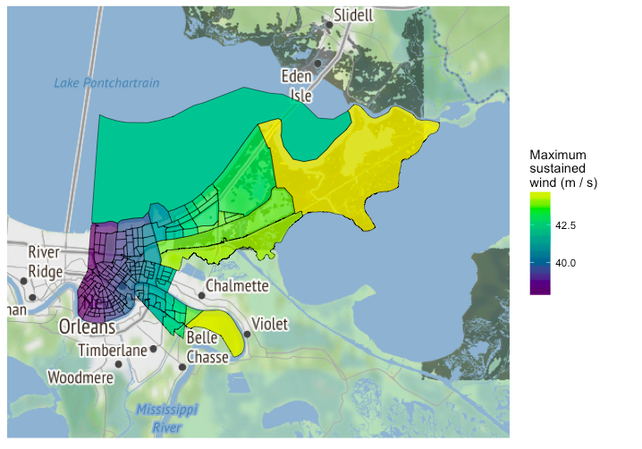

---
output:
  beamer_presentation:
    keep_tex : true
    includes: 
      in_header: anderson_header.txt
      before_body: anderson_beforebody.txt
---

```{r setup, include=FALSE, message = FALSE, warning = FALSE}
knitr::opts_chunk$set(echo = FALSE)
library(ggplot2)
library(dplyr)
library(lubridate)
library(gridExtra)
library(tidyr)
library(stringr)

library(hurricaneexposuredata)
library(hurricaneexposure)
library(countyweather)
```

# Motivation and Study Aims

## Epidemiologic research on tropical storms

\begin{block}{Outcomes studied for U.S. tropical storms}
\begin{itemize}
  \item Mortality 
  \begin{itemize}
    \item Direct deaths
    \item Indirect deaths
  \end{itemize}
  \item Cardiovascular events
  \item Birth rates
  \item Birth outcomes
\end{itemize}
\end{block}

\begin{block}{Focus of exposure assessment for this study}
Multi-storm studies with aggregated daily counts of outcomes (for example, daily deaths by county). 
\end{block}

## Assessing exposure

\begin{block}{Challenge for epidemiological research}
How can we determine whether a county was exposed to a tropical storm?
\end{block}

Previous approaches have varied but include: 

- Distance from storm track
- Storm winds above a threshold
- Evacuation orders
- FEMA reports
- Combined metric (property damage, power outages, gas shortages, etc.) 

## Assessing exposure

\begin{columns}
\begin{column}{0.7\textwidth}
```{r echo = FALSE, fig.align = "center", out.width = "\\textwidth"}
knitr::include_graphics("coastal_inland_mortality_figure.png")
```
\vspace{-0.3cm}
\begin{center}
\footnotesize Czajkowski et al. 2011
\end{center}
\end{column}
\begin{column}{0.3\textwidth}
\small
\begin{block}{Example exposure assessment}
Czajkowski et al. (2011) classified counties based on distance to storm tracks to study mortality risks.
\end{block}
\end{column}
\end{columns}

## Assessing exposure

\begin{columns}
\begin{column}{0.7\textwidth}
```{r echo = FALSE, fig.align = "center", out.width = "\\textwidth"}
knitr::include_graphics("florida_direct_indirect_mortality_figure.png")
```
\vspace{-0.6cm}
\begin{center}
\footnotesize McKinney et al. 2011
\end{center}
\end{column}
\begin{column}{0.3\textwidth}
\small
\begin{block}{Example exposure assessment}
McKinney et al. (2011) classified counties based on distance to storm tracks, evacuations, and wind to study mortality risk.
\end{block}
\end{column}
\end{columns}

## Hazard-specific metrics

\begin{columns}
\begin{column}{0.5\textwidth}
\begin{block}{Tropical storm hazard metrics}
   \begin{itemize}
    \item Distance from the storm
    \item High winds
    \item Rainfall
    \item Flood events
    \item Tornado events
   \end{itemize}
\end{block}
\end{column}
\begin{column}{0.5\textwidth}  
    \vspace{-0.25cm}
    \begin{center}
     \includegraphics[width=0.8\textwidth]{storm_hazards.png}
     \end{center}
     \vspace{-0.25cm}
     \scriptsize{Image sources: Los Angeles Times, NBC}
\end{column}
\end{columns}

## Study aims

\begin{block}{Study aims}
\begin{itemize}
  \item Develop exposure classifications of all U.S. Atlantic basin tropical storms, 1988--2011, based on state-of-the-art measurements of tropical storm hazards
  \item Assess agreement between hazard-based classifications for (1) storm severity and (2) county-specific classification
  \item Make exposure assessments accessible to other researchers for epidemiological and other impact studies 
\end{itemize}
\end{block}

# Assessing exposure

## Study data
\vspace{-0.4cm}
\begin{center}
\large Atlantic basin tropical storms, 1988--2011
\end{center}
\vspace{-0.6cm}

```{r echo = FALSE, fig.align = 'center', message = FALSE, fig.width = 4, out.width = "0.7\\textwidth"}
data(closest_dist)
storms <- unique(closest_dist$storm_id)
storms <- storms[gsub("*.+-", "", storms) <= 2011 & 
                        gsub("*.+-", "", storms) >= 1988]
a <- map_tracks(storms, plot_points = FALSE, alpha = 0.3, color = "darkcyan")
# Add storms whose names were retired
# Source: http://www.nhc.noaa.gov/aboutnames_history.shtml
map_tracks(c("Hugo-1989", "Bob-1991", "Andrew-1992", 
             "Opal-1995", "Fran-1996", "Georges-1998", "Mitch-1998",
             "Floyd-1999", "Allison-2001", "Michelle-2001",
             "Isidore-2002", "Lili-2002", "Isabel-2003",
             "Charley-2004", "Frances-2004",
             "Ivan-2004", "Jeanne-2004", 
             "Dennis-2005", "Katrina-2005", "Rita-2005",
             "Wilma-2005", "Noel-2007",
             "Gustav-2008", "Ike-2008", "Paloma-2008",
             "Irene-2011"),
           plot_object = a, plot_points = FALSE, color = "darkcyan",
           padding = 0) + 
  theme_void() + 
  theme(panel.background = element_rect(fill = "white")) + 
  coord_map() 
```
\vspace{-1cm}
\begin{center}
\footnotesize Tracks shown in bold indicate storms whose names were retired. Storms that did not come within 250 km of a U.S. county are excluded.
\end{center}

## Storm exposure

\footnotesize
```{r}
data_frame(
  `Exposure metric` = c("Distance",
                        "Rain",
                        "Wind",
                        "Flood",
                        "Tornado"),
  `Criterial for exposure` = c("County population mean center within 100 km of storm track",
                               "County received 75 mm or more rain over the period from two days before to one day after the storm's closest approach and the storm passed within 500 km of the county",
                               "Modeled wind speed at county's population mean center met or exceeded 15 m / s during the storm",
                               "Flood event listed with a start date within two days of the storm's closest approach and county within 500 km of storm track",
                               "Tornado event listed with a start date within two days of the storm's closest approach and county within 500 km of storm track")
  ) %>%
  pander::pander(justify = "ll", split.cells = c(15, 50))
```

## Distance from storm

\large Tropical storm "Best Track" data
\vspace{-0.7cm}

\begin{columns}
\begin{column}{0.7\textwidth}
```{r echo = FALSE, out.width = "\\textwidth"}
knitr::include_graphics("finding_closest_point.pdf")
```
\end{column}
\begin{column}{0.3\textwidth}
\small
\begin{block}{Distance metric}
We matched storm tracks to county population mean centers to determine the closest approach and date of closest approach of each storm to each county.
\end{block}
\end{column}
\end{columns}

## Wind exposure

\begin{columns}
\begin{column}{0.7\textwidth}
```{r echo = FALSE, out.width = "\\textwidth", fig.width = 6, fig.height = 4}
map_tracks("Katrina-2005", padding = 2, plot_points = TRUE) + 
  coord_map()
```
\end{column}
\begin{column}{0.3\textwidth}
\small
\begin{block}{Wind metric}
We modeled county winds with the Willoughby wind model. This model inputs storm location and maximum wind from best tracks data. 
\end{block}
\end{column}
\end{columns}

## Wind exposure

```{r echo = FALSE, out.width = "\\textwidth", message = FALSE, warning = FALSE, fig.width = 6, fig.height = 4, fig.align = "center"}
map_tracks("Katrina-2005", padding = 0, 
           plot_object = map_counties("Katrina-2005", metric = "wind")) + 
  coord_map() + 
  ggtitle("Modeled winds, Katrina, 2005")
```

## Wind exposure

\begin{block}{Assessment}
To assess results of the storm wind model, we compared modeled results with wind radii from the Extended Best Tracks for each storm. 
\end{block}
\vspace{-0.5cm}
```{r echo = FALSE, out.width = "0.75\\textwidth", fig.align = "center"}

```

## Wind exposure

\begin{center}
Comparison of modeled wind versus wind radii, Katrina, 2005
\end{center}
\vspace{-1cm}

```{r echo = FALSE, out.width = "1.08\\textwidth", fig.align = "left"}

```

## Wind exposure

\begin{center}
Comparison of modeled wind versus wind radii, Ike, 2008
\end{center}
\vspace{-1cm}

```{r echo = FALSE, out.width = "1.05\\textwidth", fig.align = "left"}
knitr::include_graphics("wind_model_eval_ike_2008.png")
```

## Rain exposure

\begin{columns}
\begin{column}{0.7\textwidth}  
    \vspace{-0.25cm}
    \begin{center}
    Rain during Tropical Storm Lee
    \end{center}
    \begin{center}
     \includegraphics[width=\textwidth]{nldas2_ts_lee.png}
     \end{center}
     \begin{center}
         \vspace{-0.4cm}
     \scriptsize{Image source: Goddard Earth Sciences DISC}
     \end{center}
\end{column}
\begin{column}{0.3\textwidth}
\footnotesize
\begin{block}{Rain metric}
We used NLDAS-2 precipitation data to assess county rainfall. We summed rain from two days before to one day after the storm. We include a distance threshold for the rain metric.
\end{block}
\end{column}
\end{columns}

## Rain exposure

```{r frances_rain_example, echo = FALSE, fig.width = 6, fig.height = 4, fig.align = "center", out.width = "0.9\\textwidth", warning = FALSE, message = FALSE}
storm <- "Frances-2004"
map_tracks(storms = storm, plot_points = FALSE, 
                plot_object = map_counties(storm = storm, 
                                           metric = "rainfall")) + 
        ggtitle("Rainfall during Frances, 2004")
```

## Rain exposure

\small
\begin{block}{Assessment}
To assess this rain metric, we compared it to rainfall measured at weather stations. X-axis: Rainfall summed for days near storm; y-axis: average of summed rain at each monitor for the same days.
\end{block}

```{r compare_rain_ex_counties, echo = FALSE, fig.width = 9, fig.height = 2.75, fig.align = "left", out.width = "1.05\\textwidth"}
plot_county_rain_compare <- function(ex_fips, ex_dir, ex_title, 
                                     get_data = FALSE){
        if(get_data){
                write_daily_timeseries(ex_fips, coverage = 0,
                                       date_min = "1988-01-01",
                                       date_max = "2011-12-31",
                                       var = "PRCP",
                                       out_directory = ex_dir,
                                       keep_map = FALSE)
        }
        
        check_dates <- closest_dist %>%
                dplyr::filter(fips == ex_fips) %>%
                dplyr::select(-storm_dist) %>%
                dplyr::mutate(closest_date = ymd(closest_date)) %>%
                dplyr::rename(day_0 = closest_date) %>%
                dplyr::mutate(fips = as.integer(fips),
                              day_0 = day_0 + days(0),
                              day_b1 = day_0 - days(1),
                              day_b2 = day_0 - days(2),
                              day_a1 = day_0 + days(1)) %>%
                dplyr::select(storm_id, day_b2, day_b1, day_0, day_a1) %>%
                tidyr::gather(key = lag, value = day, -storm_id) %>%
                dplyr::rename(date = day)
        all_dates <- unique(check_dates$date)
        
        ex_weather <- readRDS(paste0(ex_dir, ex_fips, ".rds"))
        ex_weather <- as.data.frame(ex_weather$daily_data)
        
        ex_weather <- ex_weather %>%
                dplyr::filter(date %in% all_dates) %>%
                dplyr::right_join(check_dates, by = "date") %>%
                dplyr::group_by(storm_id) %>%
                dplyr::summarize(prcp = sum(prcp),
                                ave_n = mean(prcp_reporting))
        
        ex_rain <- county_rain(counties = ex_fips,
                               start_year = 1988, end_year = 2011,
                               rain_limit = 0, dist_limit = 500) %>%
                full_join(ex_weather, by = "storm_id") %>%
                filter(!is.na(prcp) & !is.na(tot_precip)) %>%
                mutate(prcp = prcp / 10) ## Units for countyweather are now 10ths
                                         ## of millimeters for precipitation
        
        ave_n <- round(mean(ex_rain$ave_n, na.rm = TRUE))
        n_storms <- nrow(ex_rain)
        ex_title <- paste0(ex_title, "\n(storms: ", n_storms,
                           "; monitors: ", ave_n, ")")
        
        plot_range <- range(ex_rain[ , c("prcp", "tot_precip")],
                            na.rm = TRUE)
        
        ex_plot <- ggplot(ex_rain, aes(x = tot_precip, y = prcp)) +
                geom_hline(aes(yintercept = 75), color = "lightgray") +
                geom_vline(aes(xintercept = 75), color = "lightgray") +
                geom_abline(aes(intercept = 0, slope = 1), color = "gray",
                    alpha = 0.5) +
                geom_point(alpha = 0.5, color = "red") +
                theme_classic() +
                scale_size_continuous(guide = "none") +
                xlab("Rainfall (mm)  from\nNLDAS-2 data") +
                ylab("Rainfall (mm)\nfrom monitors") +
                xlim(plot_range) + ylim(plot_range) + 
                ggtitle(ex_title)
        return(ex_plot)
}

a <- plot_county_rain_compare(ex_fips = "12086", ex_dir = "dade_data/",
                         ex_title = "Miami-Dade, FL",
                         get_data = FALSE)

b <- plot_county_rain_compare(ex_fips = "42101",
                              ex_dir = "philadelphia_data/",
                         ex_title = "Philadelphia County, PA",
                         get_data = FALSE)

c <- plot_county_rain_compare(ex_fips = "48201", ex_dir = "harris_data/",
                         ex_title = "Harris County, TX",
                         get_data = FALSE)


grid.arrange(a, b, c, ncol = 3)
```

## Rain exposure

```{r ike_rain_example, echo = FALSE, fig.width = 6, fig.height = 4, fig.align = "center", out.width = "0.9\\textwidth", warning = FALSE, message = FALSE}
storm <- "Ike-2008"
map_tracks(storms = storm, plot_points = FALSE, 
                plot_object = map_counties(storm = storm, 
                                           metric = "rainfall")) + 
        ggtitle("Rainfall during Ike, 2008")
```

## Rain exposure

```{r lee_rain_example, echo = FALSE, fig.width = 6, fig.height = 4, fig.align = "center", out.width = "0.9\\textwidth", warning = FALSE, message = FALSE}
storm <- "Lee-2011"
map_tracks(storms = storm, plot_points = FALSE, 
                plot_object = map_counties(storm = storm, 
                                           metric = "rainfall")) + 
        ggtitle("Rainfall during Lee, 2011")
```

## Flood and tornado events

```{r echo = FALSE, out.width = "\\textwidth"}
knitr::include_graphics("noaastormevents.png")
```

Website: https://www.ncdc.noaa.gov/stormevents/

## Flood and tornado events

```{r floyd_flood_example, echo = FALSE, fig.width = 6, fig.height = 4, fig.align = "center", out.width = "0.9\\textwidth", warning = FALSE, message = FALSE}
storm <- "Floyd-1999"
map_tracks(storms = storm, plot_points = FALSE, 
                plot_object = map_event_exposure(storm = storm, 
                                           event_type = "flood")) + 
        ggtitle("Flood events during Floyd, 1999")
```

## Flood and tornado events

```{r ivan_tornado_example, echo = FALSE, fig.width = 6, fig.height = 4, fig.align = "center", out.width = "0.9\\textwidth", warning = FALSE, message = FALSE}
storm <- "Ivan-2004"
map_tracks(storms = storm, plot_points = FALSE, 
                plot_object = map_event_exposure(storm = storm, 
                                           event_type = "tornado")) + 
        ggtitle("Tornado events during Ivan, 2004")
```


# Agreement between exposure metrics

## Storm exposure 

```{r}
my_fips <- unique(closest_dist$fips)
distance_exposure <- county_distance(counties = my_fips, start_year = 1988,
                                     end_year = 2011, dist_limit = 100) %>%
  select(storm_id, fips) %>%
  mutate(distance_exposed = TRUE,
         storm_id = as.character(storm_id))
rain_exposure <- county_rain(counties = my_fips,
                             start_year = 1988, end_year = 2011,
                             rain_limit = 75, dist_limit = 500) %>%
  select(storm_id, fips) %>%
  mutate(rain_exposed = TRUE,
         storm_id = as.character(storm_id))
wind_exposure <- county_wind(counties = my_fips, start_year = 1988,
                             end_year = 2011, wind_limit = 15) %>%
  select(storm_id, fips) %>%
  mutate(wind_exposed = TRUE,
         storm_id = as.character(storm_id))
flood_exposure <- county_events(counties = my_fips,
                              start_year = 1996, end_year = 2011,
                              event_type = "flood") %>%
  select(storm_id, fips) %>%
  mutate(flood_exposed = TRUE,
         storm_id = as.character(storm_id))
tornado_exposure <- county_events(counties = my_fips,
                              start_year = 1996, end_year = 2011,
                              event_type = "tornado") %>%
  select(storm_id, fips) %>%
  mutate(tornado_exposed = TRUE,
         storm_id = as.character(storm_id))
total_exposure <- distance_exposure %>%
  full_join(rain_exposure, by = c("storm_id", "fips")) %>%
  full_join(wind_exposure, by = c("storm_id", "fips")) %>%
  full_join(flood_exposure, by = c("storm_id", "fips")) %>%
  full_join(tornado_exposure, by = c("storm_id", "fips")) %>%
  gather(metric, exposed, 
         -storm_id, -fips, na.rm = FALSE) %>%
  mutate(exposed = ifelse(is.na(exposed), FALSE, exposed)) 
```

```{r}
total_exposure %>%
  group_by(storm_id, metric) %>%
  dplyr::summarize(n_exposed = sum(exposed)) %>%
  dplyr::ungroup() %>%
  dplyr::group_by(metric) %>%
  dplyr::summarize(median_exposure2 = median(n_exposed),
                   iqr_exposure = paste(quantile(n_exposed, c(0.25, 0.75)),
                                              collapse = ", "), 
                   median_exposure = paste0(median_exposure2, " (",
                                                  iqr_exposure, ")"),
                   max_exposure = max(n_exposed),
                   which_max_exposure = storm_id[which.max(n_exposed)],
                   which_max_exposure = gsub("-", ", ", which_max_exposure),
                   max_exposure = paste0(which_max_exposure, " (",
                                               max_exposure, ")")) %>%
  arrange(desc(median_exposure2)) %>%
  dplyr::select(-iqr_exposure, -which_max_exposure, -median_exposure2) %>%
  mutate(metric = str_replace(metric, "_exposed", ""),
         metric = str_to_title(metric)) %>%
  rename(`Exposure metric` = metric,
         `Median number of exposed counties (IQR)` = median_exposure,
         `Storm with most counties exposed` = max_exposure) %>%
  pander::pander(justify = "lcc")
```

\footnotesize{\textsuperscript{*}Note: Flood and Tornado events only include storms in 1996--2011. All other event listings cover storms in 1988--2011.}

## Storm-specific severity

\begin{block}{Assessing agreement in storm severity across metrics}
\begin{itemize}
\item For this assessment, we measured \textbf{storm-specific severity} as the number of counties classified as exposed by a given metric for a given storm
\item We measured this storm-specific severity for every storm and every metric (1988--2011 for distance, rain, wind; 1996--2011 for flood and tornado)
\item We measured the rank correlation (Kendall's $\tau$) between storm severity for each pair of exposure metrics 
\end{itemize}
\end{block}

## Storm-specific severity

\begin{center}
\large Agreement in storm severity for distance, wind, and rain metrics
\end{center}

```{r}
storm_severity <- total_exposure %>%
  mutate(metric = str_replace(metric, "_exposed", ""),
         metric = str_to_title(metric)) %>%
  group_by(storm_id, metric) %>%
  summarize(exposed_counties = sum(exposed)) %>%
  spread(metric, exposed_counties) %>% 
  ungroup()
```

```{r echo = FALSE, message = FALSE, warning = FALSE, fig.width = 6, fig.height = 4, out.width = "0.7\\textwidth", fig.align = "center", eval = FALSE}
library(GGally)
ggpairs(storm_severity, columns = c("Distance", "Rain", "Wind")) + 
  theme_classic()
```

```{r echo = FALSE, message = FALSE, warning = FALSE, fig.width = 5, fig.height = 3.5, out.width = "0.7\\textwidth", fig.align = "center"}
library(psych)
pairs.panels(storm_severity[, c("Distance", "Wind", "Rain")], 
             method = "kendall", smooth = FALSE, ellipses = FALSE,
             hist.col = "gray", cex.cor = 0.6)
```


## Storm-specific severity

\begin{center}
\large Agreement in storm severity for exposure metrics
\end{center}

```{r echo = FALSE}
storm_cor <- cor(storm_severity[, c("Distance", "Rain", "Wind",
                                    "Flood", "Tornado")],
    method = "kendall") 

storm_cor <- corr.test(storm_severity[ , c("Distance", "Rain", "Wind", "Flood", "Tornado")], method = "kendall", adjust = "bonferroni")$r
storm_cor <- apply(storm_cor, 1, function(x){ sprintf("%.2f", x)})
row.names(storm_cor) <- c("Distance", "Rain", "Wind", "Flood", "Tornado")
for(i in 1:nrow(storm_cor)){
  for(j in 1:ncol(storm_cor)){
    if(i <= j){storm_cor[i, j] <- "-"}
  }
}
storm_cor %>%
 pander::pander(round = 2)
```

```{r eval = FALSE}
corr.test(storm_severity[ , c("Distance", "Rain", "Wind", "Flood", "Tornado")], method = "kendall", adjust = "bonferroni")$p
```

```{r eval = FALSE}
cor.ci(storm_severity[ , c("Distance", "Rain", "Wind", "Flood", "Tornado")], method = "kendall", plot = FALSE)
```

\footnotesize The table gives Kendall's $\tau$ for each pair of exposure metrics. All comparisons that include flood or tornado metrics are limited to storms since 1996. 

## County-specific classification

\begin{block}{Assessing agreement in county classifications}
For each storm and each pair of metrics, we measured the probability a county was classified as exposed by one of the metrics conditional on it being classified as exposed by the other metric:

\begin{equation}
Pr(Exposure_{Y} = 1 | Exposure_{X} = 1)
\end{equation}

\end{block}

## County-specific classification-- Floyd, 1999

```{r agreefunction, echo = FALSE, eval = FALSE}
#' Estimates the probability of exposure for metric \eqn{Y} given 
#' exposure for metric \eqn{X} at the county level
#'
#' @param df The dataframe with the data on exposure by different metrics by 
#'    storm and county
#' @param exp_x A character vector defining metric \eqn{X}
#' @param exp_y A character vector defining metric \eqn{Y}
#' @param permute Logical, whether to permutate metric \eqn{Y} before 
#'    calculating the probability. This option can be used for a 
#'    permutation test 
#' @storms Character string identifying a storm. This can be used to 
#'    get agreement for a single storm or group of storms. Default is 
#'    all storms in the dataframe input
check_agree <- function(df, exp_x, exp_y, permute = FALSE, storms = NULL){
  
  if(!is.null(storms)){
    df <- df %>%
      dplyr::filter_(~storm_id %in% storms)
    if(nrow(df) == 0){ 
      warning("There are no storms with that name or names.")
      return(NULL)
      }
  }
  
  if(exp_x %in% c("Flood", "Tornado") | exp_y %in% c("Flood", "Tornado")){
    storm_year <- as.numeric(str_replace(df$storm_id, ".+-", ""))
    df <- df %>%
      dplyr::filter_(~ storm_year >= 1996)
    if(nrow(df) == 0){
      warning("'Flood' or 'Torando' exposures cannot be evaluated for storms before 1996")
      return(NULL)
    }
    
  }
  
  out <- df %>%
    dplyr::filter_(~ metric %in% c(exp_x, exp_y)) %>%
    dplyr::mutate_(metric = ~ ifelse(metric == exp_x, "exp_x", "exp_y")) %>%
    tidyr::spread_(key_col = "metric", value_col = "exposed") 
  
  if(permute){
    out <- out %>%
      dplyr::group_by_(~storm_id) %>%
      dplyr::mutate_(exp_y = ~ sample(exp_y)) %>%
      dplyr::ungroup()
  }
  
  out <- out %>%
    dplyr::filter_(~ exp_x) %>%
    dplyr::summarize_(prob = ~ mean(exp_y))
  
  return(out$prob)
}
```

```{r calcagreement, echo = FALSE, eval = FALSE}
all_storm_fips <- expand.grid(unique(total_exposure$storm_id),
                              my_fips, 
                              unique(total_exposure$metric)) %>%
  rename(storm_id = Var1, 
         fips = Var2,
         metric = Var3) %>%
  mutate(storm_id = as.character(storm_id),
         fips = as.character(fips),
         metric = as.character(metric))

df <- total_exposure %>% 
  full_join(all_storm_fips, by = c("storm_id", "fips", "metric")) %>%
  mutate(metric = str_replace(metric, "_exposed", ""),
         metric = str_to_title(metric)) %>%
  mutate(exposed = ifelse(is.na(exposed), FALSE, exposed))
metrics <- unique(df$metric)
agree_df <- expand.grid(metrics, metrics) %>%
  rename(exp_x = Var1, exp_y = Var2) %>%
  mutate(exp_x = as.character(exp_x), 
         exp_y = as.character(exp_y), 
         same = exp_x == exp_y) %>%
  filter(!same) %>%
  select(-same) %>%
  mutate(prob = NA,
         p_value = NA)

# For Hurricane Floyd
agree_df_floyd <- agree_df
for(i in 1:nrow(agree_df)){
  print(i)
  agree_df_floyd$prob[i] <- check_agree(df = df,
                                        exp_x = agree_df_floyd$exp_x[i], 
                                        exp_y = agree_df_floyd$exp_y[i],
                                        storms = "Floyd-1999")
  agree_distribution <- replicate(499, 
                                  check_agree(df = df,
                                          exp_x = agree_df_floyd$exp_x[i],
                                          exp_y = agree_df_floyd$exp_y[i],
                                          storms = "Floyd-1999", 
                                          permute = TRUE))
  agree_distribution <- c(agree_distribution, agree_df_floyd$prob[i])
  agree_df_floyd$p_value[i] <- mean(agree_distribution >=
                                     agree_df_floyd$prob[i])
}
save(agree_df_floyd, file = "data/agree_df_floyd.RData")

agree_mat_floyd <- matrix(NA, nrow = length(metrics), ncol = length(metrics))
colnames(agree_mat_floyd) <- metrics
rownames(agree_mat_floyd) <- metrics
agree_pvalue_floyd <- agree_mat_floyd
for(i in 1:length(metrics)){
  for(j in 1:length(metrics)){
    if(i == j){
      agree_mat_floyd[i, j] <- 0
      agree_pvalue_floyd[i, j] <- 0
    } else {
      agree_mat_floyd[i, j] <- agree_df_floyd[agree_df_floyd$exp_x ==
                                                metrics[j] & 
                                    agree_df_floyd$exp_y == metrics[i],
                                    "prob"]
      agree_pvalue_floyd[i, j] <- agree_df_floyd[agree_df_floyd$exp_x ==
                                                   metrics[j] & 
                                    agree_df_floyd$exp_y == metrics[i],
                                    "p_value"]
    }
  }
}
save(agree_mat_floyd, file = "agree_mat_floyd.RData")
save(agree_pvalue_floyd, file = "agree_pvalue_floyd.RData")

# For all storms
for(i in 1:nrow(agree_df)){
  print(i)
  agree_df$prob[i] <- check_agree(df = df,
                                  exp_x = agree_df$exp_x[i], 
                                  exp_y = agree_df$exp_y[i])
    agree_distribution <- replicate(499, 
                                  check_agree(df = df,
                                          exp_x = agree_df$exp_x[i],
                                          exp_y = agree_df$exp_y[i],
                                          permute = TRUE))
  agree_distribution <- c(agree_distribution, agree_df$prob[i])
  agree_df$p_value[i] <- mean(agree_distribution >= agree_df$prob[i])
}
save(agree_df, file = "data/agree_df.RData")

agree_mat <- matrix(NA, nrow = length(metrics), ncol = length(metrics))
colnames(agree_mat) <- metrics
rownames(agree_mat) <- metrics
agree_pvalue <- agree_mat
for(i in 1:length(metrics)){
  for(j in 1:length(metrics)){
    if(i == j){
      agree_mat[i, j] <- 0
      agree_pvalue[i, j] <- 0
    } else {
      agree_mat[i, j] <- agree_df[agree_df$exp_x == metrics[j] & 
                                    agree_df$exp_y == metrics[i],
                                    "prob"]
      agree_pvalue[i, j] <- agree_df[agree_df$exp_x == metrics[j] & 
                                    agree_df$exp_y == metrics[i],
                                    "p_value"]
    }
  }
}
save(agree_mat, file = "agree_mat.RData")
save(agree_pvalue, file = "agree_pvalue.RData")
```

\begin{columns}
\begin{column}{0.6\textwidth}
```{r echo = FALSE, fig.width = 6, fig.height = 3, out.width = "\\textwidth"}
load("agree_mat_floyd.RData")
load("agree_pvalue_floyd.RData")
library(corrplot)
library(viridis)

corrplot(t(agree_mat_floyd), method = "number", is.corr = FALSE,
         diag = FALSE, outline = TRUE, tl.col = "black",
         tl.srt = 45, p.mat = t(agree_pvalue_floyd), sig.level = 0.05,
         col = viridis(n=20, option = "D"), 
         cl.lim=c(0,1), cl.pos = "n")
```
\end{column}
\begin{column}{0.4\textwidth}
\small
\begin{block}{County agreement}
Above the diagonal shows the probability that, given the county was exposed based on the metric for that row, it was also exposed based on the metric for that column. Below the diagonal shows the probability that, given the county was exposed based on the metric for that column, it was also exposed based on the metric for that row.
\end{block}
\end{column}
\end{columns}

## County-specific classification-- All storms

\begin{columns}
\begin{column}{0.6\textwidth}
```{r echo = FALSE, fig.width = 6, fig.height = 3, out.width = "\\textwidth"}
load("agree_mat.RData")
load("agree_pvalue.RData")
library(corrplot)
library(viridis)
corrplot(t(agree_mat), method = "number", is.corr = FALSE,
         diag = FALSE, outline = TRUE, tl.col = "black",
         tl.srt = 45, p.mat = t(agree_pvalue_floyd), sig.level = 0.05,
         col = viridis(n=20, option = "D"), 
         cl.lim=c(0,1), cl.pos = "n")
```
\end{column}
\begin{column}{0.4\textwidth}
\small
\begin{block}{County agreement}
Above the diagonal shows the probability that, given the county was exposed based on the metric for that row, it was also exposed based on the metric for that column. Below the diagonal shows the probability that, given the county was exposed based on the metric for that column, it was also exposed based on the metric for that row.
\end{block}
\end{column}
\end{columns}

# Software

## Open data / reproducible research

```{r echo = FALSE, out.width = "0.8\\textwidth", fig.align = "center"}

```

## Software as a research product

```{r echo = FALSE, out.width = "\\textwidth"}
knitr::include_graphics("coursera_screenshot.png")
```

Courses: https://www.coursera.org/specializations/r
Course book: https://bookdown.org/rdpeng/RProgDA/

## Project software

\footnotesize
\begin{block}{`hurricaneexposure`}
Create county-level exposure time series for tropical storms in U.S. counties. Exposure can be determined based on several hazards (e.g., distance, wind, rain), with user-specified thresholds. 
https://github.com/geanders/hurricaneexposure
\end{block}

```{r echo = TRUE, eval = FALSE}
county_rain(counties = c("22071", "51700"), rain_limit = 100, 
            start_year = 1995, end_year = 2005, dist_limit = 100,
            days_included = c(-1, 0, 1))
```

```{r echo = FALSE}
county_rain(counties = c("22071", "51700"), rain_limit = 100, 
            start_year = 1995, end_year = 2005, dist_limit = 100,
            days_included = c(-1, 0, 1)) %>%
  slice(1:6) %>%
  select(storm_id, fips, closest_date, storm_dist, tot_precip)
```

## Project software

\vspace{-0.2cm}
\large
\begin{center}
Web application interface to `hurricaneexposure`
\end{center}
\vspace{-0.3cm}

```{r echo = FALSE, out.width = "\\textwidth"}

```

## Project software

\begin{columns}
\begin{column}{0.3\textwidth}
\footnotesize
\begin{block}{`stormwindmodel`}
Model storm winds from Best Tracks data at U.S. locations. Includes modeling sustained and gust winds, as well as duration of sustained and gust winds above a specified threshold. On CRAN.
\end{block}
\end{column}
\begin{column}{0.7\textwidth}
```{r echo = FALSE, out.width = "\\textwidth", fig.align = "center"}

```
\end{column}
\end{columns}

## Project software

\footnotesize
\begin{block}{`noaastormevents`}
Download and explore listings from the NOAA Storm Events database. Includes the ability to pull events based on a tropical storm, using events listed close in time and distance to the storm's tracks. 
https://github.com/zailchen/noaastormevents
\end{block}

\footnotesize
\begin{block}{`countytimezones`}
Convert time-stamps from UTC to local time zones for U.S. counties based on county FIPs. Facilitates merging weather observations with locally measured data, including health outcomes. On CRAN.
\end{block}

\footnotesize
\begin{block}{`countyweather`}
Download weather monitor data through NOAA API by U.S. county. Includes functions to map available monitors for each county. On CRAN.
\end{block}

## Future work

\begin{block}{Future work}
\begin{itemize}
\item Epidemiological study of mortality risk and tropical storm hazards
\item Exploring alternative measures of flood and tornado exposure
\item Improving wind model for extra-tropical storms
\item Incorporating metrics of infrastructure damage
\end{itemize}
\end{block}

