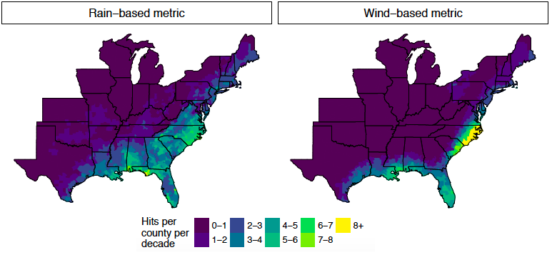

---
output:
  beamer_presentation:
    keep_tex : true
    includes: 
      in_header: anderson_header.txt
      before_body: anderson_beforebody.txt
---

## Extreme weather events in the U.S.

```{r echo = FALSE}

```

\scriptsize Source: NOAA National Centers for Environmental Information (NCEI), 2017.

# Extreme precipitation / flooding

## Extreme precipitation exposure in U.S. communities

\begin{center}
\large Exposure in 106 U.S. communities, 1987--2005
\end{center}
```{r echo = FALSE, fig.align = "center", out.width = "\\textwidth"}

```
\vspace{-0.2cm}
\scriptsize \textbf{Extreme precipitation day:} Any day with measured precipitation $\ge$ 30 millimeters. Precipitation data is from the county-aggregated NLDAS-2 Reanalysis data set available through the CDC WONDER database. The histogram (right) shows distributions in exposures across days. Colors of circles on the map correspond to color code in histogram sextiles.

## Flood exposure in the U.S. 

\vspace{-0.2cm}
\small
\begin{center}
Thirty-two most severe floods in the U.S. in the 20\textsuperscript{th} century
\end{center}
\vspace{-0.4cm}
```{r echo = FALSE, fig.align = "center", out.width = "0.95\\textwidth"}
# Significant floods in the US during the 20th century
# 32 floods total. Includes floods from storm surge (e.g., Hurricane Camille), 
# dam failures, flash floods, regional floods (often excessive rainfall, sometimes a 
# slow-moving or reminants of a tropical storm), mudflow flood from Mt. St. Helens.

```
\vspace{-0.8cm}
\scriptsize Source: Perry, 2000. USGS Fact Sheet 024-00.

## Health risks associated with extreme precipitation / floods

\begin{columns}

\begin{column}{0.45\textwidth}
\begin{center}
\small Combined sewer system
\vspace{-0.1cm}
\end{center}
```{r echo = FALSE, out.width = "\\textwidth"}

```
\vspace{-0.1cm}
\scriptsize Source: \url{jerseywaterworks.org}.
\end{column}

\begin{column}{0.55\textwidth}
\begin{block}{Identified health risks}
\small
\begin{itemize}
  \item Gastrointestinal illness (e.g., Wade et al. 2014; Tornevi et al. 2013)
  \begin{itemize}
    \item Risks may be increased by combined sewer systems (left; Jagai et al. 2015)
  \end{itemize}
  \item Respiratory outcomes
  \begin{itemize}
    \item Aerosol-transmitted pathogens (e.g., \textit{Legionella pneumophila})
    \item Asthma hospitalizations (Soneja et al. 2016)
    \item Mold exposure
  \end{itemize}
  \item Motor vehicle accidents (Ashley et al. 2015)
\end{itemize}
\end{block}
\end{column}

\end{columns}

<!-- ## Recent trends in extreme precipitation -->

<!-- ```{r echo = FALSE} -->
<!-- # Trends in total amount of precipitation falling on days that exceed the 99th percentile threshold of daily precipitation amounts during the 30-year period of 1983-2012 with respect to the preior preiod of 1953-1982.  -->
<!-- # Source: Peterson et al. 2014. Changes in weather and climate extremes: State of knowledge relevant to air and water quality in the United States. Journal of the Air and Waste Management Association. -->
<!--  -->
<!-- ``` -->

<!-- \footnotesize Source: Peterson et al., 2014. -->


## Trends in extreme precipitation

\begin{columns}

\begin{column}{0.5\textwidth}
\begin{block}{Trends in extreme precipitation}
\small
\begin{itemize}
  \item Recent trend of increased exposure to extreme precipitation in all regions of the U.S., especially in the Northeast and Midwest (Peterson et al. 2014).
  \item Number of extreme precipitation days per year expected to increase throughout U.S. in coming decades (right; Wuebbles et al. 2014), especially in certain regions.
\end{itemize}
\end{block}
\end{column}

\begin{column}{0.5\textwidth}
\vspace{-0.2cm}
\begin{center}
\footnotesize Expected increase in number of extreme precipitation days by end of century.
\end{center}
\vspace{-0.2cm}
```{r echo = FALSE, out.width = "\\textwidth"}
# Projected changes in the relative rate of the frequency of exceedences of the 20-yr extreme precip value (based on 1986-2005) in 2081-2100 under two climate change scenarios.
# Source: Wuebbles et al. 2014. CMIP5 climate model analyses: Climate extremes in the United States. Bulletin of the American Meteorological Society

```
\vspace{-0.1cm}
\scriptsize Source: Wuebbles et al. 2014.
\end{column}

\end{columns}

## Trends in flooding 

\begin{columns}

\begin{column}{0.6\textwidth}
\footnotesize Trends in days of flood exposure, 1940--2013.
\vspace{-0.3cm}
```{r echo = FALSE, fig.align = "center", out.width = "\\textwidth"}
# Regional changes in the frequency of flood events per year (using peaks above threshold
# approach) between 1940 and 2013. Negative trends: orange (p < 0.1) and red (p < 0.01). Positive trends: blue (p < 0.1) and purple (p < 0.01). Dashed line: standardized mean over the whole period. Solid line: Smoothed flood series within that cell. Used USGS streamgage data. 
# Archfield et al. 2016. Fragmented patterns of flood change across the United States. Geophysical Research Letters.

```
\vspace{-0.1cm}
\scriptsize \textbf{Orange, red:} Significant decrease in exposure. \textbf{Blue, purple:} Significant decrease in exposure. 
\vspace{0.1cm}
Source: Archfield et al. 2016.
\end{column}

\begin{column}{0.4\textwidth}
\begin{block}{Recent and future trends}
\small
\begin{itemize}
  \item Between 1940 and 2013, frequency of flood days has increased in some areas and decreased in others (map at left; Archfield et al. 2016).
  \item In future decades, flooding is expected to increase in some regions, although a lot of uncertainty in expected trends in flooding remains (Berghuijs et al. 2016).
\end{itemize}
\end{block}
\end{column}

\end{columns}


# Wildfires

## Exposure to wildfires

```{r echo = FALSE}

```

\scriptsize Source: FEMA, 2017.

## Increased health risks associated with wildfires

\vspace{-0.6cm}

\small
\begin{center}
Widespread smoke from 2016 eastern wildfires
\end{center}
\vspace{-0.9cm}
```{r echo = FALSE, fig.align = "center", out.width = "0.9\\textwidth"}

```
\vspace{-0.7cm}
\scriptsize Sources: NASA, 2016 and  Wildfire Today, 2016.

\begin{columns}

\begin{column}{0.5\textwidth}
\begin{block}{\small Consistent evidence}
\footnotesize
\begin{itemize}
  \item Respiratory morbidity
  \item Asthma / COPD exacerbations
\end{itemize}
\end{block}
\end{column}

\begin{column}{0.5\textwidth}
\begin{block}{\small Mixed evidence}
\footnotesize
\begin{itemize}
  \item All-cause mortality
  \item Cardiovascular outcomes
\end{itemize}
\end{block}
\end{column}
\end{columns}

\vspace{-0.4cm}
\begin{center}
\footnotesize Sources: Reid et al. 2016, Liu et al. 2015.
\end{center}

## Past and expected future trends in wildfires

\begin{columns}

\begin{column}{0.6\textwidth}
```{r echo = FALSE, fig.align = "center", out.width = "\\textwidth"}

```
\scriptsize Source: Liu et al. 2016. For an interactive map, see \url{http://khanotations.github.io/smoke-map/}.
\end{column}

\begin{column}{0.4\textwidth}
\begin{block}{Recent and expected future trends}
\small
\begin{itemize}
  \item Recently, there has been a trend to more intense fires and longer fire seasons (U.S. Forest Service, 2009; Karl et al. 2009).
  \item In the coming decades, wildfire smoke days are expected become more frequent (left) and intense (Liu et al. 2016).
\end{itemize}
\end{block}
\end{column}

\end{columns}

# Tropical storms

## Tropical storms bring exposure from multiple hazards

\begin{columns}
\begin{column}{0.5\textwidth}
\begin{block}{Tropical storm hazards}
   \begin{itemize}
    \item High winds
    \item Extreme precipitation
    \item Flood events
    \item Tornado events
   \end{itemize}
\end{block}
\end{column}
\begin{column}{0.5\textwidth}  
    \vspace{-0.25cm}
    \begin{center}
     \includegraphics[width=0.8\textwidth]{storm_hazards.png}
     \end{center}
     \vspace{-0.25cm}
     \scriptsize{Image sources: Los Angeles Times, NBC}
\end{column}
\end{columns}

## County-level exposure to Hurricane Ivan (2004)

\vspace{-0.6cm}
```{r echo = FALSE}
knitr::include_graphics("ivanexposure.pdf")
```

\vspace{-0.7cm}
\scriptsize Criteria for exposure classifications: \textbf{Distance:} Within 100 kms of storm track. \textbf{Rain:} $\ge$ 75 mm of rain total for two days before to one day after storm. \textbf{Wind:} Modeled wind of $\ge$ 15 m/s. \textbf{Flood, Tornado:} Listed event in NOAA Storm Events database.

## Tropical storm exposure in U.S. counties

\begin{centering}
\small Storm hits per county per decade based on rain (left) and wind (right) exposure metrics.
\end{centering}

```{r echo = FALSE, fig.align = "center", out.width = "0.95\\textwidth"}

```

\vspace{-0.7cm}
\scriptsize Criteria for exposure classifications: \textbf{Rain:} $\ge$ 75 mm of rain total for two days before to one day after storm. \textbf{Wind:} Modeled wind of $\ge$ 15 m/s. 

## Risks in Miami, FL, during Hurricane Andrew (1992)

\begin{centering}
\small Relative risk for all-cause (left) and accidental (right) mortality in Miami, FL, at lags from the storm day (lag 0) compared to non-storm days.
\end{centering}

```{r echo = FALSE}
knitr::include_graphics("miami_andrew_2.pdf")
```

\vspace{-0.2cm}
\scriptsize Estimates were obtained by comparing storm days to matched non-storm days in the same time of year and day of week in other years. Matched days were picked to exclude days near other storms. Lag 0 represents the storm day. Negative lags represent days before the storm and positive lags represent days after the storm. Vertical lines give 95\% confidence intervals.


## Health risks associated with Hurricane Sandy (2012)

\begin{columns}

\begin{column}{0.4\textwidth}
```{r echo = FALSE, fig.align = "center", out.width = "0.9\\textwidth"}
knitr::include_graphics("sandy_satellite.jpg")
```
\vspace{-0.5cm}
\begin{center}
\scriptsize Source: NOAA / NASA GOES Project
\end{center}
\end{column}

\begin{column}{0.6\textwidth}
\begin{block}{Health risks in storm-affected areas}
\small
\begin{itemize}
  \item Change in patterns of emergency department visits (Kim et al. 2016)
  \item Increased outpatient cases of food and waterborne disease among elderly (Bloom et al. 2016)
  \item Increased rate of myocardial infarctions (Swerdel et al. 2014)
  \item Increased hospitalizations for dehydration (Lee et al. 2016)
  \item Difficulty obtaining medical care, medications, and medical equipment (Davidow et al. 2016)
\end{itemize}
\end{block}
\end{column}

\end{columns}


## Conclusion

\begin{block}{Closing comments}
\begin{itemize}
  \item Epidemiological research continues to identify new health risks associated with extreme weather. 
  \item Infrastructure may often play a role in the pathway between extreme events and health risks.
  \item Patterns in exposure to several types of extreme events have changed in recent decades and are expected to continue to change in U.S. cities in the coming decades.
\end{itemize}
\end{block}

\begin{block}{Acknowledgements}
\small Meilin Yan, Rachel Severson, and Roger Peng collaborated on original research shown here. This research was supported by grant R00ES022631 from the National Institute of Environmental Health Sciences. 
\end{block}