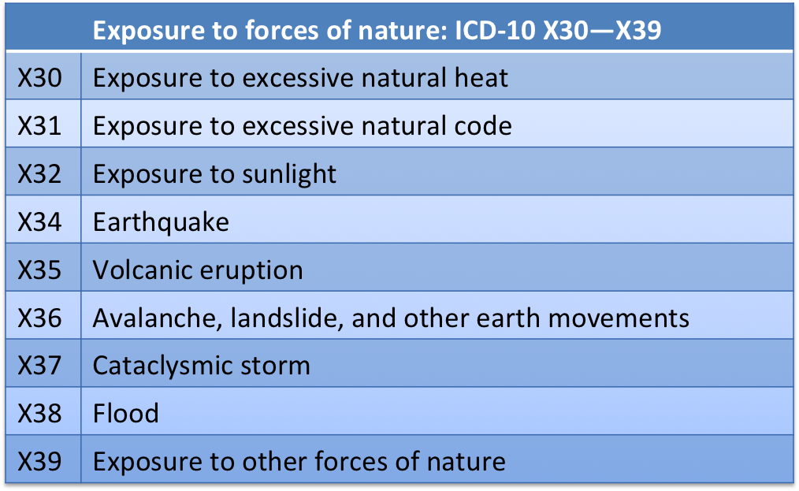
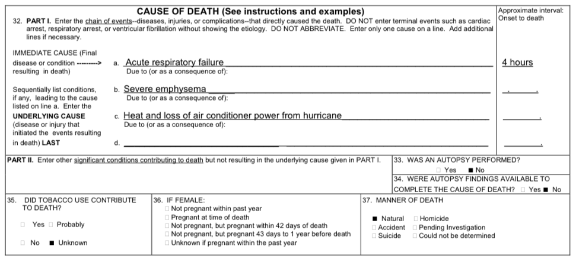
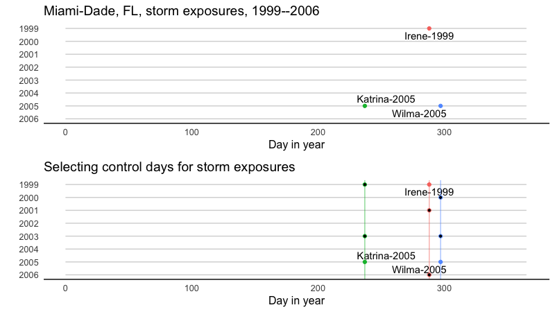
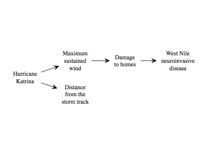
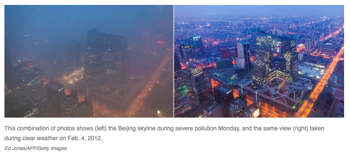

---
output:
  beamer_presentation:
    keep_tex : true
    includes: 
      in_header: anderson_header.txt
      before_body: anderson_beforebody.txt
---

```{r setup, include=FALSE}
library(knitr)
opts_chunk$set(echo = FALSE)
```

## Impacts in excess of official death tolls

Evidence from Hurricane Maria in Puerto Rico of extensive mortality impacts. 

```{r echo = FALSE, out.width="0.9\\textwidth", fig.align = "center"}
knitr::include_graphics("figures/maria_excess_deaths.png.png")
```

\footnotesize Source: The New York Times

## Counting tropical cyclone fatalities

```{r echo = FALSE, out.width="\\textwidth", fig.align = "center"}

```

## Reporting cause of death

```{r echo = FALSE, out.width="\\textwidth", fig.align = "center"}
knitr::include_graphics("figures/cdc_direct_death.png")
```

\footnotesize Source: https://www.cdc.gov/nchs/data/dvs/hurricane_certification.pdf

## Reporting cause of death

```{r echo = FALSE, out.width="\\textwidth", fig.align = "center"}

```

\footnotesize Source: https://www.cdc.gov/nchs/data/dvs/hurricane_certification.pdf

## Reporting cause of death

```{r echo = FALSE, out.width="\\textwidth", fig.align = "center"}

```

\footnotesize Source: https://www.cdc.gov/nchs/data/dvs/hurricane_certification.pdf

## Impacts in excess of official death tolls

Evidence from Hurricane Maria in Puerto Rico. 

```{r out.width = "\\textwidth"}
include_graphics("figures/maria_timeseries.png")
```

\footnotesize Source: The New York Times

## Relative risk of mortality associated with storm exposure

\begin{block}{Relative risk of mortality associated with storm exposure}
We aimed to measure the \textit{relative risk (RR)} of mortality during the storm compared to what would have been expected the same days if there had not been a storm:

\begin{equation*}
RR = \frac{\text{\# deaths during storm}}{\text{Expected \# of deaths without storm}}
\end{equation*}

\end{block}

## Study storms and communities

```{r echo = FALSE, out.width="0.85\\textwidth", fig.align = "center"}
knitr::include_graphics("figures/mortality_storms_counties.png")
```

\footnotesize Source: Preliminary results, Yan et al.


## Seasonality in tropical cyclones

Storm occurence by month for three high-risk US counties.

```{r out.width = "0.8\\textwidth", fig.align = "center"}
include_graphics("figures/storm_seasonality.png")
```

## Seasonal confounding 

```{r out.width = "0.6\\textwidth", fig.align = "center"}

```

\small The probability of both tropical storms and mortality vary by season, opening the potential for season to confound measurements of the relationship between tropical storm exposure and mortality risk.

## Matching to control for seasonality

```{r out.width = "\\textwidth", fig.align = "center"}

```

\small We selected unexposed days in each community, matched to each storm exposed day, ensuring all matches are on similar days of the year.

## Potential pathways through which tropical cyclone exposure might increase mortality risk

```{r out.width = "0.9\\textwidth", fig.align = "center"}
include_graphics("figures/storm_death_pathways.png")
```

## Metrics of tropical cyclone exposure used previously

```{r out.width = "\\textwidth", fig.align = "center"}
include_graphics("figures/previous_exposure_metrics.pdf")
```

## Distance as a surrogate measure of tropical cyclone exposure

```{r out.width = "\\textwidth", fig.align = "center"}
include_graphics("figures/katrina_west_nile.png")
```

## Potential pathway for effects of Katrina on West Nile risk

```{r out.width = "\\textwidth", fig.align = "center"}

```

## Katrina wind exposure vs. distance from storm track

```{r out.width = "\\textwidth", fig.align = "center"}
include_graphics("figures/katrina_continuous_exposures.png")
```

\footnotesize For each county in Louisiana and Mississippi, we measured the distance of the county's population mean center from the storm track (left) and modeled the maximum sustained windspeed associated with the storm (right).

## Katrina wind exposure vs. distance from storm track

```{r out.width = "\\textwidth", fig.align = "center"}
include_graphics("figures/katrina_exposure_discrete.png")
```

\footnotesize Binary storm exposure classifications based on distance from the storm track (left) and maximum sustained wind (right) for Hurricane Katrina.

## Katrina wind exposure vs. distance from storm track

```{r out.width = "0.8\\textwidth", fig.align = "center"}
include_graphics("figures/katrina_exposure_class.png")
```

\footnotesize Differences between storm exposure classifications when using distance versus maximum sustained winds.

## Relationships among tropical cyclone hazards

```{r out.width = "0.8\\textwidth", fig.align = "center"}

```

## Tropical storm exposure classifications for Hurricane Katrina

```{r out.width = "\\textwidth", fig.align = "center"}
include_graphics("figures/katrina_all_exposures.png")
```

## Similarity among tropical cyclone hazards

```{r out.width = "\\textwidth", fig.align = "center"}
include_graphics("figures/jaccard_heatmap_presentation.pdf")
```

## Associations between storm hazards and mortality

```{r out.width = "0.8\\textwidth", fig.align = "center"}

```

## Mortality risks by day during storm period

\begin{columns}
\begin{column}{0.6\textwidth}  
    \begin{center}
     \includegraphics[width=\textwidth]{figures/all_cause_lags.png}
     \end{center}
\end{column}
\begin{column}{0.4\textwidth}
\footnotesize
\begin{block}{Risks by day}
\footnotesize
\begin{itemize}
  \item For all-cause deaths, RRs were highest on storm's closest day
  \item There was some evidence of elevated risk before and after the storm
  \item Lag patterns were similar for cardiovascular and accidental deaths
\end{itemize}
\end{block}
\end{column}
\end{columns}

\footnotesize Source: Preliminary results, Yan et al.

## Mortality risk by exposure metric

```{r echo = FALSE, out.width="\\textwidth", fig.align = "center"}
knitr::include_graphics("figures/rrs_by_metric.png")
```

\footnotesize Source: Preliminary results, Yan et al.

<!-- ## Beijing study  -->

<!-- ```{r out.width = "\\textwidth"} -->
<!--  -->
<!-- ``` -->

<!-- \footnotesize Source: https://www.npr.org/ -->

<!-- ## Beijing study -->

<!-- ```{r out.width = "\\textwidth"} -->
<!-- include_graphics("figures/Beijing_Figure2.pdf") -->
<!-- ``` -->

<!-- \footnotesize Source: Ferreri et al. (2017) *Air Quality, Atmosphere & Health* -->

<!-- ## Beijing study -->

<!-- ```{r out.width = "\\textwidth"} -->
<!--  -->
<!-- ``` -->

<!-- \footnotesize Source: Ferreri et al. (2017) *Air Quality, Atmosphere & Health* -->

<!-- ## Beijing study -->

<!-- ```{r out.width = "\\textwidth"} -->
<!-- include_graphics("figures/Beijing_Figure3.pdf") -->
<!-- ``` -->

<!-- \footnotesize Source: Ferreri et al. (2017) *Air Quality, Atmosphere & Health* -->

<!-- ## Beijing study -->

<!-- ```{r out.width = "\\textwidth"} -->
<!--  -->
<!-- ``` -->


