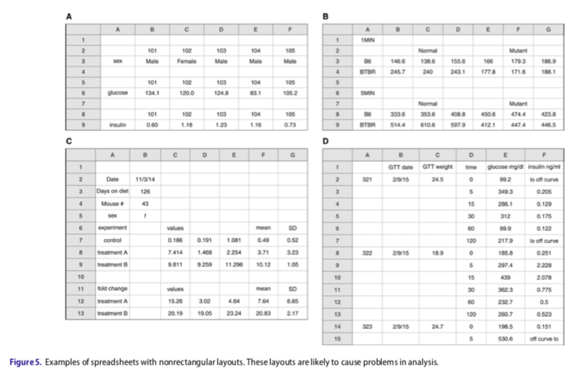

---
output:
  beamer_presentation:
    keep_tex : true
    includes: 
      in_header: anderson_header.txt
      before_body: anderson_beforebody.txt
---

```{r setup, include=FALSE}
library(knitr)
opts_chunk$set(echo = FALSE)
```

## Objectives

The objectives for this talk are: 

1. Clarify the principle and requirements for **reproducible research**, from a computational standpoint.
2. Outline some guidelines for **recording experimental data** in a way that facilitates computationally reproducible research, based on two recent papers: 
    + Broman and Woo (2018) Data Organization in Spreadsheets, *The American Statistician*, 72:1, 2--10, DOI: 10.1080/00031305.2017.1375989
    + Ellis and Leek (2018) How to Share Data for Collaboration, *The American Statistician*, 72:1, 53--57, DOI: 10.1080/00031305.2017.1375987

# Objective 1: Clarify the principle and requirements for reproducible research, from a computational standpoint.

## Reproducible research

```{r echo = FALSE, out.width="\\textwidth", fig.align = "center"}
knitr::include_graphics("figures/peng_reproducible.jpg")
```

\vspace{-0.4cm}

\scriptsize Source: Peng (2011) Reproducible Research in Computational Science, *Science*, 334:6060, 1226--1227, DOI: 10.1126/science.1213847

\bigskip

\normalsize Computationally **reproducible research** is research for which another person could take the published materials and recreate the same results from the same raw data.

## Reproducible research

\begin{columns}

\begin{column}{0.5\textwidth}
\begin{centering}
\includegraphics[width=\textwidth]{figures/sidney_harris_new_yorker.png}
\end{centering} \\
\vspace{-0.1cm}
\scriptsize Source: Sidney Harris, The New Yorker
\end{column}

\begin{column}{0.5\textwidth}
\small
To make research computationally reproducible, full instructions should be available describing how you: 

\begin{itemize}
\item Did any cleaning, pre-processing, or reformatting of the \textbf{raw data} (i.e., the data directly recorded for an experiment or output by laboratory equipment)
\item Analyzed the \textbf{processed data} to generate figures, tables, and other research results
\end{itemize}

\textbf{Code scripts} are an excellent way to record this information.

\end{column}

\end{columns}

## Common "black boxes" in laboratory-based research

```{r echo = FALSE, out.width="0.9\\textwidth", fig.align = "center"}
knitr::include_graphics("figures/existing_blackboxes.jpg")
```

\small

We identified two common **black boxes** in laboratory-based research, where the research steps are often neither **transparent** nor **reproducible**.

## "Co-benefits" of reproducible research

```{r echo = FALSE, out.width="0.8\\textwidth", fig.align = "center"}
knitr::include_graphics("figures/own_worst_collaborator.jpg")
```

\vspace{-0.4cm}

\scriptsize Source: Twitter, @pop_gen_JED

\bigskip

\normalsize Meeting the standards of reproducibility can have many co-benefits for a research lab, including **increasing efficiency** of research and **sharing data pre-processing and analysis techniques** across laboratory members.

# Objective 2: Outline some guidelines for recording experimental data in a way that facilitates computationally reproducible research

## Record data in "rectangular" formats

```{r echo = FALSE, out.width="0.8\\textwidth", fig.align = "center"}

```

\vspace{-0.4cm}

\scriptsize Source: Broman and Woo, 2018

\bigskip

\small \textbf{Rectangular format}: One unit of observation per spreadsheet; one row for each study observation (e.g., study subject, time point); one column for each variable being measured; no empty boxes.

## Non-"rectangular" formats

```{r echo = FALSE, out.width="\\textwidth", fig.align = "center"}

```

\vspace{-0.4cm}

\scriptsize Source: Broman and Woo, 2018

\small These may be \textbf{human-readable}, but are much less \textbf{computer-readable}.

## Think in terms of "plain text" file formats

```{r echo = FALSE, out.width="\\textwidth", fig.align = "center"}

```

\vspace{-0.4cm}

\scriptsize Source: Broman and Woo, 2018

\medskip 

\normalsize Ideally, the data recording format should be something that could be set up as within a \textbf{plain text file format}, like a comma-separated values format (.csv).

## Avoid cell formatting

```{r echo = FALSE, out.width="\\textwidth", fig.align = "center"}

```

\vspace{-0.4cm}

\scriptsize Source: Broman and Woo, 2018

\medskip

\normalsize Any time you use \textbf{highlighting} or other forms of cell formatting in a spreadsheet, you will lose the information when you read the data into R or Python. Similarly, avoid adding \textbf{text boxes} or \textbf{embedded formulas} to spreadsheets used for data recording.

## Be careful in naming columns

```{r echo = FALSE, out.width="\\textwidth", fig.align = "center"}

```

\vspace{-0.4cm}

\scriptsize Source: Broman and Woo, 2018

\medskip

\normalsize Make sure that column names do not have \textbf{spaces}, \textbf{mathematical symbols}, or \textbf{other special characters}.

## More guidelines

```{r echo = FALSE, out.width="\\textwidth", fig.align = "center"}

```

\vspace{-0.4cm}

\scriptsize Source: Ellis and Leek, 2018

\normalsize \textbf{Similar and additional guidelines} are outlined in Ellis and Leek, 2018.

