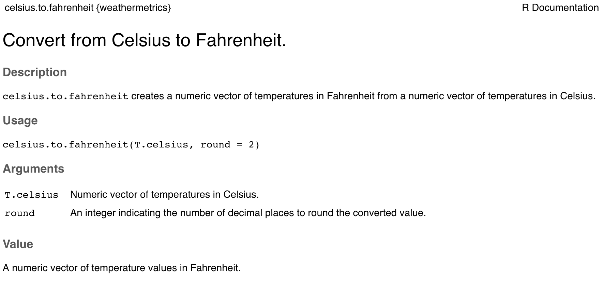
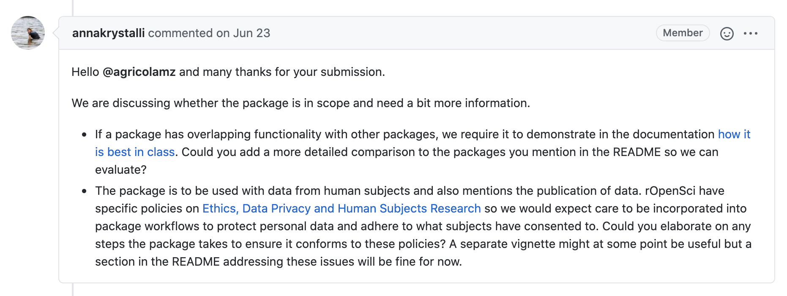
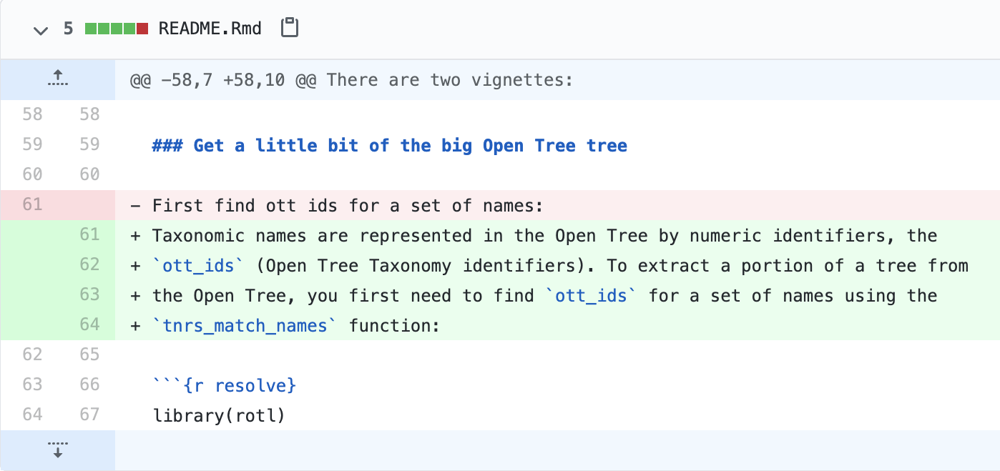

---
output:
  beamer_presentation:
    includes:
      in_header: header.tex
      before_body: anderson_beforebody.txt
fontsize: 10pt
---

#  R Packages: What and Why

## Base R

```{r echo = FALSE, out.width = "\\textwidth", fig.align = "center"}

```

\footnotesize Comprehensive R Archive Network: https://cran.r-project.org/

## Base R

```{r echo = FALSE, out.width = "0.7\\textwidth", fig.align = "center"}

```

\footnotesize Source: Brio

## R Package Ecosystem

```{r echo = FALSE, out.width = "\\textwidth"}

```

\footnotesize Source: Brio

## R Package Ecosystem

```{r echo = FALSE, out.width = "\\textwidth", fig.align = "center"}

```

\footnotesize Mitchell O'Hara-Wild: https://www.mitchelloharawild.com/blog/user-2018-feature-wall/

## R Package Ecosystem

```{r echo = FALSE, out.width = "0.8\\textwidth", fig.align = "center"}
knitr::include_graphics("figures/use_r_aust_hexbins.jpg")
```

\footnotesize Mitchell O'Hara-Wild: https://www.mitchelloharawild.com/blog/user-2018-feature-wall/

## What's in an R Package?

Process: 

$$
\mbox{Temperature (F)} = \frac{9}{5} \mbox{Temperature (C)} + 32
$$

Example R function:

```{r echo = FALSE, out.width = "\\textwidth", fig.align = "center"}

```

## What's in an R Package?

Example help file:

```{r echo = FALSE, out.width = "\\textwidth", fig.align = "center"}

```

## What's in an R Package?

```{r echo = FALSE, out.width = "\\textwidth", fig.align = "center"}
knitr::include_graphics("figures/weathermetrics_package.png")
```

## How are R Packages Shared?

```{r echo = FALSE, out.width = "0.9\\textwidth", fig.align = "center"}
knitr::include_graphics("figures/install_vs_library.jpg")
```

## How are R Packages Shared?

Dependencies for the rOpenSci package `riem`:

```{r echo = FALSE, out.width = "0.9\\textwidth", fig.align = "center"}

```

# Peer Review: What and Why

## Early Steps

```{r echo = FALSE, out.width = "\\textwidth", fig.align = "center"}
knitr::include_graphics("figures/royal_academy.jpg")
```
	
\footnotesize Henri Testelin, https://www.wga.hu/frames-e.html?/html/t/testelin/colbert.html

## The Journal Peer Review Process

```{r echo = FALSE, out.width = "0.75\\textwidth", fig.align = "center"}
knitr::include_graphics("figures/peer_review_overview.jpg")
```

\footnotesize https://undsci.berkeley.edu/article/howscienceworks_16

## The Challenges Continue Today

```{r echo = FALSE, out.width = "0.85\\textwidth", fig.align = "center"}

```

\footnotesize Jonathan M. Gitlin: https://arstechnica.com/science/2020/05/a-lot-of-covid-19-papers-havent-been-peer-reviewed-reader-beware/

## Peer Review Related to R Code

```{r echo = FALSE, out.width = "\\textwidth", fig.align = "center"}

```

https://journal.r-project.org/

## Peer Review Related to R Code

```{r echo = FALSE, out.width = "\\textwidth", fig.align = "center"}
knitr::include_graphics("figures/journal_statistical_software.png")
```

https://www.jstatsoft.org/index

# rOpenSci Packages and Package Review

## rOpenSci

```{r echo = FALSE, out.width = "\\textwidth", fig.align = "center"}
knitr::include_graphics("figures/ropensci_main.png")
```

https://ropensci.org

## rOpenSci Packages

```{r echo = FALSE, out.width = "\\textwidth", fig.align = "center"}

```

https://ropensci.org/packages/

## rOpenSci Package Categories

```{r echo = FALSE, out.width = "\\textwidth", fig.align = "center"}

```

https://ropensci.org/packages/

## rOpenSci Example Data Access Packages

```{r echo = FALSE, out.width = "\\textwidth", fig.align = "center"}

```

https://ropensci.org/packages/data-access/

## rOpenSci Example Data Extraction Packages

```{r echo = FALSE, out.width = "\\textwidth", fig.align = "center"}

```

https://ropensci.org/packages/data-extraction/

## rOpenSci Package Review

```{r echo = FALSE, out.width = "\\textwidth", fig.align = "center"}

```

"With the community approach came challenges. How could we ensure the quality of code written by scientists without formal training in software development practices? How could we drive adoption of best practices among our contributors? How could we create a community that would support each other in this work? We have had great success addressing these challenges via the **peer review**."

 https://numfocus.org/blog/how-ropensci-uses-code-review-to-promote-reproducible-science

## rOpenSci Package Review

```{r echo = FALSE, out.width = "\\textwidth", fig.align = "center"}

```

"We draw elements from a process familiar to our target community---**academic peer review**---and a practice from the software development world---**production code review**---to create a system that fosters software quality, ongoing education, and community development."

https://numfocus.org/blog/how-ropensci-uses-code-review-to-promote-reproducible-science

## rOpenSci Package Review

```{r echo = FALSE, out.width = "0.4\\textwidth", fig.align = "center"}
knitr::include_graphics("figures/ropensci_book_cover.png")
```

"Packages contributed by the community undergo a **transparent**, **constructive**, **non adversarial** and **open** review process"

https://devguide.ropensci.org/


# The rOpenSci Review Process

## The Journal Peer Review Process

```{r echo = FALSE, out.width = "0.75\\textwidth", fig.align = "center"}
knitr::include_graphics("figures/peer_review_overview.jpg")
```

\footnotesize https://undsci.berkeley.edu/article/howscienceworks_16

## Overview of Review Process

"In our process, **authors submit** complete R packages to rOpenSci. **Editors check** that packages fit into our project’s scope, run a series of automated tests to ensure a baseline of code quality and completeness, and then **assign** two independent reviewers. **Reviewers comment** on usability, quality, and style of software code as well as documentation. **Authors make changes in response**, and once reviewers are satisfied with the updates, the package receives a badge of approval and joins our suite."

https://numfocus.org/blog/how-ropensci-uses-code-review-to-promote-reproducible-science

## Overview of Review Process

```{r echo = FALSE, out.width = "0.75\\textwidth", fig.align = "center"}
knitr::include_graphics("figures/ropensci_book_cover_closeup.png")
```

"Our reviewing threads are **public**. Authors, reviewers, and editors all know each other’s identities. The broader community can view or even participate in the conversation as it happens."

https://devguide.ropensci.org/

## Review Framework

"Technically, we make the most of GitHub infrastructure: each package review process is **an issue** in the ropensci/software-review GitHub repository."

https://github.com/ropensci/software-review/issues

```{r echo = FALSE, out.width = "\\textwidth", fig.align = "center"}

```

## Review Framework

```{r echo = FALSE, out.width = "\\textwidth", fig.align = "center"}
knitr::include_graphics("figures/phonfieldwork_issue.png")
```

```{r echo = FALSE, out.width = "\\textwidth", fig.align = "center"}

```

https://github.com/ropensci/software-review/issues/385

## Step 1: Authors submit package

Open an issue and complete the submission template. It includes choices and short answers about topics like scope:

```{r echo = FALSE, out.width = "\\textwidth", fig.align = "center"}

```

## Step 1: Authors submit package

It includes choices and short answers about topics like technical checks:

```{r echo = FALSE, out.width = "\\textwidth", fig.align = "center"}

```

Other topics include package metadata, publication options, and 
agreeing to rOpenSci's Code of Conduct.

## Step 1: Authors submit package

At this point, the current Editor in Chief might ask for some clarifications, 
and the editorial board will consider if the package is in scope: 

```{r echo = FALSE, out.width = "\\textwidth", fig.align = "center"}

```

## Step 2: Editor Conducts Some Checks

Once the submission is clarified, an Associate Editor is assigned who 
runs some checks and assigns two reviewers.

```{r echo = FALSE, out.width = "\\textwidth", fig.align = "center"}

```

This process uses a [editor's template](https://devguide.ropensci.org/editortemplate.html) and R packages for checking packages (`spelling`, `goodpractice`).

## Step 3: Reviewers Examine and Comment

Reviewers examine the package and submit their review based on a [review template](https://devguide.ropensci.org/reviewtemplate.html). This includes
areas for the reviewer to comment on:

- Potential Conflict of Interest
- Documentation
- Functionality
- Review Comments

## Step 3: Reviewers Examine and Comment

```{r echo = FALSE, out.width = "\\textwidth", fig.align = "center"}

```

## Step 3: Reviewers Examine and Comment

```{r echo = FALSE, out.width = "\\textwidth", fig.align = "center"}

```

## Step 3: Reviewers Examine and Comment

**Functionality:**  Any functional claims of the software been confirmed.

```{r echo = FALSE, out.width = "\\textwidth", fig.align = "center"}

```

- Do the functions work?
- Are the algorithms appropriate?
- Are there alternatives that might be better?

## Step 3: Reviewers Examine and Comment

**Documentation**: Is documentation clear, thorough, and helpful?

```{r echo = FALSE, out.width = "\\textwidth", fig.align = "center"}

```

## Review and Revise as a Conversation

```{r echo = FALSE, out.width = "0.8\\textwidth", fig.align = "center"}

```

Example from review of `rotl`: https://github.com/ropensci/software-review/issues/17

## Review and Revise as a Conversation

```{r echo = FALSE, out.width = "0.8\\textwidth", fig.align = "center"}

```

Example from review of `rotl`: https://github.com/ropensci/software-review/issues/17

## Review and Revise as a Conversation

```{r echo = FALSE, out.width = "\\textwidth", fig.align = "center"}

```

Example from review of `rotl`: https://github.com/ropensci/software-review/issues/17

## Once package is accepted

- "The process is an ongoing conversation until acceptance of the package, with two external reviews as important milestones"

```{r echo = FALSE, out.width = "\\textwidth", fig.align = "center"}

```

- "Once aboard, your package will continue to receive support from rOpenSci members. You’ll retain ownership and control of your package, but we can help with ongoing maintenance issues such as those associated with updates to R and dependencies and CRAN policies."
- "rOpenSci will promote your package through our webpage, blog, and social media. Packages in our suite also get a documentation website that is automatically built and deployed after each push."

# How to Join In

## How to Join In

- Use the Packages: https://ropensci.org/packages/
- Read the Packages Book: https://devguide.ropensci.org/
- Read Package Reviews: https://github.com/ropensci/software-review
- Volunteer to Review: https://ropensci.org/onboarding/
- Submit Your Own Package for Review: https://devguide.ropensci.org/

## Volunteer to Review

```{r echo = FALSE, out.width = "\\textwidth", fig.align = "center"}

```

