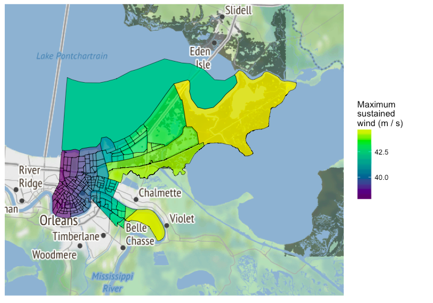

---
output:
  beamer_presentation:
    keep_tex : true
    includes: 
      in_header: anderson_header.txt
      before_body: anderson_beforebody.txt
---

```{r setup, include=FALSE, message = FALSE, warning = FALSE}
knitr::opts_chunk$set(echo = FALSE, warning = FALSE, message = FALSE, error = TRUE)
library(ggplot2)
library(dplyr)
library(lubridate)
library(gridExtra)
library(tidyr)
library(stringr)

library(hurricaneexposuredata)
library(hurricaneexposure)
library(countyweather)
```

# Tropical storm exposure in U.S. counties

## Hazard-specific tropical storm metrics

\begin{columns}
\begin{column}{0.5\textwidth}
\begin{block}{Tropical storm hazard metrics}
   \begin{itemize}
    \item Distance from the storm
    \item High winds
    \item Rainfall
    \item Storm surge
    \item Flood events
    \item Tornado events
   \end{itemize}
\end{block}
\end{column}
\begin{column}{0.5\textwidth}  
    \vspace{-0.25cm}
    \begin{center}
     \includegraphics[width=0.8\textwidth]{storm_hazards.png}
     \end{center}
     \vspace{-0.25cm}
     \scriptsize{Image sources: Los Angeles Times, NBC}
\end{column}
\end{columns}

## Assessing tropical storm exposure

\begin{block}{Challenge for epidemiological research}
How to determine whether a county was exposed to a tropical storm?
\end{block}

\vspace{-0.3cm}

```{r fig.align = "center", out.height = "0.77\\textheight"}
knitr::include_graphics("previous_exposure_metrics.pdf")
```

## Project aims

\begin{block}{Work on tropical storm exposure}
\begin{itemize}
  \item Develop exposure classifications of all U.S. Atlantic basin tropical storms, 1996--2011, based on reasonable measurements of tropical storm hazards
  \item Assess agreement between hazard-based county-specific exposure classifications
  \item Make exposure assessments accessible to other researchers for epidemiological and other impact studies 
\end{itemize}
\end{block}

## Assessing tropical storm exposure 

\begin{columns}
\begin{column}{0.5\textwidth}
```{r echo = FALSE, out.width = "\\textwidth"}
knitr::include_graphics("finding_closest_point.pdf")
```

\vspace{-0.5cm}
\small
Example of "Best Tracks" data
\end{column}
\begin{column}{0.5\textwidth}
\small
\begin{block}{Distance metric}
\begin{itemize}
\item \textbf{Distance:} National Hurricane Center Best Tracks data
\item \textbf{Wind:} Wind model based on Willoughby et al. (2006)
\item \textbf{Rain:} Re-analysis rain data (NLDAS-2)
\item \textbf{Flood and tornado events:} NOAA Storm Events database
\end{itemize}
\end{block}
\end{column}
\end{columns}

# Agreement between exposure metrics

## County-level exposure to Hurricane Ivan (2004)

\vspace{-0.6cm}
```{r echo = FALSE, out.height="0.75\\textheight", fig.align = "center"}
knitr::include_graphics("ivanexposurepresentation.pdf")
```

\vspace{-0.5cm}
\scriptsize Criteria for exposure classifications: \textbf{Distance:} Within 100 kms of storm track. \textbf{Rain:} $\ge$ 75 mm of rain total for two days before to one day after storm. \textbf{Wind:} Modeled wind of $\ge$ 15 m/s. \textbf{Flood, Tornado:} Listed event in NOAA Storm Events database.


## County-level agreement in storm exposure 

\begin{block}{Assessing agreement in county classifications}
For each storm and each pair of metrics, we measured the \textit{Jaccard index} as a measure of county-level agreement in exposure classification for a storm:

\begin{equation*}
J = \frac{X_1 \cap X_2}{X_1 \cup X_2}
\end{equation*}

where $X_1$ is the set of counties exposed to a storm based on the first metric and $X_2$ is the set of counties exposed to the storm based on the second metric. 

\end{block}

## County-level agreement in storm exposure 

\vspace{-0.3cm}

```{r fig.align = "center", out.height = "0.87\\textheight"}
knitr::include_graphics("jaccard_heatmap_presentation.pdf")
```

## Tropical storm exposure in U.S. counties

\begin{centering}
\small Storm hits per county per decade based on rain (left) and wind (right) exposure metrics.
\end{centering}

```{r echo = FALSE, fig.align = "center", out.width = "0.95\\textwidth"}
knitr::include_graphics("hurricane_exposure.png")
```

\vspace{-0.7cm}
\scriptsize Criteria for exposure classifications: \textbf{Rain:} $\ge$ 75 mm of rain total for two days before to one day after storm. \textbf{Wind:} Modeled wind of $\ge$ 15 m/s. 

# Software

## Project software

\footnotesize
\begin{block}{`hurricaneexposure`}
Create county-level exposure time series for tropical storms in U.S. counties. Exposure can be determined based on several hazards (e.g., distance, wind, rain), with user-specified thresholds. On CRAN.
\end{block}

```{r echo = TRUE, eval = FALSE}
county_rain(counties = c("22071", "51700"), rain_limit = 100, 
            start_year = 1995, end_year = 2005, dist_limit = 100,
            days_included = c(-1, 0, 1))
```

```{r echo = FALSE}
county_rain(counties = c("22071", "51700"), rain_limit = 100, 
            start_year = 1995, end_year = 2005, dist_limit = 100,
            days_included = c(-1, 0, 1)) %>%
  slice(1:4) %>%
  select(storm_id, fips, closest_date, storm_dist, tot_precip)
```

## Project software

\begin{columns}
\begin{column}{0.3\textwidth}
\footnotesize
\begin{block}{`stormwindmodel`}
Model storm winds from Best Tracks data at U.S. locations. Includes modeling sustained and gust winds, as well as duration of sustained and gust winds above a specified threshold. On CRAN.
\end{block}
\end{column}
\begin{column}{0.7\textwidth}
```{r echo = FALSE, out.width = "\\textwidth", fig.align = "center"}

```
\end{column}
\end{columns}

## Project software

\footnotesize
\begin{block}{`countyweather`, `countyfloods`}
Download weather monitor data through NOAA and USGS APIs by U.S. county. Includes functions to map available monitors / gages for each county. On CRAN.
\end{block}

\footnotesize
\begin{block}{`noaastormevents`}
Download and explore listings from the NOAA Storm Events database. Includes the ability to pull events based on a tropical storm, using events listed close in time and distance to the storm's tracks. On CRAN.
\end{block}

\footnotesize
\begin{block}{`countytimezones`}
Convert time-stamps from UTC to local time zones for U.S. counties based on county FIPs. Facilitates merging weather observations with locally measured data, including health outcomes. On CRAN.
\end{block}

## Tropical storms and mortality risk

```{r, out.height = "1.1\\textheight", fig.align = "center"}

```


<!-- ## Tropical storms and mortality risk -->

<!-- \begin{centering} -->
<!-- \small Relative risk for all-cause (left) and accidental (right) mortality in Miami, FL, at lags from the Hurricane Andrew storm day (lag 0) compared to non-storm days. -->
<!-- \end{centering} -->

<!-- ```{r echo = FALSE} -->
<!-- knitr::include_graphics("miami_andrew_2.pdf") -->
<!-- ``` -->

<!-- \vspace{-0.2cm} -->
<!-- \scriptsize Estimates were obtained by comparing storm days to matched non-storm days in the same time of year and day of week in other years. Matched days were picked to exclude days near other storms. Lag 0 represents the storm day. Negative lags represent days before the storm and positive lags represent days after the storm. Vertical lines give 95\% confidence intervals. -->

# Projecting heat wave-related mortality impacts

```{r echo = FALSE, message = FALSE, warning = FALSE}
library(dplyr)
library(tibble)
library(forcats)
library(ggplot2)
library(randomForest)
library(scales)
library(viridis)
library(ggcorrplot)
library(data.table)
library(ggridges)
library(purrr)
library(stringr)
library(tidyr)
library(readr)
library(readxl)
```

## Historical heat waves

Variation across heat waves in increased mortality risk. 

\vspace{-0.2in}

```{r echo = FALSE, fig.width = 5.5, fig.height = 2.75, out.width = "\\textwidth", fig.align = "center"}
load("../../r_projects/rcp1.5/city_data/ListOfAllHeatwaves.Rdata")

hw_data %>% 
  select(post.estimate) %>% 
  mutate(excess = (exp(post.estimate) - 1),
         mean_excess = (exp(mean(post.estimate)) - 1)) %>% 
  ggplot(aes(x = excess)) + 
  geom_histogram(binwidth = .01, color = "black", fill = "#3B528BFF") + 
  geom_vline(aes(xintercept = mean_excess), color = "red", linetype = 2, size = 0.8) + 
  labs(x = "Increase in mortality", 
       y = "# of heatwaves") + 
  scale_x_continuous(labels = percent) + 
  theme_classic()
```

\vspace{-0.2in}

\footnotesize

The red line shows the central estimate across all heat waves. The graph shows estimates from 2,980 heat waves identified in 83 U.S. communities, 1987-2005.

## Health-based model

\begin{block}{Model goal}
Predict heat wave-related mortality for a heat wave based on a number of its characteristics.
\end{block}

\small

\begin{block}{Model development}
\begin{enumerate}
\item Identified historical heat waves in 83 U.S. communities, 1987 to 2005. (Heat wave = $\ge2$ days $\ge98^{th}$ percentile temperature.)
\item Used epidemiological model to estimate relative risk of mortality observed for 2,980 historical heat waves.
\item Built a Random Forests model to predict the relative risk of a heat wave based on 20 heat wave characteristics.
\item Validated model through cross-validation, tuned, compared to other models.
\end{enumerate}
\end{block}

## Heat wave characteristics

```{r echo = FALSE, message = FALSE, warning = FALSE, fig.width =  9, fig.height = 5, fig.align = "center", out.height = "0.85\\textheight"}
load("../../r_projects/rcp1.5/city_data/ListOfAllHeatwaves.Rdata")

hw_chars <- tribble(
  ~ abbr, ~ full,
  "days.above.90", "Days above 90F",
  "min.temp", "Lowest daily temperature",
  "mean.temp", "Mean daily temperature",
  "max.temp", "Highest daily temperature",
  "days.above.85", "Days above 85F",
  "mean.summer.temp", "Summer climate",
  "mean.temp.1", "Year-round climate",
  "first.in.season", "First in season",
  "max.temp.quantile", "Quantile of highest daily temperature",
  "mean.temp.quantile", "Quantile of average daily temperature",
  "days.above.99th", "Days above 99th percentile",
  "days.above.99.5th", "Days above 99.5th percentile",
  "days.above.80", "Days above 80F",
  "length", "Heat wave length", 
  "pop.density", "Population density",
  "pop100", "Population",
  "min.temp.quantile", "Quantile of lowest daily temperature",
  "start.month", "Month heat wave started", 
  "start.doy", "Day of year heat wave started",
  "days.above.95", "Days above 95F"
)

a <- hw_data %>% 
  select(mean.temp:length, start.doy:mean.summer.temp, pop100, pop.density)
setnames(a, old = hw_chars$abbr, new = hw_chars$full)
  
a %>% 
  cor(method = "spearman") %>% 
  ggcorrplot(hc.order = TRUE, type = "lower", outline.col = "white",
             lab_size = 1, tl.cex = 10) + 
  scale_fill_viridis(name = "Spearman\ncorrelation\ncoefficient")
```

## Variable importance for heat-health model

```{r echo = FALSE, fig.width = 6, fig.height = 4.25, fig.align = "center", out.height="0.85\\textheight"}
load("../../r_projects/rcp1.5/heat_health_models/rf_mod.RData")

hw_chars <- tribble(
  ~ abbr, ~ full,
  "days.above.90", "Days above 90F",
  "min.temp", "Lowest daily temperature",
  "mean.temp", "Mean daily temperature",
  "max.temp", "Highest daily temperature",
  "days.above.85", "Days above 85F",
  "mean.summer.temp", "Summer climate",
  "mean.temp.1", "Year-round climate",
  "first.in.season", "First in season",
  "max.temp.quantile", "Quantile of highest daily temperature",
  "mean.temp.quantile", "Quantile of average daily temperature",
  "days.above.99th", "Days above 99th percentile",
  "days.above.99.5th", "Days above 99.5th percentile",
  "days.above.80", "Days above 80F",
  "length", "Heat wave length", 
  "pop.density", "Population density",
  "pop100", "Population",
  "min.temp.quantile", "Quantile of lowest daily temperature",
  "start.month", "Month heat wave started", 
  "start.doy", "Day of year heat wave started",
  "days.above.95", "Days above 95F"
)

importance(rf_mod) %>% 
  as.data.frame() %>% 
  rownames_to_column(var = "variable") %>% 
  left_join(hw_chars, by = c("variable" = "abbr")) %>% 
  select(-IncNodePurity) %>% 
  ggplot(aes(y = `%IncMSE`, x = fct_reorder(full, `%IncMSE`))) + 
  geom_bar(stat = "Identity", fill = "#3B528BFF", color = "white") + 
  coord_flip() + 
  labs(x = "", y = "% increase in MSE of predictions\nwhen given variable is permuted") + 
  theme_classic()
```

## Heat wave characteristics in climate model output

```{r echo = FALSE, message = FALSE, warning = FALSE, fig.width = 7, fig.height = 7,  out.height = "1\\textheight", fig.align = "center"}
hw_files_new <- list.files("../../r_projects/rcp1.5/List_of_all_Heatwaves_082817/") %>% 
  str_subset("1pt5|2pt0") %>% 
  map(str_split, pattern = "\\.", simplify = TRUE) %>% 
  map(as.tibble) %>% 
  bind_rows() %>% 
  select(V6:V7, V10:V11) %>% 
  rename(scenario = V6,
         member = V7) %>% 
  unite(adapt, V10, V11, sep = "-") %>% 
  mutate(file_name = str_subset(list.files("../../r_projects/rcp1.5/List_of_all_Heatwaves_082817/"),
                                           "1pt5|2pt0"))

hw_files_historic <- list.files("../../r_projects/rcp1.5/List_of_all_Heatwaves_082817/") %>% 
  str_subset("B20TRC5CNBDRD") %>% 
  map(str_split, pattern = "\\.", simplify = TRUE) %>% 
  map(as.tibble) %>% 
  bind_rows() %>% 
  mutate(scenario = "present") %>% 
  select(scenario, V6, V7) %>% 
  rename(member = V6, 
         adapt = V7) %>% 
  mutate(file_name = str_subset(list.files("../../r_projects/rcp1.5/List_of_all_Heatwaves_082817/"),
                                           "B20TRC5CNBDRD"))

hw_files <- hw_files_historic %>% 
  bind_rows(hw_files_new)

read_hw_file <- function(file_name){
  data_path <- "../../r_projects/rcp1.5/List_of_all_Heatwaves_082817"
  hw_df <- read_table(paste(data_path, file_name, sep = "/")) %>%
    mutate(mean.summer.temp = str_extract(`mean.summer.temp  city`, "[0-9]+\\.[0-9]+"),
           mean.summer.temp = as.numeric(mean.summer.temp),
           city = str_extract(`mean.summer.temp  city`, "[a-z]+")) %>% 
    select(-`mean.summer.temp  city`) %>% 
    filter(city != "colo")
}

characterize_hws <- function(hw_file_name){
  hw_df <- read_hw_file(hw_file_name)
  hw_df %>% 
    group_by(city) %>% 
    summarize(n_hws_per_year = n() / 20,
              n_hw_days_per_year = sum(length) / 20,
              mean_temp = mean(mean.temp),
              mean_length = mean(length),
              mean_start = mean(start.doy))
}

n_hws <- hw_files %>% 
  group_by(scenario, member, adapt) %>% 
  nest() %>% 
  mutate(hw_chars = map(data, characterize_hws)) %>% 
  select(-data) %>% 
  unnest()

city_names <- tribble(
  ~ city, ~ city_name,
  "ny", "New York",
  "chic", "Chicago", 
  "dlft", "Dallas / Ft Worth",
  "hous", "Houston",
  "la", "Los Angeles",
  "det", "Detroit",
  "phil", "Philadelphia",
  "tamp", "Tampa",
  "phoe", "Phoenix",
  "sand", "San Diego",
  "akr", "Akron",
  "albu", "Albuquerque",
  "atla", "Atlanta",
  "aust", "Austin",
  "bake", "Bakersfield",
  "balt", "Baltimore",
  "batr", "Baton Rouge",
  "birm", "Birmingham",
  "bost", "Boston", 
  "buff", "Buffalo",
  "char", "Charlotte", 
  "cinc", "Cincinnati",
  "clev", "Cleveland", 
  "clmo", "Columbus, OH",
  "corp", "Corpus Christi",
  "dayt", "Dayton", 
  "dc", "Washintgon, D.C.", 
  "denv", "Denver",
  "desm", "Des Moines",
  "elpa", "El Paso",
  "fres", "Fresno",
  "ftwa", "Fort Wayne",
  "gdrp", "Grand Rapids", 
  "grnb", "Greensboro", 
  "indi", "Indianapolis", 
  "jckv", "Jacksonville", 
  "jers", "Jersey City", 
  "kan", "Kansas City", 
  "knox", "Knoxville", 
  "lasv", "Las Vegas", 
  "loui", "Louisville", 
  "ltrk", "Little Rock", 
  "madi", "Madison",
  "memp", "Memphis",
  "miam", "Miami", 
  "milw", "Milwaukee",
  "minn", "Minneapolis",
  "mobi", "Mobile",
  "mode", "Modesto",
  "nash", "Nashville",
  "no", "New Orleans", 
  "nwk", "Newark", 
  "oakl", "Oakland", 
  "okla", "Oklahoma City", 
  "oma", "Omaha", 
  "orla", "Orlando",
  "pitt", "Pittsburgh",
  "port", "Portland", 
  "prov", "Provo",
  "ral", "Raleigh", 
  "rive", "Riverside", 
  "roch", "Rochester", 
  "sacr", "Sacramento",
  "salt", "Salt Lake City", 
  "sana", "San Antonio", 
  "sanb", "San Bernardino", 
  "sand", "San Diego",
  "sanf", "San Francisco",
  "sanj", "San Jose",
  "seat", "Seattle", 
  "shr", "Shreveport", 
  "spok", "Spokane",
  "staa", "Santa Ana / Anaheim",
  "stlo", "St. Louis",
  "stoc", "Stockton",
  "stpe", "St. Petersburg",
  "syra", "Syracuse", 
  "taco", "Tacoma",
  "tamp", "Tampa", 
  "tole", "Toledo", 
  "tucs", "Tucson", 
  "tuls", "Tulsa", 
  "wich", "Wichita", 
  "wor", "Worcester"
  
  
  )

n_hws %>% 
  mutate(scenario = factor(scenario, levels = c("present", "1pt5degC", "2pt0degC"),
                           labels = c("Present", "1.5 C", "2.0 C"))) %>% 
  left_join(city_names, by = "city") %>% 
  ggplot(aes(x = n_hw_days_per_year, 
             y = fct_reorder(city_name, n_hw_days_per_year, mean))) + 
  geom_density_ridges(aes(fill = scenario),
                      rel_min_height = 0.01, alpha = 0.5) + 
  theme_ridges() + 
  scale_fill_viridis(discrete = TRUE, begin = 0.1, end = 0.9) + 
  labs(x = "Average heat wave days per year", y = "") + 
  theme(axis.text.y = element_text(size = 7))
```

## Projected excess heat wave mortality

```{r echo = FALSE, fig.height = 3.5, fig.width = 7, message = FALSE, warning = FALSE}
load("../../r_projects/rcp1.5/heat_health_models/rf_mod.RData")

proj_pops <- read_excel("../../r_projects/rcp1.5/city_data/CountyPop_Brooke.xlsx")
colnames(proj_pops) <- gsub(" ", "", colnames(proj_pops))
proj_pops <- proj_pops %>% 
  select(city,county, statename, fips, `2061-2080`)

land_area <- read_csv("../../r_projects/rcp1.5/city_data/land_area.csv")
load("../../r_projects/rcp1.5/city_data/base_deaths.RData")

pop_data <- proj_pops %>%
                dplyr::rename(pop = `2061-2080`) %>% 
                dplyr::select(city, pop) %>%
                dplyr::group_by(city) %>%
                dplyr::summarize(pop100 = sum(pop)) %>%
                dplyr::left_join(land_area, by = "city") %>%
                dplyr::mutate(pop.density = pop100 / arealand) %>%
                dplyr::select(-arealand) %>%
                dplyr::left_join(base_deaths, by = "city")

hw_df <- read_hw_file(hw_files$file_name[30])
hw_datafr <- hw_df %>% 
  left_join(pop_data, by = "city") %>%
                dplyr::select(mean.temp, max.temp, min.temp, length,
                              start.doy, start.month, days.above.80,
                              days.above.85, days.above.90,
                              days.above.95, days.above.99th,
                              days.above.99.5th, first.in.season,
                              mean.temp.quantile, max.temp.quantile,
                              min.temp.quantile, mean.temp.1,
                              mean.summer.temp, pop100, pop.density,
                              mort_rate)

pred_log_rr <- predict(rf_mod, newdata = hw_datafr)
hw_length <- hw_datafr$length
base_mort <- hw_datafr$pop100 * hw_datafr$mort_rate
exp_excess <- hw_length * base_mort * (exp(pred_log_rr) - 1)

city_names <- tribble(
  ~ city, ~ city_name,
  "ny", "New York",
  "chic", "Chicago", 
  "dlft", "Dallas / Ft Worth",
  "hous", "Houston",
  "la", "Los Angeles",
  "det", "Detroit",
  "phil", "Philadelphia",
  "tamp", "Tampa",
  "phoe", "Phoenix",
  "sand", "San Diego"
  )

data_frame(city = hw_df$city, 
           base_mort = hw_datafr$pop100 * hw_datafr$mort_rate,
           hw_length = hw_datafr$length,
           mean_temp = hw_datafr$mean.temp,
           exp_excess = exp_excess) %>% 
  # mutate(city = as.factor(city),
  #         city = fct_reorder(city, exp_excess, fun = max, .desc = TRUE)) %>% 
  filter(city %in% c("ny", "la", "chic", "dlft", "phoe", "det", "sand", 
                     "hous", "tamp", "phil")) %>% 
  left_join(city_names, by = "city") %>% 
  mutate(city_name = factor(city_name),
         city_name = fct_reorder(city_name, base_mort, fun = mean, .desc = TRUE)) %>% 
  ggplot(aes(x = hw_length, y = exp_excess)) + 
  geom_point(aes(color = mean_temp), alpha = 0.8, size = 0.9) + 
  geom_abline(aes(intercept = 0, slope = base_mort / 10), alpha = 0.7, linetype = 3) +
  facet_wrap(~ city_name, ncol = 5) + 
  scale_color_viridis() +
  labs(x = "Length of heat wave (days)", 
       y = "Expected number of\nheat wave-related deaths",
       color = "Mean temperature\nduring heat wave (F)") +
  theme(legend.position = "bottom")
```

\vspace{-0.1in}

\footnotesize

Example from one ensemble member of the $1.5^{o}C$ model output, showing characteristics and projected mortality for heat waves in ten larger U.S. communities. The dotted line shows where points would fall for heat waves with a 10% increase in daily mortality.

## Incorporating A/C effect modification

```{r out.height="0.85\\textheight", fig.align = "center"}

```

