---
output:
  beamer_presentation:
    keep_tex : true
    includes: 
      in_header: anderson_header.txt
      before_body: anderson_beforebody.txt
---

```{r setup, include=FALSE}
library(knitr)
library(ggplot2)
library(dplyr)
library(lubridate)
library(gridExtra)
library(tidyr)
library(stringr)

library(hurricaneexposuredata)
library(hurricaneexposure)
library(countyweather)

opts_chunk$set(echo = FALSE)
```

# Motivation

## Impacts in excess of official death tolls

Evidence from Hurricane Maria in Puerto Rico of extensive mortality impacts. 

```{r echo = FALSE, out.width="0.9\\textwidth", fig.align = "center"}
knitr::include_graphics("figures/maria_excess_deaths.png.png")
```

\footnotesize Source: The New York Times

## Counting tropical cyclone fatalities

```{r echo = FALSE, out.width="\\textwidth", fig.align = "center"}
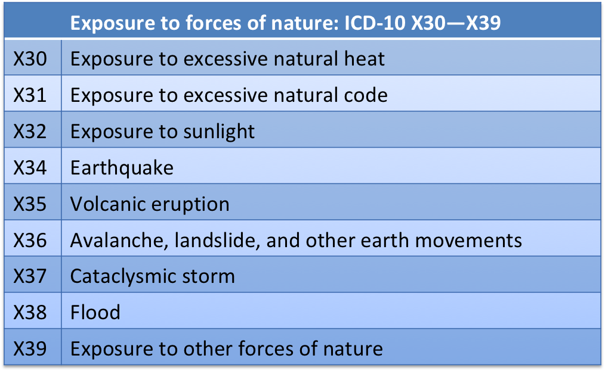
```

## Reporting cause of death

```{r echo = FALSE, out.width="\\textwidth", fig.align = "center"}
knitr::include_graphics("figures/cdc_direct_death.png")
```

\footnotesize Source: https://www.cdc.gov/nchs/data/dvs/hurricane_certification.pdf

## Reporting cause of death

```{r echo = FALSE, out.width="\\textwidth", fig.align = "center"}
knitr::include_graphics("figures/cdc_indirect_death.png")
```

\footnotesize Source: https://www.cdc.gov/nchs/data/dvs/hurricane_certification.pdf

## Reporting cause of death

```{r echo = FALSE, out.width="\\textwidth", fig.align = "center"}
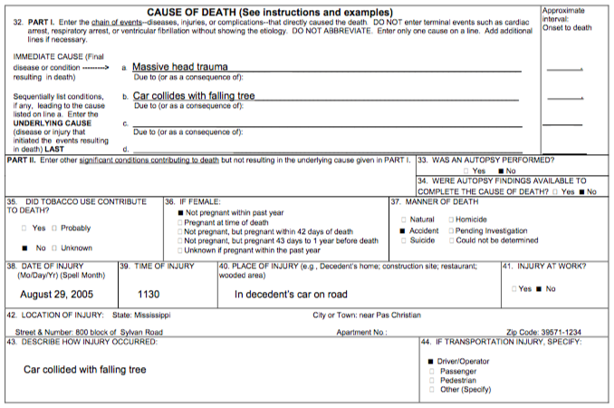
```

\footnotesize Source: https://www.cdc.gov/nchs/data/dvs/hurricane_certification.pdf

## Impacts in excess of official death tolls

Evidence from Hurricane Maria in Puerto Rico. 

```{r out.width = "\\textwidth"}
include_graphics("figures/maria_timeseries.png")
```

\footnotesize Source: The New York Times


# Measuring tropical cyclone exposure

## Potential pathways through which tropical cyclone exposure might increase mortality risk

```{r out.width = "0.9\\textwidth", fig.align = "center"}
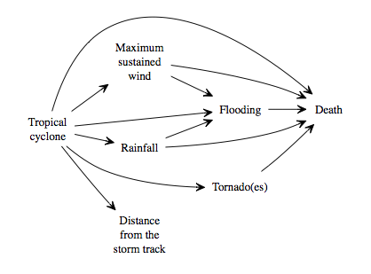
```

## Assessing tropical storm exposure

\begin{block}{Challenge for epidemiological research}
How should we determine whether a county was exposed to a tropical storm for epidemiological research?
\end{block}

\vspace{-0.3cm}

```{r out.width = "\\textwidth", fig.align = "center"}
knitr::include_graphics("figures/previous_exposure_metrics.pdf")
```

## Distance as a surrogate measure of tropical cyclone exposure

```{r out.width = "\\textwidth", fig.align = "center"}
include_graphics("figures/katrina_west_nile.png")
```

## Potential pathway for effects of Katrina on West Nile risk

```{r out.width = "\\textwidth", fig.align = "center"}
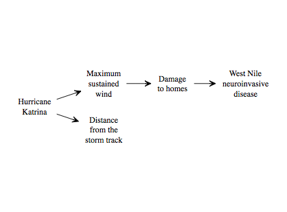
```

<!-- ## Katrina wind exposure vs. distance from storm track -->

<!-- ```{r out.width = "\\textwidth", fig.align = "center"} -->
<!-- 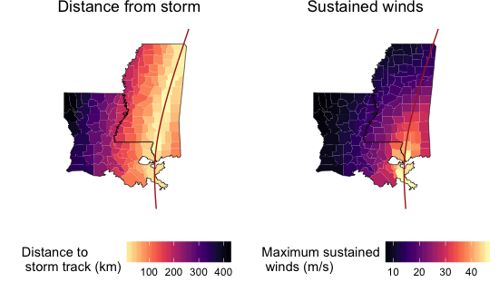 -->
<!-- ``` -->

<!-- \footnotesize For each county in Louisiana and Mississippi, we measured the distance of the county's population mean center from the storm track (left) and modeled the maximum sustained windspeed associated with the storm (right). -->

<!-- ## Katrina wind exposure vs. distance from storm track -->

<!-- ```{r out.width = "\\textwidth", fig.align = "center"} -->
<!-- 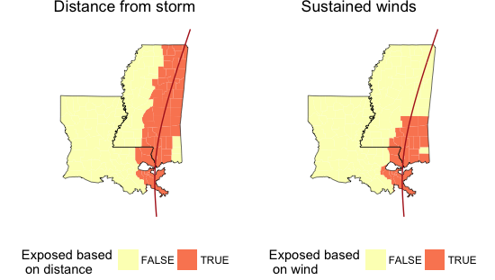 -->
<!-- ``` -->

<!-- \footnotesize Binary storm exposure classifications based on distance from the storm track (left) and maximum sustained wind (right) for Hurricane Katrina. -->

<!-- ## Katrina wind exposure vs. distance from storm track -->

<!-- ```{r out.width = "0.8\\textwidth", fig.align = "center"} -->
<!-- 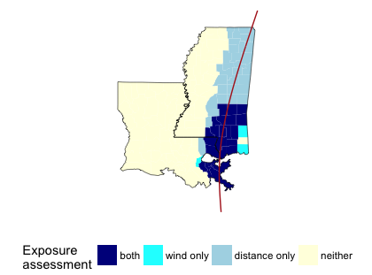 -->
<!-- ``` -->

<!-- \footnotesize Differences between storm exposure classifications when using distance versus maximum sustained winds. -->

<!-- ## Relationships among tropical cyclone hazards -->

<!-- ```{r out.width = "0.8\\textwidth", fig.align = "center"} -->
<!-- 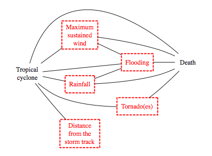 -->
<!-- ``` -->

## Distance from storm

\large Tropical storm "Best Track" data
\vspace{-0.7cm}

\begin{columns}
\begin{column}{0.7\textwidth}
```{r echo = FALSE, out.width = "\\textwidth"}
knitr::include_graphics("figures/finding_closest_point.pdf")
```
\end{column}
\begin{column}{0.3\textwidth}
\small
\begin{block}{Distance metric}
We matched storm tracks to county population mean centers to determine the closest approach and date of closest approach of each storm to each county.
\end{block}
\end{column}
\end{columns}

## Wind exposure

\begin{columns}
\begin{column}{0.7\textwidth}
```{r echo = FALSE, out.width = "\\textwidth", fig.width = 6, fig.height = 4}
map_tracks("Katrina-2005", padding = 2, plot_points = TRUE) + 
  coord_map()
```
\end{column}
\begin{column}{0.3\textwidth}
\small
\begin{block}{Wind metric}
We modeled county winds with a wind model based on a Willoughby et al. paper. This model inputs storm location and maximum wind from best tracks data. 
\end{block}
\end{column}
\end{columns}

## Rain exposure

\begin{columns}
\begin{column}{0.7\textwidth}  
    \vspace{-0.25cm}
    \begin{center}
    Rain during Tropical Storm Lee
    \end{center}
    \begin{center}
     \includegraphics[width=\textwidth]{figures/nldas2_ts_lee.png}
     \end{center}
     \begin{center}
         \vspace{-0.4cm}
     \scriptsize{Image source: Goddard Earth Sciences DISC}
     \end{center}
\end{column}
\begin{column}{0.3\textwidth}
\footnotesize
\begin{block}{Rain metric}
We used NLDAS-2 precipitation data to assess county rainfall. We summed rain from two days before to one day after the storm. We include a distance threshold for the rain metric.
\end{block}
\end{column}
\end{columns}

## Flood and tornado events

```{r echo = FALSE, out.width = "\\textwidth"}
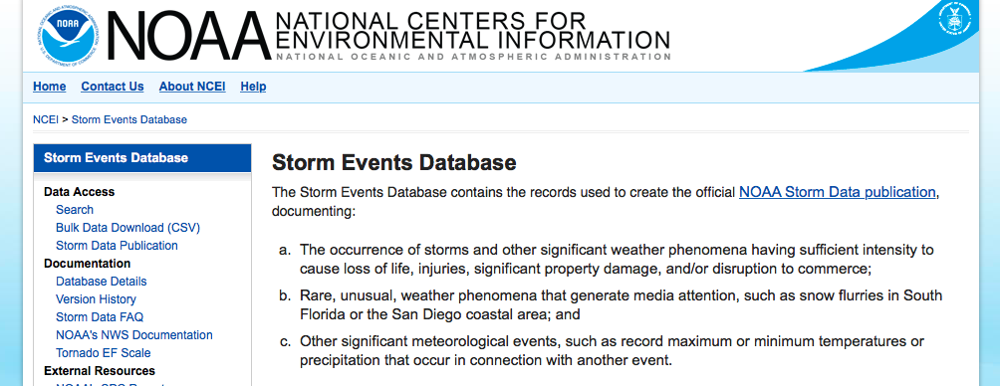
```

Website: https://www.ncdc.noaa.gov/stormevents/

## Storm exposure

\footnotesize
```{r}
data_frame(
  `Exposure metric` = c("Distance",
                        "Rain",
                        "Wind",
                        "Flood",
                        "Tornado"),
  `Criterial for exposure` = c("County population mean center within 100 km of storm track",
                               "County received 75 mm or more rain over the period from two days before to one day after the storm's closest approach and the storm passed within 500 km of the county",
                               "Modeled wind speed at county's population mean center met or exceeded 15 m / s during the storm",
                               "Flood event listed with a start date within two days of the storm's closest approach and county within 500 km of storm track",
                               "Tornado event listed with a start date within two days of the storm's closest approach and county within 500 km of storm track")
  ) %>%
  pander::pander(justify = "ll", split.cells = c(15, 50))
```


## Tropical storm exposure classifications for Hurricane Katrina

```{r out.width = "\\textwidth", fig.align = "center"}
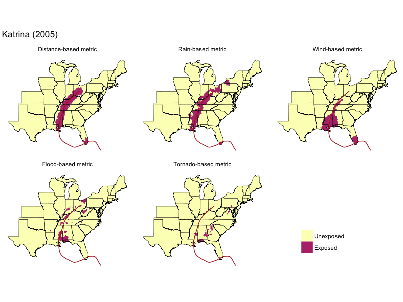
```

## County-level agreement in storm exposure 

\begin{block}{Assessing agreement in county classifications}
For each storm and each pair of metrics, we measured the \textit{Jaccard index} as a measure of county-level agreement in exposure classification for a storm:

\begin{equation*}
J = \frac{X_1 \cap X_2}{X_1 \cup X_2}
\end{equation*}

where $X_1$ is the set of counties exposed to a storm based on the first metric and $X_2$ is the set of counties exposed to the storm based on the second metric. 

\end{block}

## Similarity among tropical cyclone hazards

```{r out.width = "\\textwidth", fig.align = "center"}
include_graphics("figures/jaccard_heatmap_presentation.pdf")
```

# Software

## Open data / reproducible research

```{r echo = FALSE, out.width = "0.8\\textwidth", fig.align = "center"}
knitr::include_graphics("figures/open_data_headlines.png")
```

## Project software

\footnotesize
\begin{block}{`hurricaneexposure`}
Create county-level exposure time series for tropical storms in U.S. counties. Exposure can be determined based on several hazards (e.g., distance, wind, rain), with user-specified thresholds. 
https://github.com/geanders/hurricaneexposure
\end{block}

```{r echo = TRUE, eval = FALSE}
county_rain(counties = c("22071", "51700"), rain_limit = 100, 
            start_year = 1995, end_year = 2005, dist_limit = 100,
            days_included = c(-1, 0, 1))
```

```{r echo = FALSE}
county_rain(counties = c("22071", "51700"), rain_limit = 100, 
            start_year = 1995, end_year = 2005, dist_limit = 100,
            days_included = c(-1, 0, 1)) %>%
  slice(1:6) %>%
  select(storm_id, fips, closest_date, storm_dist, tot_precip)
```

## Project software

\vspace{-0.2cm}
\large
\begin{center}
Web application interface to `hurricaneexposure`
\end{center}
\vspace{-0.3cm}

```{r echo = FALSE, out.width = "\\textwidth"}
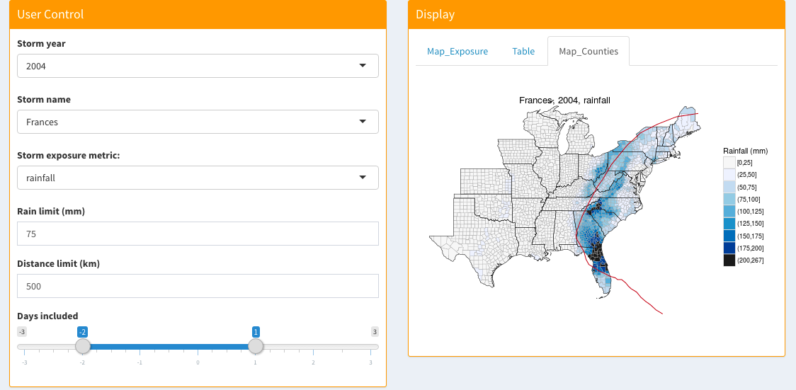
```

## Project software

\begin{columns}
\begin{column}{0.3\textwidth}
\footnotesize
\begin{block}{`stormwindmodel`}
Model storm winds from Best Tracks data at U.S. locations. Includes modeling sustained and gust winds, as well as duration of sustained and gust winds above a specified threshold. On CRAN.
\end{block}
\end{column}
\begin{column}{0.7\textwidth}
```{r echo = FALSE, out.width = "\\textwidth", fig.align = "center"}
knitr::include_graphics("figures/census_track_modeled_winds.png")
```
\end{column}
\end{columns}

## Project software

\footnotesize
\begin{block}{`noaastormevents`}
Download and explore listings from the NOAA Storm Events database. Includes the ability to pull events based on a tropical storm, using events listed close in time and distance to the storm's tracks. 
https://github.com/zailchen/noaastormevents
\end{block}

\footnotesize
\begin{block}{`countytimezones`}
Convert time-stamps from UTC to local time zones for U.S. counties based on county FIPs. Facilitates merging weather observations with locally measured data, including health outcomes. On CRAN.
\end{block}

\footnotesize
\begin{block}{`countyweather`}
Download weather monitor data through NOAA API by U.S. county. Includes functions to map available monitors for each county. On CRAN.
\end{block}

## Software as a research product

```{r echo = FALSE, out.width = "\\textwidth"}

```

Courses: https://www.coursera.org/specializations/r
Course book: https://bookdown.org/rdpeng/RProgDA/


# Associations between tropical cyclone exposure and mortality

## Impacts in excess of official death tolls

Evidence from Hurricane Maria in Puerto Rico. 

```{r out.width = "\\textwidth"}
include_graphics("figures/maria_timeseries.png")
```

\footnotesize Source: The New York Times

## Relative risk of mortality associated with storm exposure

\begin{block}{Relative risk of mortality associated with storm exposure}
We aimed to measure the \textit{relative risk (RR)} of mortality during the storm compared to what would have been expected the same days if there had not been a storm:

\begin{equation*}
RR = \frac{\text{Community-wide risk of death during storm}}{\text{Expected community-wide risk of death without storm}}
\end{equation*}

\end{block}


## Seasonality in tropical cyclones

Storm occurence by month for three high-risk US counties.

```{r out.width = "0.8\\textwidth", fig.align = "center"}
include_graphics("figures/storm_seasonality.png")
```

## Matching to control for seasonality

```{r out.width = "\\textwidth", fig.align = "center"}
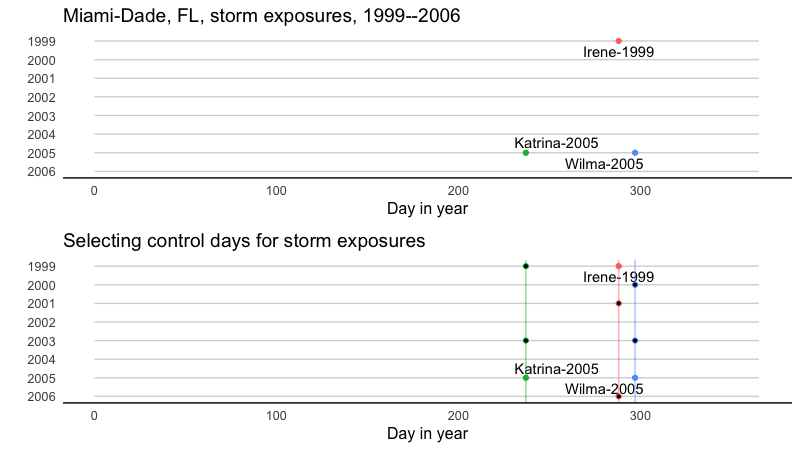
```

\small We selected unexposed days in each community, matched to each storm exposed day, ensuring all matches are on similar days of the year.

## Estimating relative risk of mortality

To this matched data, we fit a random effects generalized linear model, using an **unconstrained distributed lag approach** to explore risks in the period surrounding the storm: 

\begin{equation*}
log[E(Y_t^c)]=log(n^c) + \alpha + \alpha^c + 
\boldsymbol{\beta}\sum_{l=-2}^{7} x_{t-l}^c + \boldsymbol{\delta} Year_t^c + 
\boldsymbol{\gamma} DOW_t^c
\end{equation*}

\small

where $Y_t^c$: observed death count on day $t$ in community $c$; $n^c$: population size in community $c$ in year of day $t$; $\alpha$, $\alpha^c$: overall intercept and community random effect intercepts, respectively; $x_{t-l}^c$: indicator of whether the day at lag $l$ from day $t$ was exposed to the storm in community $c$; $Year_t^c$: year of day $t$; and $DOW_t^c$: day of week of day $t$.

## Study storms and communities

```{r echo = FALSE, out.width="0.85\\textwidth", fig.align = "center"}
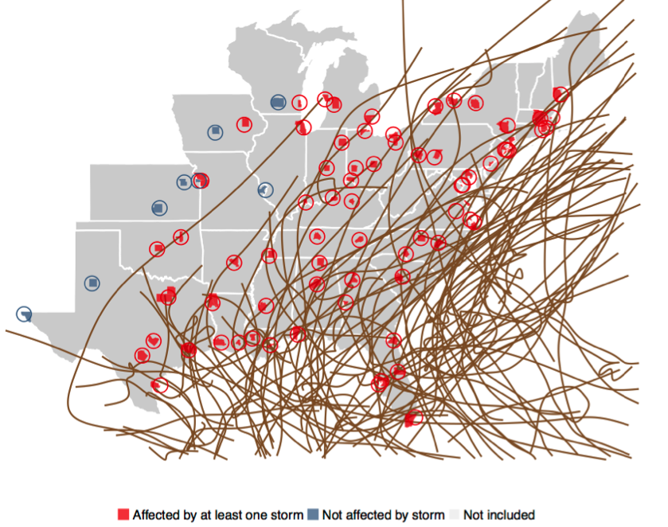
```

\footnotesize Source: Preliminary results, Yan et al.

## Mortality risks by day during storm period

\begin{columns}
\begin{column}{0.6\textwidth}  
    \begin{center}
     \includegraphics[width=\textwidth]{figures/all_cause_lags.png}
     \end{center}
\end{column}
\begin{column}{0.4\textwidth}
\footnotesize
\begin{block}{Risks by day}
\footnotesize
\begin{itemize}
  \item For all-cause deaths, RRs were highest on storm's closest day
  \item There was some evidence of elevated risk before and after the storm
  \item Lag patterns were similar for cardiovascular and accidental deaths
\end{itemize}
\end{block}
\end{column}
\end{columns}

\footnotesize Source: Preliminary results, Yan et al.

## Mortality risk by exposure metric

```{r echo = FALSE, out.width="\\textwidth", fig.align = "center"}
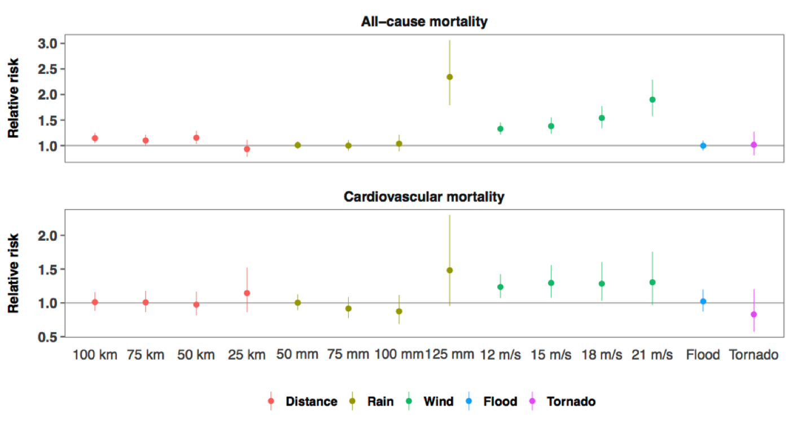
```

\footnotesize Source: Preliminary results, Yan et al.

# Final thoughts

## CSU R Programming course

I teach a course each fall in R Programming (ERHS 535). The coursebook is available online: https://geanders.github.io/RProgrammingForResearch/

```{r echo = FALSE, out.width="\\textwidth", fig.align = "center"}

```

## Partnership for Air Quality, Climate, and Health

```{r echo = FALSE, out.width="\\textwidth", fig.align = "center"}

```

## Statistics for dynamic / mechanistic models

```{r echo = FALSE, out.width="0.8\\textwidth", fig.align = "center"}
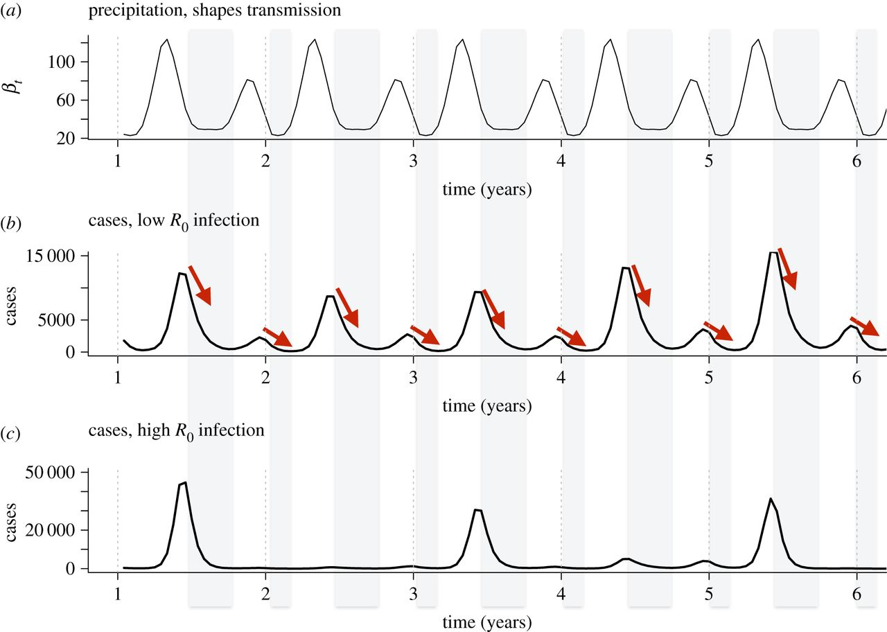
```

\footnotesize{Source: Metcalfe et al., 2017. Identifying climate drivers of infectious disease dynamics: recent advances and challenges ahead. \textit{Proc. R. Soc. B}.}

## Statistics for dynamic / mechanistic models

```{r echo = FALSE, out.width="\\textwidth", fig.align = "center"}
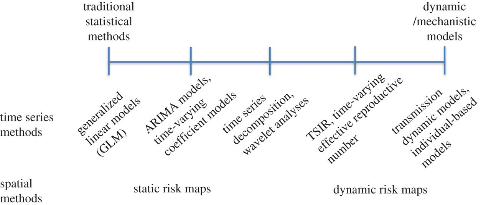
```

\footnotesize{Source: Metcalfe et al., 2017. Identifying climate drivers of infectious disease dynamics: recent advances and challenges ahead. \textit{Proc. R. Soc. B}.}

## Multiple hypothesis testing

```{r echo = FALSE, out.width="0.5\\textwidth", fig.align = "center"}
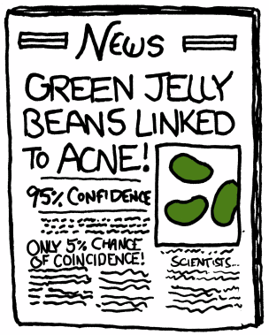
```

\footnotesize{Source: xkcd}
