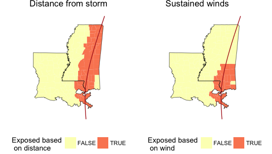
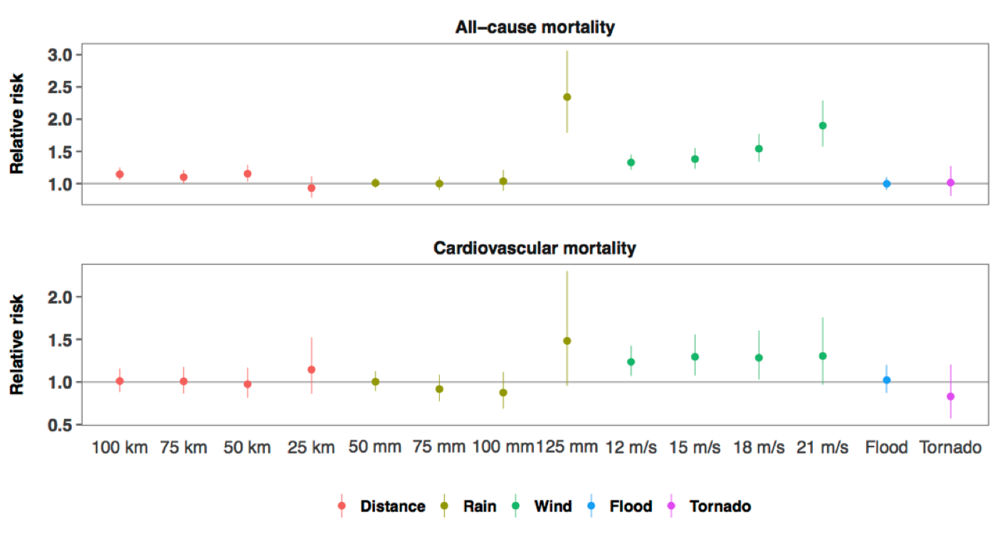

---
output:
  beamer_presentation:
    keep_tex : true
    includes: 
      in_header: anderson_header.txt
      before_body: anderson_beforebody.txt
---

```{r setup, include=FALSE, message = FALSE, warning = FALSE}
knitr::opts_chunk$set(echo = FALSE, warning = FALSE, message = FALSE)
library(ggplot2)
library(dplyr)
library(lubridate)
library(gridExtra)
library(tidyr)
library(stringr)

library(hurricaneexposuredata)
library(hurricaneexposure)
library(countyweather)
```

## Major U.S. disasters, 2017

```{r echo = FALSE, out.width="\\textwidth", fig.align = "center"}

```

\vspace{-0.5cm}

\footnotesize

Source: https://www.ncdc.noaa.gov/billions/

## Hurricane fatality studies

```{r echo = FALSE, out.width="0.8\\textwidth", fig.align = "center"}

```

<!-- ## Reporting cause of death -->

<!-- ```{r echo = FALSE, out.width="0.8\\textwidth", fig.align = "center"} -->
<!-- knitr::include_graphics("icd_disaster_codes.png") -->
<!-- ``` -->

## Reporting cause of death

```{r echo = FALSE, out.width="\\textwidth", fig.align = "center"}

```

\vspace{-0.5cm}

\footnotesize

Source: https://www.cdc.gov/nchs/data/dvs/hurricane_certification.pdf

## Reporting cause of death

```{r echo = FALSE, out.width="\\textwidth", fig.align = "center"}
knitr::include_graphics("cdc_indirect_death.png")
```

\vspace{-0.5cm}

\footnotesize

Source: https://www.cdc.gov/nchs/data/dvs/hurricane_certification.pdf

## Hurricane Maria example

```{r echo = FALSE, out.width="0.9\\textwidth", fig.align = "center"}
knitr::include_graphics("maria_excess_deaths.png")
```

\vspace{-0.2cm}

\footnotesize

Source: The New York Times

## Hurricane Maria example

```{r echo = FALSE, out.width="0.9\\textwidth", fig.align = "center"}
knitr::include_graphics("maria_timeseries.png")
```

\vspace{-0.2cm}

\footnotesize

Source: The New York Times

## Health risks associated with Hurricane Sandy (2012)

\begin{columns}

\begin{column}{0.45\textwidth}
```{r echo = FALSE, fig.align = "center", out.width = "\\textwidth"}
knitr::include_graphics("sandy_satellite.jpg")
```
\vspace{-0.5cm}
\begin{center}
\scriptsize Source: NOAA / NASA GOES Project
\end{center}
\end{column}

\begin{column}{0.55\textwidth}
\small
\begin{block}{Health risks in storm-affected areas}
\begin{itemize}
  \item Change in patterns of emergency department visits (Kim et al. 2016)
  \item Increased outpatient cases of food and waterborne disease among elderly (Bloom et al. 2016)
  \item Increased rate of myocardial infarctions (Swerdel et al. 2014)
  \item Increased hospitalizations for dehydration (Lee et al. 2016)
  \item Difficulty obtaining medical care, medications, and medical equipment (Davidow et al. 2016)
\end{itemize}
\end{block}
\end{column}

\end{columns}

## Project aims

\begin{block}{Project aims}
\begin{itemize}
  \item Assess exposure to tropical storms for all U.S. Atlantic basin tropical storms, 1988--2015, based on reasonable measurements of tropical storm hazards
  \item Determine agreement between hazard-based classifications for U.S. counties
  \item Investigate mortality risks associated with tropical storm exposures in U.S. communities
  \item Make exposure assessments accessible to other researchers for epidemiological and other impact studies 
\end{itemize}
\end{block}

# Assessing exposure to tropical storms

## Hurricane hazards and impacts

```{r echo = FALSE, out.width = "\\textwidth", fig.align = "center"}

```

\footnotesize

Source: The New York Times

## Hurricane hazards and impacts

```{r echo = FALSE, out.width = "\\textwidth", fig.align = "center"}
knitr::include_graphics("harvey_inland.jpg")
```

\footnotesize

Source: AccuWeather

## Forecasts of Hurricane Sandy's track

```{r echo = FALSE, out.width="\\textwidth", fig.align = "center"}

```

\vspace{-0.2cm}

\footnotesize 

Source: http://wtvr.com/2012/10/24/sandy-becomes-a-hurricane/

## Hurricane hazards

```{r echo = FALSE, out.width="0.8\\textwidth", fig.align = "center"}

```

## Assessing exposure

\begin{columns}
\begin{column}{0.7\textwidth}
```{r echo = FALSE, fig.align = "center", out.width = "\\textwidth"}
knitr::include_graphics("coastal_inland_mortality_figure.png")
```
\vspace{-0.5cm}
\begin{center}
\footnotesize Czajkowski et al. 2011
\end{center}
\end{column}
\begin{column}{0.3\textwidth}
\small
\begin{block}{Example exposure assessment}
Czajkowski et al. (2011) classified counties based on distance to storm tracks to study mortality risks.
\end{block}
\end{column}
\end{columns}

## Assessing exposure

\begin{columns}
\begin{column}{0.7\textwidth}
```{r echo = FALSE, fig.align = "center", out.width = "\\textwidth"}
knitr::include_graphics("florida_direct_indirect_mortality_figure.png")
```
\vspace{-0.6cm}
\begin{center}
\footnotesize McKinney et al. 2011
\end{center}
\end{column}
\begin{column}{0.3\textwidth}
\small
\begin{block}{Example exposure assessment}
McKinney et al. (2011) classified counties based on distance to storm tracks, evacuations, and wind to study mortality risk.
\end{block}
\end{column}
\end{columns}

## Previous metrics of tropical cyclone exposure

```{r out.width = "\\textwidth", fig.align = "center"}
knitr::include_graphics("previous_exposure_metrics.pdf")
```

## Exposure metrics

```{r echo = FALSE, out.width = "0.8\\textwidth", fig.align = "center"}
knitr::include_graphics("metric_relationships.png")
```


## Distance from storm

\large Tropical storm "Best Track" data
\vspace{-0.7cm}

\begin{columns}
\begin{column}{0.7\textwidth}
```{r echo = FALSE, out.width = "\\textwidth"}
knitr::include_graphics("finding_closest_point.pdf")
```
\end{column}
\begin{column}{0.3\textwidth}
\small
\begin{block}{Distance metric}
We matched storm tracks to county population mean centers to determine the closest approach and date of closest approach of each storm to each county.
\end{block}
\end{column}
\end{columns}

## Rain exposure

\begin{columns}
\begin{column}{0.7\textwidth}  
    \vspace{-0.25cm}
    \begin{center}
    Rain during Tropical Storm Lee
    \end{center}
    \begin{center}
     \includegraphics[width=\textwidth]{nldas2_ts_lee.png}
     \end{center}
     \begin{center}
         \vspace{-0.4cm}
     \scriptsize{Image source: Goddard Earth Sciences DISC}
     \end{center}
\end{column}
\begin{column}{0.3\textwidth}
\footnotesize
\begin{block}{Rain metric}
We used NLDAS-2 precipitation data to assess county rainfall. We summed rain from two days before to one day after the storm. We include a distance threshold for the rain metric.
\end{block}
\end{column}
\end{columns}

## Wind exposure

\begin{columns}
\begin{column}{0.5\textwidth}
```{r echo = FALSE, out.width = "\\textwidth", fig.align = "center"}

```
\end{column}
\begin{column}{0.5\textwidth}
\small
\begin{block}{Wind metric}
We modeled county winds with a wind model based on a Willoughby et al. paper. This model inputs storm location and maximum wind from best tracks data. 
\end{block}
\end{column}
\end{columns}

## Flood and tornado events

```{r echo = FALSE, out.width = "\\textwidth"}
knitr::include_graphics("noaastormevents.png")
```

Website: https://www.ncdc.noaa.gov/stormevents/

## Storm exposure

\footnotesize
```{r}
data_frame(
  `Exposure metric` = c("Distance",
                        "Rain",
                        "Wind",
                        "Flood",
                        "Tornado"),
  `Criterial for exposure` = c("County population mean center within 100 km of storm track",
                               "County received 75 mm or more rain over the period from two days before to one day after the storm's closest approach and the storm passed within 500 km of the county",
                               "Modeled wind speed at county's population mean center met or exceeded 15 m / s during the storm",
                               "Flood event listed with a start date within two days of the storm's closest approach and county within 500 km of storm track",
                               "Tornado event listed with a start date within two days of the storm's closest approach and county within 500 km of storm track")
  ) %>%
  pander::pander(justify = "ll", split.cells = c(15, 50))
```


# Agreement between exposure metrics

## County-level exposure to Hurricane Ivan (2004)

\vspace{-0.6cm}
```{r echo = FALSE, out.height="0.75\\textheight", fig.align = "center"}
knitr::include_graphics("ivanexposurepresentation.pdf")
```

\vspace{-0.5cm}
\scriptsize Criteria for exposure classifications: \textbf{Distance:} Within 100 kms of storm track. \textbf{Rain:} $\ge$ 75 mm of rain total for two days before to one day after storm. \textbf{Wind:} Modeled wind of $\ge$ 15 m/s. \textbf{Flood, Tornado:} Listed event in NOAA Storm Events database.


## County-level agreement in storm exposure 

\begin{block}{Assessing agreement in county classifications}
For each storm and each pair of metrics, we measured the \textit{Jaccard index} as a measure of county-level agreement in exposure classification for a storm:

\begin{equation*}
J = \frac{X_1 \cap X_2}{X_1 \cup X_2}
\end{equation*}

where $X_1$ is the set of counties exposed to a storm based on the first metric and $X_2$ is the set of counties exposed to the storm based on the second metric. 

\end{block}

## County-level agreement in storm exposure 

\vspace{-0.3cm}

```{r fig.align = "center", out.height = "0.87\\textheight"}
knitr::include_graphics("jaccard_heatmap_presentation.pdf")
```

## Tropical storm exposure in U.S. counties

\begin{centering}
\small Storm hits per county per decade based on rain (left) and wind (right) exposure metrics.
\end{centering}

```{r echo = FALSE, fig.align = "center", out.width = "0.95\\textwidth"}
knitr::include_graphics("hurricane_exposure.png")
```

\vspace{-0.7cm}
\scriptsize Criteria for exposure classifications: \textbf{Rain:} $\ge$ 75 mm of rain total for two days before to one day after storm. \textbf{Wind:} Modeled wind of $\ge$ 15 m/s. 

## Distance as a measure of tropical cyclone exposure

```{r out.width = "0.8\\textwidth", fig.align = "center"}
knitr::include_graphics("katrina_west_nile.png")
```

## Potential pathway for effects of Katrina on West Nile risk

```{r out.width = "0.9\\textwidth", fig.align = "center"}
knitr::include_graphics("causal_wind.png")
```

## Katrina wind exposure vs. distance from storm track

```{r out.width = "0.8\\textwidth", fig.align = "center"}
knitr::include_graphics("katrina_continuous_exposures.png")
```

\footnotesize For each county in Louisiana and Mississippi, we measured the distance of the county's population mean center from the storm track (left) and modeled the maximum sustained windspeed associated with the storm (right).

## Katrina wind exposure vs. distance from storm track

```{r out.width = "0.8\\textwidth", fig.align = "center"}

```

\footnotesize Binary storm exposure classifications based on distance from the storm track (left) and maximum sustained wind (right) for Hurricane Katrina.

# Tropical storms and mortality risks

## Study storms and communities

\centering
\small{Storms and communities considered, 1988--2005}

\vspace{-0.2cm}

```{r echo = FALSE, out.width="0.85\\textwidth", fig.align = "center"}
knitr::include_graphics("mortality_storms_counties.png")
```

## Relative risk of mortality associated with storm exposure

\begin{block}{Relative risk of mortality associated with storm exposure}
We aimed to measure the \textit{relative risk (RR)} of mortality during the storm compared to what would have been expected the same days if there had not been a storm:

\begin{equation*}
RR = \frac{\text{Rate of deaths during storm}}{\text{Expected rate of deaths without storm}}
\end{equation*}

We assessed this relative rate for (1) specific days during the storm period (two days before to seven days after storm's closest approach) and (2) the total storm period. 

\end{block}

<!-- ## Study storms and communities -->

<!-- \centering -->
<!-- Number of communities and storms identified as exposed by different exposure metrics. -->

<!-- \begin{table}[] -->
<!-- \centering -->
<!-- \begin{tabular}{@{}lcc@{}} -->
<!-- \toprule -->
<!-- Exposure metric              & \# of communities & \# of community storms \\ \midrule -->
<!-- Wind (\textgreater 21 m / s) & 26                & 83                     \\ -->
<!-- Rain (\textgreater 125 mm)   & 26                & 50                     \\ -->
<!-- Distance (\textless 25 km)   & 44                & 79                     \\ -->
<!-- Flood events                 & 51                & 180                    \\ -->
<!-- Tornado events               & 22                & 53                     \\ \bottomrule -->
<!-- \end{tabular} -->
<!-- \end{table} -->

<!-- \footnotesize{Note: For wind, rain, and distance, the most stringent thresholds considered are shown here.} -->

## Seasonality in tropical cyclones

Storm occurrence by month for three high-risk US counties.

```{r out.width = "0.8\\textwidth", fig.align = "center"}

```

## Hurricane Maria example

```{r echo = FALSE, out.width="0.9\\textwidth", fig.align = "center"}
knitr::include_graphics("maria_timeseries.png")
```

\vspace{-0.2cm}

\footnotesize

Source: The New York Times

## Matching to control for seasonality

```{r out.width = "0.9\\textwidth", fig.align = "center"}
knitr::include_graphics("example_picking_controls.png")
```

\vspace{-0.3cm}

\small We selected unexposed days in each community, matched to each storm exposed day, ensuring all matches are on similar days of the year.

## Relative risk of mortality during storms

\centering
\small{Relative risk of mortality associated with tropical storm exposures, as determined by maximum windspeed > 21 m / s}

\begin{table}[]
\centering
\begin{tabular}{@{}lcc@{}}
\toprule
Cause of death & RR on closest day    & RR over storm period                                             \\ \midrule
All-cause      & 1.42 (1.36, 1.49)    & 1.90 (1.58, 2.29)      \\
\ \ Cardiovascular & 1.15 (1.06, 1.24)    & 1.30 (0.97, 1.76)      \\
\ \ Respiratory    & 1.13 (0.92,1.38)     & 1.54 (0.70, 3.39)      \\
\ \ Accidental     & 12.03 (10.87, 13.32) & 161.41 (61.62, 422.80) \\ \bottomrule
\end{tabular}
\end{table}

## Mortality risks by day during storm period

\begin{columns}
\begin{column}{0.6\textwidth}  
    \begin{center}
     \includegraphics[width=\textwidth]{all_cause_lags.png}
     \end{center}
\end{column}
\begin{column}{0.4\textwidth}
\footnotesize
\begin{block}{Risks by day}
\footnotesize
\begin{itemize}
  \item For all-cause deaths, RRs were highest on storm's closest day
  \item There was some evidence of elevated risk before and after the storm
  \item Lag patterns were similar for cardiovascular and accidental deaths
\end{itemize}
\end{block}
\end{column}
\end{columns}

## Mortality risk by exposure metric

```{r echo = FALSE, out.width="\\textwidth", fig.align = "center"}

```

\vspace{-0.3cm}

\footnotesize

Cumulative relative risk of mortality from two days before to seven days after tropical storm exposure for different metrics of exposure to tropical storms.

# Sharing exposure assessments

## Project software

\footnotesize
\begin{block}{`hurricaneexposure`}
Create county-level exposure time series for tropical storms in U.S. counties. Exposure can be determined based on several hazards (e.g., distance, wind, rain), with user-specified thresholds. On CRAN.
\end{block}

```{r echo = TRUE, eval = FALSE}
county_rain(counties = c("22071", "51700"), rain_limit = 100, 
            start_year = 1995, end_year = 2005, dist_limit = 100,
            days_included = c(-1, 0, 1))
```

```{r echo = FALSE}
county_rain(counties = c("22071", "51700"), rain_limit = 100, 
            start_year = 1995, end_year = 2005, dist_limit = 100,
            days_included = c(-1, 0, 1)) %>%
  slice(1:4) %>%
  select(storm_id, fips, closest_date, storm_dist, tot_precip)
```

## Project software

\begin{columns}
\begin{column}{0.3\textwidth}
\footnotesize
\begin{block}{`stormwindmodel`}
Model storm winds from Best Tracks data at U.S. locations. Includes modeling sustained and gust winds, as well as duration of sustained and gust winds above a specified threshold. On CRAN.
\end{block}
\end{column}
\begin{column}{0.7\textwidth}
```{r echo = FALSE, out.width = "\\textwidth", fig.align = "center"}
knitr::include_graphics("census_track_modeled_winds.png")
```
\end{column}
\end{columns}

## Project software

\footnotesize
\begin{block}{`countyweather`, `countyfloods`}
Download weather monitor data through NOAA and USGS APIs by U.S. county. Includes functions to map available monitors / gages for each county. On CRAN.
\end{block}

\footnotesize
\begin{block}{`noaastormevents`}
Download and explore listings from the NOAA Storm Events database. Includes the ability to pull events based on a tropical storm, using events listed close in time and distance to the storm's tracks. On CRAN.
\end{block}

\footnotesize
\begin{block}{`countytimezones`}
Convert time-stamps from UTC to local time zones for U.S. counties based on county FIPs. Facilitates merging weather observations with locally measured data, including health outcomes. On CRAN.
\end{block}

## Continuing / future work

- Improving flood exposure metric
- Improving wind model for inland locations
- Influence of most notable storms on mortality risk estimates
- Effect modification of power outages
- Hospitalization impacts among Medicare beneficiaries

## Acknowledgements

\small

\begin{block}{Funding}
This work was supported in part by grants from the National Institute of Environmental Health Sciences (R00ES022631), the National Science Foundation (1331399), and a NASA Applied Sciences Program/Public Health Program Grant (NNX09AV81G).
\end{block}

\begin{block}{Collaborators}
Meilin Yan, Joshua Ferreri, Ander Wilson, Roger Peng, Dirk Eddelbuettel, Mohammad Al-Hamdan, William Crosson, Andrea Schumacher, Seth Guikema, and Steven Quiring collaborated on research and software shown here.
\end{block}

