# Overview

## Overview

While there are many hazards associated with tropical cyclones, in this 
session we'll focus on the hazard of **high winds**. 

We'll discuss how wind intensity can be measured for tropical cyclones and
how this can be leveraged for **exposure assessment** for epidemiology studies. 

The principles apply with a variety of available datasets and wind field 
models. I will show examples from one set of R packages that my research 
group developed and made available.

## Overview

We'll start by talking about central measures of storm intensity, focusing 
on **storm track data**. 

We'll then move into a discussion of **wind field modeling** and how that has
advantages in terms of estimating winds local to each study subject. We'll 
discuss how wind field models can be used for **exposure assessment** for 
epidemiology. We'll talk some about binary versus continuous exposure measures.

We'll end by discussing some **alternatives to wind field modeling**, as well as
briefly discuss how exposure assessment that is based on wind might differ
from exposure assessment based on **other hazards** of tropical cyclones.

## Overview

Many of the concepts in this session are covered in the following article.
I will make this available to all the participants, for anyone who would like
to go deeper based on the overview I give today. 

Anderson, Schumacher, and Done. 2022. Exposure Assessment for Tropical Cyclone
Epidemiology. *Current Environmental Health Reports*. 9:104--119.

## Format

We are at the end of a few hours of talks. I have focused on sharing the 
information for this session in a way that it visual and hopefully 
engaging. 

For full citations and deeper dives into specific concepts that I'll cover, 
please take a look at the paper I'll be sharing, as well as vignettes for 
the R packages I'll use as examples. 

# Storm tracks data

## Tropical cyclones as organized systems

Tropical cyclones are **organized** weather systems. As a result they can---and
are---tracked and measured **as a system**. 

## Tropical cyclones as organized systems

In this image, you can see Hurricane Florence as a system---an organized storm 
that is separate from other systems or weather patterns. 

```{r echo = FALSE, out.width = "0.85\\textwidth", fig.align = "center"}

```

\footnotesize Source: NASA / Goddard Space Flight Center 

## Central measures of tropical cyclones

One way we track the whole system of a tropical cyclone is to focus on 
**central measures**. These include measures like the **location** of the center of 
the storm and the **intensity** at its highest throughout the storm, which is 
typically near its center. 

## Central measures of tropical cyclones

One common measure that is used for tropical cyclones as systems is the 
Saffir-Simpson Hurricane Wind Scale. 

```{r echo = FALSE, out.width = "0.95\\textwidth", fig.align = "center"}
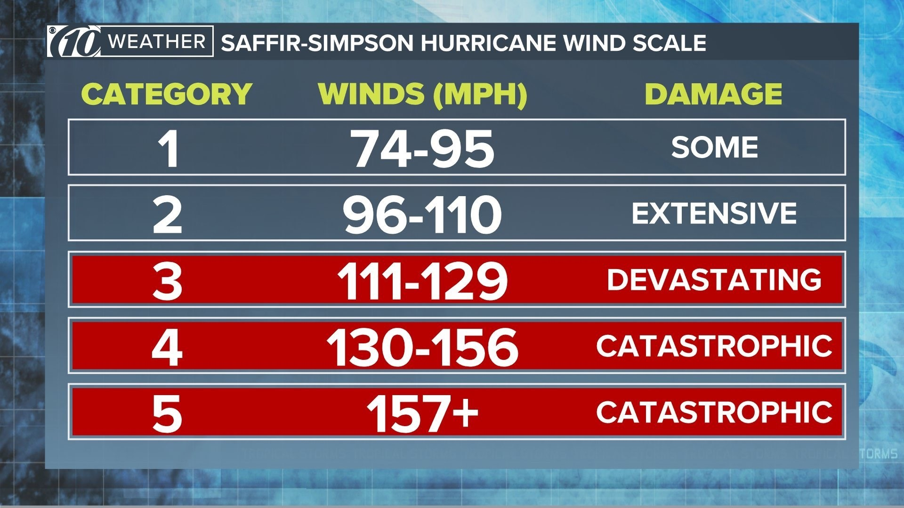
```

\footnotesize Source: WTSP

## Storm track data

As we track a storm, we gather these data points at 
regular times, what are known as the **synoptic times** of 00:00, 06:00, 12:00, 
and 18:00 UTC (Coordinated Universal Time). For many storms, tracking data will 
cover **several days**, and in some cases a week or more. 

```{r echo = FALSE, out.width = "0.9\\textwidth", fig.align = "center"}
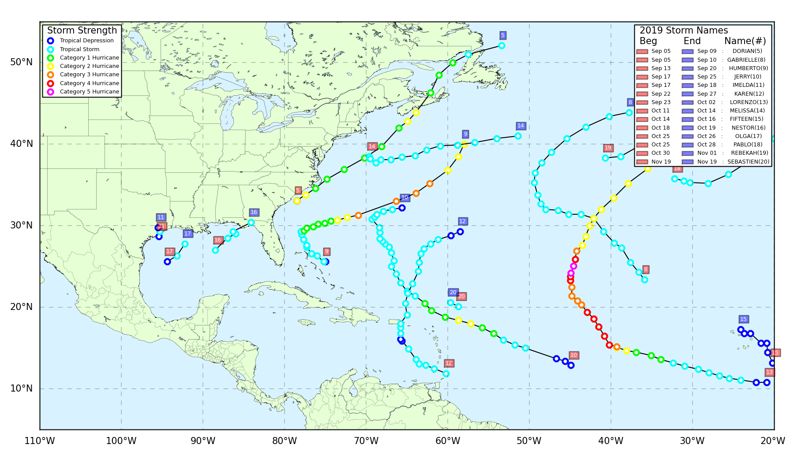
```
\footnotesize Source: LSC Earth Scan Laboratory

## Storm track data

Storm track data are widely available and are going available going back many 
years. A preliminary version is typically available in real time from the weather
service responsible for storm tracking. At a later time, an 
updated **Best Tracks** version is available. 

## Storm track data

The tracking data are also available internationally through an effort 
called the **International Best Track Archive for Climate Stewardship (IBTrACS)**.

To talk about IBTrACS, though, we need to step back and talk about 
tropical cyclone **basins**.

## Tropical cyclone basins

Tropical cyclones occur in different spots in the
world, and these spots have been divided into basins: 

```{r echo = FALSE, out.width = "0.95\\textwidth", fig.align = "center"}
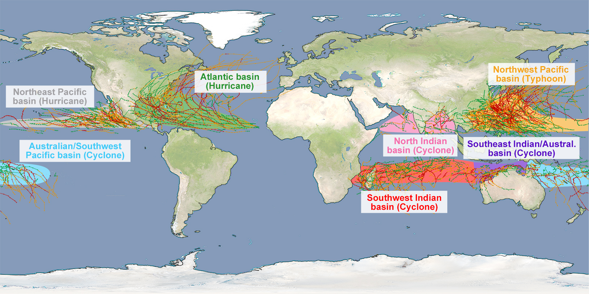
```

\footnotesize Source: Deutsche Wetterdienst

## Tropical cyclone basins

Traditionally, different weather services were responsible for 
tracking tropical cyclones in different basins. 

These different weather services sometimes measure things in different
ways or with different conventions.

As a result, while you can get tracking data from each responsible group, 
the resulting data may be hard to compare across study locations.

## IBTrACS

This issue is addressed by IBTrACS, or the International Best Tracks Archive
for Climate Stewardship. IBTrACS provides global, tropical cyclone storm 
track data, standardized across all the basins. 

```{r echo = FALSE,out.width = "0.9\\textwidth", fig.align = "center"}
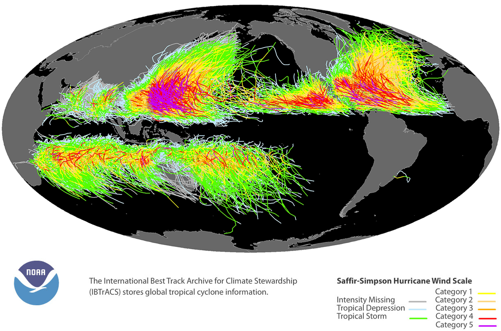
```

## Storm tracks data

If you are studying a single basin, it's fine to use the specific tracking data
from the weather service that is in charge of that basin. However, if you 
are investigating multiple basins, it is best to use the IBTrACS data. 

If you do that, it is worth closely reading the IBTrACS documentation, 
available through its website: 

https://www.ncei.noaa.gov/products/international-best-track-archive

I also highly recommend this paper: 

Knapp et al. 2010. The International Best Track Archive for Climate Stewardship 
(IBTrACS) unifying tropical cyclone data. 
*Bulletin of the American Meteorological Society* 91.3: 363-376.


## Example

For the US, historical Best Tracks data are available through the 
`hurricaneexposuredata` package in R, with associated functions in the 
`hurricaneexposure` package. We'll look through that as an example. 

Other R packages are available that can help you access the IBTrACS data, 
including `noaastorms` (https://github.com/basilesimon/noaastorms/). 

# Set-up of example packages

## Required set-up 

If you'd like to try yourself, there are some set-up steps. First, make sure
your computer has R and R studio. If you need them, you can download them 
from online. 

- [Install R](https://cran.rstudio.com/)
- [Install RStudio](https://rstudio.com/products/rstudio/download/) (Recommended but not required)

## Required set-up 

The data package is stored using a system called `drat`. If you're 
interested in the details, there's more information here: 

```{r echo = FALSE, out.width = "\\textwidth", fig.align = "center"}
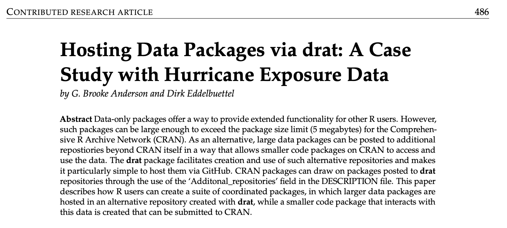
```

## Required set-up

All you really need to know, though, is that you need to install the 
packages in a slightly different way. 

- Install `hurricaneexposuredata` (from our personal repo)

```{r eval = FALSE}
install.packages("drat") # Only run if you don't have `drat` 
library("drat")

addRepo("geanders")
install.packages("hurricaneexposuredata")
```

## Required set-up

The other package we'll focus on, `hurricaneexposure` is available through 
GitHub. You can install that package with the following steps: 

- Install `hurricaneexposure` (from GitHub)

```{r eval = FALSE}
install.packages("devtools") # If you don't have `devtools`
library("devtools")
install_github("geanders/hurricaneexposure")
```

# Storm track examples

## Example

To start, load the two `hurricaneexposure` packages, as well as the 
`tidyverse` package (for standard data science R tools).

```{r message = FALSE, warning = FALSE}
library("hurricaneexposuredata")
library("hurricaneexposure")
library("tidyverse")
```

## Example

You can map a storm's track with the `map_tracks` function from `hurricaneexposure`.
For example, map the track of Hurricane Sandy with: 

```{r out.width = "0.6\\textwidth", fig.width = 4, fig.align = "center"}
map_tracks(storm = "Sandy-2012")
```

## Example

You can plot the tracks of multiple storms. For example, you can plot the 
tracks of all the tracked storms that came near the US in 2012 with:

```{r out.width = "0.55\\textwidth", fig.width = 4,  fig.align = "center"}
map_tracks(storm = c("Alberto-2012", "Beryl-2012", 
                     "Debby-2012", "Isaac-2012", 
                     "Sandy-2012"))
```

## Example

This function is using storm track data that we've included in the 
`hurricaneexposuredata` package, in a dataset called `hurr_tracks`:

\small

```{r}
data("hurr_tracks")
hurr_tracks %>% sample_n(3)
```

## Example

You can work directly with this dataset. For example, you can use regular
expressions to identify storms that start with "B":

\small

```{r}
hurr_tracks %>% 
   filter(str_detect(storm_id, "^B")) %>%
   group_by(storm_id) %>% 
   summarize(n = n(), max_wind = max(wind), 
             start_date = first(date)) %>% 
  slice(1:4)
```


## R package framework

By having the data in R, you can leverage many of R's useful other packages: 

- `sf` for mapping and working with geospatial data
- `tidyverse` for exploring a plotting data
- `lubridate` for working with dates and times

# From central to local measures

## From central to local measures

Tracking data can give central measures of the storm, but they don't 
always give you what you need for epidemiological reseach. 

For example, two storms could have the same central storm measures but create
very different wind exposures for a location the same distance from each storm
track. 

## From central to local measures

This highlights another important point---many of the people who are 
affected by a storm do **not** live right along the storm's track. Central 
measures of the storm won't capture the exposure for anyone who does not live
along the storm track. 

## Wind field models

Instead, it is good to know the **wind field** of the storm. This gives us
spatially-defined wind speeds for the storm at a specific time: 

```{r echo = FALSE, out.width = "\\textwidth", fig.align = "center"}
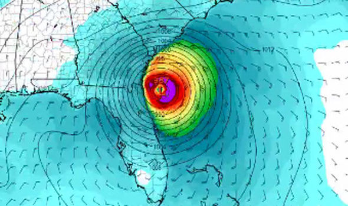
```
\footnotesize
Source: ECMWF

## Wind field models 

Wind field models are parametric models built to estimate these wind fields. 

There are a few you might have 
heard of, including the Holland model and the Willoughby model. 

At heart, each of these gives a smooth fit of storm intensity as a function of the 
distance from the center of the storm. 

## Wind field models 

However, tropical cyclones are not symmetrical. This is because the storm is 
moving in two ways---forward (translational movement and speed) and 
by rotating (rotational movement and speed). Because storms are moving 
forward and rotating, wind speeds are higher in certain regions in certain 
regions of the storm and lower in others. 

```{r echo = FALSE, out.width = "0.5\\textwidth", fig.align = "center"}
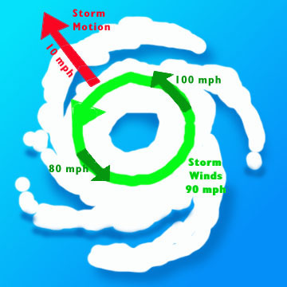
```
\footnotesize Source: NOAA

## Wind field models 

As a result, when you plot the wind as distance from the storm center, it is 
asymmetrical. 

```{r echo = FALSE, out.width = "0.95\\textwidth", fig.align = "center"}
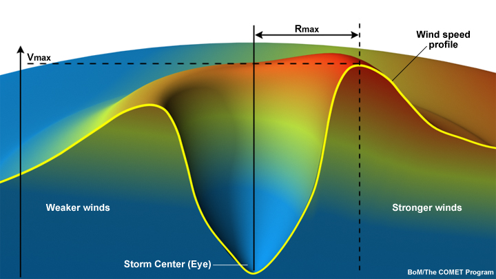
```
\footnotesize
Source: NOAA

## Wind field models

A wind field model like the Holland model takes, as inputs, information from 
the storm tracks data. 

This includes the location of the storm over time, 
which allows a calculation of the translational (forward) direction and speed
of the storm. 

It also includes a measure of the central storm intensity, like the 
maximum sustained winds or the minimum pressure. 

## Wind field models

To develop these wind field models and tune the parameters that define them, 
scientists used observational data from historical storms. 

A lot of this data, as well as the optimization of the models, aimed to 
measure
the storm right before and at the time of landfall. 

## Wind field models

These include data from flying airplanes into storms, dropping recording 
equipment called **dropsondes**. 

```{r echo = FALSE, out.width = "0.9\\textwidth", fig.align = "center"}

```

\footnotesize Source: Smithsonian Magazine

## Wind field models

Wind field models can be used to model storm-associated winds not only along
the storm track, but also at any location the storm might affect. 

These models can therefore be used to generate estimates of storm-associated
winds at county or ZIP code centroids, for studies that use aggregated 
data on health outcomes. 

They can also be used to generate wind estimates at residential locations, 
if data are available at that scale. This would allow you to determine a 
separate and local exposure estimate for each subject in a study. 

## Wind fields 

Wind fields usually represent at a single time point during a storm. For example, 
this wind field for Hurricane Matthew is showing the spatial pattern of its
winds right before landfall:

```{r echo = FALSE, out.width = "\\textwidth", fig.align = "center"}

```
\footnotesize
Source: ECMWF

## Wind field models 

To figure out the peak winds that a storm brought to a location, you can run 
wind field models regularly over the storm's history. 

```{r echo = FALSE, out.width = "0.9\\textwidth", fig.align = "center"}
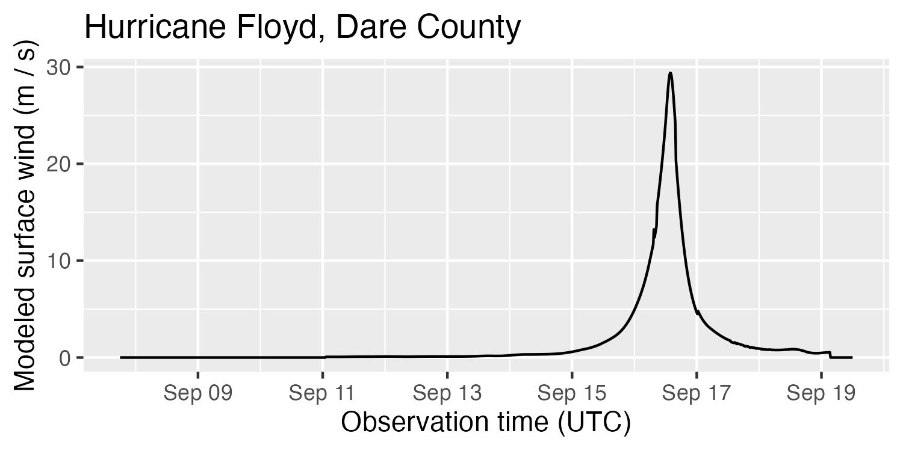
```

At each location you 
model, you can create this wind history, then take measures like the peak 
wind during the storm and the duration of winds of a certain intensity. 

## Example 

Use `map_counties` with `metric = "wind"` to map county-level peak sustained
wind from a storm:

```{r fig.height = 4, out.height = "0.7\\textheight", message = FALSE, warning = FALSE}
map_counties(storm = "Ike-2008", metric = "wind")
```

## Example

The `county_wind` function from `hurricaneexposure` allows you to determine
which of a set of counties had peak sustained wind above a certain threshold, 
as well as pull information about each location's peak wind and duration of 
high winds:

\footnotesize

```{r}
county_wind(counties = county_centers$fips, wind_limit = 35,
            start_year = 2008, end_year = 2008) %>% 
   filter(storm_id == "Ike-2008") %>% slice(1:4)
```

## Use in epidemiology

A growing number of studies have used wind field models to assess exposure
to tropical cyclone--associated winds for epidemiological research and other
research on human outcomes. 

These include studies of the association between tropical cyclone exposure and: 

- mortality (Parks et al., 2023; Blum et al. 2022; Parks et al. 2022, 
Liu et al. 2023)
- hospitalization (Yan et al. 2021, Parks et al. 2021)
- infectious disease (Huang et al. 2024, Lynch and Shaman, 2023)
- school outcomes (Meltzer et al., 2025)

## Use in epidemiology

Epidemiologists can use the estimated peak winds from a wind model as either 
a continuous metric or, in conjunction with a threshold of exposure, to 
create a binary metric of exposure to the storm. 

To date, most studies have looked at exposure as a binary variable. 

One exception is a study by Nethery et al. In their analysis, they found
evidence of an exposure-response relationship that is very non-linear. 

Estimating exposure-response relationships will be important, but is 
methodologically difficult because of both this non-linearity and the 
sparsity of data at the highest levels of exposure. 

## Use in epidemiology

```{r echo = FALSE, out.width = "0.7\\textwidth", fig.align = "center"}
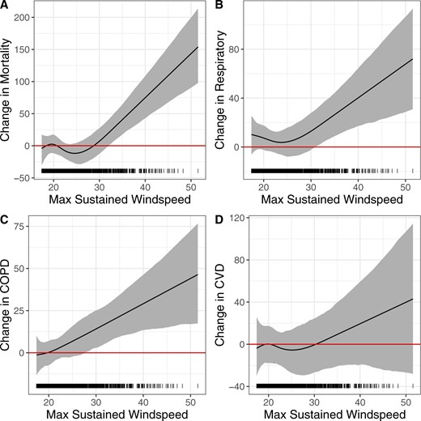
```

\footnotesize Source: Nethery et al. 2021

## Threshold of exposure

If wind field data are used to classify binary exposure (exposed / unexposed), 
you must pick a threshold to define exposure. 

One common practice in epidemiological studies to date has been to explore 
results under two or more selections of thresholds of exposure. 

## Beaufort wind scale

For example, 
studies might conduct their main analysis using **gale-force wind
speed** (34 knots) as the primary threshold, but also include a secondary 
analysis based on **hurricane-force wind speed** (64 knots).

The names of wind speeds (e.g., gale-force) come from a scale called the 
Beaufort scale. This scale describes the local conditions created by winds of 
different speeds. 

## Beaufort wind scale

```{r echo = FALSE, out.width = "0.85\\textwidth", fig.align = "center"}
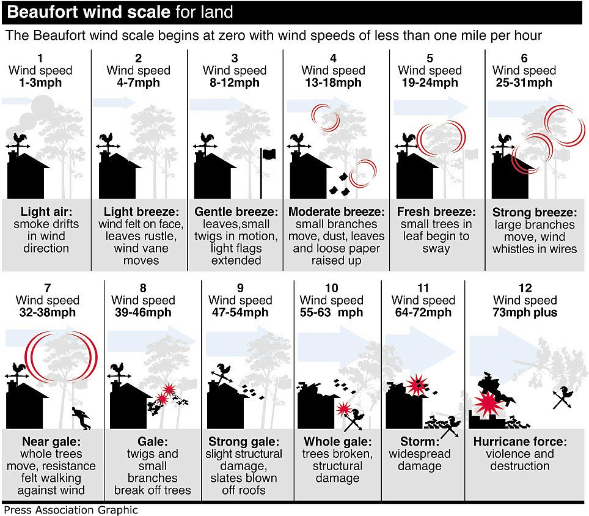
```

## Beaufort wind scale

This makes it helpful in determining which threshold 
might be appropriate based on the hypothesized pathway between exposure
and health risk in your study. 

For example, if you hypothesize that power 
outages from the storm are likely to be a driver of risk, it may make sense
to consider gale-force as a threshold, since winds at that level can damage
trees, which can create significant power outages.

Alternatively, if you are studying psychological trauma related to major
damage to personal property, a higher threshold---one associated with damage
to buildings---might be more reasonable.

## Threshold of exposure

Whichever threshold you select, keep in mind that most of the storm 
exposures in your study will be right above that threshold. This is because
the intensity of wind exposures are highly right-skewed. 

```{r echo = FALSE, out.width = "0.9\\textwidth", fig.align = "center"}
knitr::include_graphics("figures/wind_exposure_hist.pdf")
```

\footnotesize Source: Yan et al. 2021

## Threshold of exposure

Studies that have considered multiple thresholds of exposure have often 
found some evidence of an exposure-response relationship, with higher estimated
risk when using a higher threshold. 

However, the skewed nature of wind exposures means that estimates at a higher
threshold often are estimated with much higher variability. 

## Threshold of exposure

\footnotesize Source: Yan et al. 2021

\vspace{-0.1cm}

```{r echo = FALSE, out.width = "0.5\\textwidth", fig.align = "center"}
knitr::include_graphics("figures/cum_allmetric_26July2018.pdf")
```

## Example

The `map_wind_exposure` function in `hurricaneexposure` allows you to map
all counties with peak sustained wind over a certain threshold (in m/s) 
for a storm:

```{r fig.height = 4, out.height = "0.6\\textheight"}
map_wind_exposure(storm = "Ike-2008", wind_limit = 35)
```

## Example

If you want to get values for a certain region (e.g., a state), start by 
creating a vector with the county FIPs codes for all counties in that region.
For example, to get everything from Florida counties, start by running:

```{r}
fl_counties <- county_centers %>% 
   filter(str_sub(fips, 1, 2) == "12") %>% 
   pull("fips")
fl_counties %>% head()
```

## Example

\small

```{r}
county_wind(counties = fl_counties, wind_limit = 45,
            start_year = 2004, end_year = 2004) %>% 
  select(storm_id, fips, vmax_sust, sust_dur, closest_date)
```

## Example

The `hurricaneexposuredata` package provides historical data where the wind
field modeling has already been processed, modeling to population-weighted
county centers. 

We also have a package that can directly run a wind field model, 
`stormwindmodel`, for cases where you want to model different locations or 
storms. Computationally, this will take longer, but it provides flexibility
beyond the pre-run data in `hurricaneexposuredata`.

## Use in epidemiology

There are both advantages and disadvantages to using wind field models
for exposure assessment in epidemiological studies. 

Advantages: 

- Estimates local (rather than storm-wide / centralized) intensity of exposure
- Provides a consistent method to estimate exposure over the study period
- To some degree, provides a consistent method to estimate exposure over the study 
area

## Use in epidemiology

Disadvantages: 

- It's a model, and no model is perfect
- Models were optimized using data taken over water or right at the coast. 
Most people live further inland. 
- Models don't perform as well for storms that are traveling over land or 
for storms that are undergoing extratropical transition
- There are some tropical cyclones with very unusual wind-field patterns

# Alternative methods of exposure assessment

## Alternative exposure assessment

We'll wrap up by talking about two broad topics for alternative exposure
assessment: 

- Alternative ways to assess exposure to tropical cyclone winds
- Alternative metrics that focus on or incorporate other storm hazards

## Wind exposure

If you are interested in assessing exposure to the hazard of wind specifically, 
one alternative to consider are wind radii. 

```{r echo = FALSE, out.width = "\\textwidth", fig.align = "center"}
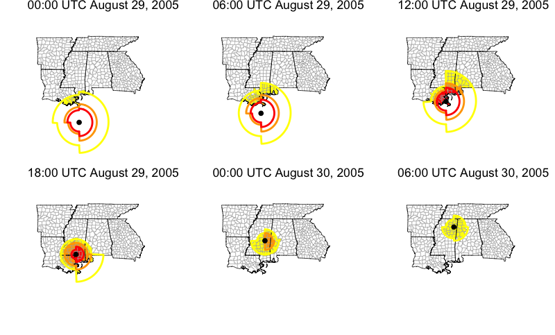
```

## Wind radii

These wind radii are developed through data integration and expert assessment
for each synoptic time of each storm. They are therefore storm-specific and 
capture any unusual characteristics of a specific storm. 

For the North Atlantic basin, they are available through the Extended Best
Tracks dataset. 

There are some disadvantages: 

- May not be available for every storm or in every basin
- Not available immediately
- Amount of data they're based on may vary by storm
- Only provide categories of wind speed, not exact values

## Comparison of wind data

```{r echo = FALSE, out.height = "0.95\\textheight", fig.align = "center"}
knitr::include_graphics("figures/windcomparison.pdf")
```

## Comparison of wind data

```{r echo = FALSE, out.height = "0.9\\textheight", fig.align = "center"}
knitr::include_graphics("figures/windexamples.pdf")
```

## Example

You can change to use the wind radii (instead of the modeled wind)
by using the "ext_tracks" option for the `wind_source` parameter
(available for storms 2004):

```{r fig.height = 4, out.height = "0.6\\textheight"}
map_counties(storm = "Katrina-2005", metric = "wind",
             wind_source = "ext_tracks")
```

## Other storm hazards

```{r echo = FALSE, out.width = "0.9\\textwidth", fig.align = "center"}
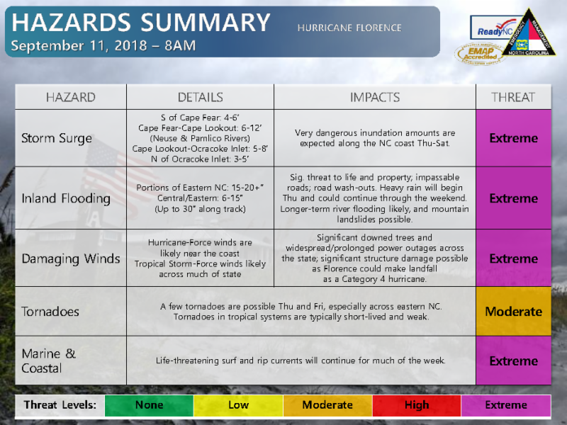
```

## Different patterns in hazards

```{r echo = FALSE, out.height = "0.7\\textheight", fig.align = "center"}
knitr::include_graphics("figures/ivanonly.pdf")
```

## Other storm hazards

For these hazards, you may need to join other datasets by date and location
with your study data. 

```{r echo = FALSE, out.width = "0.8\\textwidth", fig.align = "center"}
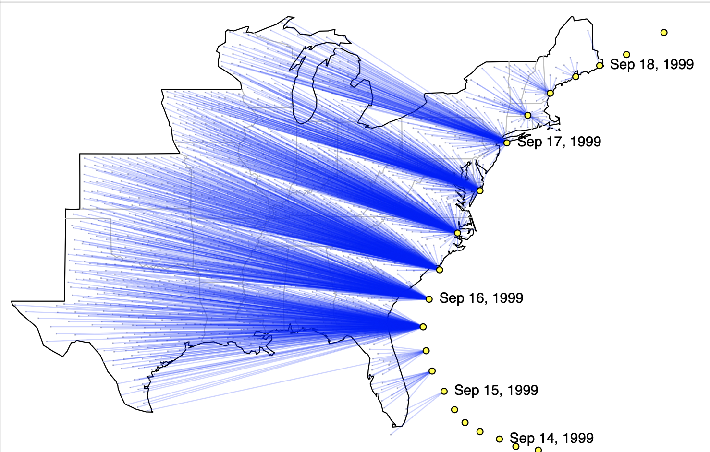
```

## Example

The `county_distance` function from `hurricaneexposure` allows you to determine
which of a county were within a certain distance of the storm's track and 
which date the storm was closest to that county:

\small

```{r}
county_distance(counties = "51700",
              start_year = 1995, end_year = 2005,
              dist_limit = 30) %>% 
  select(storm_id, fips, closest_date, storm_dist)
```

# Questions

