```{r setup, include=FALSE}
knitr::opts_chunk$set(echo = FALSE)
library(knitr)
library(tidyverse)
library(hurricaneexposuredata)
library(hurricaneexposure)
```

## Let's go all the way back to the beginning...

\vspace{-0.2cm}

```{r echo = FALSE, out.width = "0.35\\textwidth", fig.align = "center"}
knitr::include_graphics("figures/corn_pic.jpg")
```

\vspace{-1cm}
\footnotesize The Virginian Pilot

## Strawberry pie

```{r echo = FALSE, out.width = "0.7\\textwidth", fig.align = "center"}
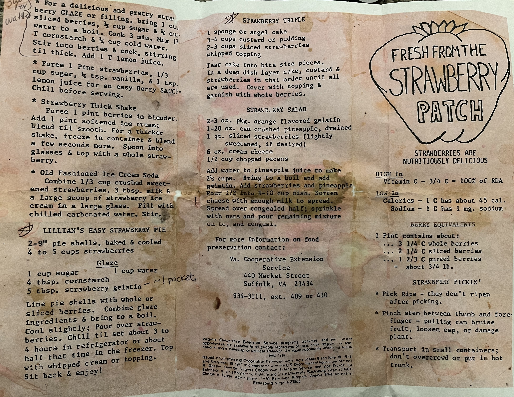
```

\footnotesize Source: Virginia Cooperative Extension Service

## Strawberry pie

```{r echo = FALSE, out.width = "0.9\\textwidth", fig.align = "center"}
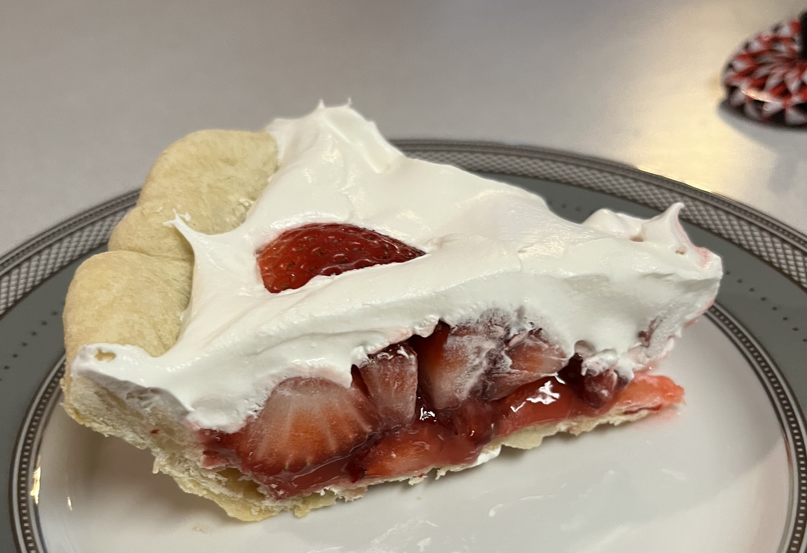
```

## Learning to grow cotton

```{r echo = FALSE, out.width = "0.9\\textwidth", fig.align = "center"}
knitr::include_graphics("figures/powell_farm.jpg")
```

## What we got from our local land grant

As a farm family, we got many useful things from Virginia Tech and its
extension service: 

- Evidence basis and demonstration of best practices
- Documents that provided guidance: "helpfiles"
- Recipes!
- Training to make the best, safest use of available tools

Overall, we got information and training that was **based on good science**, **free**, 
**practical**, and ready to **use right away**. 

# Open-source software

## R programming language

The R programming language is **free and open-source software**. 

```{r echo = FALSE, out.width = "\\textwidth", fig.align = "center"}
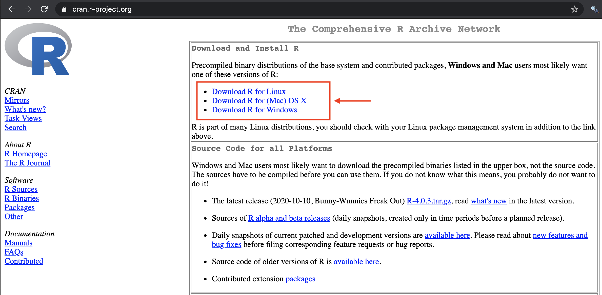
```

## R programming language

```{r echo = FALSE, out.width = "0.6\\textwidth", fig.align = "center"}
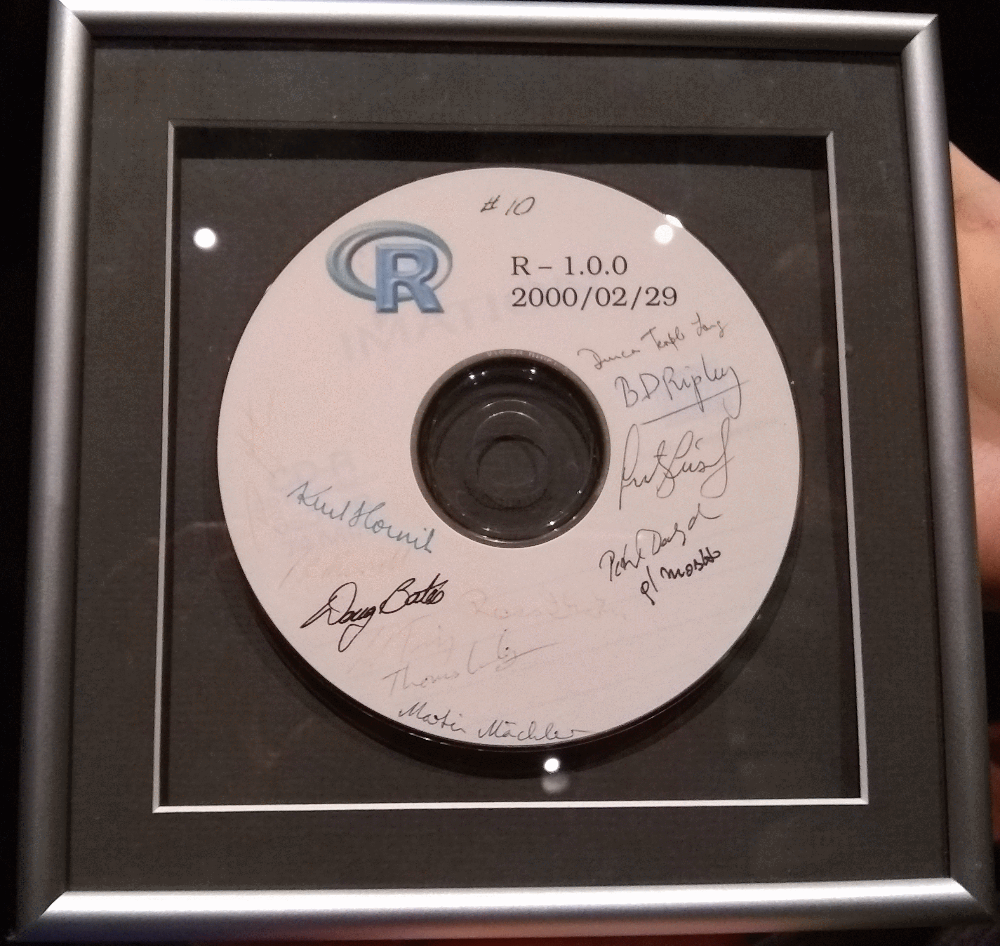
```

\vspace{-0.3cm}
\footnotesize Source: Douglas Bates

## Base R

When you initially install R, you are getting **base R**, which is a fairly 
basic set of tools for working with data. 

```{r echo = FALSE, out.width = "0.65\\textwidth", fig.align = "center"}
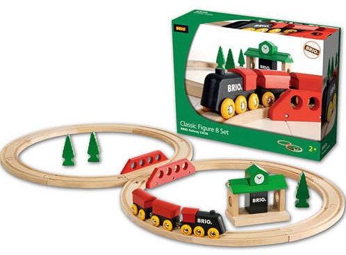
```

\vspace{-1cm}
\footnotesize Source: Brio

## R Package Ecosystem

**Packages** extend base R to do all kinds of different things, and they can
be created and shared by anyone. 

```{r echo = FALSE, out.width = "\\textwidth"}
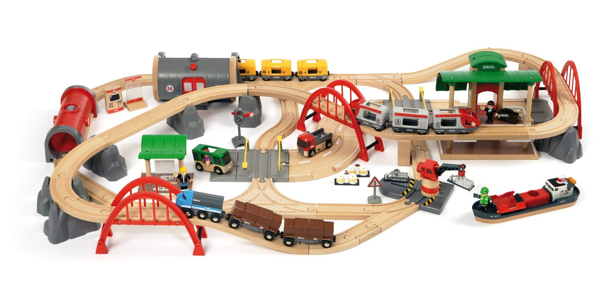
```

\vspace{-1cm}
\footnotesize Source: Brio

## R Package Ecosystem

There are over 20,000 packages on the primary repository alone. 

```{r echo = FALSE, out.width = "0.8\\textwidth", fig.align = "center"}
knitr::include_graphics("figures/use_r_aust_hexbins_closeup.jpg")
```

\footnotesize Mitchell O'Hara-Wild: https://www.mitchelloharawild.com/blog/user-2018-feature-wall/

## What's in an R package?

Process: 

$$
\mbox{Temperature (F)} = \frac{9}{5} \mbox{Temperature (C)} + 32
$$

Example R function:

```{r echo = FALSE, out.width = "\\textwidth", fig.align = "center"}
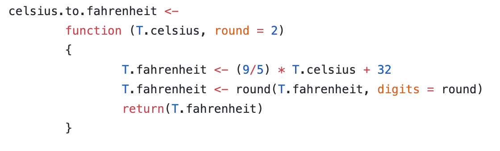
```

## What's in an R Package?

Example help file:

```{r echo = FALSE, out.width = "\\textwidth", fig.align = "center"}
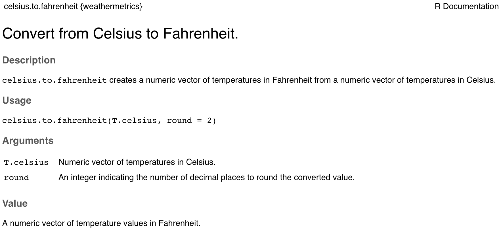
```

<!-- ## Software vignettes -->

<!-- \begin{block}{Documenting R Software} -->
<!-- R packages can include \textbf{vignettes}, which provide tutorials or documentation for users. These vignettes can be written in RMarkdown, which allows a mix of executable R code and text, figures, tables, etc. -->
<!-- \end{block} -->

## What's in an R Package?

```{r echo = FALSE, out.width = "\\textwidth", fig.align = "center"}
knitr::include_graphics("figures/weathermetrics_package.png")
```

<!-- ## R package repositories -->

<!-- \begin{block}{Sharing R packages} -->
<!-- R packages can be shared with others through:  -->
<!-- \begin{itemize} -->
<!--   \item By sharing a \texttt{.tar.gz} file -->
<!--   \item Through the Comprehensive R Archive Network (CRAN) -->
<!--   \item Through GitHub (packages can be installed from GitHub with the \texttt{install\_github} function from the \texttt{devtools} package) -->
<!--   \item Through a \texttt{drat} repository, hosted locally or through GitHub pages -->
<!-- \end{itemize} -->
<!-- \end{block} -->

# Create

## Reporting cause of death

```{r echo = FALSE, out.width="\\textwidth", fig.align = "center"}
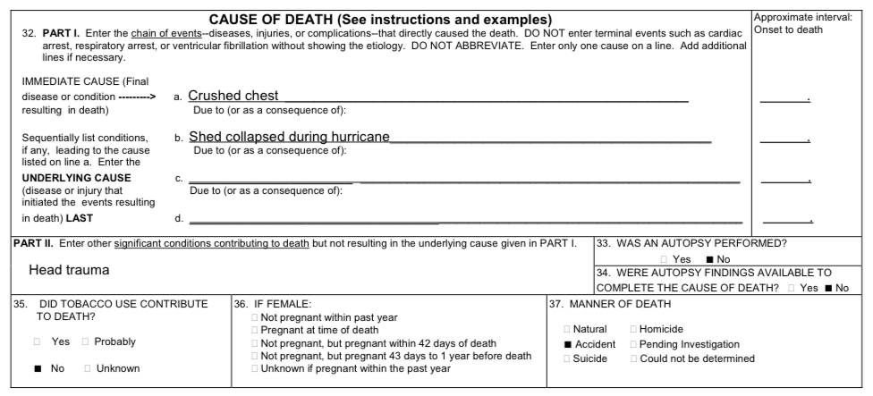
```

\vspace{-0.3cm}

\footnotesize

Source: https://www.cdc.gov/nchs/data/dvs/hurricane_certification.pdf

## Reporting cause of death

```{r echo = FALSE, out.width="\\textwidth", fig.align = "center"}
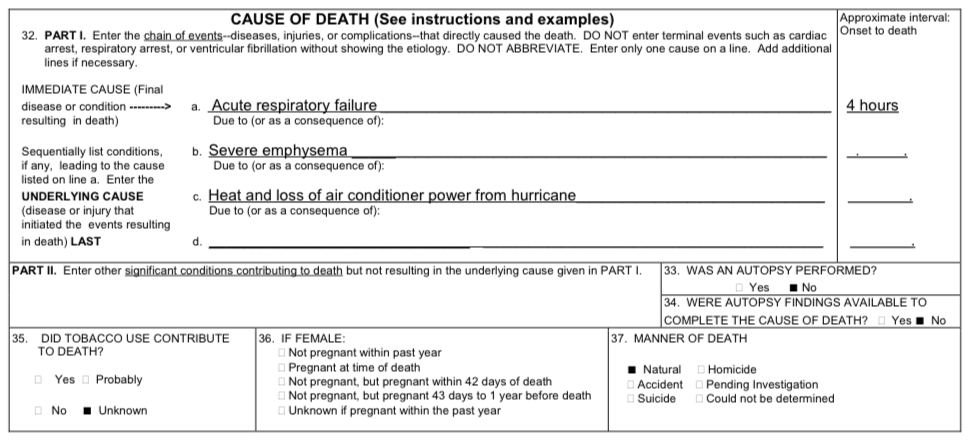
```

\vspace{-0.3cm}

\footnotesize

Source: https://www.cdc.gov/nchs/data/dvs/hurricane_certification.pdf

<!-- ## Hurricane Maria example -->

<!-- ```{r echo = FALSE, out.width="0.9\\textwidth", fig.align = "center"} -->
<!-- 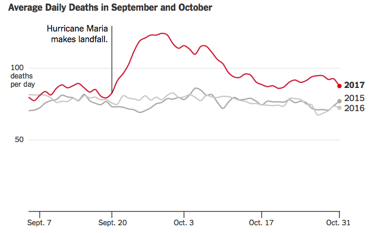 -->
<!-- ``` -->

<!-- \vspace{-0.2cm} -->

<!-- \footnotesize -->

<!-- Source: The New York Times -->

## Hurricane Maria example

```{r echo = FALSE, out.width="0.9\\textwidth", fig.align = "center"}
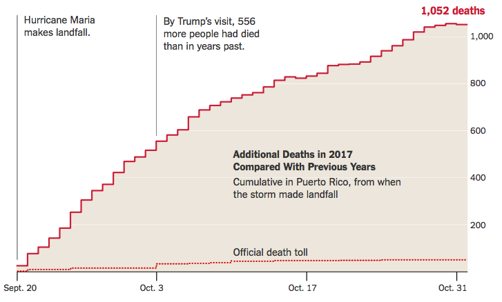
```

\vspace{-0.2cm}

\footnotesize

Source: The New York Times

<!-- ## Health risks associated with Hurricane Sandy (2012) -->

<!-- \begin{columns} -->

<!-- \begin{column}{0.45\textwidth} -->
<!-- ```{r echo = FALSE, fig.align = "center", out.width = "\\textwidth"} -->
<!-- 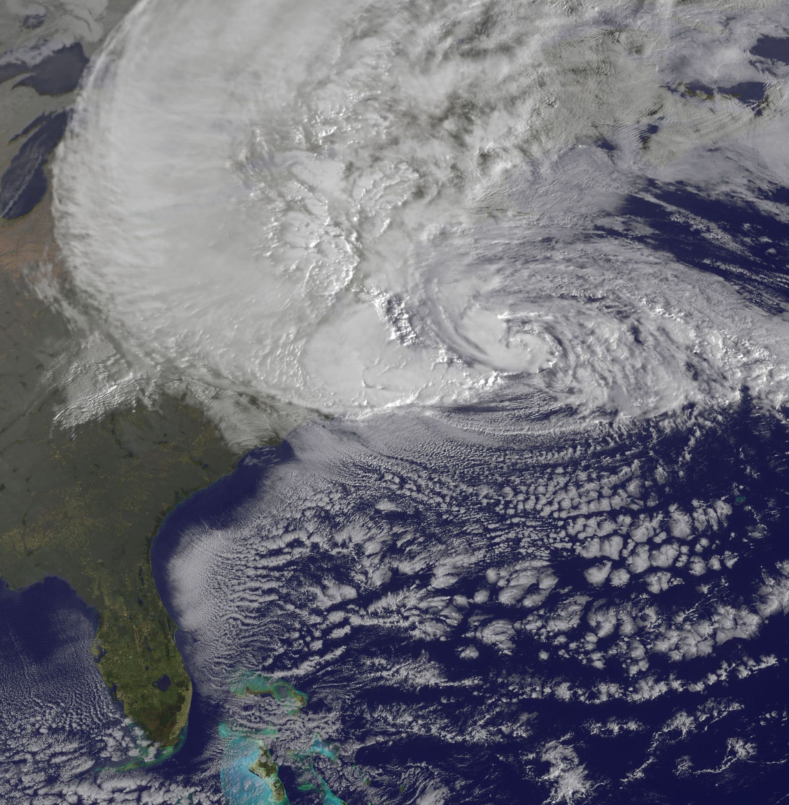 -->
<!-- ``` -->
<!-- \vspace{-0.5cm} -->
<!-- \begin{center} -->
<!-- \scriptsize Source: NOAA / NASA GOES Project -->
<!-- \end{center} -->
<!-- \end{column} -->

<!-- \begin{column}{0.55\textwidth} -->
<!-- \small -->
<!-- \begin{block}{Health risks in storm-affected areas} -->
<!-- \begin{itemize} -->
<!--   \item Change in patterns of emergency department visits (Kim et al. 2016) -->
<!--   \item Increased outpatient cases of food and waterborne disease among elderly (Bloom et al. 2016) -->
<!--   \item Increased rate of myocardial infarctions (Swerdel et al. 2014) -->
<!--   \item Increased hospitalizations for dehydration (Lee et al. 2016) -->
<!--   \item Difficulty obtaining medical care, medications, and medical equipment (Davidow et al. 2016) -->
<!-- \end{itemize} -->
<!-- \end{block} -->
<!-- \end{column} -->

<!-- \end{columns} -->

## Assessing exposure

\begin{block}{Challenge for epidemiological research}
How can we determine whether a county was exposed to a tropical storm, in a 
way that is consistent over many storms in many places over many years?
\end{block}

Previous approaches have varied but include: 

- Distance from storm track
- Storm winds above a threshold
- Evacuation orders
- FEMA reports
- Combined metric (property damage, power outages, gas shortages, etc.) 

<!-- ## Assessing exposure -->

<!-- \begin{columns} -->
<!-- \begin{column}{0.7\textwidth} -->
<!-- ```{r echo = FALSE, fig.align = "center", out.width = "\\textwidth"} -->
<!-- 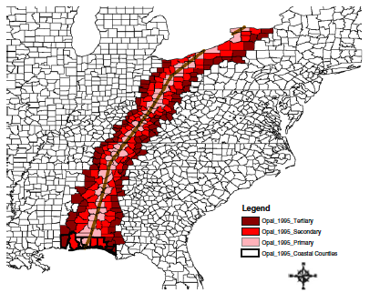 -->
<!-- ``` -->
<!-- \vspace{-0.5cm} -->
<!-- \begin{center} -->
<!-- \footnotesize Czajkowski et al. 2011 -->
<!-- \end{center} -->
<!-- \end{column} -->
<!-- \begin{column}{0.3\textwidth} -->
<!-- \small -->
<!-- \begin{block}{Example exposure assessment} -->
<!-- Czajkowski et al. (2011) classified counties based on distance to storm tracks to study mortality risks. -->
<!-- \end{block} -->
<!-- \end{column} -->
<!-- \end{columns} -->

## Hazard-specific metrics

\begin{columns}
\begin{column}{0.5\textwidth}
\begin{block}{Tropical storm hazard metrics}
   \begin{itemize}
    \item Distance from the storm
    \item High winds
    \item Rainfall
    \item Flood events
    \item Tornado events
   \end{itemize}
\end{block}
\end{column}
\begin{column}{0.5\textwidth}  
    \vspace{-0.25cm}
    \begin{center}
     \includegraphics[width=0.8\textwidth]{figures/storm_hazards.png}
     \end{center}
     \vspace{-0.1cm}
     \scriptsize{Image sources: Los Angeles Times, NBC}
\end{column}
\end{columns}

<!-- ## Synoptic meteorology -->

<!-- https://www.weather.gov/dvn/armistice_day_blizzard -->
<!-- The blizzard that struck the Midwest in November 1940 was the type of snow storm that engenders legends. Fall was extremely mild and across the Upper Midwest temperatures were well above normal on the morning of November 11th. So warm that at 7:30 in the morning the temperature at Chicago was 55 degrees Fahrenheit, and at Davenport Iowa the temperature was 54. Armistice Day 1940 was a perfect opportunity for many individuals to enjoy the mild respite before winter. Little did they know the most infamous duck hunt in American history was about to unfold.  When the storm exited the region over a foot of snow had fallen, and more than 150 people and thousands of livestock were dead. -->

<!-- Until 1934 the Weather Bureau offices operated 12-15 hours a day with two basic observations taken at 8 a.m. and 8 p.m. The observations were transmitted via telegraph. There were no satellite images and few upper air observations. -->

<!-- Armistice Day Blizzard of 1940 -->

<!-- ```{r fig.align = "center", out.width = "0.8\\textwidth"} -->
<!-- 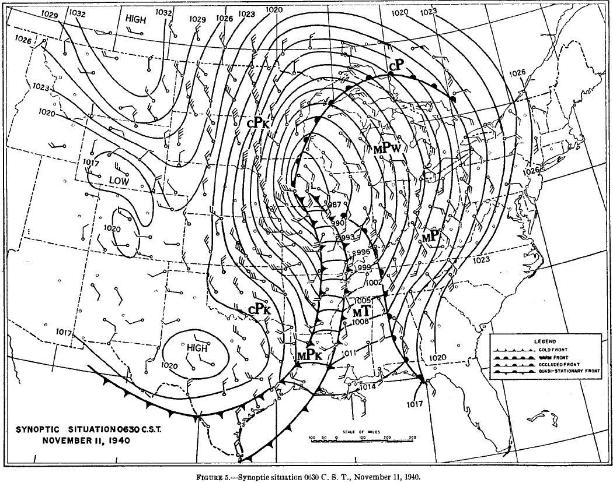 -->
<!-- ``` -->

<!-- \footnotesize Source: US National Weather Service -->

<!-- ## Meteorology by telegraph -->

<!-- Creating synoptic charts in Bergen, Norway, November 1919. -->

<!-- ```{r fig.align = "center", out.width = "\\textwidth"} -->
<!-- 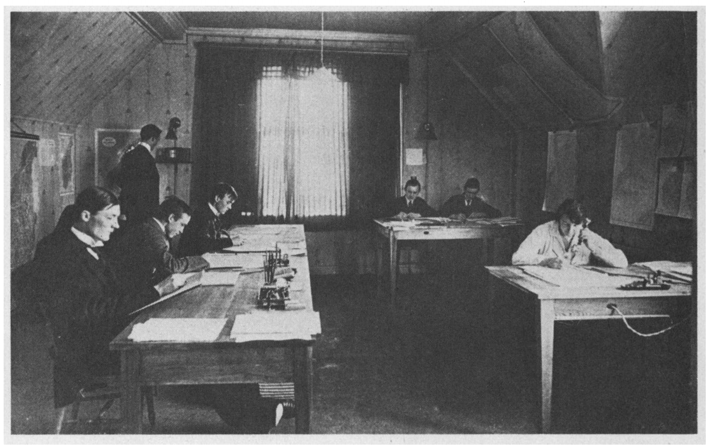 -->
<!-- ``` -->

<!-- \footnotesize Source: Jewell, 1981 -->

<!-- ## Meteorology by telegraph -->

<!-- ```{r fig.align = "center", out.width = "0.6\\textwidth"} -->
<!-- 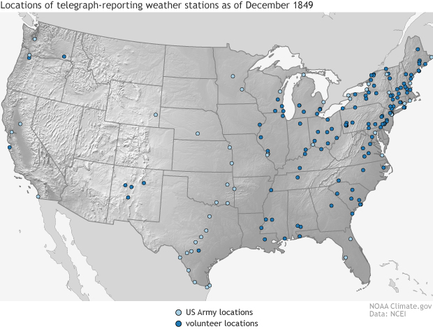 -->
<!-- ``` -->

<!-- <!-- \footnotesize Source: NOAA Climate.gov --> -->

<!-- \small -->
<!-- > "To provide a picture of weather conditions across the country, the observers -->
<!-- made their reports as nearly simultaneous as possible." -->
<!-- \flushright --\textit{Getting the Message Through}, R.B. Raines -->

## Extensive weather data are available

Weather balloons are launched every day around the world **at the same time** 
(midnight and noon Zulu time).

<!-- Today, NWS launches weather balloons twice daily from 92 stations across the U.S. to observe the upper atmosphere and provide valuable data for weather forecasting. -->

<!-- Across the entire planet twice a day at midnight and noon Zulu time ( Greenwich, England), weather balloons with radiosondes attached under them are launched to sample the global atmosphere. -->

```{r fig.align = "center", out.width = "0.8\\textwidth"}
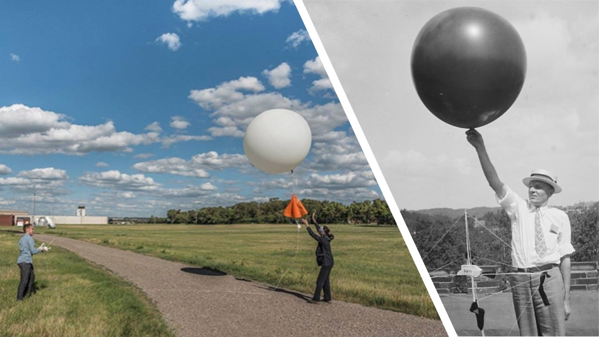
```

\footnotesize Source: NOAA

<!-- ## Storm track data -->

<!-- As we track a storm, we gather these data points at  -->
<!-- regular times of 00:00, 06:00, 12:00,  -->
<!-- and 18:00 UTC (Coordinated Universal Time).  -->

<!-- ```{r echo = FALSE, out.width = "0.9\\textwidth", fig.align = "center"} -->
<!-- knitr::include_graphics("figures/2019_accumulated_tracks.png") -->
<!-- ``` -->

<!-- ## Standards for human impact data integration -->

<!-- For human impacts data, what are common scales of the data in **time** and  -->
<!-- **space**? \medspace -->

<!-- 1. Human impacts data are often aggregated by **geopolitical boundaries**. -->
<!-- 2. Often, human impacts data has a time scale that requires **aggregation** -->
<!-- of exposure time series. -->

<!-- ## Aligning data  -->

<!-- Human impacts data are often aggregated by **geopolitical boundaries**. -->

<!-- ```{r fig.align = "center", out.width = "0.8\\textwidth", fig.align = "center"} -->
<!-- 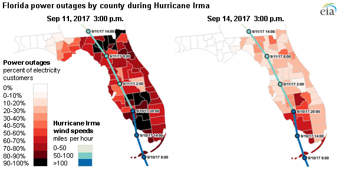 -->
<!-- ``` -->

<!-- \footnotesize -->
<!-- Source: US Energy Information Administration -->

<!-- ## Aligning data  -->

<!-- National Weather Service regions and locations of Florida Climate Center monitors within Florida. -->

<!-- ```{r fig.align = "center", out.width = "0.45\\textwidth", align = "center"} -->
<!-- 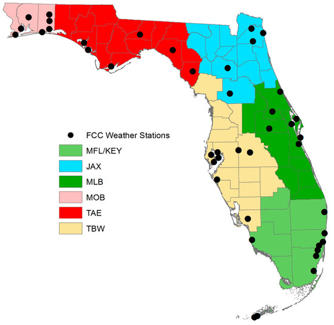 -->
<!-- ``` -->

<!-- \footnotesize -->
<!-- Source: Learry et al., 2017 -->

<!-- ## Aligning data   -->

<!-- <!-- spatial misalignment, change of support, modifiable areal unit problem --> -->

<!-- North American Land Data Assimilation System (NLDAS) 12-km grid of -->
<!-- maximum temperature (C) in New York State for July 21, 2010. -->

<!-- ```{r fig.align = "center", out.width = "0.5\\textwidth", fig.align = "center"} -->
<!-- 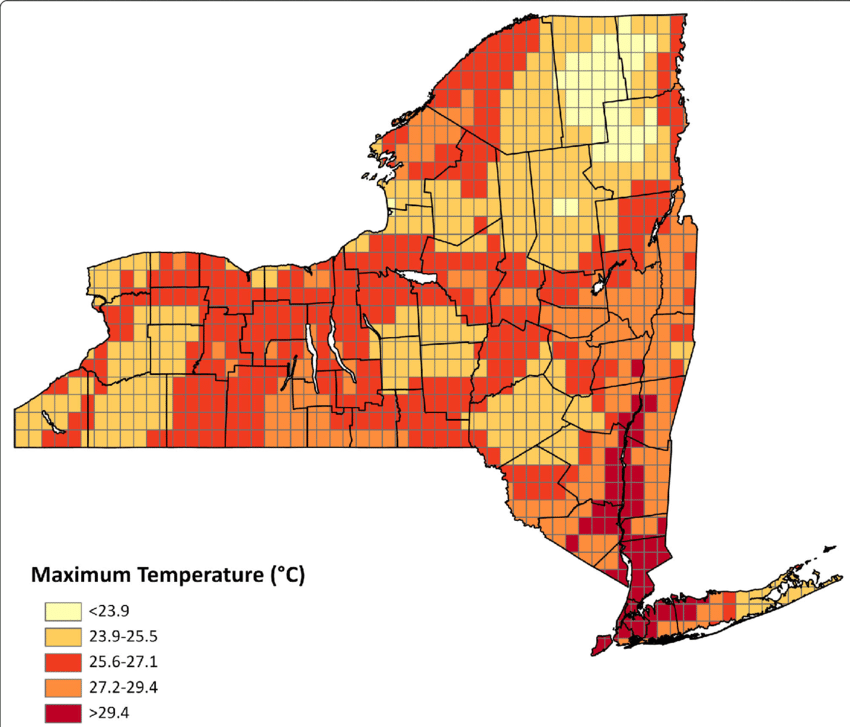 -->
<!-- ``` -->

<!-- \footnotesize Source: Adeyeye et al, 2019 -->

## County-level exposure assessment

We developed wind field model software to assess county-level exposure.

```{r fig.align = "center", out.width = "\\textwidth"}
include_graphics("figures/exposure_assessment.pdf")
```

\footnotesize Adapted from Yan et al., *Epidemiology*, 2021.

<!-- ## County-level exposure assessment -->

<!-- Identifying date of storm's closest approach to each county. -->

<!-- ```{r echo = FALSE, out.width = "0.9\\textwidth", fig.align = "center"} -->
<!-- 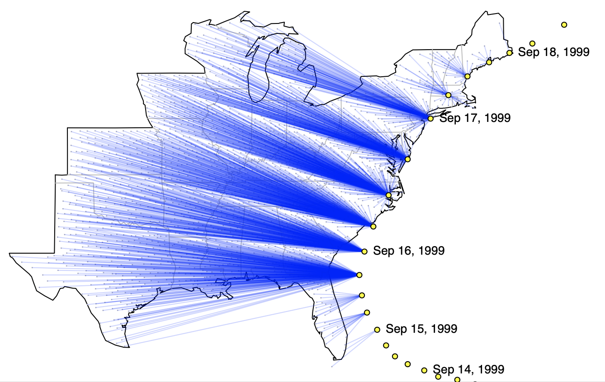 -->
<!-- ``` -->

<!-- ## Aggregating exposure time series -->

<!-- Local storm-associated winds at the population mean center of Dare County, NC,  -->
<!-- at 15-minute intervals throughout the tracking period of Hurricane Floyd, 1999. -->

<!-- ```{r fig.align = "center", out.width = "\\textwidth"} -->
<!-- 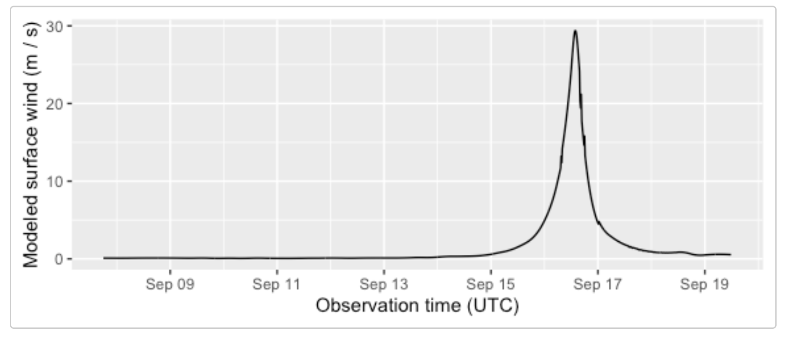 -->
<!-- ``` -->

<!-- Possible summaries: Peak winds; Duration of winds over 20 m/s. -->

## Aggregating exposure time series

<!-- Precipitation during Hurricane Floyd, 1999, for three day windows surrounding -->
<!-- the storm's closest approach to each county. -->

```{r fig.align = "center", out.width = "\\textwidth"}
include_graphics("figures/rain_lags.pdf")
```

\footnotesize From Yan et al., *Epidemiology*, 2021.

<!-- ## Rain exposure -->

<!-- \begin{columns} -->
<!-- \begin{column}{0.7\textwidth}   -->
<!--     \vspace{-0.25cm} -->
<!--     \begin{center} -->
<!--     Rain during Tropical Storm Lee -->
<!--     \end{center} -->
<!--     \begin{center} -->
<!--      \includegraphics[width=\textwidth]{figures/nldas2_ts_lee.png} -->
<!--      \end{center} -->
<!--      \begin{center} -->
<!--          \vspace{-0.4cm} -->
<!--      \scriptsize{Image source: Goddard Earth Sciences DISC} -->
<!--      \end{center} -->
<!-- \end{column} -->
<!-- \begin{column}{0.3\textwidth} -->
<!-- \footnotesize -->
<!-- \begin{block}{Rain metric} -->
<!-- We used NLDAS-2 precipitation data to assess county rainfall. We summed rain from two days before to one day after the storm. We include a distance threshold for the rain metric. -->
<!-- \end{block} -->
<!-- \end{column} -->
<!-- \end{columns} -->

<!-- ## Flood and tornado events -->

<!-- ```{r echo = FALSE, out.width = "\\textwidth"} -->
<!-- 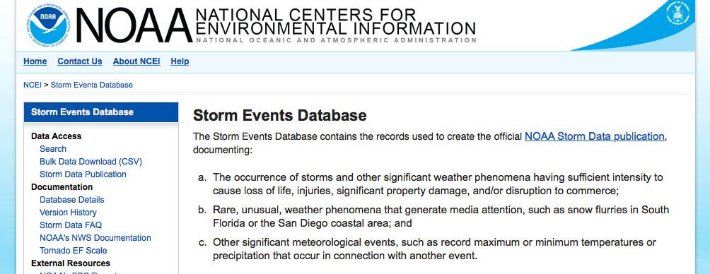 -->
<!-- ``` -->

<!-- Website: https://www.ncdc.noaa.gov/stormevents/ -->


## `hurricaneexposure` package

\footnotesize
\begin{block}{`hurricaneexposure` package}
\medskip
Create county-level exposure time series for tropical storms in U.S. counties. Exposure can be determined based on several hazards (e.g., wind, rain, tornadoes), with user-specified thresholds. 
\end{block}

\bigskip

```{r echo = TRUE, eval = FALSE}
county_wind(counties = c("22071", "51700"), wind_limit = 21, 
            start_year = 1995, end_year = 2005)
```

```{r echo = FALSE}
county_wind(counties = c("22071", "51700"), wind_limit = 21, 
            start_year = 1995, end_year = 2005) %>%
  slice(1:4) %>%
  select(storm_id, fips, closest_date, vmax_sust)
```

## Rain exposure

```{r frances_rain_example, echo = FALSE, fig.width = 6, fig.height = 4, fig.align = "center", out.width = "0.9\\textwidth", warning = FALSE, message = FALSE}
storm <- "Frances-2004"
map_tracks(storms = storm, plot_points = FALSE, 
                plot_object = map_counties(storm = storm, 
                                           metric = "rainfall")) + 
        ggtitle("Rainfall during Frances, 2004")
```


<!-- ## Differences in exposures by hazard -->

<!-- The counties assessed as "exposed" to tropical cyclones can differ substantially based on the hazard metrics considered in assessing exposure.  -->

<!-- ```{r echo = FALSE, fig.width = 8, out.width = "\\textwidth", fig.align = "center"} -->
<!-- storm <- "Ivan-2004" -->
<!-- a <- map_tracks(storms = storm, plot_points = FALSE,  -->
<!--                 plot_object = map_rain_exposure(storm = storm, -->
<!--                                                 rain_limit = 50, dist_limit = 500)) +  -->
<!--         ggtitle("Rain exposures during Ivan, 2004") -->
<!-- b <- map_tracks(storms = storm, plot_points = FALSE,  -->
<!--                 plot_object = map_wind_exposure(storm = storm, -->
<!--                                                 wind_limit = 12)) +  -->
<!--         ggtitle("Wind exposures during Ivan, 2004") -->
<!-- gridExtra::grid.arrange(a, b, ncol = 2) -->
<!-- ``` -->

<!-- \footnotesize Exposures for Hurricane Ivan based on rain measurements (left) and modeled maximum sustained winds (right). -->


<!-- ## Assessing exposure to multiple hazards -->

<!-- Storm hits per county per decade based on rain (left) and wind (right) exposure metrics. -->

<!-- ```{r echo = FALSE, out.width="\\textwidth"} -->
<!-- 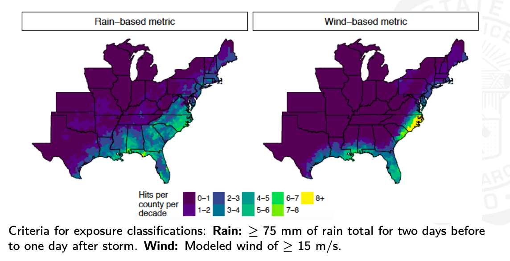 -->
<!-- ``` -->

## Project software

\footnotesize
\begin{block}{`stormwindmodel`}
Model storm winds from Best Tracks data at U.S. locations. Includes modeling sustained and gust winds, as well as duration of sustained and gust winds above a specified threshold. 
\end{block}

\footnotesize
\begin{block}{`noaastormevents`}
Download and explore listings from the NOAA Storm Events database. Includes the ability to pull events based on a tropical storm, using events listed close in time and distance to the storm's tracks. 
\end{block}

\footnotesize
\begin{block}{`countytimezones`}
Convert time-stamps from UTC to local time zones for U.S. counties based on county FIPs. Facilitates merging weather observations with locally measured data, including health outcomes.
\end{block}

\footnotesize
\begin{block}{`weathermetrics`}
Functions to convert between weather metrics, including conversions for metrics of temperature, air moisture, wind speed, and precipitation. This package also includes functions to calculate the heat index.
\end{block}

## Immunology

```{r echo = FALSE, out.width="\\textwidth", fig.align = "center"}
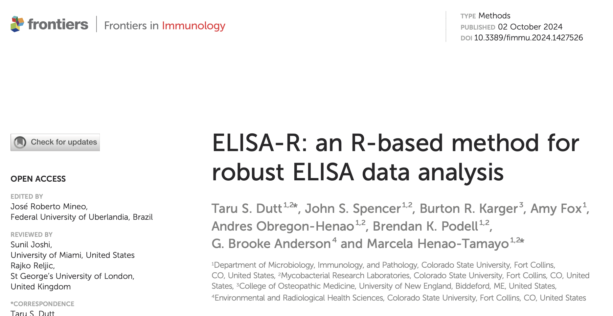
```

## Immunology

```{r echo = FALSE, out.width="\\textwidth", fig.align = "center"}
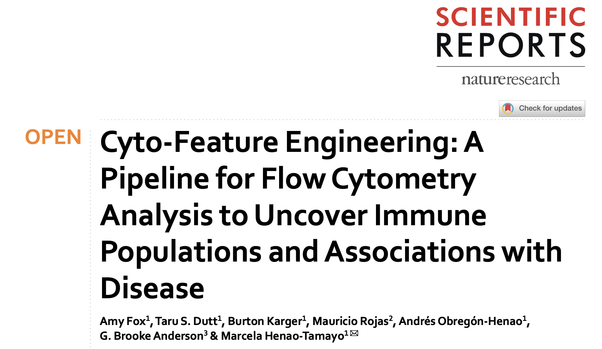
```

## Immunology

```{r echo = FALSE, out.width="\\textwidth", fig.align = "center"}
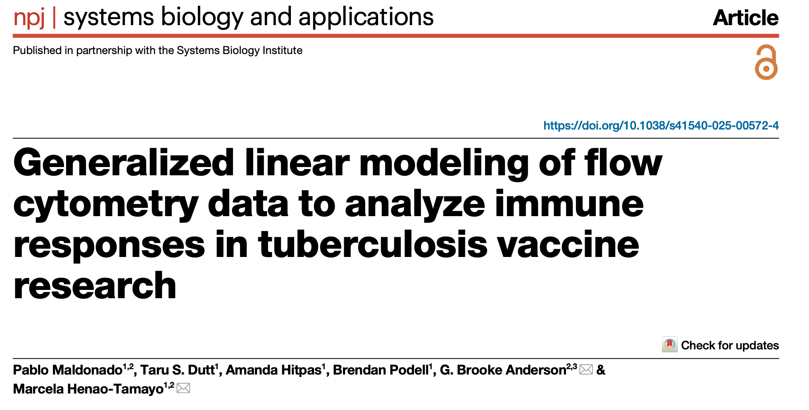
```

# Share

## Open data / reproducible research

```{r echo = FALSE, out.width = "0.8\\textwidth", fig.align = "center"}
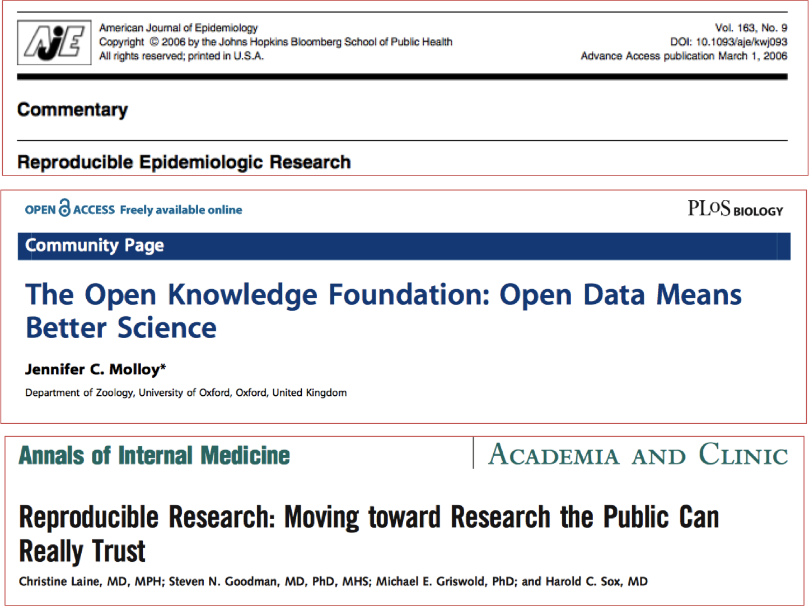
```

<!-- ## Peer-review options -->

<!-- \begin{block}{Peer-review for R software} -->
<!-- R packages do not undergo peer review for CRAN and most other repositories. However, there are a few avenues for partial or full peer review of packages: \begin{itemize} -->
<!--   \item \textit{ROpenSci}: Includes the option for community-contributed packages. These undergo peer review through GitHub. The full source code is reviewed and comments must be addressed before the package is added to the ROpenSci repository -->
<!--   \item \textit{The Journal of Open Source Software}: Very short articles, peer review of code -->
<!--   \item \textit{The R Journal}, \textit{Journal of Statistical Software}: Peer-review of articles, but may include some suggestsion for software  -->
<!-- \end{itemize} -->
<!-- \end{block} -->

## Sharing functions through an R package

```{r echo = FALSE, out.width="\\textwidth", fig.align = "center"}
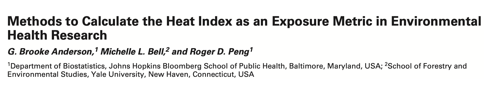
```

\footnotesize
\begin{block}{`weathermetrics`}
Functions to convert between weather metrics, including conversions for metrics of temperature, air moisture, wind speed, and precipitation. This package also includes functions to calculate the heat index.
\end{block}

## Sharing data through an R package

1. Data access is **scripted**---easy to reproduce and adapt later.
2. Dataset is **versioned**---the version of the data package changes
as the dataset is updated. The version number can be included as part
of Methods section of studies.
3. Data can be **easily integrated** with other tools available through R.
These include mapping and statistical tools.
4. Data creation is **documented and reproducible** on GitHub
starting from public data and software.

## Sharing data through an R package

```{r echo = FALSE, out.width="\\textwidth", fig.align = "center"}
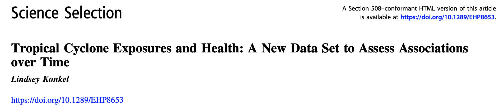
```

\bigskip

\begin{quotation}
There is the potential to take tropical cyclone epidemiology in a powerful 
new direction.---Marianthi-Anna Kioumourtzoglou, Columbia University
\end{quotation}

## Collaborative papers

```{r echo = FALSE, out.width="0.9\\textwidth", fig.align = "center"}
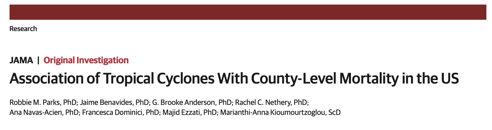
```

## Collaborative papers

```{r echo = FALSE, out.width="\\textwidth", fig.align = "center"}
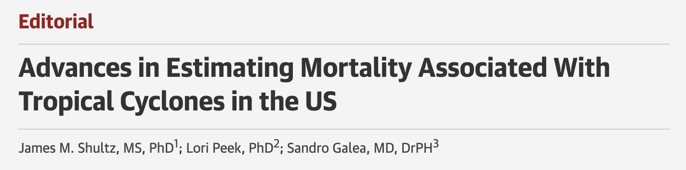
```

```{r echo = FALSE, out.width="0.9\\textwidth", fig.align = "center"}
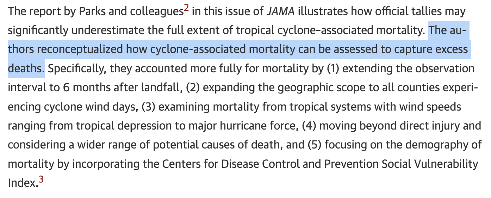
```


## Collaborative papers

```{r echo = FALSE, out.width="\\textwidth", fig.align = "center"}
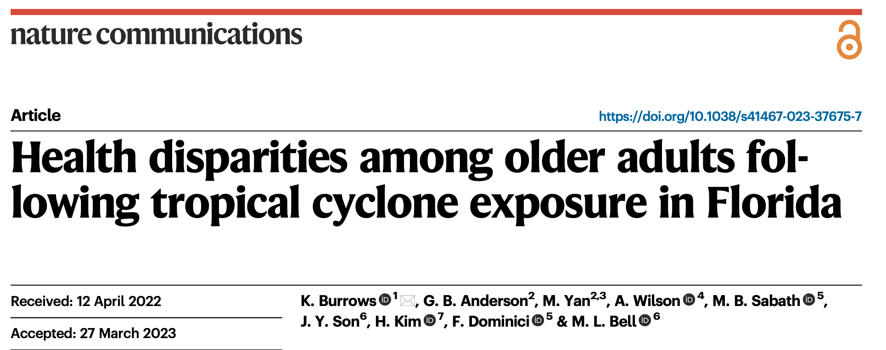
```

## Collaborative papers

```{r echo = FALSE, out.width="\\textwidth", fig.align = "center"}
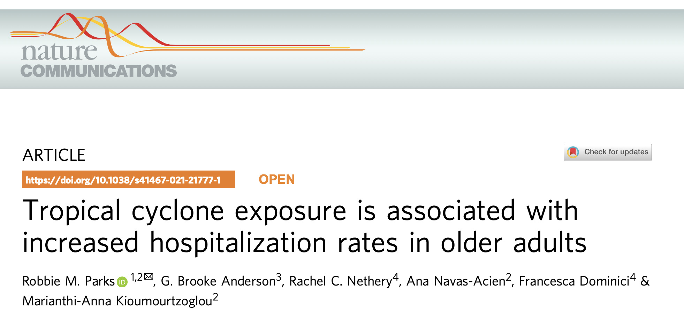
```

## Collaborative papers

```{r echo = FALSE, out.width="\\textwidth", fig.align = "center"}
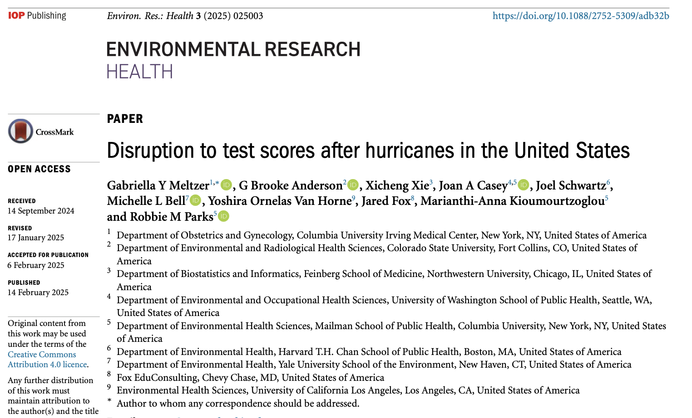
```

## Collaborative papers

```{r echo = FALSE, out.width="0.9\\textwidth", fig.align = "center"}
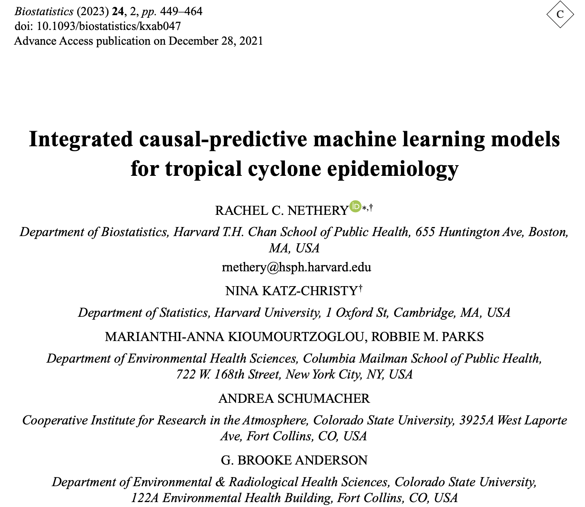
```

## Software in the wild

```{r echo = FALSE, out.width="0.9\\textwidth", fig.align = "center"}
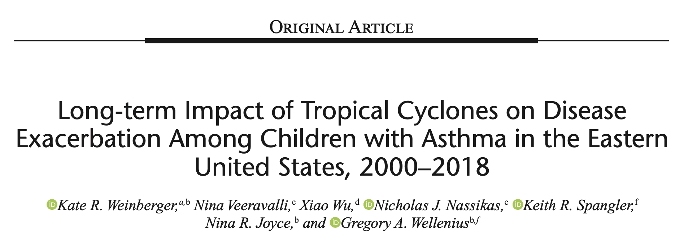
```

```{r echo = FALSE, out.width="0.65\\textwidth", fig.align = "center"}
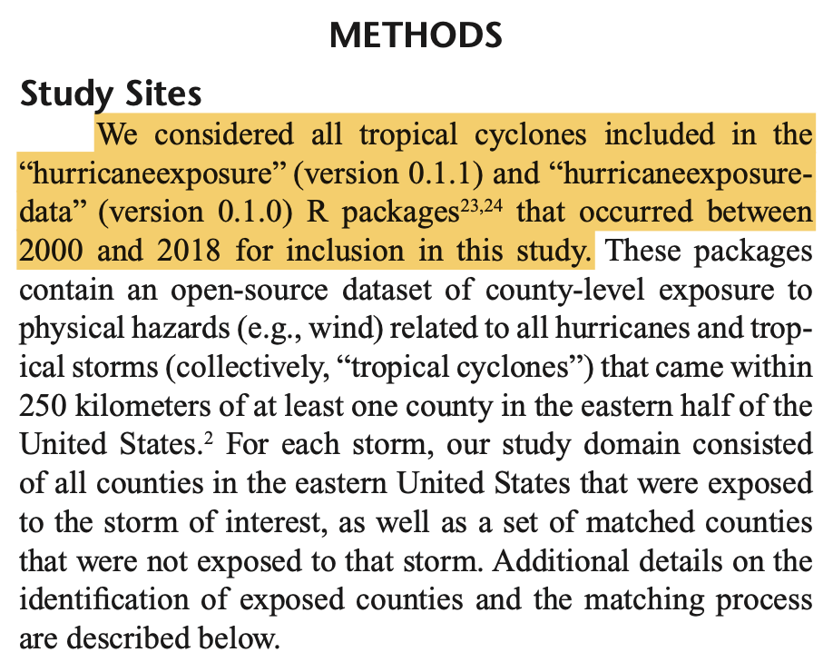
```

## Software in the wild

```{r echo = FALSE, out.width="0.9\\textwidth", fig.align = "center"}
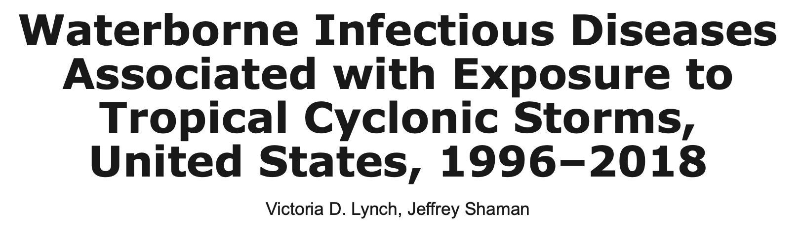
```

```{r echo = FALSE, out.width="0.75\\textwidth", fig.align = "center"}
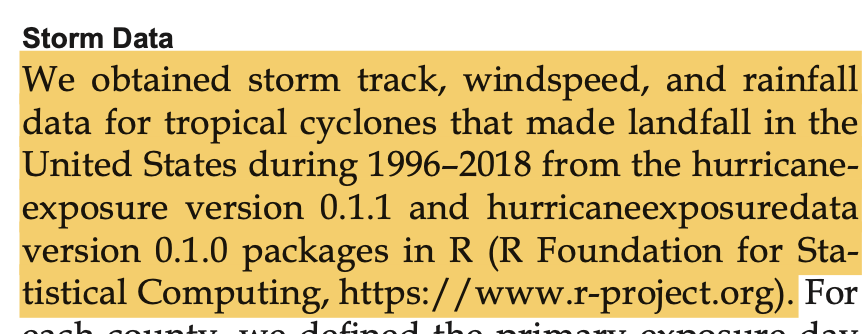
```

## Software in the wild

```{r echo = FALSE, out.width="0.9\\textwidth", fig.align = "center"}
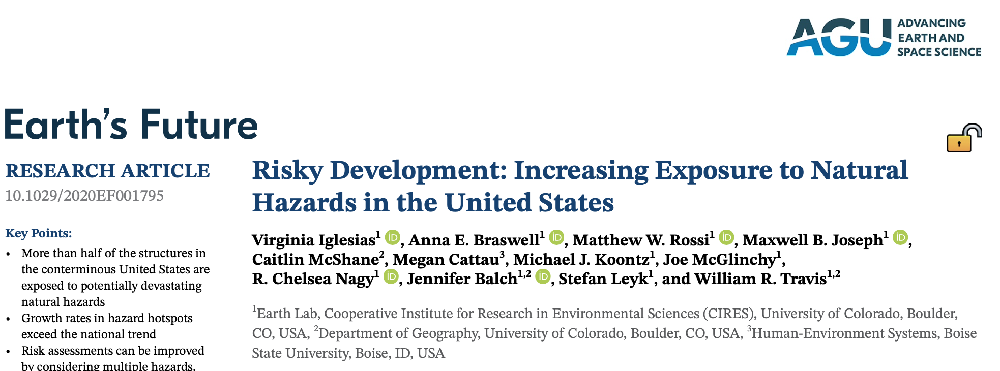
```

```{r echo = FALSE, out.width="0.9\\textwidth", fig.align = "center"}
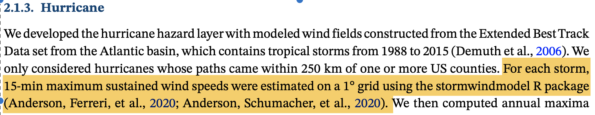
```

## Software in the wild

```{r echo = FALSE, out.width="0.9\\textwidth", fig.align = "center"}
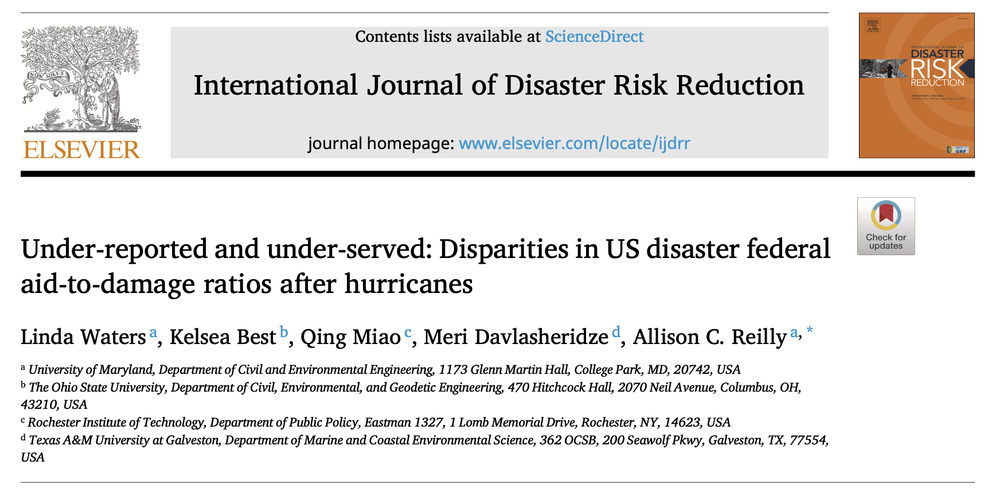
```

```{r echo = FALSE, out.width="0.9\\textwidth", fig.align = "center"}
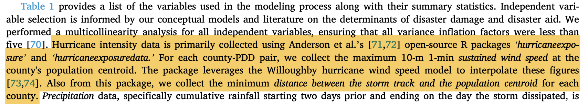
```

## User feedback

\footnotesize
\begin{block}{J. J. Nadeo, Department of Economics, Georgetown University}
\medskip
``To begin I'd like to thank you very much for your R package ‘stormwindmodel’. It has made a huge difference in my current research'' 
\end{block}

\footnotesize
\begin{block}{Rick Thomas, Managing Director, Beachgp.com, Zurich, Switzerland}
\medskip
``I have worked on the development of Catastrophe models of various sorts for the last 20+ years, and I think your ‘stormwindmodel’ package is an excellent resource for many modellers who would like to develop US wind models, e.g. using the OASIS loss model framework'' 
\end{block}

\footnotesize
\begin{block}{Donya Brown, Department of Economics, University of Leicester, England}
\medskip
``Thanks for your tremendous contribution, this package is excellent and has helped me so much!'' 
\end{block}

<!-- ## User feedback -->

<!-- ```{r echo = FALSE, out.width="\\textwidth", fig.align = "center"} -->
<!-- 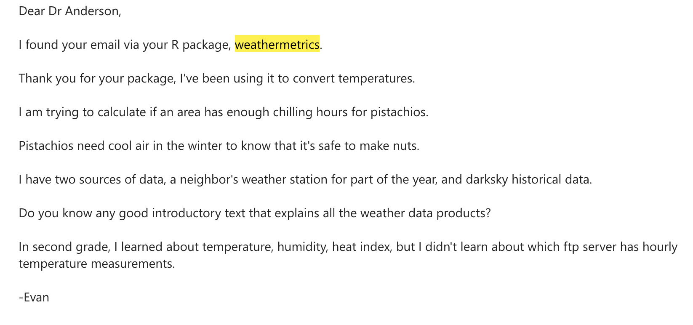 -->
<!-- ``` -->

# Teach

## ERHS 535---R Programming for Research

- "In-depth instruction on data collection, data management, programming, 
and visualization, using data examples relevant to academic research."
- Flipped classroom, in-person time focuses on applied group coding exercises
- Project-based, final group project develops a web-based interactive data
visualization

## ERHS 535---R Programming for Research

```{r echo = FALSE, out.width="\\textwidth", fig.align = "center"}
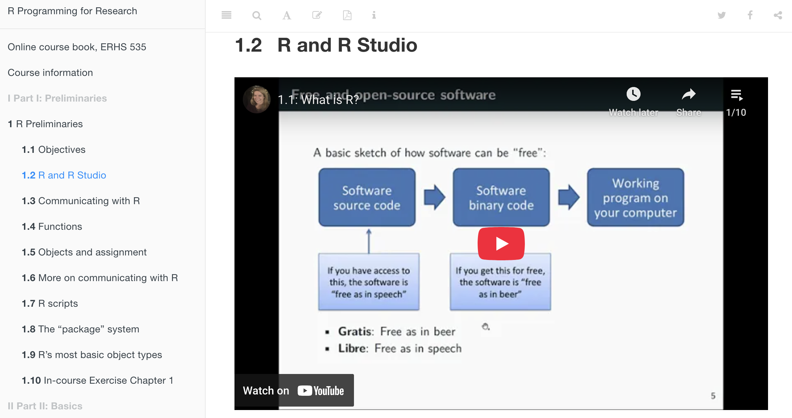
```

https://geanders.github.io/RProgrammingForResearch/

## ERHS 535---R Programming for Research

R Programming for Research (ERHS 535) has been taken by students pursuing 
degrees in: 

Environmental Health, Cellular \& Molecular Biology, 
Public Health, Microbiology, Clinical Sciences, Animal Sciences, 
Mechanical Engineering, Ecology, Radiological Health Sciences, 
Biochemistry, Food Science \& Nutrition, Pathology, 
Human Development \& Family Studies, Civil \& Environmental Engineering, 
Ecosystem Sustainability, Fish Wildlife and Conservation Biology, 
Forest Sciences, Soil \& Crop Sciences, Chemical Engineering, Horticulture, 
Data Analysis, Civil Engineering, Mathematics, and Chemistry

## ERHS 535---R Programming for Research

\footnotesize
\begin{block}{Nutrition Sciences}
\medskip
``Enrolling in this course turned out to be a \textbf{pivotal} moment in my academic journey'' 
\end{block}

\begin{block}{Ecology}
\medskip
``I found this to be one of the most \textbf{useful} classes I have taken at CSU'' 
\end{block}

\footnotesize
\begin{block}{Environmental Health}
\medskip
``Reflecting on your R Programming course (ERHS 535), I can confidently say it was one of the most \textbf{formative} classes I took during the early stages of my doctoral program.'' 
\end{block}

\begin{block}{Radiological Health Sciences}
\medskip
``It may have been my favorite [course] at CSU. It was definitely work-intensive, but so worth it. Your class has taught be a great deal, and I now \textbf{use R almost every day}.'' 
\end{block}

## Student feedback

\footnotesize
\begin{block}{Microbiology}
\medskip
``R-Programming for Research is a class that I consistently recommend to new graduate students… The class was \textbf{instrumental} in preparing me for my doctoral research.'' 
\end{block}

\begin{block}{Environmental Health}
\medskip
``Overall, your course was not just helpful; it has been \textbf{pivotal} in my doctoral training.'' 
\end{block}

\begin{block}{Cellular \& Molecular Biology}
\medskip
``EHRS 535 taught by Brooke Anderson was one of the most \textbf{important} courses I took during my PhD.'' 
\end{block}

\begin{block}{Environmental Health}
\medskip
``I would say that \textbf{I wouldn’t have my current job} without this class.'' 
\end{block}

## Student feedback

```{r echo = FALSE, out.width = "1.1\\textwidth"}
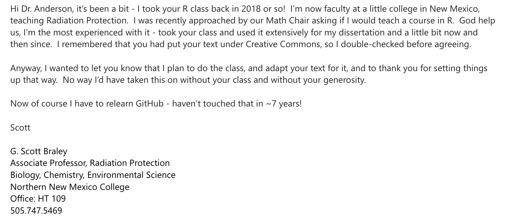
```

## Continuing education

```{r echo = FALSE, out.width = "\\textwidth"}
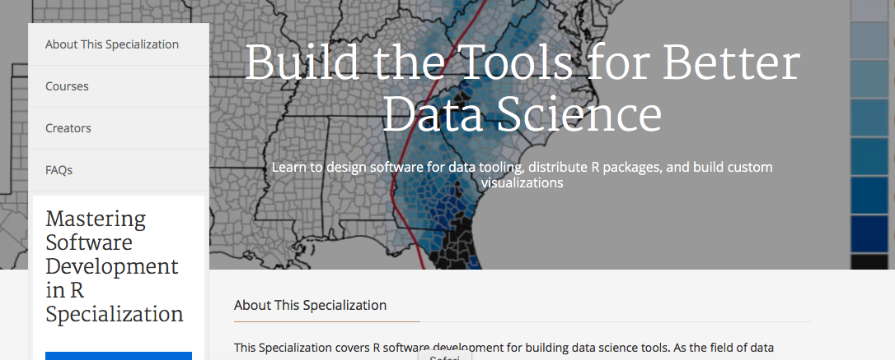
```

Courses: https://www.coursera.org/specializations/r

Course book: https://bookdown.org/rdpeng/RProgDA/

## Continuing education

```{r echo = FALSE, out.width="\\textwidth", fig.align = "center"}
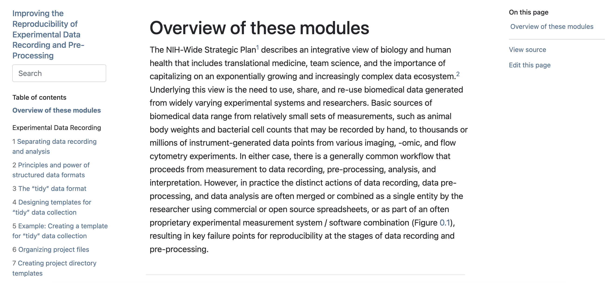
```

https://geanders.github.io/improve_repro/index.html

## Continuing education

```{r echo = FALSE, out.width="\\textwidth", fig.align = "center"}
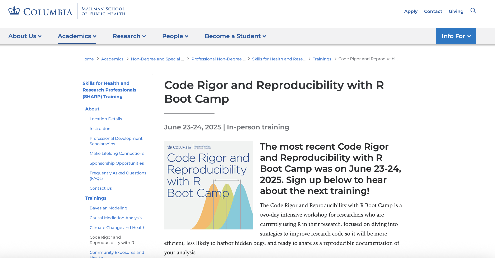
```

## Participant feedback

\small
- "I wish I had taken something like this years ago... This was probably the most **useful** workshop I've ever attended!"
- "This is the **best professional development I've ever participated in** and would recommend it to anyone using R for their work." 
- ``This is by far the most **useful** training I've taken since graduating with my MPH.'' 
- ``Truly the **best professional experience** I have had.'' 
- ``This was by far my favorite SHARP workshop! It was **incredibly helpful**, and I know I’ll be using the tools and concepts we covered every day. I’d recommend it to anyone.''

## `morrowplots` package

```{r echo = FALSE, out.width = "\\textwidth"}
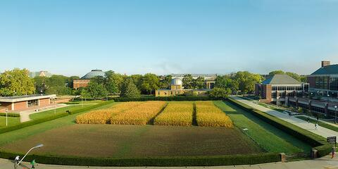
```

\footnotesize
Source: University of Illinois Urbana-Champaign

## Acknowledgements

Thank you to the students and postdocs who have contributed to developing 
software and pipelines: 

\begin{columns}
\begin{column}{0.5\textwidth}
\begin{itemize}
\item Alice Wells
\item Melea Barahona
\item Pablo Maldonado
\item Daniel Dean
\item Amy Fox
\item Meilin Yan
\item Rachel Severson
\item Jorge Rivera-Gonzalez
\item Rod Lammers
\item Taru Dutt
\end{itemize}
\end{column}
\begin{column}{0.5\textwidth}
\begin{itemize}
\item Nichole Monhait
\item Sarah Koehler
\item Jordan Robinson
\item Caroline Wendt
\item Joshua Ferreri
\item Therese Kondash
\item Zhiming Guo
\item Ziyu Chen
\item Colin Eason
\end{itemize}
\end{column}
\end{columns}


