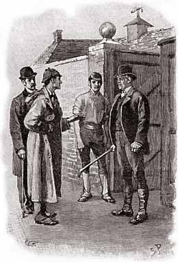
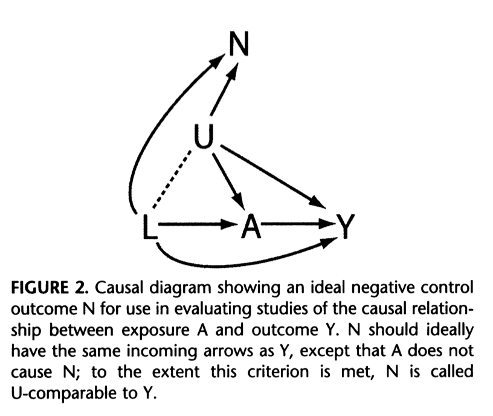
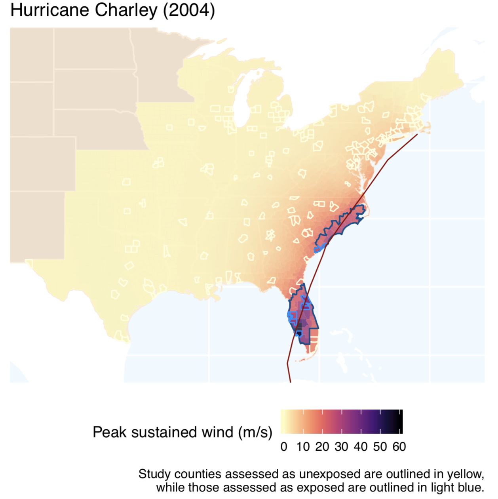
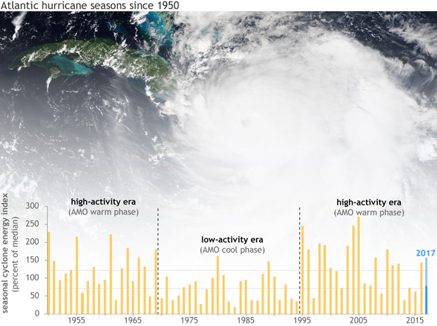
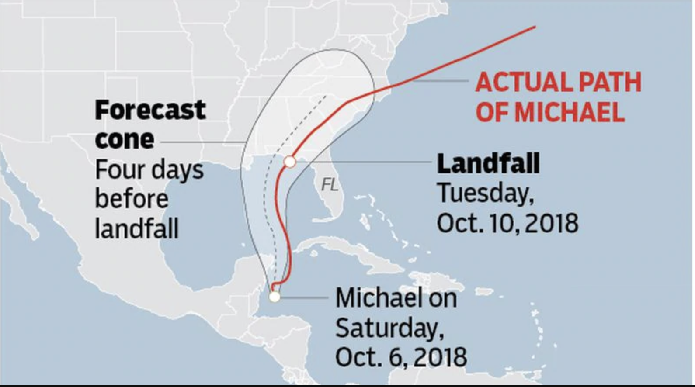
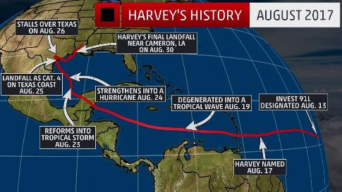
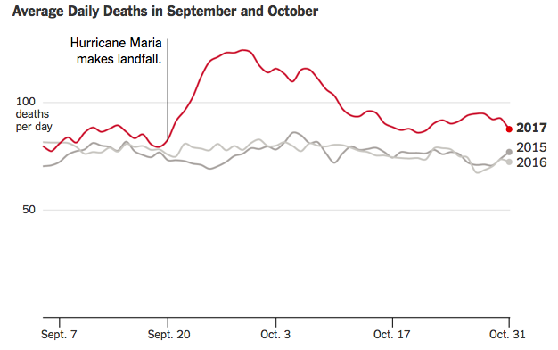
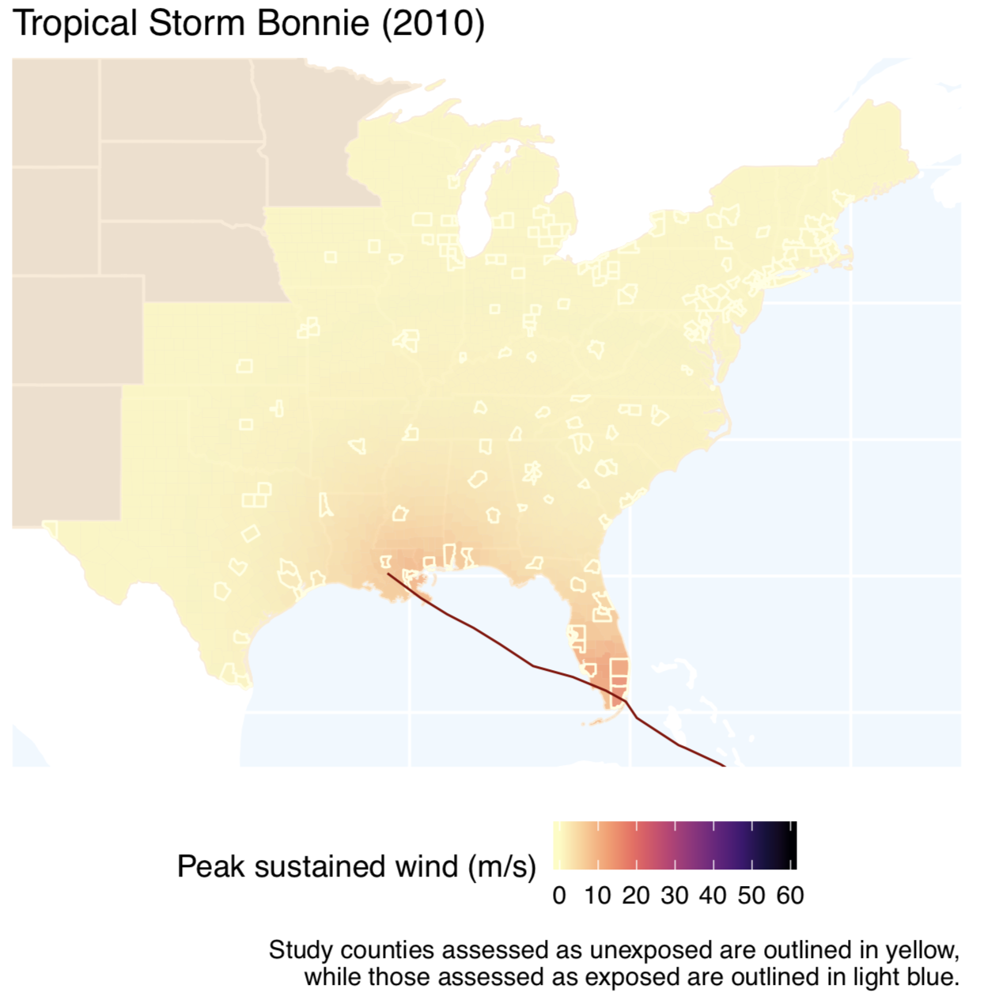
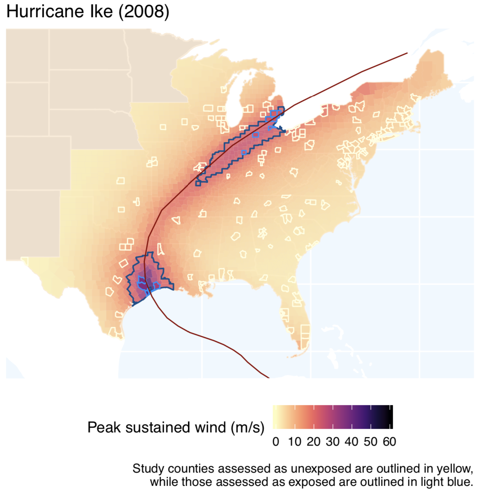

---
output:
  beamer_presentation:
    includes:
      in_header: header.tex
      before_body: anderson_beforebody.txt
fontsize: 10pt
---

```{r setup, include=FALSE}
knitr::opts_chunk$set(echo = FALSE, warning = FALSE, message = FALSE, error = TRUE)

library(dplyr)
library(tidyr)
library(stringr)
library(tibble)
library(lubridate)

library(ggplot2)
library(viridis)
library(ggrepel)
library(scales)

library(sf)
library(maps)
library(tigris)
options(tigris_class = "sf")
options(tigris_use_cache = TRUE)

library(kableExtra)

library(hurricaneexposuredata)
library(hurricaneexposure)

data(state)
state <- data_frame(state = state.name, 
                    abbr = state.abb)
data(hurr_tracks)
data(closest_dist)
data(storm_winds)

our_states <- c("ME", "NH", "VT", "MA", "RI", "CT", "NY", 
                "PA", "NJ", "OH", "MI", "WV", "VA", "DE", 
                "MD", "KY", "IN", "IL", "NC", "SC", "GA",
                "AL", "FL", "MS", "LA", "AR", "TN", "MO", 
                "TX", "OK", "KS", "IA", "WI", "DC")
us_counties <- counties(state = our_states, 
                        cb = TRUE,
                        resolution = "20m",
                        year = 2010)
us_states <- st_as_sf(map("state", plot = FALSE, fill = TRUE)) %>% 
  mutate(ID = str_to_title(ID)) %>% 
  inner_join(state, by = c("ID" = "state")) %>% 
  filter(abbr %in% our_states) %>% 
  st_transform(crs = 4269)
```


## The Adventure of Silver Blaze

```{r echo = FALSE, fig.align = "center", out.width = "0.8\\textwidth"}

```

*Source: Doyle, The Adventure of Silver Blaze, 1892*

## The dog that didn't bark

\begin{columns}
\begin{column}{0.5\textwidth}
```{r echo = FALSE, fig.align = "center", out.width = "\\textwidth"}

```
\end{column}
\begin{column}{0.5\textwidth}
\textbf{Gregory (Scotland Yard detective):} "Is there any other point to which you would wish 
to draw my attention?" \\ \bigskip

\textbf{Sherlock Holmes:} "To the curious incident of the dog in the night-time." \\ \bigskip

\textbf{Gregory:} "The dog did nothing in the night-time." \\ \bigskip

\textbf{Sherlock Holmes:} "That was the curious incident." \\ \bigskip
\end{column}
\end{columns}

*Source: Doyle, The Adventure of Silver Blaze, 1892*

## The dog that didn't bark

\begin{columns}
\begin{column}{0.5\textwidth}
```{r echo = FALSE, fig.align = "center", out.width = "\\textwidth"}

```
\end{column}
\begin{column}{0.5\textwidth}
\textbf{Sherlock Holmes:} "I had grasped the significance of the silence of the dog \ldots
Obviously the midnight visitor was someone whom the dog knew well."
\end{column}
\end{columns}

*Source: Doyle, The Adventure of Silver Blaze, 1892*

<!-- ## Negative controls -->


<!-- > "Biologists employ 'negative controls' as a means of ruling out possible noncausal  -->
<!-- interpretations of their results \ldots  -->
<!-- [They] repeat the experiment under conditions in which it is expected to produce a  -->
<!-- null result and verify that it does." --Lipsitch et al., *Epidemiology*, 2010 -->

<!-- \bigskip \bigskip -->

<!-- ```{r echo = FALSE, fig.align = "center", out.width = "\\textwidth"} -->
<!--  -->
<!-- ``` -->


<!-- ## Negative controls -->

<!-- Techniques for negative controls in experimental biology:  -->

<!-- - "Leave out an essential ingredient" -->
<!-- - "Inactivate the (hypothesized) active ingredient" -->
<!-- - "Check for an effect that would be impossible by the hypothesized mechanism" -->

<!-- *Source: Lipsitch et al., Epidemiology, 2010* -->

<!-- \bigskip \bigskip -->


<!-- ## Negative controls in observational studies -->

<!-- > "The essential purpose of a negative control is to reproduce a condition that -->
<!-- cannot involve the hypothesized causal mechanism but is very likely to involve -->
<!-- the same sources of bias that may have been present in the original association." -->
<!-- --Lipsitch et al., *Epidemiology*, 2010 -->

<!-- \bigskip \bigskip -->

## Negative controls in observational studies

```{r echo = FALSE, fig.align = "center", out.width = "0.75\\textwidth"}

```

*Source: Lipsitch et al., Epidemiology, 2010*


## Negative controls

Negative controls have a long tradition in environmental epidemiology. 

In studies
that aimed to estimate the relationship between particulate matter and respiratory 
outcomes, examples include:

- Substituting exposure with particulate matter from the same area and day of year but a different year (Lumley and Shepard, *Environmentrics*, 2000)
- Substituting exposure with particulate matter from a different city, 140 miles away (Lumley and Shepard, *Environmentrics*, 2000)
- Substituting the outcome with accidental deaths (Borja-Aburto et al., *American Journal of Epidemiology*, 1997)
- Substituting the outcome with appendicitis (Shepard et al., *Epidemiology*, 1999)


## Health risks associated with Hurricane Sandy (2012)

\begin{columns}

\begin{column}{0.45\textwidth}
```{r echo = FALSE, fig.align = "center", out.width = "\\textwidth"}
knitr::include_graphics("figures/sandy_satellite.jpg")
```
\vspace{-0.5cm}
\begin{center}
\scriptsize Source: NOAA / NASA GOES Project
\end{center}
\end{column}

\begin{column}{0.55\textwidth}
\small
\begin{block}{Health risks in storm-affected areas}
\begin{itemize}
  \item Change in patterns of emergency department visits (Kim et al. 2016)
  \item Increased outpatient cases of food and waterborne disease among elderly (Bloom et al. 2016)
  \item Increased rate of myocardial infarctions (Swerdel et al. 2014)
  \item Increased hospitalizations for dehydration (Lee et al. 2016)
  \item Difficulty obtaining medical care, medications, and medical equipment (Davidow et al. 2016)
\end{itemize}
\end{block}
\end{column}

\end{columns}

## Study question

Typically, how do county-level hospitalization rates change during
county-level exposure to tropical cyclone winds of $\ge21$ m/s for cardiovascular
and respiratory outcomes among Medicare beneficiaries?


## Study counties

```{r fig.width = 6, fig.height = 4.3, out.width = "0.9\\textwidth", fig.align = "center"}
study_counties <- readRDS("data/med_eastern_counties.rds") %>% 
  select(fips)

study_counties <- us_counties %>% 
  mutate(fips = paste(STATEFP, COUNTYFP, sep = "")) %>% 
  semi_join(study_counties, by = "fips")

ggplot() + 
  geom_sf(data = us_states, color = "white", fill = "lightgray") +  
  geom_sf(data = study_counties, alpha = 0.7, fill = "red", color = "darkred") +
  theme_dark() + 
  theme(legend.position = "right",
        axis.title = element_blank(),
        axis.text = element_blank(),
        axis.ticks = element_blank()) + 
  ggtitle("Counties considered in our study",
          subtitle = "180 urban counties in the eastern US")
  
```

## Storms near or over the US, 1999--2010

```{r echo = FALSE, fig.align = "center", out.width = "0.9\\textwidth"}
knitr::include_graphics("figures/storm_tracks.pdf")
```

## Wind field modeling and exposure assessment

```{r echo = FALSE, fig.align = "center", out.width = "0.75\\textwidth"}

```


## Potential for seasonal confounding

```{r fig.height = 4, fig.width = 6.5, out.width = "\\textwidth"}
library(hurricaneexposuredata)
library(tidyverse)
library(lubridate)
library(gridExtra)

# Get all tracks (near US and other) from HURDAT, 1988 to 2018
data("hurr_tracks")
data("excluded_tracks")

all_tracks <- bind_rows(hurr_tracks, excluded_tracks) %>% 
  group_by(storm_id) %>% 
  slice(1) %>% 
  ungroup() %>%  
  mutate(date = ymd_hm(date)) %>% 
  filter(1987 <= year(date) & year(date) <= 2005) %>%  
  # Create a version with all start dates in the same year so they can be plotted
  # together
  mutate(date2 = paste("2000", month(date), mday(date), sep = "-"), 
         date2 = ymd(date2)) %>% 
  filter(1987 <= year(date) & year(date) <= 2005)

a <- ggplot(all_tracks, aes(x = date2)) + 
  geom_rect(aes(xmin = ymd("2000-06-01"), xmax = ymd("2000-11-30"), 
                ymin = -Inf, ymax = Inf), fill = "antiquewhite") + 
  geom_histogram(binwidth = 7, fill = "darkcyan", color = "white") + 
  scale_x_date(name = "First day of tropical cyclone", 
               date_labels = "%B", 
               limits = c(ymd("2000-01-01"), ymd("2000-12-31"))) + 
  theme_classic() + 
  labs(y = "Number of tropical\ncyclones per week",
       caption = "Official Atlantic Basin hurricane season shown in beige") + 
  ggtitle("Seasonal patterns in tropical cyclones",
          subtitle = "Atlantic basin tropical cyclones, 1987-2005")


## Get mortality data
hous <- readRDS("/Users/georgianaanderson/Documents/co_i_projects/hazard_sees/pred_mortality_model/model_data/hous.rds") %>% 
  as_tibble() %>% 
  select(alldeath, date) %>% 
  mutate(date = ymd(date), 
         date2 = paste("2000", month(date), mday(date), sep = "-"),
         date2 = ymd(date2)) %>% 
  filter(date2 != ymd("2000-02-29")) %>% 
  group_by(date2) %>% 
  summarize(alldeath = sum(alldeath) / 19)

b <- ggplot(hous, aes(x = date2, y = alldeath)) + 
  geom_point(color = "darkcyan") + 
  scale_x_date(name = "Timing in year", date_labels = "%B", 
               limits = c(ymd("2000-01-01"), ymd("2000-12-31"))) + 
  theme_classic() + 
  labs(y = "Average number of\ndeaths per day") + 
  ggtitle("Seasonal patterns in mortality", 
          subtitle = "Example of Houston, TX, 1987-2005")

grid.arrange(a, b, nrow = 2)
```

## Potential for confounding by long-term trends


```{r out.width = "0.9\\textwidth", fig.align = "center"}

```

*Source: climate.gov*

## Matched analysis

We matched each storm-exposed day to ten unexposed days in the county, randomly selected from candidate days that were: 

1. in a different year 
2. within a seven-day window of the exposure’s day of year 
3. outside a three-day window of a different storm-exposed day for the county 
4. outside September 11--24, 2001

<!-- ## Selecting matched unexposed days -->

<!-- ```{r fig.width = 7, fig.height = 5, out.width = "\\textwidth"} -->
<!-- all_dates <- data_frame(date = seq(from = ymd("1999-01-01"), to = ymd("2010-12-31"), by = 1)) %>%  -->
<!--   mutate(year = year(date),  -->
<!--          yday = yday(date)) -->

<!-- closest_date <- closest_dist %>%  -->
<!--   filter(storm_id == "Wilma-2005", fips == "12099") %>%  -->
<!--   select(storm_id, closest_date) %>%  -->
<!--   rename(date = closest_date) %>%  -->
<!--   mutate(date = ymd(date), -->
<!--          year = year(date),  -->
<!--          yday = yday(date))  -->

<!-- a <- ggplot(all_dates, aes(x = yday, y = year)) +  -->
<!--   geom_path(aes(group = year), alpha = 0.5, color = "lightgray") +  -->
<!--   labs(x = "Day in year", y = "Year in study") +  -->
<!--   scale_y_reverse() +  -->
<!--   geom_point(data = closest_date, color = "red") +  -->
<!--   theme_dark() -->
<!-- a +  -->
<!--   geom_label_repel(data = closest_date, aes(label = storm_id), -->
<!--                    fill = "red", color = "white", fontface = "bold", -->
<!--                    alpha = 0.7) +  -->
<!--   ggtitle("1. Identify the day-of-year of the storm", -->
<!--           subtitle = "Example for Hurricane Wilma in Palm Beach County, FL") -->

<!-- ``` -->

<!-- ## Selecting matched unexposed days -->

<!-- ```{r fig.width = 7, fig.height = 5, out.width = "\\textwidth"} -->
<!-- a +  -->
<!--   annotate("rect", xmin = 294, xmax = 300, ymin = 1998.75, ymax = 2010.25, -->
<!--         alpha = .2, fill = "cyan") +  -->
<!--   ggtitle("2. Create a seven-day window centered on the storm's day-of-year", -->
<!--           subtitle = "Example for Hurricane Wilma in Palm Beach County, FL")  -->
<!-- ``` -->

<!-- ## Selecting matched unexposed days -->

<!-- ```{r fig.width = 7, fig.height = 5, out.width = "\\textwidth"} -->
<!-- matched_days <- data_frame( -->
<!--   year = c(sample(c(1999:2004, 2006:2010), 5, replace = FALSE)), -->
<!--   yday = c(sample(294:300, 5, replace = TRUE)) -->
<!-- ) -->

<!-- a +  -->
<!--   annotate("rect", xmin = 294, xmax = 300, ymin = 1998.75, ymax = 2010.25, -->
<!--         alpha = .2, fill = "cyan") +  -->
<!--   geom_point(data = matched_days, color = "lightyellow") +  -->
<!--   ggtitle("3. Randomly pick a set of unexposed days from other years within window", -->
<!--           subtitle = "Example for Hurricane Wilma in Palm Beach County, FL") -->
<!-- ``` -->

<!-- ## Selecting matched unexposed days -->

<!-- ```{r fig.width = 7, fig.height = 5, out.width = "\\textwidth"} -->
<!-- matched_days <- matched_days %>%  -->
<!--   mutate(start = yday - 2, -->
<!--          end = yday + 7) -->

<!-- a +  -->
<!--   annotate("rect", xmin = 294, xmax = 300, ymin = 1998.75, ymax = 2010.25, -->
<!--         alpha = .2, fill = "cyan") + -->
<!--   geom_point(data = matched_days, color = "lightyellow") + -->
<!--   geom_errorbarh(data = matched_days,  -->
<!--                  aes(xmax = yday + 7, xmin = yday - 2),  -->
<!--                  color = "lightyellow", height = 0, size = 1.5) +  -->
<!--   geom_errorbarh(data = closest_date,  -->
<!--                  aes(xmin = yday - 2, xmax = yday + 7), -->
<!--                  color = "red", height = 0, size = 1.5) +  -->
<!--   ggtitle("4. Determine the number of hospitalizations for a period around each day", -->
<!--           subtitle = "Example for Hurricane Wilma in Palm Beach County, FL") -->
<!-- ``` -->

## Estimating tropical cyclone-hospitalization associations

We then used this matched data to fit a generalized linear mixed-effect model of hospitalization rates in association with tropical cyclone exposure: 

$$
log[E(Y_t^c)] = log(n_t^c) + \alpha + \alpha_c + \sum_{l=-2}^7\beta_{l} x_{t-l}^c + \delta Z_t + \gamma D_t
$$
\small
where:

- $Y_t$ is the total count of hospital admissions on day $t$ in community $c$
- $n_T^c$ is an offset for the number of unhospitalized Medicare beneficiaries in the county on day $t$ in community $c$
- $\alpha$ is the model intercept
- $\alpha_c$ is a random effect for study county
- $x_{t-l}$ is an indicator variable for storm exposure, with associated lag-specific coefficients $\beta_l$
- $Z_t$ is the year of day $t$, fit as a factor and with associated coefficient $\delta$
- $D_t$ is the day of week of day $t$, with associated coefficient $\gamma$


## Hospitalization risks by lag day

```{r fig.width = 7, fig.height = 4.5, out.width = "\\textwidth"}
wind_lag_ests <- readRDS("data/wind21_resp_est_July2018.rds")
wind_lags <- data_frame(lag = -2:7,
                        rr = wind_lag_ests$pred$matRRfit[1, ],
                        low_ci = wind_lag_ests$pred$matRRlow[1, ],
                        high_ci = wind_lag_ests$pred$matRRhigh[1, ])

ggplot(wind_lags, aes(x = lag, y = (rr - 1))) +
  annotate("rect", xmin = -0.5, xmax = 0.5, ymin = -0.05, ymax = 0.55,
        alpha = .2, fill = "cyan") +
  geom_text(x = 0, y = 0.48, label = "Storm\nday") +
  geom_hline(yintercept = 0, linetype = 3) +
  geom_line() + 
  geom_point(color = "white") + 
  geom_errorbar(aes(ymin = (low_ci - 1), ymax = (high_ci - 1)), 
                width = 0, color = "white") + 
  theme_dark() + 
  scale_x_continuous(name = "Day since storm's closest approach", breaks = -2:7) + 
  scale_y_continuous(name = "Percent increase in hospitalizations\ncompared to matched unexposed days",
                     label = percent) + 
  ggtitle("Respiratory hospitalization risks by lag day",
          subtitle = "Storm exposure assessed as maximum sustained winds in the county of 21 m/s or higher")
```

## Hospitalization risks by lag day

```{r fig.width = 7, fig.height = 4.5, out.width = "\\textwidth"}
wind_lag_ests <- readRDS("data/wind21_cvd_est_July2018.rds")
wind_lags <- data_frame(lag = -2:7,
                        rr = wind_lag_ests$pred$matRRfit[1, ],
                        low_ci = wind_lag_ests$pred$matRRlow[1, ],
                        high_ci = wind_lag_ests$pred$matRRhigh[1, ])

ggplot(wind_lags, aes(x = lag, y = (rr - 1))) +
  annotate("rect", xmin = -0.5, xmax = 0.5, ymin = -0.15, ymax = 0.2,
        alpha = .2, fill = "cyan") +
  geom_text(x = 0, y = 0.18, label = "Storm\nday") +
  geom_hline(yintercept = 0, linetype = 3) +
  geom_line() + 
  geom_point(color = "white") + 
  geom_errorbar(aes(ymin = (low_ci - 1), ymax = (high_ci - 1)), 
                width = 0, color = "white") + 
  theme_dark() + 
  scale_x_continuous(name = "Day since storm's closest approach", breaks = -2:7) + 
  scale_y_continuous(name = "Percent increase in hospitalizations\ncompared to matched unexposed days",
                     label = percent) + 
  ggtitle("Cardiovascular hospitalization risks by lag day",
          subtitle = "Storm exposure assessed as maximum sustained winds in the county of 21 m/s or higher")
```

## Negative control analysis

To check for residual confounding by long-term temporal trends, we conducted a 
negative control analysis, where we substituted the true outcome with a 
negative control outcome hospitalizations a bit **before** each real storm day.

## Negative controls in observational studies

```{r echo = FALSE, fig.align = "center", out.width = "0.8\\textwidth"}

```

*Source: Lipsitch et al., Epidemiology, 2010*

## Negative control analysis

A few days before landfall, the storm may already cause changes to the community.

```{r out.width = "\\textwidth"}

```

*Source: sun-sentinel.com*

## Negative control analysis

Two weeks before landfall is typically far too early to have any idea where the 
storm will hit or how severe it will be.

```{r out.width = "\\textwidth"}

```

*Source: weather.com*

<!-- ## Matched analysis -->

<!-- We tested for residual confounding from long-term temporal trends using as a  -->
<!-- negative control outcome hospitalizations two weeks **before** each real storm day. -->

<!-- We then matched the day *two weeks before each storm-exposed day* to  -->
<!-- ten control days in the county, randomly selected from candidate days that were:  -->

<!-- 1. in a different year  -->
<!-- 2. within a seven-day window of the exposure’s day of year  -->
<!-- 3. outside a three-day window of a different storm-exposed day for the county  -->
<!-- 4. outside September 11–-24, 2001 -->

<!-- ## Selecting matched unexposed days---negative controls -->

<!-- ```{r fig.width = 7, fig.height = 5, out.width = "\\textwidth"} -->
<!-- all_dates <- data_frame(date = seq(from = ymd("1999-01-01"), to = ymd("2010-12-31"), by = 1)) %>%  -->
<!--   mutate(year = year(date),  -->
<!--          yday = yday(date)) -->

<!-- closest_date <- closest_dist %>%  -->
<!--   filter(storm_id == "Wilma-2005", fips == "12099") %>%  -->
<!--   select(storm_id, closest_date) %>%  -->
<!--   rename(date = closest_date) %>%  -->
<!--   mutate(date = ymd(date), -->
<!--          year = year(date),  -->
<!--          yday = yday(date))  -->

<!-- a <- ggplot(all_dates, aes(x = yday, y = year)) +  -->
<!--   geom_path(aes(group = year), alpha = 0.5, color = "lightgray") +  -->
<!--   labs(x = "Day in year", y = "Year in study") +  -->
<!--   scale_y_reverse() +  -->
<!--   geom_point(data = closest_date, color = "red") +  -->
<!--   geom_point(data = closest_date, aes(x = yday - 14, y = year)) + -->
<!--   theme_dark() -->
<!-- a +  -->
<!--   geom_label_repel(data = closest_date, aes(label = storm_id), -->
<!--                    fill = "red", color = "white", fontface = "bold", -->
<!--                    alpha = 0.7) +  -->
<!--   ggtitle("1. Identify the day-of-year of the storm", -->
<!--           subtitle = "Example for Hurricane Wilma in Palm Beach County, FL") -->
<!-- ``` -->

<!-- ## Selecting matched unexposed days---negative controls -->

<!-- ```{r fig.width = 7, fig.height = 5, out.width = "\\textwidth"} -->
<!-- a +  -->
<!--   annotate("rect", xmin = 294 - 14, xmax = 300 - 14, ymin = 1998.75, ymax = 2010.25, -->
<!--         alpha = .2, fill = "cyan") +  -->
<!--   ggtitle("2. Create a seven-day window centered on the storm's day-of-year", -->
<!--           subtitle = "Example for Hurricane Wilma in Palm Beach County, FL")  -->
<!-- ``` -->

<!-- ## Selecting matched unexposed days---negative controls -->

<!-- ```{r fig.width = 7, fig.height = 5, out.width = "\\textwidth"} -->
<!-- matched_days <- data_frame( -->
<!--   year = c(sample(c(1999:2004, 2006:2010), 5, replace = FALSE)), -->
<!--   yday = c(sample(294:300, 5, replace = TRUE)) -->
<!-- ) -->

<!-- a +  -->
<!--   annotate("rect", xmin = 294 - 14, xmax = 300 - 14, ymin = 1998.75, ymax = 2010.25, -->
<!--         alpha = .2, fill = "cyan") +  -->
<!--   geom_point(data = matched_days, aes(x = yday - 14, y = year), color = "lightyellow") +  -->
<!--   ggtitle("3. Randomly pick a set of unexposed days from other years within window", -->
<!--           subtitle = "Example for Hurricane Wilma in Palm Beach County, FL") -->
<!-- ``` -->

<!-- ## Selecting matched unexposed days---negative controls -->

<!-- ```{r fig.width = 7, fig.height = 5, out.width = "\\textwidth"} -->
<!-- matched_days <- matched_days %>%  -->
<!--   mutate(start = yday - 2, -->
<!--          end = yday + 7) -->

<!-- a +  -->
<!--   annotate("rect", xmin = 294 - 14, xmax = 300 - 14, ymin = 1998.75, ymax = 2010.25, -->
<!--         alpha = .2, fill = "cyan") + -->
<!--   geom_point(data = matched_days, aes(x = yday - 14, y = year), color = "lightyellow") + -->
<!--   geom_errorbarh(data = matched_days,  -->
<!--                  aes(xmax = yday + 7 - 14, xmin = yday - 2 - 14),  -->
<!--                  color = "lightyellow", height = 0, size = 1.5) +  -->
<!--   geom_errorbarh(data = closest_date,  -->
<!--                  aes(xmin = yday - 2 - 14, xmax = yday + 7 - 14), -->
<!--                  color = "black", height = 0, size = 1.5) +  -->
<!--   ggtitle("4. Determine the number of hospitalizations for a period around each day", -->
<!--           subtitle = "Example for Hurricane Wilma in Palm Beach County, FL") -->
<!-- ``` -->

## Estimating tropical cyclone-hospitalization associations

We then used this matched data to fit a generalized linear mixed-effect model of hospitalization rates in association with tropical cyclone exposure: 

$$
log[E(Y_{t-14}^c)] = log(n_{t-14}^c) + \alpha + \alpha_c + \sum_{l=-2}^7\beta_{l} x_{t-l}^c + \delta Z_{t} + \gamma D_{t}
$$
\small
where:

- $Y_{t-14}$ is the total count of hospital admissions on day $t-14$ in community $c$
- $n_{t-14}^c$ is an offset for the number of unhospitalized Medicare beneficiaries in the county on day $t-14$ in community $c$
- $\alpha$ is the model intercept
- $\alpha_c$ is a random effect for study county
- $x_{t-l}$ is an indicator variable for storm exposure, with associated lag-specific coefficients $\beta_l$
- $Z_{t}$ is the year of day $t$, fit as a factor and with associated coefficient $\delta$
- $D_{t}$ is the day of week of day $t$, with associated coefficient $\gamma$


## Negative control analysis---negative controls


```{r out.width = "\\textwidth"}
knitr::include_graphics("figures/negativeControl_wind.pdf")
```

## Negative controls for calibration

- Tchetgen Tchetgen, 2013. **The control outcome calibration approach for 
causal inference with unobserved confounding.** *American Journal of Epidemiology.*

*Leveraging temporal logic*

- Flanders et al., 2017. **A new method for partial correction of residual 
confounding in time-series and other observational studies.** *American Journal of
Epidemiology.*
- Miao and Tchetgen Tchetgen, 2017. **Bias attenuation and identification of 
causal effects with multiple negative controls.** *American Journal of Epidemiology.*

## Negative controls in non-ideal settings

- Weisskopf et al., 2016. **On the use of imperfect negative control exposures in 
epidemiologic studies.** *Epidemiology.*
- Sanderson et al., 2018. **Negative control exposure studies in the presence of 
measurement error: implications for attempted effect estimate calibration.**
*International Journal of Epidemiology.*


## Acknowledgements

\small

\begin{columns}

\begin{column}{0.49\textwidth}

\textit{Colorado State University}
\begin{itemize}
\item \textbf{Meilin Yan}
\item Ander Wilson
\item Joshua Ferreri
\item Andrea Schumacher
\end{itemize}

\textit{NASA Marshall Space Flight Center}
\begin{itemize}
\item Mohammad Al-Hamdan
\item William Crosson
\end{itemize}

\textit{Debian / University of Illinois}
\begin{itemize}
\item Dirk Eddelbuettel
\end{itemize}

\end{column}

\begin{column}{0.49\textwidth}

\textit{Johns Hopkins (Public Health)}
\begin{itemize}
\item Roger Peng
\end{itemize}

\textit{Harvard (Public Health)}
\begin{itemize}
\item Francesca Dominici
\item Yun Wang
\end{itemize}

\textit{University of Michigan}
\begin{itemize}
\item Seth Guikema
\end{itemize}

\textit{Ohio State University}
\begin{itemize}
\item Steven Quiring
\end{itemize}


\end{column}

\end{columns}

## Additional slides

\appendix

## `hurricaneexposure` package

The `hurricaneexposure` package can be used to map exposures for specific storms:

```{r fig.align = "center", echo = TRUE, fig.width = 5, out.width="\\textwidth"}
map_counties(storm = "Floyd-1999", metric = "wind")
```

## `hurricaneexposure` package

\footnotesize
\begin{block}{`hurricaneexposure` package}
\medskip
Create county-level exposure time series for tropical storms in U.S. counties. Exposure can be determined based on several hazards (e.g., wind, rain, tornadoes), with user-specified thresholds. On CRAN.
\end{block}

\bigskip

```{r echo = TRUE, eval = FALSE}
county_wind(counties = c("22071", "51700"), wind_limit = 21, 
            start_year = 1995, end_year = 2005)
```

```{r echo = FALSE}
county_wind(counties = c("22071", "51700"), wind_limit = 21, 
            start_year = 1995, end_year = 2005) %>%
  slice(1:4) %>%
  select(storm_id, fips, closest_date, vmax_sust)
```


## Potential for extended effects

Evidence from Hurricane Maria in Puerto Rico. 

```{r out.width = "\\textwidth"}

```

\footnotesize Source: The New York Times

## Wind field modeling and exposure assessment

```{r echo = FALSE, fig.align = "center", out.width = "0.75\\textwidth"}

```

## Wind field modeling and exposure assessment

```{r echo = FALSE, fig.align = "center", out.width = "0.75\\textwidth"}

```

