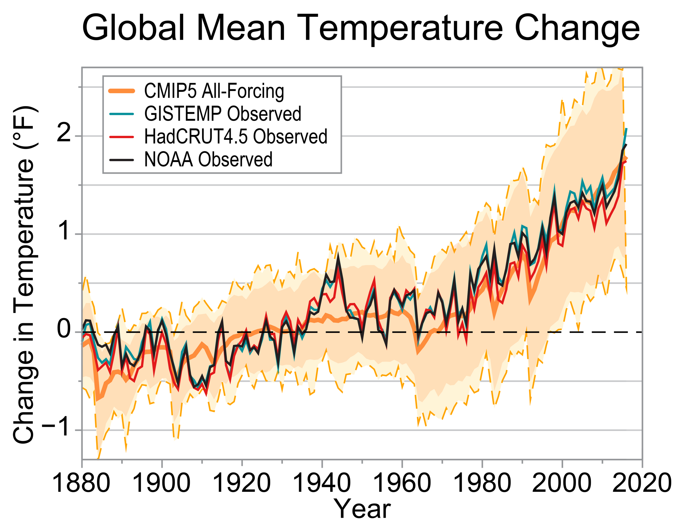

```{r setup, include=FALSE}
knitr::opts_chunk$set(echo = FALSE)
```

## US Climate and Health Assessment

```{r echo = FALSE, out.width = "\\textwidth"}

```

\footnotesize https://health2016.globalchange.gov/

## US Global Climate Research Program Mandate

\small

> "The U.S. Global Change Research Program (USGCRP) was established by Presidential initiative in 1989 and **mandated by Congress** in the Global Change Research Act (GCRA) of 1990. Its mandate is to develop and coordinate 'a comprehensive and integrated United States research program which will assist the Nation and the world to understand, assess, predict, and respond to human-induced and natural processes of global change.' ...
 
> "USGCRP has four major sets of responsibilities: (a) coordinating global change research across the Federal Government, (b) developing and distributing mandated products, (c) helping to inform decisions, and (d) facilitating international research coordination."

\footnotesize https://health2016.globalchange.gov/

##  US Global Climate Research Program

```{r echo = FALSE, out.width = "0.7\\textwidth", fig.align = "center"}
knitr::include_graphics("figures/agencies.png")
```

## Weather versus climate

## Weather impacts


## Changing climate

```{r echo = FALSE, out.width = "\\textwidth"}

```

\footnotesize https://science2017.globalchange.gov/chapter/1/

## Changing climate

```{r echo = FALSE, out.width = "\\textwidth"}

```

\footnotesize https://health2016.globalchange.gov/climate-change-and-human-health

## Changing climate

```{r echo = FALSE, out.width = "\\textwidth"}

```

\footnotesize https://nca2018.globalchange.gov/chapter/1/

## Modeling climate change

```{r echo = FALSE, out.width = "\\textwidth", fig.align = "center"}

```

\footnotesize https://science2017.globalchange.gov/chapter/4/

## Modeling climate change

```{r echo = FALSE, out.width = "0.9\\textwidth", fig.align = "center"}

```

\footnotesize https://nca2018.globalchange.gov/chapter/1/

## Modeling climate change

```{r echo = FALSE, out.width = "0.7\\textwidth", fig.align = "center"}

```

\footnotesize https://nca2018.globalchange.gov/chapter/1/

## Modeling climate change

```{r echo = FALSE, out.width = "\\textwidth", fig.align = "center"}

```

\footnotesize https://science2017.globalchange.gov/chapter/9/

## Modeling climate change

```{r echo = FALSE, out.width = "0.8\\textwidth", fig.align = "center"}

```

\footnotesize https://science2017.globalchange.gov/chapter/12/

## Climate, weather, and health 

```{r echo = FALSE, out.width = "0.9\\textwidth", fig.align = "center"}

```

\footnotesize https://health2016.globalchange.gov/populations-concern

## Climate, weather, and health 

```{r echo = FALSE, out.width = "0.9\\textwidth", fig.align = "center"}

```

\footnotesize https://health2016.globalchange.gov/climate-change-and-human-health

## Climate, weather, and health

```{r echo = FALSE, out.width = "\\textwidth", fig.align = "center"}

```

\footnotesize https://health2016.globalchange.gov/climate-change-and-human-health

## Climate, weather, and health

```{r echo = FALSE, out.width = "0.9\\textwidth", fig.align = "center"}
knitr::include_graphics("figures/f6-cropped_5.png")
```

\footnotesize https://health2016.globalchange.gov/climate-change-and-human-health