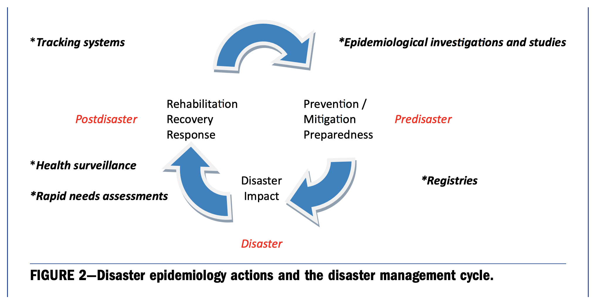
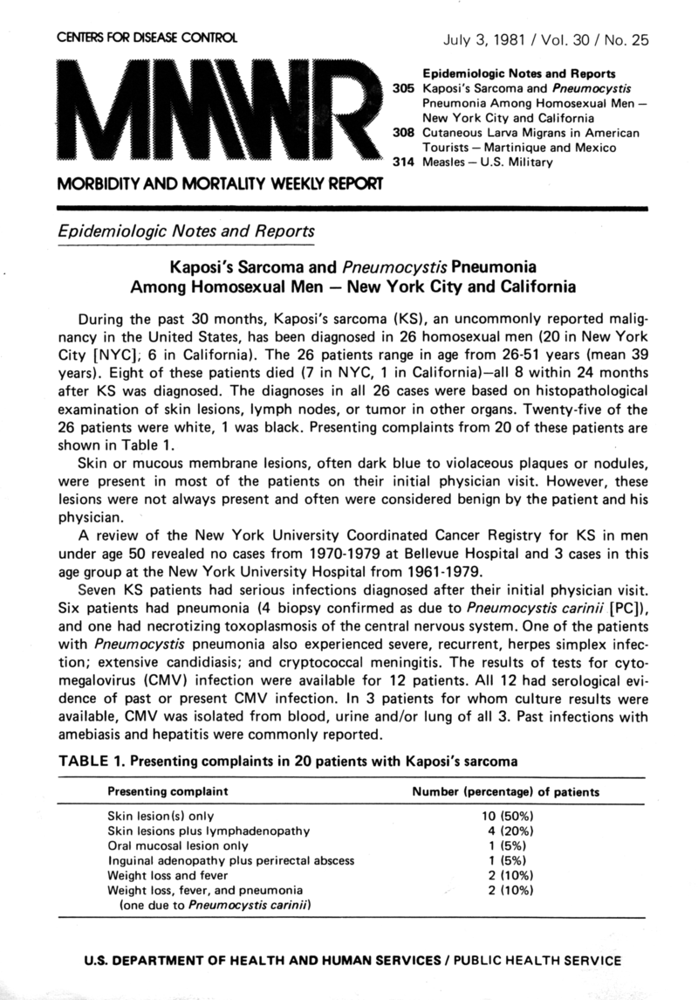
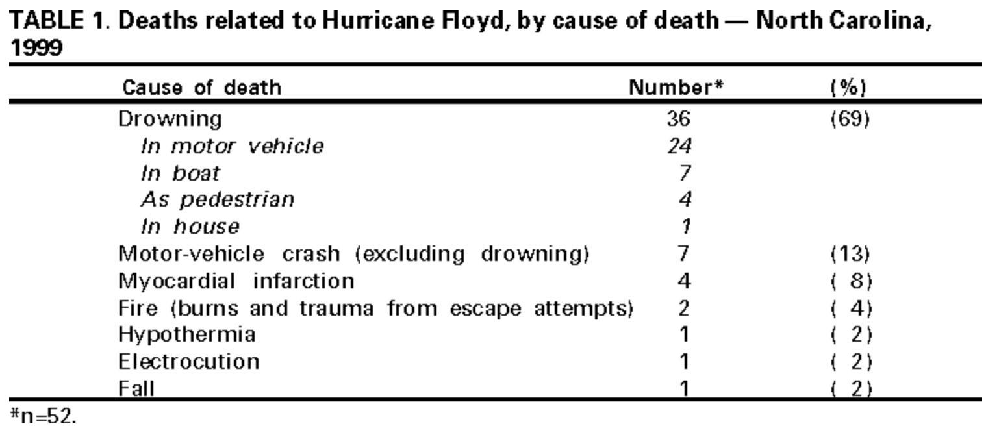
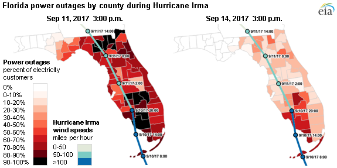

```{r setup, include=FALSE}
knitr::opts_chunk$set(echo = FALSE)
```

# Overview

## Overview

- Climate change in the US
- US Global Change Research Program
- Temperature and Human Health
- Extreme events and Human Health

# Climate change

## Weather versus climate

**Climate** is what you **expect**, **weather** is what you **get**. 

```{r echo = FALSE, out.width = "\\textwidth", fig.align = "center"}

```

## What is climate change

**Climate change**: "Changes in average weather conditions that persist over multiple decades or longer. Climate change encompasses both increases and decreases in temperature, as well as shifts in precipitation, changing risk of certain types of severe weather events, and changes to other features of the climate system."

\footnotesize Source: https://health2016.globalchange.gov/

## Why is climate changing?

```{r echo = FALSE, out.width = "\\textwidth", fig.align = "center"}
knitr::include_graphics("figures/ghg-emissions.jpg")
```

\footnotesize Source: World Meteorological Organization

## Observed climate trends in the US

```{r echo = FALSE, out.width = "\\textwidth", fig.align = "center"}
knitr::include_graphics("figures/us_climate_trends.png")
```

\footnotesize Source: https://health2016.globalchange.gov/climate-change-and-human-health


<!-- ## Projected climate trends in the US -->

<!-- Projected changes in temperature and precipitation in the US under RCP6.0 -->
<!-- scenario. -->

<!-- ```{r echo = FALSE, out.width = "0.6\\textwidth", fig.align = "center"} -->
<!--  -->
<!-- ``` -->

<!-- \footnotesize Source: https://health2016.globalchange.gov -->

## Projected climate trends in the US

Projected changes in risk weeks with risk of large fires in the US by mid-century (2041--2070) under RCP8.5
scenario.

```{r echo = FALSE, out.width = "0.7\\textwidth", fig.align = "center"}

```

\footnotesize Source: https://health2016.globalchange.gov, adapted from Barbero et al. 2015 by NOAA

## Projected climate trends in the US

> "Projections of future climate conditions are based on results from **climate models**---sophisticated computer programs that simulate the behavior of the Earth’s climate system. These climate models are used to project how the climate system is expected to change under different possible scenarios." 

\footnotesize Source: https://health2016.globalchange.gov/

## Projected health impacts

```{r echo = FALSE, out.width = "\\textwidth", fig.align = "center"}
knitr::include_graphics("figures/Change-in-Exposure-flow.png")
```

\footnotesize Source: https://health2016.globalchange.gov

<!-- ## Projected health impacts---Sources of uncertainty -->

<!-- ```{r echo = FALSE, out.width = "0.8\\textwidth", fig.align = "center"} -->
<!--  -->
<!-- ``` -->

<!-- \footnotesize Source: https://health2016.globalchange.gov -->

# US Global Change Research Program

## US Global Change Research Program (USGCRP)

```{r echo = FALSE, out.width = "\\textwidth"}

```

\footnotesize Source: https://www.globalchange.gov/about

## US Global Change Research Program (USGCRP)

```{r echo = FALSE, out.width = "\\textwidth", fig.align = "center"}

```

Includes thirteen agencies in the US government: 

- Departments of Agriculture, Commerce, Defense, Energy, Health & Human 
Services, Interior, State, and Transportation
- Environmental Protection Agency
- National Aeronautics & Space Administration
- National Science Foundation
- Smithsonian Institution
- U.S. Agency for International Development

See https://www.globalchange.gov/agencies for the role each agency 
plays in the USGCRP.

## US Global Change Research Program (USGCRP)

Key activities of USGCRP include: 

- Advance global change science
  + Observe changes in the Earth system (including through indicators)
  + Improving understanding of earth systems
  + Modeling global change
- Prepare for climate change
  + US Climate Reslience Toolkit
- Assess the US Climate
  + National Climate Assessment (NCA) every four years (includes *Climate Science Special Report* and *Impacts, Risks, and Adaptation in the United States*)
- Coordinate internationally
  + Coordinate US participation in the Intergovernmental Panel on Climate Change (IPCC) Assessment Reports
- Provide data and tools
  + Climate Data Initiative
  
\footnotesize Source: https://www.globalchange.gov/about

## US Climate and Health Assessment

```{r echo = FALSE, out.width = "0.4\\textwidth", fig.align = "center"}

```

\center https://health2016.globalchange.gov/

## Documenting uncertainty in key findings

```{r echo = FALSE, out.width = "\\textwidth", fig.align = "center"}
knitr::include_graphics("figures/documenting_uncertainty.png")
```

\footnotesize Source: https://health2016.globalchange.gov/documenting-uncertainty

# Temperature and Human Health 

## Temperature extremes and human health

```{r echo = FALSE, out.width = "0.5\\textwidth", fig.align = "center"}
knitr::include_graphics("figures/heat_exhaustion_heat_stroke.png")
```

\footnotesize Source: https://www.oregon.gov/oha

## Thermoregulation

```{r echo = FALSE, out.width = "0.6\\textwidth", fig.align = "center"}
knitr::include_graphics("figures/thermoregulation.png")
```

\footnotesize Source: pathwayz.org, credit Ben Himme

## Temperature extremes and human health

Heat-Related Deaths in Chicago in the Summer of 1995

```{r echo = FALSE, out.width = "0.9\\textwidth", fig.align = "center"}
knitr::include_graphics("figures/chicago_hw.png")
```

\footnotesize Source: https://health2016.globalchange.gov

## Temperature extremes and human health

```{r echo = FALSE, out.width = "0.5\\textwidth", fig.align = "center"}
knitr::include_graphics("figures/temp_mort_curve.png")
```

\footnotesize Source: Vicedo-Cabrera et al., 2019, *Epidemiology*

## Adaptation to temperature extremes

Overall cumulative relative risk at 29 degrees Celsius relative to 22 degrees Celsius on mortality in New York City by
decade, 1900s-2000s.

```{r echo = FALSE, out.width = "0.8\\textwidth", fig.align = "center"}

```

\footnotesize Source: Petkova et al., 2014, *Epidemiology*

## Adaptation to temperature extremes

People resting in Battery Park during a 1911 heat wave. 

```{r echo = FALSE, out.width = "\\textwidth", fig.align = "center"}

```

\footnotesize Source: www.history.com, credit to Bain News Service / The Library of Congress


## Pathways for extreme heat and health impacts

```{r echo = FALSE, out.width = "\\textwidth", fig.align = "center"}
knitr::include_graphics("figures/temp_pathways.png")
```

\footnotesize Source: https://health2016.globalchange.gov/temperature-related-death-and-illness

## Key findings

```{r echo = FALSE, out.width = "\\textwidth", fig.align = "center"}
knitr::include_graphics("figures/key_finding_1.png")
```

\footnotesize Source: https://health2016.globalchange.gov/temperature-related-death-and-illness

# Extreme Events and Human Health

## Climate-related disasters

```{r echo = FALSE, out.width = "\\textwidth", fig.align = "center"}

```

\footnotesize Source: https://www.ncdc.noaa.gov/billions/

## Role of epidemiology in disasters

```{r out.width = "\\textwidth", fig.align = "center"}

```

\footnotesize Source: Malilay et al., 2014, "The Role of Applied Epidemiology Methods in the Disaster Management Cycle", \textit{American Journal of Public Health}


## US CDC Morbidity and Mortality Weekly Report 

\begin{columns}
\begin{column}{0.5\textwidth}
For many American disasters, results from disaster epidemiology 
are reported in the US CDC's Morbidity and Mortality Weekly Report 
(MMWR).
\end{column}
\begin{column}{0.5\textwidth}
```{r out.width = "\\textwidth", fig.align = "center"}

```
\end{column}
\end{columns}

## Hurricane Floyd, 1999

\center In September 1999, Hurricane Floyd caused extensive damage---especially from widespread flooding---in eastern North Carolina.

```{r out.width = "0.9\\textwidth", fig.align = "center"}
knitr::include_graphics("figures/floyd_us_army_corps.jpg")
```

\footnotesize Source: US Army Corps of Engineers

## Hurricane Floyd, 1999

\center In May 2000, a report on the storm's health impacts in North Carolina, including attributable mortality, was published in the CDC's MMWR.

```{r out.width = "0.9\\textwidth", fig.align = "center"}

```

\footnotesize Source: US CDC, 2000, "Morbidity and Mortality Associated With Hurricane Floyd---North Carolina, September--October 1999", \textit{Morbidity and Mortality Weekly Report}

<!-- ## Hurricane Floyd, 1999 -->

<!-- > "The medical examiner determined that 52 deaths were associated directly with the storm. Decedents ranged in age from 1 to 96 years (median: 43 years); 38 (73%) were males. \ldots \ Seven deaths occurred during transport by boat; flotation devices were not worn by any of the decedents." -->

<!-- \footnotesize Source: US CDC, 2000, "Morbidity and Mortality Associated With Hurricane Floyd---North Carolina, September--October 1999", \textit{Morbidity and Mortality Weekly Report} -->


## Direct and indirect deaths

- **Direct deaths:** "Caused by environmental forces of the hurricane and direct consequences of these forces."

- **Indirect deaths:** "Caused by unsafe or unhealthy conditions because of loss or disruption of usual services, personal loss, or lifestyle disruption."

\bigskip

\footnotesize Source: Issa et al., 2018, "Deaths Related to Hurricane Irma — Florida, Georgia, and North Carolina, September 4–October 10, 2017", \textit{Morbidity and Mortality Weekly Report}

## Hurricane Maria, 2017

```{r out.width = "0.9\\textwidth", fig.align = "center"}
knitr::include_graphics("figures/maria_excess_deaths.png")
```

*Source:* New York Times

## 2004 Florida hurricane season

\center Comparison of observed storm-dependent mortality and official mortality for the 2004 hurricane season in Florida

```{r out.width = "\\textwidth", fig.align = "center"}
knitr::include_graphics("figures/fl_table.png")
```

\small \textit{Source:} McKinney et al., 2011, "Direct and indirect mortality in Florida during the 2004 hurricane season," \textit{International Journal of Biometeorology}

## Pathways for flooding and health impacts

```{r echo = FALSE, out.width = "\\textwidth", fig.align = "center"}
knitr::include_graphics("figures/extreme_weather_pathways.png")
```

\footnotesize Source: https://health2016.globalchange.gov

## Key findings

```{r echo = FALSE, out.width = "\\textwidth", fig.align = "center"}
knitr::include_graphics("figures/extreme_key_finding_1.png")
```

\footnotesize Source: https://health2016.globalchange.gov


## Key findings

```{r echo = FALSE, out.width = "\\textwidth", fig.align = "center"}

```

\footnotesize Source: U.S. Energy Information Administration based on data from Florida Division of Emergency Management and NOAA National Hurricane Center

## Key findings

```{r echo = FALSE, out.width = "0.95\\textwidth", fig.align = "center"}
knitr::include_graphics("figures/irma_nursing_home.png")
```

\footnotesize Source: newsonsix.com

<!-- Hollywood, Florida, evacuated over 100 patients from nursing home, respiratory distress, dehydration, heat-related issues. -->

## Key findings

```{r out.width = "0.6\\textwidth", fig.align = "center"}
knitr::include_graphics("figures/irma_figure.png")
```

\vspace{-0.2cm}
\footnotesize Source: Issa et al., 2018, "Deaths Related to Hurricane Irma — Florida, Georgia, and North Carolina, September 4–October 10, 2017," \textit{Morbidity and Mortality Weekly Report}

## Key findings

```{r echo = FALSE, out.width = "\\textwidth", fig.align = "center"}

```

\footnotesize Source: https://health2016.globalchange.gov

# Conclusion

## Other topics on climate and health

The US Climate and Health Assessment covers several other topics on climate
and human health: 

- Air quality impacts
- Vector-borne disease
- Water-related illness
- Food safety, nutrition, and distribution
- Mental health and well-being
- Populations of concern


