```{r setup, include=FALSE}
knitr::opts_chunk$set(echo = FALSE)
```

# Overview

## Overview

- Climate change in the US
- Temperature and Human Health
- Climate-related Disasters and Human Health

# Climate change

## Weather versus climate

**Climate** is what you **expect**, **weather** is what you **get**. 

```{r echo = FALSE, out.width = "\\textwidth", fig.align = "center"}
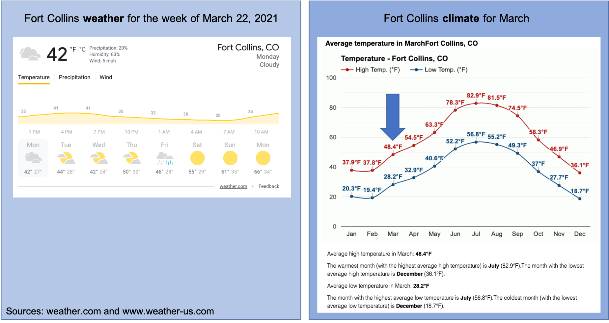
```

## What is climate change

## Why is climate changing?


## Observed climate trends in the US

```{r echo = FALSE, out.width = "\\textwidth", fig.align = "center"}
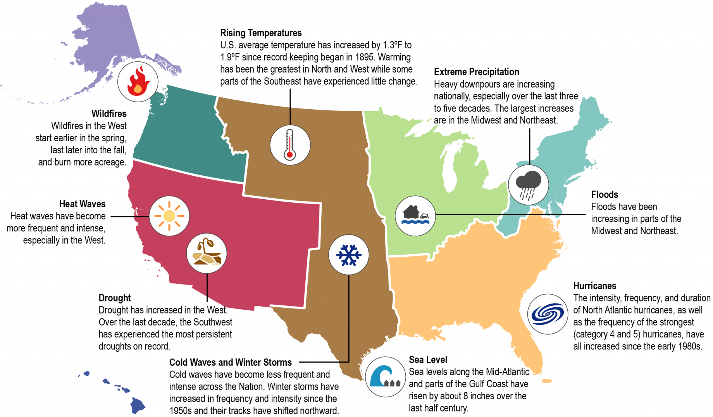
```

\footnotesize Source: https://health2016.globalchange.gov/climate-change-and-human-health


## Projected climate trends in the US

Projected changes in temperature and precipitation in the US under RCP6.0
scenario.

```{r echo = FALSE, out.width = "0.6\\textwidth", fig.align = "center"}
knitr::include_graphics("figures/temp_precip_changes.png")
```

\footnotesize Source: https://health2016.globalchange.gov

## Projected health impacts

```{r echo = FALSE, out.width = "\\textwidth", fig.align = "center"}

```

\footnotesize Source: https://health2016.globalchange.gov

## Projected health impacts

```{r echo = FALSE, out.width = "0.8\\textwidth", fig.align = "center"}
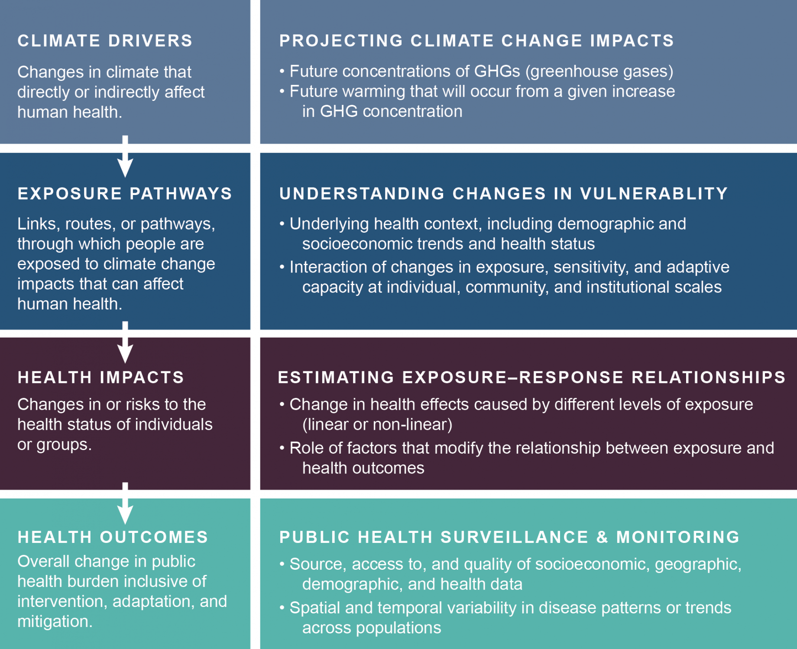
```

\footnotesize Source: https://health2016.globalchange.gov

## US Global Change Research Program (USGCRP)

```{r echo = FALSE, out.width = "\\textwidth"}

```

\footnotesize Source: https://www.globalchange.gov/about

## US Global Change Research Program (USGCRP)

```{r echo = FALSE, out.width = "\\textwidth", fig.align = "center"}

```

Includes thirteen agencies in the US government: 

- Departments of Agriculture, Commerce, Defense, Energy, Health & Human 
Services, Interior, State, and Transportation
- Environmental Protection Agency
- National Aeronautics & Space Administration
- National Science Foundation
- Smithsonian Institution
- U.S. Agency for International Development

See https://www.globalchange.gov/agencies for the role each agency 
plays in the USGCRP.

## US Global Change Research Program (USGCRP)

Key activities of USGCRP include: 

- Advance global change science
  + Observe changes in the Earth system (including through indicators)
  + Improving understanding of earth systems
  + Modeling global change
- Prepare for climate change
  + US Climate Reslience Toolkit
- Assess the US Climate
  + National Climate Assessment (NCA) every four years (includes *Climate Science Special Report* and *Impacts, Risks, and Adaptation in the United States*)
- Coordinate internationally
  + Coordinate US participation in the Intergovernmental Panel on Climate Change (IPCC) Assessment Reports
- Provide data and tools
  + Climate Data Initiative
  
\footnotesize Source: https://www.globalchange.gov/about

## US Climate and Health Assessment

```{r echo = FALSE, out.width = "0.4\\textwidth", fig.align = "center"}
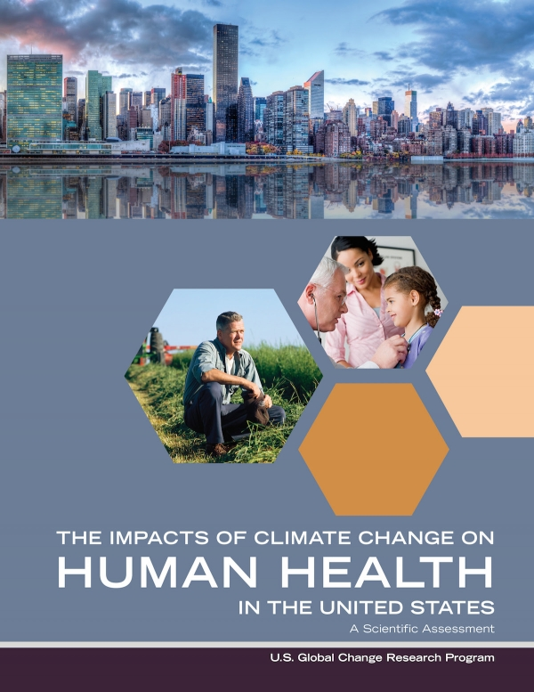
```

## Documenting uncertainty in key findings

```{r echo = FALSE, out.width = "\\textwidth", fig.align = "center"}
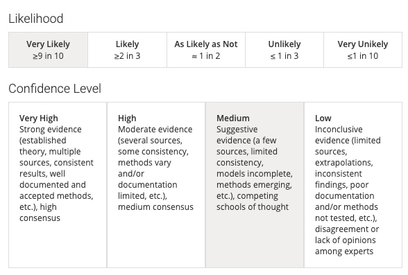
```

\footnotesize Source: https://health2016.globalchange.gov/documenting-uncertainty

# Temperature and Human Health 

## Temperature extremes and human health

```{r echo = FALSE, out.width = "0.5\\textwidth", fig.align = "center"}
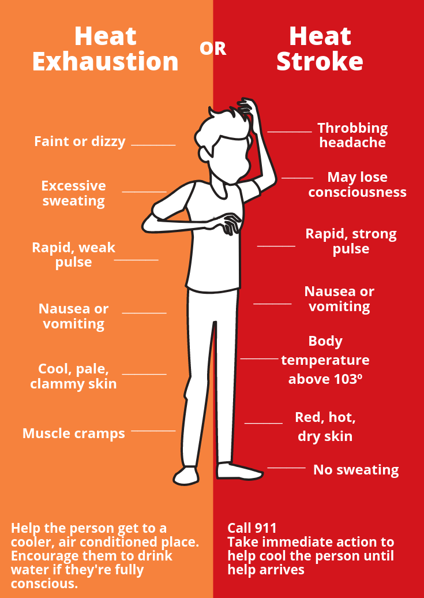
```

\footnotesize Source: https://www.oregon.gov/oha

## Thermoregulation

```{r echo = FALSE, out.width = "0.6\\textwidth", fig.align = "center"}
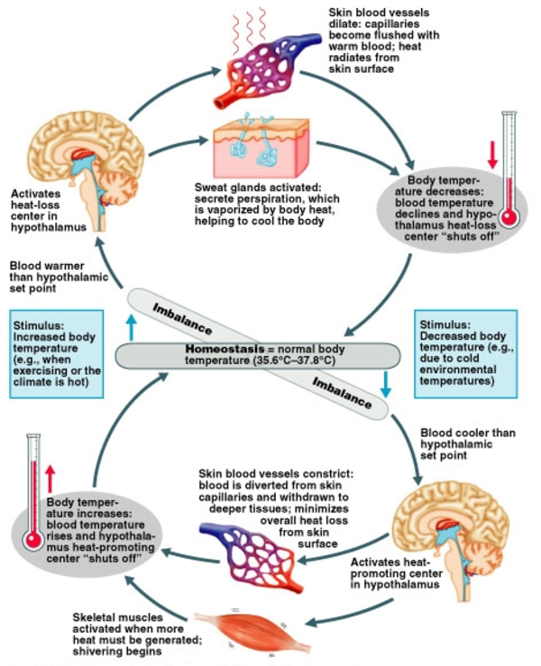
```

\footnotesize Source: pathwayz.org, credit Ben Himme

## Temperature extremes and human health

Heat-Related Deaths in Chicago in the Summer of 1995

```{r echo = FALSE, out.width = "0.9\\textwidth", fig.align = "center"}
knitr::include_graphics("figures/chicago_hw.png")
```

\footnotesize Source: https://health2016.globalchange.gov

## Adaptation to temperature extremes

## Pathways for extreme heat and health

```{r echo = FALSE, out.width = "\\textwidth", fig.align = "center"}
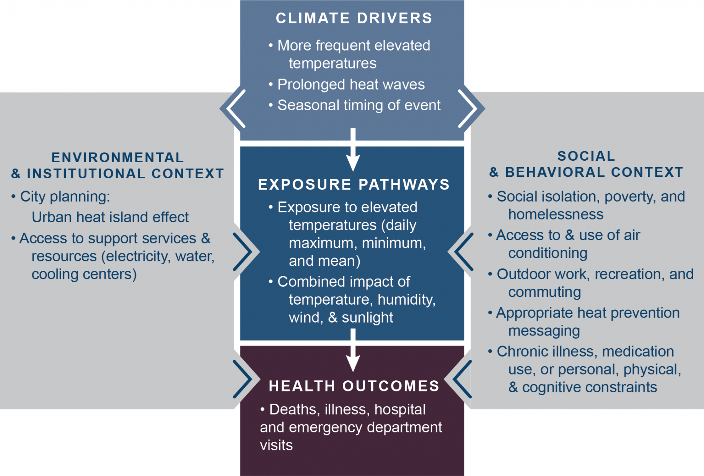
```

\footnotesize Source: https://health2016.globalchange.gov/temperature-related-death-and-illness

## Key findings

```{r echo = FALSE, out.width = "0.5\\textwidth", fig.align = "center"}
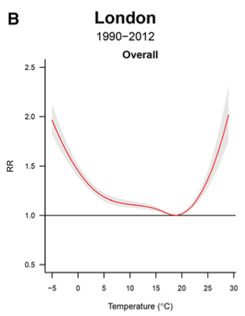
```

\footnotesize Source: Vicedo-Cabrera et al., 2019, *Epidemiology*


## Key findings

```{r echo = FALSE, out.width = "\\textwidth", fig.align = "center"}
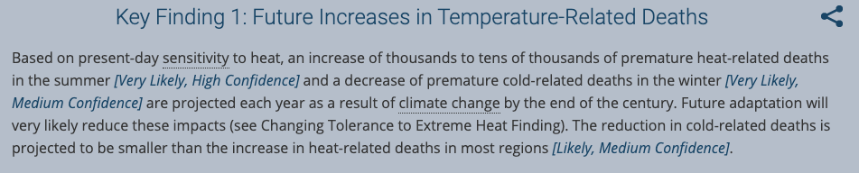
```

\footnotesize Source: https://health2016.globalchange.gov/temperature-related-death-and-illness

## Key findings

```{r echo = FALSE, out.width = "0.5\\textwidth", fig.align = "center"}
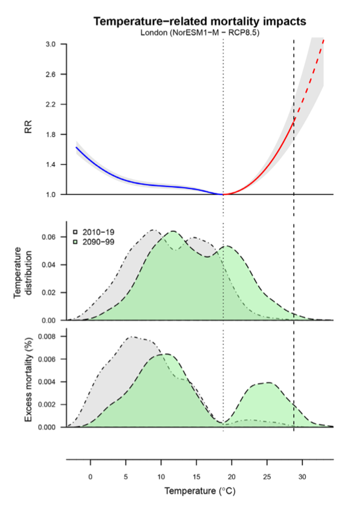
```

\footnotesize Source: Vicedo-Cabrera et al., 2019, *Epidemiology*

## Key findings

```{r echo = FALSE, out.width = "\\textwidth", fig.align = "center"}
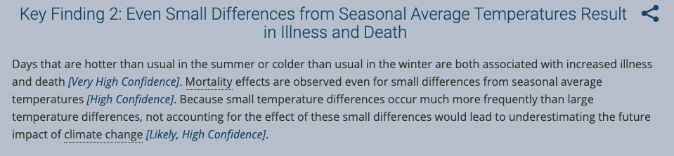
```

\footnotesize Source: https://health2016.globalchange.gov/temperature-related-death-and-illness


## Key findings

```{r echo = FALSE, out.width = "\\textwidth", fig.align = "center"}
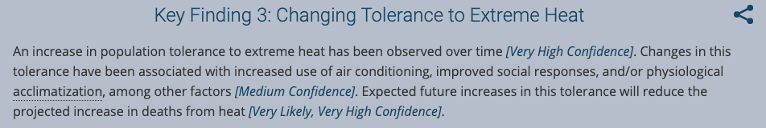
```

\footnotesize Source: https://health2016.globalchange.gov/temperature-related-death-and-illness

## Key findings

```{r echo = FALSE, out.width = "\\textwidth", fig.align = "center"}

```

\footnotesize Source: https://health2016.globalchange.gov/temperature-related-death-and-illness


# Climate-related Disasters and Human Health

## Climate-related disasters

```{r echo = FALSE, out.width = "\\textwidth", fig.align = "center"}
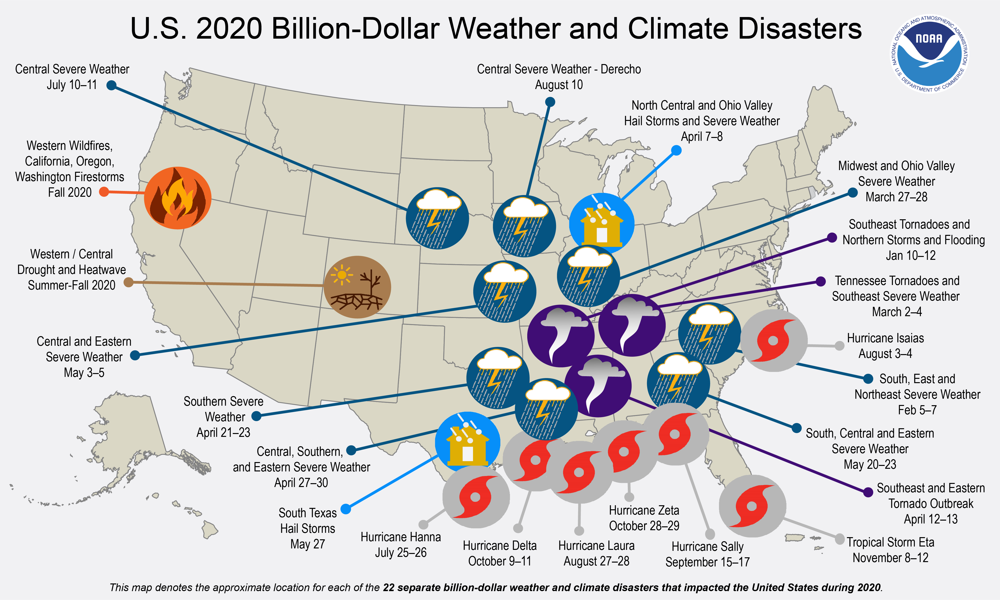
```

\footnotesize Source: https://www.ncdc.noaa.gov/billions/

## Pathways

```{r echo = FALSE, out.width = "\\textwidth", fig.align = "center"}
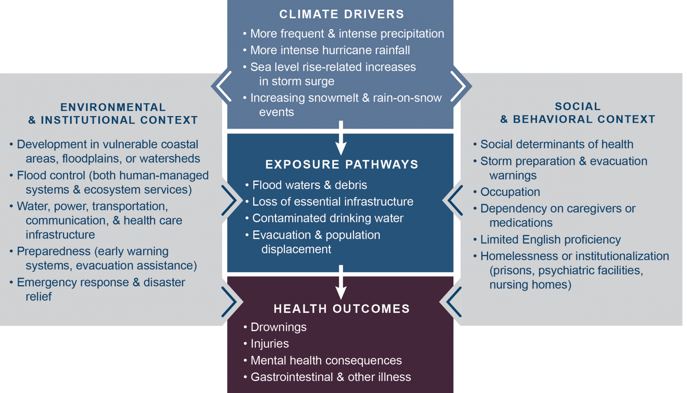
```

\footnotesize Source: https://health2016.globalchange.gov

## Key findings

```{r echo = FALSE, out.width = "\\textwidth", fig.align = "center"}
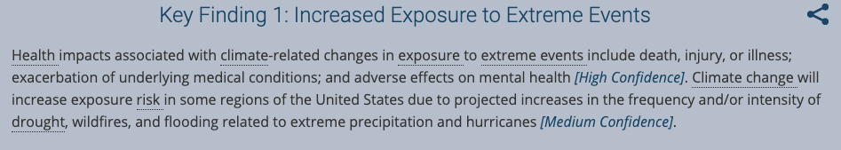
```

\footnotesize Source: https://health2016.globalchange.gov

## Key findings

```{r echo = FALSE, out.width = "\\textwidth", fig.align = "center"}
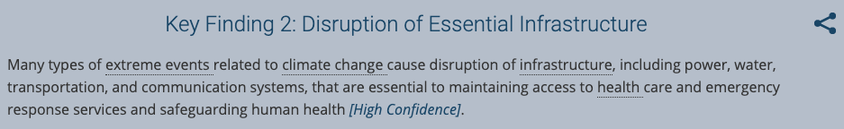
```

\footnotesize Source: https://health2016.globalchange.gov

## Key findings

```{r echo = FALSE, out.width = "\\textwidth", fig.align = "center"}
knitr::include_graphics("figures/irma_power_outages.png")
```

\footnotesize Source: U.S. Energy Information Administration based on data from Florida Division of Emergency Management and NOAA National Hurricane Center

## Key findings

```{r echo = FALSE, out.width = "0.95\\textwidth", fig.align = "center"}

```

\footnotesize Source: newsonsix.com

<!-- Hollywood, Florida, evacuated over 100 patients from nursing home, respiratory distress, dehydration, heat-related issues. -->

## Key findings

```{r echo = FALSE, out.width = "\\textwidth", fig.align = "center"}
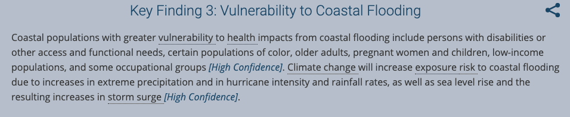
```

\footnotesize Source: https://health2016.globalchange.gov

# Conclusion

## Other topics on climate and health

- Air quality
- Water-borne disease
- Vector-borne disease
- Food and nutrition
- Mental health
- Populations of concern

## Pathways forward

- International policy
- National policy
- Local preparations
- Learning how to adapt
- More extreme measures: 
  + Migration
  + Geoengineering


