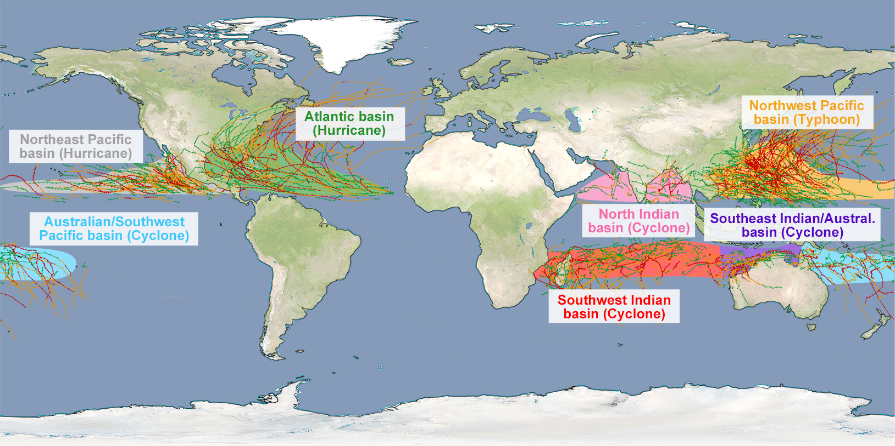
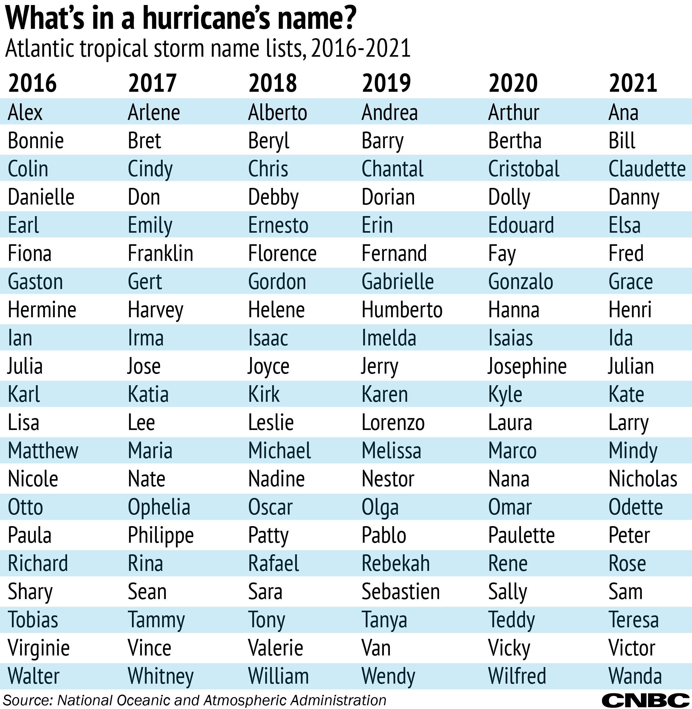
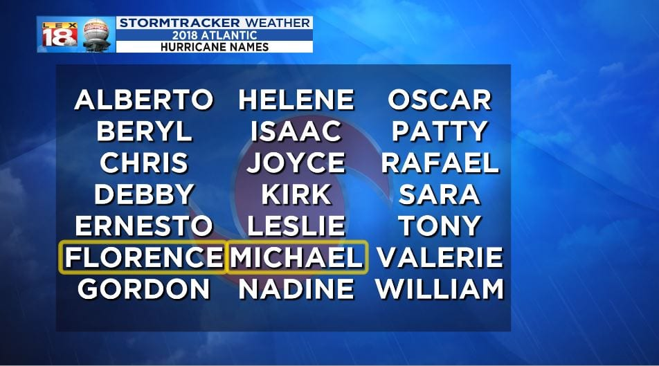
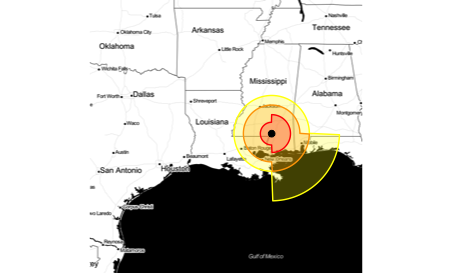
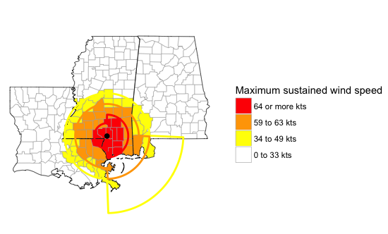
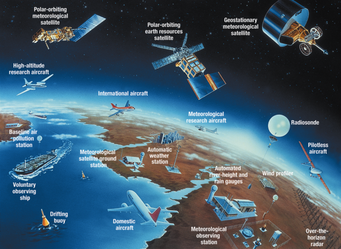

## Workshop overview

- Topics: ...
- Packages: ...

## Required set-up (1)

- Install R [add link]
- Install RStudio [add link] (Recommended but not required)

## Required set-up (2)

- Install `hurricaneexposuredata` (from our personal repo)

```{r eval = FALSE}
install.packages("drat") # Only run if you don't have `drat` installed
library("drat")

addRepo("geanders")
install.packages("hurricaneexposuredata")
```

## Required set-up (2)

[Screenshot---R Journal article]

## Required set-up (3)

- Install `hurricaneexposure` (from GitHub)

## Required set-up (4)

- Install supplementary packages: 
    + `tidyverse`
    + `sf`
    + `tigris`
    + `rnaturalearth` and `rnaturalearthdata`
    + `weathermetrics`
    + `noaastormevents`
    + `stormwindmodel`
    + `viridis`
    
## Load packages

To start, load only the two `hurricaneexposure` packages and the 
`tidyverse` package (for standard data science R tools).

```{r message = FALSE, warning = FALSE}
library("hurricaneexposuredata")
library("hurricaneexposure")
library("tidyverse")
```

# Basics on tropical cyclone data

## Tropical cyclone basins

```{r echo = FALSE, out.width = "\\textwidth"}

```
\footnotesize
Source: Deutsche Wetterdienst

## Tropical cyclone names

```{r echo = FALSE, out.height = "0.85\\textheight", fig.align = "center"}

```
\footnotesize
Source: CNBC / NOAA

## Retiring names

```{r echo = FALSE, out.width = "\\textwidth", fig.align = "center"}

```
\footnotesize
Source: Lex18

## "Best tracks" data

## Interpolating tracks

[Plot from stormwindmodel vignette]

## Mapping storm tracks

You can map a storm's track with the `map_tracks` function from `hurricaneexposure`.
For example, map the track of Hurricane Sandy with: 

```{r out.width = "0.6\\textwidth", fig.width = 4, fig.align = "center"}
map_tracks(storm = "Sandy-2012")
```

## Mapping storm tracks

The output is a `ggplot`-class object, so you can add elements as with other
`ggplot`-class objects:

```{r out.width = "0.55\\textwidth", fig.width = 4,  fig.align = "center"}
map_tracks(storm = "Sandy-2012") + 
   labs(title = "Central track of Hurricane Sandy, 2012",
        caption = "Based on HURDAT2 Best Tracks") 
```

## Mapping storm tracks

You can plot the tracks of multiple storms. For example, you can plot the 
tracks of all the tracked storms that came near the US in 2018 with:

```{r}
map_tracks(storm = c("Alberto-2018", "Chris-2018", "Florence-2018", 
                     "Gordon-2018", "Michael-2018"))
```

## Storm track data

This function is using storm track data that we've included in the 
`hurricaneexposuredata` package, in a dataset called `hurr_tracks`:

```{r}
data("hurr_tracks")
hurr_tracks %>% sample_n(3)
```

## Storm track data

You can work directly with this dataset. For example, you can use regular
expressions to identify all the storms in the dataset within a certain year
and the number of tracking data points for each in this data:

```{r}
hurr_tracks %>% 
   filter(str_detect(storm_id, "2018")) %>%
   group_by(storm_id) %>% 
   summarize(n = n(), max_wind = max(wind), 
             start_date = first(date))
```

## Storm track data

Similarly, you can explore patterns in the storm track measurements, like 
each storm's pattern of maximum sustained winds over time:

```{r out.height = "0.5\\textheight", fig.height = 3.5, message = FALSE, warning = FALSE}
library("lubridate")
hurr_tracks %>% 
   filter(str_detect(storm_id, "2018")) %>% 
   ggplot(aes(x = ymd_hm(date), y = wind)) + 
   geom_point() + 
   facet_wrap(~ storm_id, scales = "free_x")
```


## Other R sources for storm tracks

[IBTrACS?]

## Your turn

- Map the tracks of Hurricane Harvey in 2012 using `map_tracks`.
- Map the tracks of Hurricane Harvey in 2012 and Tropical Storm 
Allison in 2011 using `map_tracks`
- Create these maps using the `sf` package, adding color for the
maximum sustained wind of the storm at each time point

# R tools for geospatial tools

## `sf` framework for geospatial data

```{r message = FALSE, warning = FALSE}
library("sf")
storms_2018 <- hurr_tracks %>% 
   filter(str_detect(storm_id, "2018")) %>% 
   st_as_sf(coords = c("longitude", "latitude"))
```

## `sf` framework for geospatial data

\small

```{r}
storms_2018
```

## `sf` framework for geospatial data

```{r out.height = "0.6\\textheight", fig.height = 3.5, fig.align = "center"}
ggplot() + 
   geom_sf(data = storms_2018) 
```

## `sf` framework for geospatial data

```{r message = FALSE, warning = FALSE, out.height = "0.6\\textheight", fig.height = 3.5, fig.align = "center"}
library("viridis")
ggplot() + 
   geom_sf(data = storms_2018, 
           aes(color = wind)) + 
   scale_color_viridis()
```

## `sf` framework for geospatial data

```{r out.height = "0.6\\textheight", fig.height = 3.5, fig.align = "center"}
ggplot() + 
   geom_sf(data = storms_2018, 
           aes(color = wind)) + 
   scale_color_viridis() + 
   xlim(c(-95, -65)) + 
   ylim(c(20, 45))
```

## `tigris` package

```{r message = FALSE, warning = FALSE}
library("tigris")
fl_counties <- counties(state = "FL", 
                        cb = FALSE, resolution = "20m", 
                        class = "sf")
```

## `tigris` package

```{r}
fl_counties %>% slice(1:3)
```

## `tigris` package

```{r}
ggplot() + 
   geom_sf(data = fl_counties)
```

## Putting things together

```{r}
michael_2018 <- storms_2018 %>% 
   st_set_crs(4269) %>% 
   filter(storm_id == "Michael-2018")
michael_2018 %>% slice(1:3)
```

## Putting things together

```{r eval = FALSE}
ggplot() + 
   geom_sf(data = fl_counties) +
   geom_sf(data = michael_2018, 
           aes(color = wind)) + 
   scale_color_viridis() + 
   xlim(c(-88, -79)) + 
   ylim(c(24, 32)) + 
   theme_void() + 
   labs(color = "Maximum\nsustained\nwind (m/s)")
```

## Putting things together

```{r echo = FALSE}
ggplot() + 
   geom_sf(data = fl_counties) +
   geom_sf(data = michael_2018, 
           aes(color = wind)) + 
   scale_color_viridis() + 
   xlim(c(-88, -79)) + 
   ylim(c(24, 32)) + 
   theme_void() + 
   labs(color = "Maximum\nsustained\nwind (m/s)")
```

## `rnaturalearth` packages

## Converting to `sf` object

[Convert hurricane tracks to `sf`]

## Your turn

- Create a map of North America and the track of [storm]
- Create a map of Florida ZIP codes and the track of [storm]

# How close have storms come to US counties?

## Population mean centers

```{r}
data("county_centers")
head(county_centers)
```

## FIPs codes

# Tropical cyclone hazards

## Tropical cyclone hazards

## Different patterns in hazards

```{r echo = FALSE, out.height = "0.95\\textheight", fig.align = "center"}
knitr::include_graphics("figures/ivanonly.pdf")
```

# Wind exposures

## Modeling storm wind field

## Determining county peak sustained wind


## All wind exposures for a storm

```{r}
map_wind_exposure(storm = "Michael-2018", wind_limit = 38)
```

## All wind exposures for a storm

[Dataframe]

## All wind exposures for a county

```{r}
fl_counties <- county_centers %>% 
   filter(str_sub(fips, 1, 2) == "12") %>% 
   purrr::pluck("fips")
fl_counties
```

## All wind exposures for a county

\small

```{r}
county_wind(counties = fl_counties, wind_limit = 38,
            start_year = 2016, end_year = 2018)
```

## All wind exposures for a county

```{r}
map_counties(storm = "Michael-2018", metric = "wind")
```


## All wind exposures for a county

[Histogram of intensities]

## Joining wind exposure and outcomes

[Air delay example]

## Other sources of wind exposure

```{r echo = FALSE, out.width = "\\textwidth", fig.align = "center"}

```

## Other sources of wind exposure

```{r echo = FALSE, out.width = "\\textwidth", fig.align = "center"}

```

## Comparison of wind data

```{r echo = FALSE, out.height = "0.95\\textheight", fig.align = "center"}
knitr::include_graphics("figures/windcomparison.pdf")
```

## Comparison of wind data

```{r echo = FALSE, out.height = "0.9\\textheight", fig.align = "center"}
knitr::include_graphics("figures/windexamples.pdf")
```

## Using wind radii--based metrics

[Code for using wind radii]

## Other wind metrics

- Gust wind speed
- Duration of high wind

## Your turn

- Determine all the storms that brought winds
of [x] m / s or higher to the following counties: 
x, y, z.
- Which brought the most intense wind to county x?
Create a map showing the peak sustained wind that
storm brought to each eastern US county.
- Create the same map, but use the wind radii--based
wind exposure values rather than the modeled wind 
values.
- Create a scatterplot comparing modeled wind estimates
versus wind radii--based estimates for all storms that
brought winds of [x] m / s or higher to county x 
(based on modeled wind estimates).

# Rain exposures

## Re-analysis weather data

```{r echo = FALSE, out.height = "0.95\\textheight", fig.align = "center"}

```

## CDC WONDER database

```{r echo = FALSE, out.width = "\\textwidth", fig.align = "center"}

```
\footnotesize
Source: US Centers for Disease Control and Prevention

## Matching with storm tracks

## Cumulative rainfall


## All rain exposures for a storm

```{r}
map_rain_exposure(storm = "Allison-2001", rain_limit = 75, 
                  dist_limit = 250)
```

## All rain exposures for a storm

```{r}
all_fips <- county_centers %>% pull("fips")
county_rain(counties = all_fips, 
            rain_limit = 150, dist_limit = 250,
            start_year = 2001, end_year = 2001) %>% 
   filter(storm_id == "Allison-2001")
```


## All rain exposures for a county

```{r}
tx_counties <- county_centers %>% 
   filter(str_sub(fips, 1, 2) == "48") %>% 
   pull("fips")
tx_counties %>% head()
```

## All rain exposures for a county

\small

```{r}
county_rain(counties = tx_counties, rain_limit = 175,
            dist_limit = 250,
            start_year = 2009, end_year = 2011)
```

## Distance constraint

```{r echo = FALSE, out.height = "0.95\\textheight", fig.align = "center"}
knitr::include_graphics("figures/rainexamples.pdf")
```

## All rain exposures for a county

```{r}
map_counties(storm = "Hermine-2010", metric = "rainfall")
```

## Choice of days to include

Use only the storm day for the cumulative precipitation for Tropical Storm Allison.

```{r}
map_counties(storm = "Allison-2001", metric = "rainfall",
             days_included = 0)
```

## Choice of days to include

Use a three-day window for the cumulative precipitation for Tropical Storm Allison.

```{r}
map_counties(storm = "Allison-2001", metric = "rainfall",
             days_included = -1:1)
```

## Choice of days to include

Use a six-day window for the cumulative precipitation for Tropical Storm Allison.

```{r}
map_counties(storm = "Allison-2001", metric = "rainfall",
             days_included = -3:3)
```

## All rain exposures for a county

[Histogram of intensities]

## Alternative precipitation data

```{r echo = FALSE, out.height = "0.95\\textheight", fig.align = "center"}

```

## Comparison with ground-based monitors

```{r echo = FALSE, out.height = "0.95\\textheight", fig.align = "center"}
knitr::include_graphics("figures/raincomparison.pdf")
```

## Your turn

- Map the precipitation associated with [storm]
for the day of the storm.
- Map the cumulative precipitation associated 
with [storm] from one day before to one day
after the storm.
- Map the cumulative precipitation associated 
with [storm] from three days before to three
days after (i.e., a one week window around the
storm day).

# Flood and tornado exposures

## NOAA Storm Events database

## Matching event listings with storm tracks

## Mapping flood events for a storm

```{r}
map_event_exposure(storm_id = "Allison-2001", event_type = "flood")
```


## Identifying counties with flood events for a storm

```{r}
county_events(counties = tx_counties, event_type = "flood",
              start_year = 2001, end_year = 2001) %>% 
   filter(storm_id == "Allison_2001")
```

## Other sources of flood data

```{r echo = FALSE, out.height = "0.95\\textheight", fig.align = "center"}

```

## Comparison with streamgage data

```{r echo = FALSE, out.width = "\\textwidth", fig.align = "center"}
knitr::include_graphics("figures/floodcomparison.pdf")
```

## Your turn

- Which county had the most tropical cyclone
tornado exposures between 1988 and 2015?
- Which state had the most county tropical 
cyclone tornado exposures between 1988 and 2015?
- Which storm brought the most tornado exposures
to this state? Map county tornado exposures during this 
storm.

# Other helpful packages

## `weathermetrics` package

## `stormwindmodel` package

## `noaastormevents` package

## `futureheatwaves` package

[R Journal article on working with climate data]

