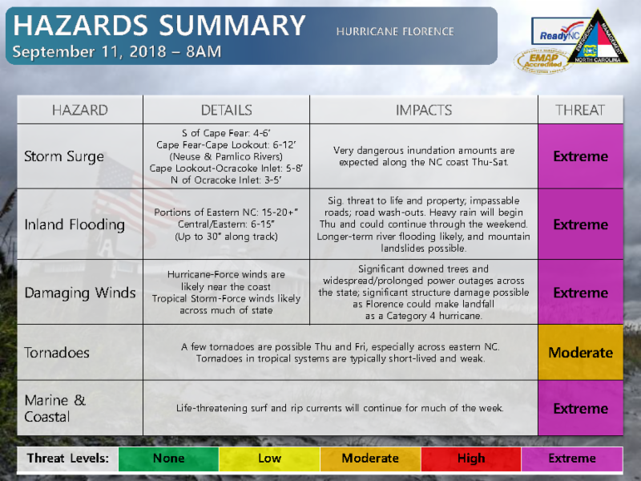
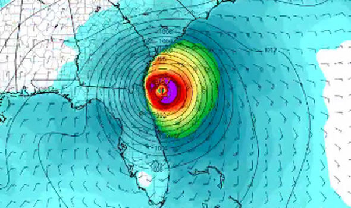

## Required set-up (1)

- [Install R](https://cran.rstudio.com/)
- [Install RStudio](https://rstudio.com/products/rstudio/download/) (Recommended but not required)

## Required set-up (2)

```{r echo = FALSE, out.width = "\\textwidth", fig.align = "center"}

```

## Required set-up (2)

- Install `hurricaneexposuredata` (from our personal repo)

```{r eval = FALSE}
install.packages("drat") # Only run if you don't have `drat` 
library("drat")

addRepo("geanders")
install.packages("hurricaneexposuredata")
```

## Required set-up (3)

- Install `hurricaneexposure` (from GitHub)

```{r eval = FALSE}
install.packages("devtools") # If you don't have `devtools`
library("devtools")
install_github("geanders/hurricaneexposure")
```

## Required set-up (4)

- Install supplementary packages: 
    + `tidyverse`
    + `sf`
    + `tigris`
    + `rnaturalearth` and `rnaturalearthdata`
    + `weathermetrics`
    + `noaastormevents`
    + `stormwindmodel`
    + `viridis`
    
## For more on R

```{r echo = FALSE, out.width = "0.5\\textwidth", fig.align = "center"}

```

## For more on geocomputation with R

```{r echo = FALSE, out.width = "0.5\\textwidth", fig.align = "center"}

```
    
## Load packages

To start, load only the two `hurricaneexposure` packages and the 
`tidyverse` package (for standard data science R tools).

```{r message = FALSE, warning = FALSE}
library("hurricaneexposuredata")
library("hurricaneexposure")
library("tidyverse")
```

# Basics on tropical cyclone data

## Tropical cyclone basins

```{r echo = FALSE, out.width = "\\textwidth"}
knitr::include_graphics("figures/tc_basis_dwd_de.jpg")
```
\footnotesize
Source: Deutsche Wetterdienst

## Tropical cyclone names

```{r echo = FALSE, out.height = "0.85\\textheight", fig.align = "center"}
knitr::include_graphics("figures/atlantic_storm_names_cnbc.png")
```
\footnotesize
Source: CNBC / NOAA

## Retiring names

```{r echo = FALSE, out.width = "\\textwidth", fig.align = "center"}

```
\footnotesize
Source: Lex18

## Storm track data

```{r echo = FALSE, out.width = "0.85\\textwidth", fig.align = "center"}

```
\footnotesize
Source: NOAA

## "Best tracks" data

```{r echo = FALSE, out.width = "0.9\\textwidth", fig.align = "center"}

```
\footnotesize
Source: NOAA

## Unusual storm tracks 

```{r echo = FALSE, out.width = "0.9\\textwidth", fig.width = 5, fig.align = "center"}
map_tracks(storm = "Gordon-1994") + 
   ggtitle("Gordon (1994)")
```

## Unusual storm tracks 

```{r echo = FALSE, out.width = "0.9\\textwidth", fig.width = 5, fig.align = "center"}
map_tracks(storm = "Allison-2001") + 
   ggtitle("Allison (2001)")
```

## Unusual storm tracks 

```{r echo = FALSE, out.width = "0.9\\textwidth", fig.width = 5, fig.align = "center"}
map_tracks(storm = "Ivan-2004") + 
   ggtitle("Ivan (2004)")
```

## Interpolating tracks

```{r echo = FALSE, message = FALSE, warning = FALSE, out.height = "\\textheight", fig.height = 4}
library(stormwindmodel)
data("floyd_tracks")
floyd_15_min <- create_full_track(hurr_track = floyd_tracks)
library(sf)
library(maps)
library(ggplot2)

floyd_states <- sf::st_as_sf(map("state", plot = FALSE, fill = TRUE)) %>% 
  dplyr::filter(ID %in% c("north carolina", "south carolina", "maryland",
                          "georgia", "florida", "virginia", "delaware", 
                          "pennsylvania", "west virginia", "new jersey",
                          "new york"))

floyd_tracks <- floyd_tracks %>% 
  st_as_sf(coords = c("longitude", "latitude")) %>% 
  st_set_crs(4326)

floyd_15_min <- floyd_15_min %>% 
  mutate(tclon = -tclon) %>% 
  st_as_sf(coords = c("tclon", "tclat")) %>% 
  st_set_crs(4326)

a <- ggplot() + 
  geom_sf(data = floyd_states, 
          fill = "aliceblue") + 
  xlim(c(-90, -70)) + 
  ylim(c(24, 46))
b <- a +
  geom_sf(data = floyd_15_min,
          size = 0.5, color = "red") + 
  ggtitle("Interpolated to 15 minutes")
c <- a + 
    geom_sf(data = floyd_tracks,
            size = 0.5, color = "red") + 
  ggtitle("Uninterpolated (6 hours)") 

gridExtra::grid.arrange(c, b, ncol = 2)
```


## Mapping storm tracks

You can map a storm's track with the `map_tracks` function from `hurricaneexposure`.
For example, map the track of Hurricane Sandy with: 

```{r out.width = "0.6\\textwidth", fig.width = 4, fig.align = "center"}
map_tracks(storm = "Sandy-2012")
```

## Mapping storm tracks

The output is a `ggplot`-class object, so you can add elements as with other
`ggplot`-class objects:

```{r out.width = "0.55\\textwidth", fig.width = 4,  fig.align = "center"}
map_tracks(storm = "Sandy-2012") + 
   labs(title = "Central track of Hurricane Sandy, 2012",
        caption = "Based on HURDAT2 Best Tracks") 
```

## Mapping storm tracks

You can plot the tracks of multiple storms. For example, you can plot the 
tracks of all the tracked storms that came near the US in 2012 with:

```{r out.width = "0.55\\textwidth", fig.width = 4,  fig.align = "center"}
map_tracks(storm = c("Alberto-2012", "Beryl-2012", "Debby-2012",
                     "Isaac-2012", "Sandy-2012"))
```

## Storm track data

This function is using storm track data that we've included in the 
`hurricaneexposuredata` package, in a dataset called `hurr_tracks`:

```{r}
data("hurr_tracks")
hurr_tracks %>% sample_n(3)
```

## Storm track data

You can work directly with this dataset. For example, you can use regular
expressions to identify all the storms in the dataset within a certain year
and the number of tracking data points for each in this data:

```{r}
hurr_tracks %>% 
   filter(str_detect(storm_id, "2012")) %>%
   group_by(storm_id) %>% 
   summarize(n = n(), max_wind = max(wind), 
             start_date = first(date))
```

## Storm track data

Similarly, you can explore patterns in the storm track measurements, like 
each storm's pattern of maximum sustained winds over time:

```{r out.height = "0.5\\textheight", fig.height = 3.5, message = FALSE, warning = FALSE}
library("lubridate")
hurr_tracks %>% 
   filter(str_detect(storm_id, "2012")) %>% 
   ggplot(aes(x = ymd_hm(date), y = wind)) + 
   geom_point() + 
   facet_wrap(~ storm_id, scales = "free_x")
```


## Other R sources for storm tracks

```{r echo = FALSE, out.height = "0.8\\textheight", fig.align = "center"}
knitr::include_graphics("figures/ibtracs-tropical-cyclone-tracks-map.png")
```

The R package `noaastorms` wraps an API for IBTrACS.

## Your turn

- Map the tracks of one of the unusual storms using `map_tracks`.
- Map the tracks of several of the unusual storms on the same map using `map_tracks`

# R tools for geospatial tools

## `sf` framework for geospatial data

The `sf` package allows you to work with geospatial data within the "tidyverse" 
framework. You can convert a regular dataframe to an `sf` object using `st_as_sf`:

```{r message = FALSE, warning = FALSE}
library("sf")
storms_2012 <- hurr_tracks %>% 
   filter(str_detect(storm_id, "2012")) %>% 
   st_as_sf(coords = c("longitude", "latitude"))
```

## `sf` framework for geospatial data

\small

```{r}
storms_2012
```

## `sf` framework for geospatial data

You can use `ggplot2` to create maps with `sf` objects:

```{r out.height = "0.6\\textheight", fig.height = 3.5, fig.align = "center"}
ggplot() + 
   geom_sf(data = storms_2012) 
```

## `sf` framework for geospatial data

```{r message = FALSE, warning = FALSE, out.height = "0.6\\textheight", fig.height = 3.5, fig.align = "center"}
library("viridis")
ggplot() + 
   geom_sf(data = storms_2012, 
           aes(color = wind)) + 
   scale_color_viridis()
```

## `sf` framework for geospatial data

```{r out.height = "0.6\\textheight", fig.height = 3.5, fig.align = "center"}
ggplot() + 
   geom_sf(data = storms_2012, 
           aes(color = wind)) + 
   scale_color_viridis() + 
   xlim(c(-95, -65)) + ylim(c(20, 45))
```

## `tigris` package

The `tigris` package allows you to access spatial data from the US Census
directly from R. For example, to pull geographic data for county boundaries
for Florida counties, run:

```{r message = FALSE, warning = FALSE, results = "hide"}
library("tigris")
ny_counties <- counties(state = "NY", 
                        cb = FALSE, resolution = "20m", 
                        class = "sf")
```

## `tigris` package

\footnotesize

```{r}
ny_counties %>% slice(1:3)
```

## `tigris` package

```{r out.height = "0.8\\textheight", fig.height = 4, fig.align = "center"}
ggplot() + 
   geom_sf(data = ny_counties)
```

## Putting things together

```{r}
sandy_2012 <- storms_2012 %>% 
   st_set_crs(4269) %>% 
   filter(storm_id == "Sandy-2012")
sandy_2012 %>% slice(1:3)
```

## Putting things together

You can plot several "layers" of geospatial data by adding `geom_sf` calls for the
ggplot object:

```{r eval = FALSE}
ggplot() + 
   geom_sf(data = ny_counties) +
   geom_sf(data = sandy_2012, 
           aes(color = wind)) + 
   scale_color_viridis() + 
   xlim(c(-80, -70)) + 
   ylim(c(38, 46)) + 
   theme_void() + 
   labs(color = "Maximum\nsustained\nwind (m/s)")
```

## Putting things together

```{r echo = FALSE, out.height = "0.8\\textheight", fig.height = 4, fig.align = "center"}
ggplot() + 
   geom_sf(data = ny_counties) +
   geom_sf(data = sandy_2012, 
           aes(color = wind)) + 
   scale_color_viridis() + 
   xlim(c(-80, -70)) + 
   ylim(c(38, 46)) + 
   theme_void() + 
   labs(color = "Maximum\nsustained\nwind (m/s)")
```


## Your turn


- Use `tigris` and `sf` to create a map of Florida ZIP codes and the track of one of
the unusual storms

# How close have storms come to US counties?

## Geographic mean centers

```{r echo = FALSE, out.height = "0.85\\textheight", fig.align = "center"}

```
\footnotesize
Source: Hallisey et al., 2017

## Population mean centers

```{r echo = FALSE, out.height = "0.85\\textheight", fig.align = "center"}

```
\footnotesize
Source: Hallisey et al., 2017

## Population mean centers

```{r}
data("county_centers")
head(county_centers)
```

## FIPs codes

```{r echo = FALSE, out.width = "0.7\\textwidth", fig.align = "center"}
knitr::include_graphics("figures/FIPSCode_policymap.png")
```

## Finding storm-county minimum distance

```{r echo = FALSE, out.width = "\\textwidth", fig.align = "center"}
knitr::include_graphics("figures/finding_closest_point2.pdf")
```

## Determining all storms that came close to a county

The `county_distance` function from `hurricaneexposure` allows you to determine
which of a county were within a certain distance of the storm's track:

\small

```{r}
county_distance(counties = "51700",
              start_year = 1995, end_year = 2005,
              dist_limit = 30)
```

## Determining all storms that came close to a county

The `county_distance` function from `hurricaneexposure` allows you to determine
which of a **set** of counties were within a certain distance of the storm's track:

\footnotesize 

```{r}
county_distance(counties = c("22071", "51700"),
              start_year = 1995, end_year = 2005,
              dist_limit = 30)
```

## Determining all counties close to a storm track

First, use regular expressions to extract all North Carolina county FIPs
from the dataset of all counties:

```{r}
nc_counties <- county_centers %>% 
   filter(str_sub(fips, 1, 2) == "37") %>% 
   pull("fips")
head(nc_counties)
```

## Determining all counties close to a storm track

The `county_distance` function from `hurricaneexposure` allows you to determine
which of a set of counties were within a certain distance of the storm's track:

\footnotesize

```{r}
county_distance(counties = nc_counties,
              start_year = 1999, end_year = 1999,
              dist_limit = 10) %>% 
   filter(storm_id == "Floyd-1999")
```

## Mapping all counties close to a storm track

The `map_distance_exposure` function from `hurricaneexposure` allows you to 
map all counties within a certain distance of a storm's track:

```{r fig.height = 4, out.height = "0.9\\textheight"}
map_distance_exposure(storm = "Floyd-1999", dist_limit = 20)
```


# Tropical cyclone hazards

## Tropical cyclone hazards

```{r echo = FALSE, out.height = "0.85\\textheight", fig.align = "center"}

```

## Different patterns in hazards

```{r echo = FALSE, out.height = "0.95\\textheight", fig.align = "center"}
knitr::include_graphics("figures/ivanonly.pdf")
```

# Wind exposure


## Modeling storm wind field

```{r echo = FALSE, out.height = "0.8\\textheight", fig.align = "center"}

```
\footnotesize
Source: Thompson

## Modeling storm wind field

```{r echo = FALSE, out.height = "0.8\\textheight", fig.align = "center"}

```
\footnotesize
Source: NOAA

## Modeling a storm's wind field

```{r echo = FALSE, out.width = "0.9\\textwidth", fig.align = "center"}

```
\footnotesize
Source: NOAA

## Modeling storm wind field

```{r echo = FALSE, out.width = "\\textwidth", fig.align = "center"}

```
\footnotesize
Source: ECMWF

## Modeling storm wind field

Here is an overview of the wind modeling process implemented by this package: 

1. Impute location and maximum wind speed from hurricane track data (every 6 hours) to  every 15 minutes.
2. For each storm track location, calculate all the inputs needed for the Willoughby wind speed model (e.g., forward speed, direction of forward motion of the storm). 
3. For each county center (or other grid point), estimate surface-level sustained wind every 15 minutes. This step includes: measuring distance to county from storm center (radius); calculating tangential gradient wind components at that grid point; calculating gradient wind direction at that grid point; calculating surface wind speed; calculating surface wind direction, adding storm forward motion back into surface wind estimate.
4. Determine for each county the peak sustained wind throughout the storm.


## All wind exposures for a storm

The `map_wind_exposure` function in `hurricaneexposure` allows you to map
all counties with peak sustained wind over a certain threshold (in m / s) 
for a storm:

```{r fig.height = 4, out.height = "0.6\\textheight"}
map_wind_exposure(storm = "Ike-2008", wind_limit = 35)
```

## All wind exposures for a storm

The `county_wind` function from `hurricaneexposure` allows you to determine
which of a set of counties had peak sustained wind above a certain threshold:

\footnotesize

```{r}
county_wind(counties = county_centers$fips, wind_limit = 35,
            start_year = 2008, end_year = 2008) %>% 
   filter(storm_id == "Ike-2008")
```

## All wind exposures for a county

If you want to get values for a certain region (e.g., a state), start by 
creating a vector with the county FIPs codes for all counties in that region.
For example, to get everything from Florida counties, start by running:

```{r}
fl_counties <- county_centers %>% 
   filter(str_sub(fips, 1, 2) == "12") %>% 
   pull("fips")
fl_counties %>% head()
```

## All wind exposures for a county

\small

```{r}
county_wind(counties = fl_counties, wind_limit = 45,
            start_year = 2004, end_year = 2004)
```

## All wind exposures for a storm

Use `map_counties` with `metric = "wind"` to map county-level peak sustained
wind from a storm:

```{r fig.height = 4, out.height = "0.9\\textheight"}
map_counties(storm = "Ike-2008", metric = "wind")
```

## Other sources of wind exposure

Wind radii: estimates of extent of peak sustained winds of certain speeds.

```{r echo = FALSE, out.width = "\\textwidth", fig.align = "center"}
knitr::include_graphics("figures/ext_tracks_1.png")
```

## Other sources of wind exposure

Wind radii: estimates of extent of peak sustained winds of certain speeds.

```{r echo = FALSE, out.width = "\\textwidth", fig.align = "center"}
knitr::include_graphics("figures/ext_tracks_2.png")
```

## Comparison of wind data

```{r echo = FALSE, out.height = "0.95\\textheight", fig.align = "center"}
knitr::include_graphics("figures/windcomparison.pdf")
```

## Comparison of wind data

```{r echo = FALSE, out.height = "0.9\\textheight", fig.align = "center"}
knitr::include_graphics("figures/windexamples.pdf")
```

## Using wind radii--based metrics

You can change to use the wind radii (instead of the modeled wind)
by using the "ext_tracks" option for the `wind_source` parameter
(available since 2004):

```{r fig.height = 4, out.height = "0.6\\textheight"}
map_counties(storm = "Katrina-2005", metric = "wind",
             wind_source = "ext_tracks")
```

## Other wind metrics: Gust

You can use the "vmax_gust" option to the `wind_var` parameter to use gust 
wind estimates unstead of sustained wind estimates (note: this uses a constant
gust factor for conversion):

```{r fig.height = 4, out.height = "0.6\\textheight"}
map_counties(storm = "Katrina-2005", metric = "wind",
             wind_var = "vmax_gust")
```

## Other wind metrics: Duration

You can use the "sust_dur" option to the `wind_var` parameter to use gust 
wind estimates unstead of sustained wind estimates (note: this uses a constant
gust factor for conversion):

```{r fig.height = 4, out.height = "0.6\\textheight"}
map_counties(storm = "Katrina-2005", metric = "wind",
             wind_var = "sust_dur")
```

## Wind data

You can also access the dataframe with all tropical cyclone wind data, 
using `storm_winds`:

```{r}
data("storm_winds")
head(storm_winds)
```

## Wind data---wind radii--based estimates

The wind radii--based estimates are available in the `ext_tracks_wind` data:

```{r}
data("ext_tracks_wind")
head(ext_tracks_wind)
```


## Your turn

- Determine all the storms that brought winds
of 17.5 m / s or higher to Miami-Dade County, FL between
1990 and 2015
- Which brought the most intense wind to Miami-Dade County?
Create a map showing the peak sustained wind that
storm brought to each eastern US county.
- Create the same map, but use the wind radii--based
wind exposure values rather than the modeled wind 
values.

# Rain exposure

## Re-analysis weather data

```{r echo = FALSE, out.height = "0.8\\textheight", fig.align = "center"}

```

## CDC WONDER database

```{r echo = FALSE, out.width = "\\textwidth", fig.align = "center"}
knitr::include_graphics("figures/cdc_wonder.png")
```
\footnotesize
Source: US Centers for Disease Control and Prevention

## Matching with storm tracks

```{r echo = FALSE, out.height = "0.95\\textheight", fig.align = "center"}
knitr::include_graphics("figures/finding_closest_point2.pdf")
```

## Cumulative rainfall

```{r echo = FALSE, out.height = "0.9\\textheight", fig.align = "center"}

```
\footnotesize
Source: Shieh et al. 2010

## All rain exposures for a storm

The `map_rain_exposure` function in `hurricaneexposure` allows you to map
all counties with cumulative precipitation over a certain threshold (in mm) 
for a storm:

```{r fig.height = 4, out.height = "0.6\\textheight"}
map_rain_exposure(storm = "Allison-2001", rain_limit = 75, 
                  dist_limit = 250)
```

## Distance constraint

```{r echo = FALSE, out.height = "0.95\\textheight", fig.align = "center"}
knitr::include_graphics("figures/rainexamples.pdf")
```


## All rain exposures for a storm

The `county_rain` function from `hurricaneexposure` allows you to determine
which of a set of counties had cumulative rainfall above a certain threshold:

\small

```{r}
all_fips <- county_centers %>% pull("fips")
county_rain(counties = all_fips, 
            rain_limit = 150, dist_limit = 250,
            start_year = 2001, end_year = 2001) %>% 
   filter(storm_id == "Allison-2001")
```


## All rain exposures for a county

If you want to get values for a certain region (e.g., a state), start by 
creating a vector with the county FIPs codes for all counties in that region.
For example, to get everything from Texas counties, start by running:

```{r}
tx_counties <- county_centers %>% 
   filter(str_sub(fips, 1, 2) == "48") %>% 
   pull("fips")
tx_counties %>% head()
```

## All rain exposures for a county

\small

```{r}
county_rain(counties = tx_counties, rain_limit = 175,
            dist_limit = 250,
            start_year = 2009, end_year = 2011)
```


## All rain exposures for a county

Use `map_counties` with `metric = "rain"` to map county-level peak sustained
wind from a storm:

```{r fig.height = 4, out.height = "0.7\\textheight"}
map_counties(storm = "Hermine-2010", metric = "rainfall")
```

## Choice of days to include

Use only the storm day for the cumulative precipitation for Tropical Storm Allison.

```{r fig.height = 4, out.height = "0.6\\textheight"}
map_counties(storm = "Allison-2001", metric = "rainfall",
             days_included = 0)
```

## Choice of days to include

Use a three-day window for the cumulative precipitation for Tropical Storm Allison.

```{r fig.height = 4, out.height = "0.6\\textheight"}
map_counties(storm = "Allison-2001", metric = "rainfall",
             days_included = -1:1)
```

## Choice of days to include

Use a six-day window for the cumulative precipitation for Tropical Storm Allison.

```{r fig.height = 4, out.height = "0.6\\textheight"}
map_counties(storm = "Allison-2001", metric = "rainfall",
             days_included = -3:3)
```

## Rain data

```{r}
data("rain")
head(rain)
```


## Alternative precipitation data

```{r echo = FALSE, out.height = "0.8\\textheight", fig.align = "center"}

```

## Comparison with ground-based monitors

```{r echo = FALSE, out.height = "0.9\\textheight", fig.align = "center"}
knitr::include_graphics("figures/raincomparison.pdf")
```

## Your turn

- Map the precipitation associated with Hurricane Ike
for the day of the storm.
- Map the cumulative precipitation associated 
with Hurricane Ike from three days before to three
days after (i.e., a one week window around the
storm day).

# Flood and tornado exposures

## NOAA Storm Events database

```{r echo = FALSE, out.height = "0.7\\textheight", fig.align = "center"}

```

## Mapping flood events for a storm

```{r}
map_event_exposure(storm_id = "Allison-2001", 
                   event_type = "flood")
```


## Identifying counties with flood events for a storm

```{r}
county_events(counties = tx_counties, event_type = "flood",
              start_year = 2001, end_year = 2001) %>% 
   filter(storm_id == "Allison-2001")
```

## Other sources of flood data

```{r echo = FALSE, out.height = "0.8\\textheight", fig.align = "center"}

```

## Comparison with streamgage data

```{r echo = FALSE, out.width = "\\textwidth", fig.align = "center"}
knitr::include_graphics("figures/floodcomparison.pdf")
```

## Your turn

- Which county had the most tropical cyclone
tornado exposures between 1996 and 2015?
- Which state had the most county tropical 
cyclone tornado exposures between 1996 and 2015?
- Which storm brought the most tornado exposures
to this state? Map county tornado exposures during this 
storm.

# Other helpful packages

## `weathermetrics` package

```{r echo = FALSE, out.width = "\\textwidth", fig.align = "center"}

```

## `weathermetrics` package

You can also use this package to convert among weather metrics. For example, you 
can convert from meters per second to knots, you can run:

```{r}
library("weathermetrics")
speed_to_knots(c(20, 30, 40), "mps")
```


## `stormwindmodel`package

The `stormwindmodel` has the wind model used to create the county wind exposure
dataset. You can use it to model winds to other geographical points, as well 
(e.g., ZIP code centriods).

Vignettes: 

- [Overview](https://cran.r-project.org/web/packages/stormwindmodel/vignettes/Overview.html)
- [Full details of the storm modeling](https://cran.r-project.org/web/packages/stormwindmodel/vignettes/Details.html)

## `noaastormevents` package

\footnotesize
\begin{block}{`noaastormevents`}
\medskip
Download and explore listings from the NOAA Storm Events database. Includes the ability to pull events based on a tropical storm, using events listed close in time and distance to the storm's tracks. On CRAN.
\end{block}

\bigskip

```{r message = FALSE, warning = FALSE}
library(noaastormevents)
```
```{r echo = TRUE}
sept_1999_events <- find_events(date_range = c("1999-09-14", "1999-09-18"))
head(sept_1999_events, 3)
```

## `noaastormevents` package

\footnotesize

You can also use this package to identify all counties with events near the time and location of a tropical cyclone:

```{r fig.align = "center", echo = TRUE, fig.width = 5, out.width="\\textwidth"}
floyd_events <- find_events(storm = "Floyd-1999", dist_limit = 300) 
head(floyd_events, 4)
```

## `noaastormevents` package

\footnotesize

You can also pull out and map specific information in this database, including specific types of disasters, property damage, and crop damage.

```{r fig.align = "center", echo = TRUE, fig.width = 5, out.width="0.7\\textwidth"}
floyd_events %>%   
  map_events(plot_type = "crop damage",
             states = c("north carolina", "virginia", "maryland"))
```

## `futureheatwaves` package

```{r echo = FALSE, out.width = "\\textwidth", fig.align = "center"}

```

## `futureheatwaves` package

```{r echo = FALSE, out.width = "\\textwidth", fig.align = "center"}

```

