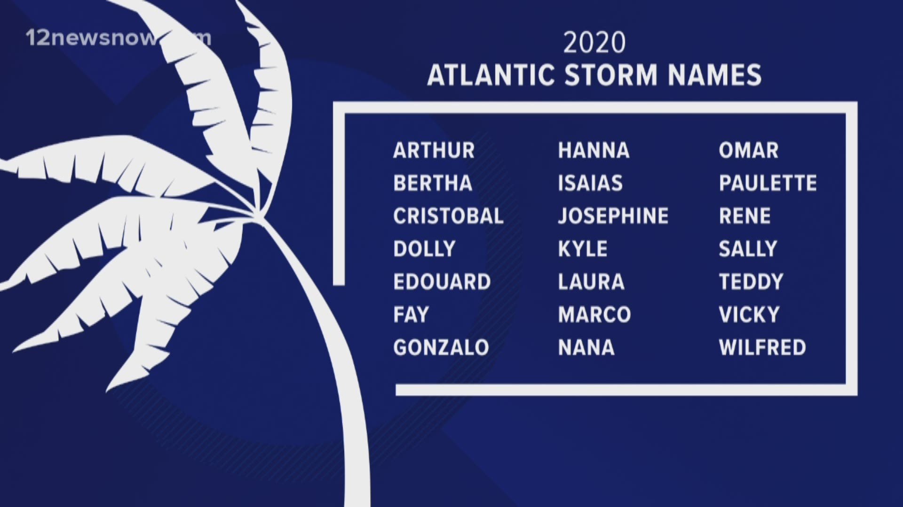

---
output:
  beamer_presentation:
    includes:
      in_header: header.tex
      before_body: anderson_beforebody.txt
fontsize: 10pt
---

## Colorado State University 2020 Atlantic seasonal forecast

```{r echo = FALSE, out.width = "\\textwidth"}

```

\footnotesize Source: https://tropical.colostate.edu/forecasting.html


## 2020 storm names

```{r echo = FALSE, out.width = "\\textwidth"}

```

\footnotesize Source: 12 News Now


## Marco and Laura

```{r echo = FALSE, out.width = "\\textwidth"}
knitr::include_graphics("figures/marco_laura.jpg")
```

\footnotesize Source: The Texas Tribune

## Workshop

"Assessing Exposure to Tropical Cyclones for Epidemiological Research: Existing Resources and Future Needs"

Wednesday, 17:00--18:00, Parallel Track 2

**Survey:** Tell us about your approaches and challenges in assessing exposure to 
tropical cyclones: https://forms.gle/bCRnDnMTKKyufj9M8

Email brooke.anderson@colostate.edu for more information

## Health Impacts of Hurricanes in the Atlantic Basin

```{r echo = FALSE, out.width = "\\textwidth"}

```
