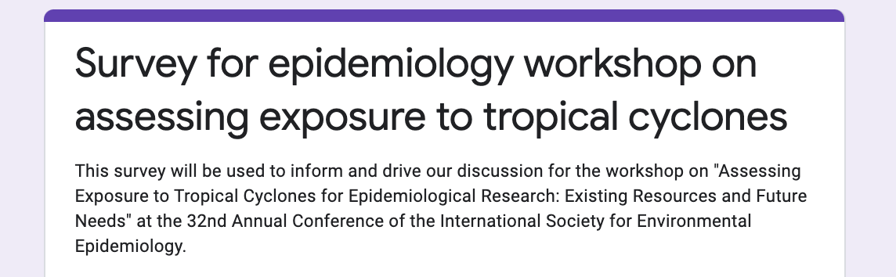
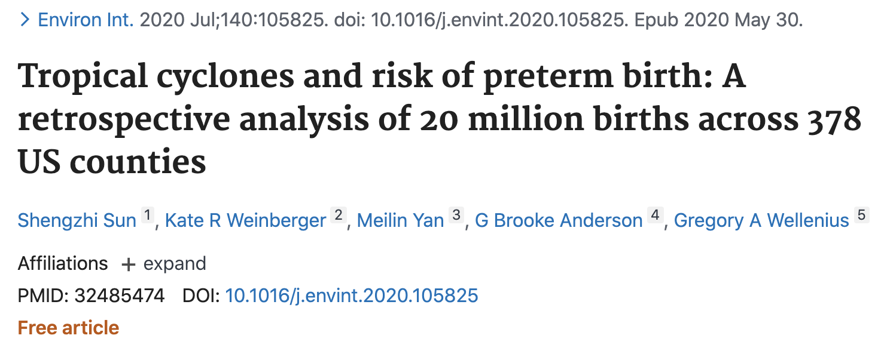
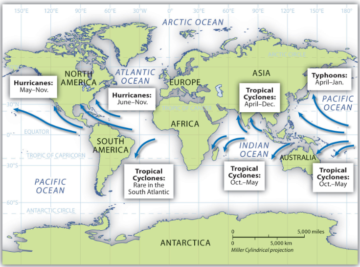
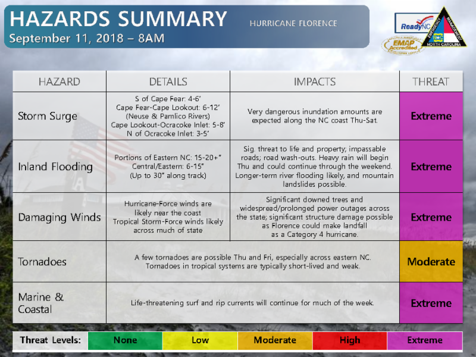
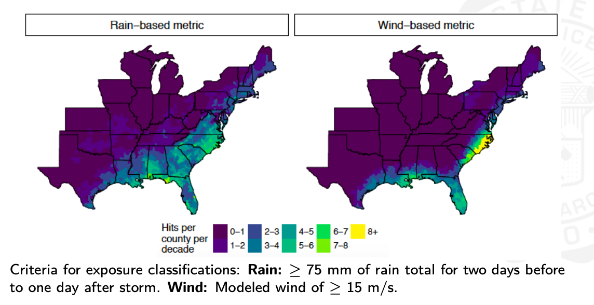

---
output:
  beamer_presentation:
    includes:
      in_header: header.tex
      before_body: anderson_beforebody.txt
fontsize: 10pt
---

```{r echo = FALSE, message = FALSE, warning = FALSE}
library(tidyverse)
library(viridis)
survey <- read_csv("data/Survey for epidemiology workshop on assessing exposure to tropical cyclones.csv")
```

## Workshop motivation

**Package:** `hurricaneexposure`: Explore and Map County-Level Hurricane Exposure in the United States. On CRAN.

**NIEHS K99/R00:** Investigating Health Effects of Climate-Related Disasters in the United States

**NSF Coastlines and People EAGER:** Establishing Interface Standards for Physical Exposure and Human Impacts Data Collection and Publication in Rapid Response to Coastal Hazards

## Workshop format

- Live (microphones on) participants
- Other participants---please write your questions and comments in the Q&A

## Survey

```{r echo = FALSE, out.width="\\textwidth"}

```

Tell us about your approaches and challenges in assessing exposure to 
tropical cyclones: 

https://forms.gle/bCRnDnMTKKyufj9M8

If you would like a copy of the slides, visit:

https://github.com/geanders/GuestLectures/blob/master/isee_2020_workshop/workshop_august_26_2020.pdf

# Survey overview

## Survey overview

**Respondents:** Twelve 

**Papers:** 1 published, 3 submitted/under review, 2 in preparation

\bigskip


```{r echo = FALSE, out.width="0.8\\textwidth", fig.align = "center"}

```

## Survey overview

```{r echo = FALSE, fig.align = "center", fig.width = 6, fig.height = 3.2, out.width = "\\textwidth"}
survey %>% 
  pull(3) %>%  
  paste(collapse = ";") %>% 
  paste(";Neurological outcomes") %>% # From a write-in answer
  str_split(pattern = ";") %>% 
  unlist() %>% 
  str_trim() %>% 
  as_tibble() %>% 
  filter(value != "Other") %>% # Wrote in Other answer above
  group_by(value) %>% 
  count() %>% 
  ggplot(aes(x = fct_reorder(value, n), y = n)) + 
  geom_col() +
  coord_flip() + 
  labs(x = "", y = "Number of survey respondents (of 12)\nstudying or hoping to study the outcome") + 
  ggtitle("Health outcomes of interest") + 
  theme_classic() +
  expand_limits(y = c(0, 12))
```

## Survey overview

```{r echo = FALSE, fig.align = "center", fig.width = 6, fig.height = 3.2, out.width = "\\textwidth"}
survey %>% 
  pull(5) %>% 
  paste(collapse = ";") %>% 
  str_split(pattern = ";") %>% 
  unlist() %>% 
  str_trim() %>% 
  as_tibble() %>% 
  group_by(value) %>% 
  count() %>%  
  ungroup() %>% 
  mutate(value = fct_recode(value, 
                            "Older adults" = "I am focusing on older adults (e.g., people 65 years or older)", 
                            "Pregnant women and/or babies in utero" = "I am focusing on women who are pregnant and/or babies in utero", 
                            "Children" = "I am focusing on children (e.g., people younger than 18 years)", 
                            "General population" = "I am studying or planning to study associations in the general population")) %>% 
  ggplot(aes(x = fct_reorder(value, n), y = n)) + 
  geom_col() +
  coord_flip() + 
  labs(x = "", y = "Number of survey respondents (of 12)\nstudying or hoping to study the population") + 
  ggtitle("Populations of interest") + 
  theme_classic() +
  expand_limits(y = c(0, 12))
```

## Survey overview

```{r echo = FALSE, out.width="0.95\\textwidth", fig.align = "center"}

```

\footnotesize Source: tracethetropics.com

## Survey overview

```{r out.width = "\\textwidth", fig.width = 6.7, fig.height = 3, echo = FALSE, warning = FALSE, message = FALSE}
survey %>% 
  pull(53) %>% 
  paste(collapse = ";") %>% 
  str_split(pattern = ";") %>% 
  unlist() %>% 
  str_trim() %>%
  str_replace("\\(.+", "") %>% 
  as_tibble() %>% 
  group_by(value) %>% 
  count() %>% 
  ggplot(aes(x = fct_reorder(value, n), y = n)) + 
  geom_col() +
  coord_flip() + 
  labs(x = "", y = "Number of survey respondents (of 12)\nstudying or hoping to study the storm basin") + 
  ggtitle("Georgraphic study areas") + 
  theme_classic() +
  expand_limits(y = c(0, 12))
```

## Survey overview

Areas studied:

- New York City
- over 100 counties in Texas
- North Carolina
- Florida
- Southeastern US
- Eastern half of US
- All counties in contiguous US
- China
- Coastal jurisdictions globally

## Survey overview

```{r out.width = "\\textwidth", fig.width = 5, fig.height = 4, echo = FALSE, warning = FALSE, message = FALSE}
survey %>% 
  select(42) %>% 
  rename_all(~ str_replace(., "F.*+", "name")) %>% 
  group_by(name) %>% 
  count() %>% 
  ggplot(aes(x = "", y = n, fill = str_wrap(name, 40))) + 
  geom_bar(width = 1, stat = "identity") + 
  coord_polar("y", start=0) + 
  scale_fill_brewer(name = "") + 
  theme_void() + 
  ggtitle("Primary versus secondary exposure data") 
```

# Physical hazards

## Physical hazards

```{r echo = FALSE, out.width="\\textwidth", fig.align = "center"}

```

## Physical hazards

**Survey question:**

\bigskip

> "Rate each physical hazard terms of how likely you think they are to be in the causal pathway linking tropical cyclones exposure to a change in the risk of the health outcome you are studying."

## Physical hazards

```{r echo = FALSE, fig.align = "center", fig.width = 6, fig.height = 4, out.width = "\\textwidth", warning = FALSE}
survey %>% 
  select(7:12) %>% 
  rename_all(~ str_replace(., "Listed below are several physical hazards that a tropical cyclone can bring. Please rate each in terms of how likely you think they are to be in the causal pathway linking tropical cyclones exposure to a change in the risk of the health outcome you are studying.", "")) %>% 
  rename_all(~ str_replace_all(., "[\\[\\]]", "")) %>% 
  mutate_all(~ str_replace_all(., "[a-zA-Z()]", "")) %>% 
  mutate_all(as.numeric) %>% 
  pivot_longer(cols = everything()) %>% 
  group_by(name, value) %>% 
  count() %>% 
  ungroup() %>% 
  ggplot(aes(x = value, 
             y = name, 
             fill = n)) + 
  geom_tile() + 
  scale_fill_viridis(option = "B") + 
  labs(x = "Likelihood of being in the causal pathway (1: unlikely, 5: likely)", 
       title = "Physical hazards", 
       y = "", 
       fill = "# respondents") + 
  theme_classic() + 
  theme(legend.position = "top")
```

## Physical hazards

```{r echo = FALSE, fig.align = "center", fig.width = 6, fig.height = 4, out.width = "\\textwidth", warning = FALSE, message = FALSE}
survey %>% 
  select(7:12) %>% 
  rename_all(~ str_replace(., "Listed below are several physical hazards that a tropical cyclone can bring. Please rate each in terms of how likely you think they are to be in the causal pathway linking tropical cyclones exposure to a change in the risk of the health outcome you are studying. ", "")) %>% 
  rename_all(~ str_replace_all(., "[\\[\\]]", "")) %>% 
  mutate_all(~ str_replace_all(., "[a-zA-Z()]", "")) %>% 
  mutate_all(str_trim) %>% 
  mutate_all(as.numeric) %>% 
  pivot_longer(cols = everything()) %>% 
  filter(!is.na(value)) %>% 
  group_by(name, value) %>% 
  count() %>% 
  ungroup() %>% 
  filter(value %in% 4:5) %>% 
  group_by(name) %>% 
  summarize(n = sum(n)) %>% 
  ggplot(aes(x = fct_reorder(str_wrap(name, 40), n), y = n)) + 
  geom_col() + 
  coord_flip() + 
  labs(x = "", 
       y = "# respondents (of 12) rating as likely (4 or 5 on scale of 1 to 5)\nin causal pathways for health outcome studied ", 
       title = "Physical hazards") + 
  theme_classic() +
  expand_limits(y = c(0, 12))
```

## Physical hazards

Are there any other physical hazards from the storm that you think are plausibly in the causal pathway for your study?

\bigskip

> "This is pretty speculative, but I've wondered whether **changes in atmospheric pressure** play a role"

# Continuous versus binary exposure assessment

## Continuous versus binary exposure assessment

```{r out.width = "\\textwidth", fig.width = 5, fig.height = 4, echo = FALSE, warning = FALSE, message = FALSE}
survey %>% 
  select(76) %>% 
  rename_all(~ str_replace(., "D.*+", "name")) %>% 
  group_by(name) %>% 
  count() %>% 
  ggplot(aes(x = "", y = n, fill = str_wrap(name, 40))) + 
  geom_bar(width = 1, stat = "identity") + 
  coord_polar("y", start=0) + 
  scale_fill_brewer(name = "") + 
  theme_void() + 
  ggtitle("Continuous versus binary exposure assessment") 
```

## Continuous versus binary exposure assessment

> "If a dose-response is seen, it is more likely that the association is causal."

> \hfill --Sir Austin Bradford Hill

## Continuous versus binary exposure assessment

Survey question: What are the biggest challenges or limitations you have faced in conducting or planning a tropical cyclone epidemiology study?

\bigskip

> "It is hard to define the appropriate spatial scale in assessing tropical cyclone exposure and further in **examining the exposure-outcome association.**"

# Single-storm versus multi-storm studies

## Challenges for single-storm versus multi-storm studies

```{r out.width = "\\textwidth", fig.width = 5, fig.height = 4, echo = FALSE, warning = FALSE, message = FALSE}
survey %>% 
  select(68) %>% 
  rename_all(~ str_replace(., "F.*+", "name")) %>% 
  group_by(name) %>% 
  count() %>% 
  ggplot(aes(x = "", y = n, fill = str_wrap(name, 40))) + 
  geom_bar(width = 1, stat = "identity") + 
  coord_polar("y", start=0) + 
  scale_fill_brewer(name = "") + 
  theme_void() + 
  ggtitle("Single-storm or multi-storm studies") 
```

## Challenges for single-storm versus multi-storm studies

Single storms studied: 

- Hurricane Irene
- Hurricane Sandy
- Hurricane Harvey
- Hurricane Florence
- Hurricane Matthew (2 studies)

\bigskip

Time periods studied: 

- 1988--2005
- 1999--2010
- 1999--2015
- 1999--2016
- 1999 and later
- 2000--2012
- 2000--2018

## Challenges for single-storm versus multi-storm studies

> ""This is not Harvey, this is not Imelda, this is not Allison. This is Laura. Every storm is different, and **we urge folks not to use any prior storm as a template** for what could or will happen. What we need to do is prepare for the worst." 

> \hfill --Lina Hidalgo, Harris County Judge

## Challenges for single-storm versus multi-storm studies

Survey comment:

\bigskip 

> "I have not yet investigated single storms, but I think looking at single storms **could help disentangle specific effects/phenomena**"

## Challenges for single-storm versus multi-storm studies

> "Next on my list of features to be specially considered, I would place the
**consistency** of the observed association. Has it been repeatedly observed by different
persons, in different places, circumstances and times?"

> \hfill --Sir Austin Bradford Hill

## Challenges for single-storm versus multi-storm studies

Survey question: What challenges have you had in getting exposure data relevant for tropical cyclones for epidemiological research?

\bigskip

> "**Exposure data across multiple countries**"

## Challenges for single-storm versus multi-storm studies

Survey question: What are the biggest challenges or limitations you have faced in conducting or planning a tropical cyclone epidemiology study?

\bigskip

> "I also wonder whether **the extent to which a specific physical hazard is a good proxy across storms** is modified by aspects of the built environment or the population exposed in a specific location."


# Assessing exposure to multiple hazards

## Assessing exposure to multiple hazards

Survey question: What are the biggest challenges or limitations you have faced in conducting or planning a tropical cyclone epidemiology study?

\bigskip

> "**Accounting for multiple hazards**"

## Assessing exposure to multiple hazards

```{r echo = FALSE, fig.align = "center", fig.width = 6, fig.height = 4, out.width = "\\textwidth", warning = FALSE, message = FALSE}
survey %>% 
  select(1, 7:12) %>% 
  rename_all(~ str_replace(., "Listed below are several physical hazards that a tropical cyclone can bring. Please rate each in terms of how likely you think they are to be in the causal pathway linking tropical cyclones exposure to a change in the risk of the health outcome you are studying. ", "")) %>% 
  rename_all(~ str_replace_all(., "[\\[\\]]", "")) %>% 
  mutate_all(~ str_replace_all(., "[a-zA-Z()]", "")) %>% 
  mutate_all(str_trim) %>% 
  mutate_all(as.numeric) %>% 
  mutate(Timestamp = 1:n()) %>% 
  pivot_longer(cols = -1) %>% 
  group_by(Timestamp) %>% 
  mutate(any_nas = anyNA(value)) %>% 
  ungroup() %>% 
  filter(!any_nas) %>% 
  group_by(Timestamp) %>% 
  summarize(n_high = sum(value %in% 4:5)) %>% 
  ungroup() %>% 
  ggplot(aes(x = n_high)) + 
  geom_histogram() + 
  labs(x = "# of hazards (of 6) rated as likely in causal pathways\nfor health outcomes studied",
       y = "# respondents (of 12)") + 
  expand_limits(x = 0) + 
  theme_classic() + 
  ggtitle("Number of hazards rated as likely in causal pathways by individual researchers" %>% 
            str_wrap(60))

```


## Assessing exposure to multiple hazards

```{r out.width = "\\textwidth", fig.width = 6.5, fig.height = 3, echo = FALSE, warning = FALSE, message = FALSE}
survey %>% 
  pull(40) %>% 
  paste(collapse = ";") %>% 
  str_split(pattern = ";") %>% 
  unlist() %>% 
  str_trim() %>%
  as_tibble() %>% 
  group_by(value) %>% 
  count() %>% 
  ggplot(aes(x = fct_reorder(str_wrap(value, 40), n), y = n)) + 
  geom_col() +
  coord_flip() + 
  labs(x = "", y = "Number of survey respondents (of 12)\nstudying or hoping to study the storm basin") + 
  ggtitle("Hazards/proxies incorporated into\nexposure assessment") + 
  theme_classic() +
  expand_limits(y = c(0, 12))
```

## Assessing exposure to multiple hazards

```{r out.width = "\\textwidth", fig.width = 5, fig.height = 3, echo = FALSE, warning = FALSE, message = FALSE}
survey %>% 
  pluck(40) %>% 
  unlist() %>% 
  map(~ str_split(., pattern = ";")) %>% 
  map(~ .[[1]] %>% length()) %>% 
  unlist() %>% 
  as_tibble() %>% 
  ggplot(aes(x = value)) + 
  geom_histogram() +
  labs(x = "# of hazards / proxy measurements included\nin a specific researchers study", 
       y = "Number of survey respondents (of 12)") + 
  ggtitle("Number of hazards/proxies incorporated into exposure assessment") + 
  theme_classic() +
  expand_limits(x = 0)
```

## Assessing exposure to multiple hazards

County-level patterns of physical hazard exposures, Hurricane Ivan

```{r echo = FALSE, out.width="\\textwidth"}
knitr::include_graphics("figures/ivanonly.pdf")
```

## Assessing exposure to multiple hazards

Storm hits per county per decade based on rain (left) and wind (right) exposure metrics.

```{r echo = FALSE, out.width="\\textwidth"}

```


## Assessing exposure to multiple hazards

```{r echo = FALSE, fig.align = "center", fig.width = 7.5, fig.height = 5, out.width = "\\textwidth", warning = FALSE, message = FALSE}
survey %>% 
  select(50) %>%  
  pull() %>% 
  paste(collapse = ";") %>% 
  str_split(";") %>% 
  unlist() %>% 
  as_tibble() %>% 
  rename(value = "value") %>% 
  group_by(value) %>% 
  count() %>% 
  ungroup() %>% 
  filter(value != "Other") %>% 
  mutate(value = as_factor(value)) %>% 
  ggplot(aes(x = fct_reorder(str_wrap(value, 40), n), y = n)) + 
  geom_col() + 
  coord_flip() + 
  theme_classic() + 
  labs(x = "", 
       y = "Number of survey respondents (of 12)\nwith the concern")
```


# Pathways for indirect effects

## Pathways for indirect effects

*Survey question:* If you think that any exposure-related factor---physical hazard or ensuing problems with the built environment, psychological stress, evacuation, etc.---dominates as a key factor for the outcome you are studying, please list that factor here and explained why you think it may have a very important role.

\medskip

> "One of my current studies examines whether children with asthma experience more frequent exacerbations of their symptoms in the months following tropical cyclones. I hypothesize that **exposure to bioaerosols (e.g., mold)** in the aftermath of the storm would be a key driver of an increase in symptom exacerbation frequency, but that there may be other factors at play as well especially immediately after a storm (e.g., psychological stress, interrupted access to routine care/medication)."

\medskip

> "**Power outages**, they likely lead to increased hospitalization for people dependent on electric powered medical devices."

## Pathwasys for indirect effects

**Survey question:** Do you collect and incorporate data on any of factors beyond the physical hazards of the storm (like wind and flooding) for your study or studies? Examples could include property damage reports, data on evacuations, measurements related to mold growth, surveys about psychological stress, or data on power outages.

\bigskip 

> "**Drinking water quality** samples"

\bigskip

> "I've been working on trying to obtain data on **power outages** from the ESRI utilities reporting"

\bigskip

> "No but I think **this is a really important direction** for future work related to my study."

## Pathways for indirect effects

Survey question: What are the biggest challenges or limitations you have faced in conducting or planning a tropical cyclone epidemiology study?

\bigskip

> "The question I've been doing some soul-searching about is whether **using information on physical hazards is a reasonably good proxy for exposure to the downstream hazards** that I think drive my health outcome of interest. I also wonder whether the extent to which a specific physical hazard is a good proxy across storms is modified by aspects of the built environment or the population exposed in a specific location."

\bigskip

> "In planning a study on mental health, I think major challenges include defining and accessing health data and **developing models to explore causal pathways**, particularly as outcomes may occur much later than exposures."

## Pathways for indirect effects

**Survey question:**

\bigskip

> "Listed below are several ways that the physical hazards of a tropical cyclone can impact the built environment and so increase risk of adverse health outcomes. Please rank how likely you think each is as a factor in causal pathways for the health exposure(s) you are studying or planning to study."

## Pathways for indirect effects

```{r echo = FALSE, fig.align = "center", fig.width = 7.5, fig.height = 5, out.width = "\\textwidth", warning = FALSE, message = FALSE}
survey %>% 
  select(14:21) %>% 
  rename_all(~ str_replace(., "Listed below are several ways that the physical hazards of a tropical cyclone can impact the built environment and so increase risk of adverse health outcomes.  Please rank how likely you think each is as a factor in causal pathways for the health exposure\\(s\\) you are studying or planning to study. ", "")) %>% 
  rename_all(~ str_replace_all(., "[\\[\\]]", "")) %>% 
  mutate_all(~ str_replace_all(., "[a-zA-Z()]", "")) %>% 
  mutate_all(as.numeric) %>% 
  pivot_longer(cols = everything()) %>% 
  group_by(name, value) %>% 
  count() %>% 
  ungroup() %>% 
  filter(value %in% 4:5) %>% 
  group_by(name) %>% 
  summarize(n = sum(n)) %>% 
  ggplot(aes(x = fct_reorder(str_wrap(name, 40), n), y = n)) + 
  geom_col() + 
  coord_flip() + 
  labs(x = "", 
       y = "# respondents (of 12) rating as likely (4 or 5 on scale of 1 to 5)\nin causal pathways for health outcome studied ", 
       title = "Built environment") + 
  theme_classic() + 
  scale_y_continuous(breaks = c(0, 3, 6, 9, 12))
```
## Pathways for indirect effects

Other potential pathways through the built environment: 

\bigskip

> "**Communication infrastructure outages** (beyond power outages as it might be to do with internet cables cut etc.)"

\bigskip

> "**Damage to personal vehicles**, reducing capacity to evacuate or reach a hospital in an emergency situation"

## Other indirect pathways

```{r echo = FALSE, fig.align = "center", fig.width = 9, fig.height = 7, out.width = "0.9\\textwidth", warning = FALSE, message = FALSE}
survey %>% 
  select(23:36) %>% 
  rename_all(~ str_replace(., "A storm's physical hazards can affect health through factors beyond \\(or as a resulting factor of\\) damage to the built environment. These can include factors related to psychological stress, exposure to hazardous chemical components, exposure to subsequent physical hazards \\(e.g., heat\\), and factors related to evacuation and sheltering. Please rank how likely you think each of the following factors is as a factor in causal pathways for the health exposure\\(s\\) you are studying or planning to study. ", "")) %>% 
  rename_all(~ str_replace_all(., "[\\[\\]]", "")) %>% 
  mutate_all(~ str_replace_all(., "[a-zA-Z()]", "")) %>% 
  pivot_longer(cols = everything()) %>% 
  group_by(name, value) %>% 
  count() %>% 
  ungroup() %>% 
  filter(value %in% 4:5) %>% 
  group_by(name) %>% 
  summarize(n = sum(n)) %>% 
  ggplot(aes(x = fct_reorder(str_wrap(name, 60), n), y = n)) + 
  geom_col() + 
  coord_flip() + 
  labs(x = "", 
       y = "# respondents (of 12) rating as likely (4 or 5 on scale of 1 to 5)\nin causal pathways for health outcome studied ") + 
  theme_classic() + 
  scale_y_continuous(breaks = c(0, 3, 6, 9, 12))
```

# Aggregating data spatially

## Aggregating data spatially

**Survey question:**

\bigskip

> "Listed below are several ways that the physical hazards of a tropical cyclone can impact the built environment and so increase risk of adverse health outcomes. Please rank how likely you think each is as a factor in causal pathways for the health exposure(s) you are studying or planning to study."

## Aggregating data spatially

```{r echo = FALSE, fig.align = "center", fig.width = 7.5, fig.height = 5, out.width = "\\textwidth", warning = FALSE, message = FALSE}
survey %>% 
  select(55) %>%  
  pull() %>% 
  paste(collapse = ";") %>% 
  str_split(";") %>% 
  unlist() %>% 
  as_tibble() %>% 
  rename(value = "value") %>% 
  group_by(value) %>% 
  count() %>% 
  ungroup() %>% 
  mutate(value = as_factor(value), 
         value = fct_recode(value, 
                            "County level" = "County level (or county equivalent)",
                            "Sub-county level" = "Aggregated, but at a finer scale than county level or county equivalent (e.g., Census-block level, ZIP-code level, neighborhood level)", 
                            "Individual level" = "Individual level for each study subject, with geographic data for each study subject (e.g., latitude and longitude of residence)", 
                            "State level" = "State level (or state equivalent)")) %>% 
  ggplot(aes(x = fct_reorder(str_wrap(value, 40), n), y = n)) + 
  geom_col() + 
  coord_flip() + 
  theme_classic() + 
  labs(x = "")
```

## Aggregating data spatially

*Survey question:* What are the biggest challenges or limitations you have faced in conducting or planning a tropical cyclone epidemiology study?

\bigskip

> "**Linking spatially** exposure and human health outcomes"

\bigskip

*Survey question:* What challenges have you had in getting exposure data relevant for tropical cyclones for epidemiological research?

\bigskip

> "Hard to get exposure data at **high spatial resolution**"


## Aggregating data spatially

*Survey question:* What challenges have you had in getting exposure data relevant for tropical cyclones for epidemiological research?

\bigskip

> "One challenge that I have had with aggregating data over time is **changing geospatial boundaries** (i.e. the fact that zip codes, ZCTAs, and county boundaries all change regularly in the United States)"

# Assessing exposure during evacuation/moving

## Assessing exposure during evacuation/moving

Survey question: What are the biggest challenges or limitations you have faced in conducting or planning a tropical cyclone epidemiology study?

\bigskip

> "Understanding the **population dynamics** in turn affects the ability to **classify the populations that were really affected by the storm / flood** during the event"

# Wrapping up

## The constant challenge

*Survey question:* What are the biggest challenges or limitations you have faced in conducting or planning a tropical cyclone epidemiology study?

\bigskip

> "**so far funding!**"

## Thank you

- Kate Burrows
- Jacob Hochard
- Tiantian Li
- Rachel Nethery
- Balaji Ramesh
- Robbie Parks
- Arbor Quist
- Darren Sun
- Kate Weinberger
- Meilin Yan
- Marianthi Kioumourtzoglou
- Jaime Madrigano

This project is supported by the National Science Foundation through 1331399.

Email: brooke.anderson@colostate.edu

