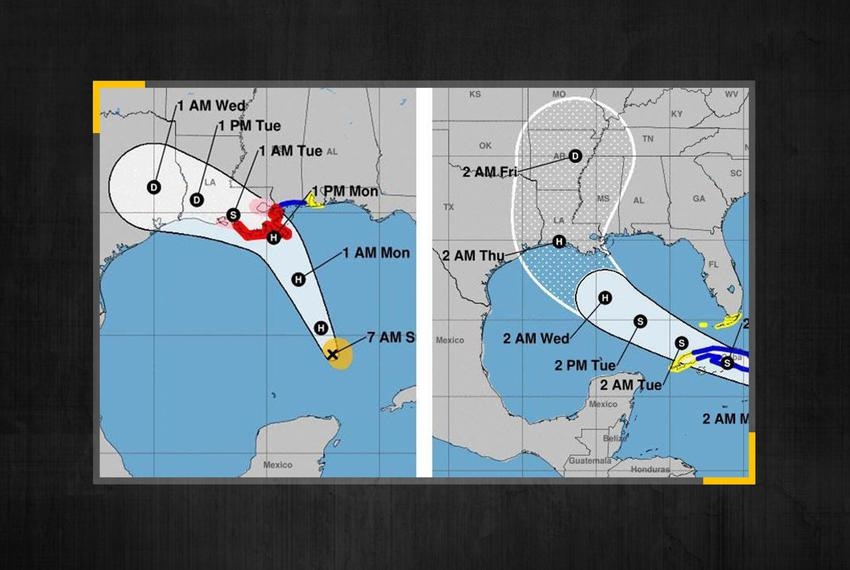

---
output:
  beamer_presentation:
    includes:
      in_header: header.tex
      before_body: anderson_beforebody.txt
fontsize: 10pt
---

```{r echo = FALSE, message = FALSE, warning = FALSE}
library(tidyverse)
library(viridis)
survey <- read_csv("data/Survey for epidemiology workshop on assessing exposure to tropical cyclones.csv")

colnames(survey)

survey %>% 
  select(14:21) %>% 
  rename_all(~ str_replace(., "Listed below are several ways that the physical hazards of a tropical cyclone can impact the built environment and so increase risk of adverse health outcomes.  Please rank how likely you think each is as a factor in causal pathways for the health exposure\\(s\\) you are studying or planning to study. ", "")) %>% 
  rename_all(~ str_replace_all(., "[\\[\\]]", "")) %>% 
  mutate_all(~ str_replace_all(., "[a-zA-Z()]", "")) %>% 
  mutate_all(as.numeric) %>% 
  pivot_longer(cols = everything()) %>% 
  group_by(name, value) %>% 
  count() %>% 
  ungroup() %>% 
  ggplot(aes(x = value, 
             y = str_wrap(name, 40), 
             fill = n)) + 
  geom_tile() + 
  scale_fill_viridis(option = "B") + 
  labs(caption = str_wrap("Survey question: Rate each physical hazard terms of how likely you think they are to be in the causal pathway linking tropical cyclones exposure to a change in the risk of the health outcome you are studying."), 
       x = "Likelihood of being in the causal pathway (1: unlikely, 5: likely)", 
       title = "Physical hazards", 
       y = "", 
       fill = "# respondents") + 
  theme_classic() + 
  theme(legend.position = "top")


```


## 2020 storm names

```{r echo = FALSE, out.width = "\\textwidth"}
knitr::include_graphics("figures/2020_Atlantic_names.jpg")
```

\footnotesize Source: 12 News Now


## Marco and Laura

```{r echo = FALSE, out.width = "\\textwidth"}

```

\footnotesize Source: The Texas Tribune

## Survey

```{r echo = FALSE, out.width="\\textwidth"}

```

Tell us about your approaches and challenges in assessing exposure to 
tropical cyclones: 

https://forms.gle/bCRnDnMTKKyufj9M8

## Survey overview

**Respondents:** Twelve 

**Papers:** 1 published, 3 submitted/under review, 2 in preparation

\bigskip


```{r echo = FALSE, out.width="0.8\\textwidth", fig.align = "center"}
knitr::include_graphics("figures/birth_outcomes.png")
```

## Survey overview

```{r echo = FALSE, fig.align = "center", fig.width = 6, fig.height = 3.2, out.width = "\\textwidth"}
survey %>% 
  pull(3) %>%  
  paste(collapse = ";") %>% 
  paste(";Neurological outcomes") %>% # From a write-in answer
  str_split(pattern = ";") %>% 
  unlist() %>% 
  str_trim() %>% 
  as_tibble() %>% 
  filter(value != "Other") %>% # Wrote in Other answer above
  group_by(value) %>% 
  count() %>% 
  ggplot(aes(x = fct_reorder(value, n), y = n)) + 
  geom_col() +
  coord_flip() + 
  labs(x = "", y = "Number of survey respondents (of 12)\nstudying or hoping to study the outcome") + 
  ggtitle("Health outcomes of interest") + 
  theme_classic() +
  expand_limits(y = c(0, 12))
```

## Survey overview

```{r echo = FALSE, fig.align = "center", fig.width = 6, fig.height = 3.2, out.width = "\\textwidth"}
survey %>% 
  pull(5) %>% 
  paste(collapse = ";") %>% 
  str_split(pattern = ";") %>% 
  unlist() %>% 
  str_trim() %>% 
  as_tibble() %>% 
  group_by(value) %>% 
  count() %>%  
  ungroup() %>% 
  mutate(value = fct_recode(value, 
                            "Older adults" = "I am focusing on older adults (e.g., people 65 years or older)", 
                            "Pregnant women and/or babies in utero" = "I am focusing on women who are pregnant and/or babies in utero", 
                            "Children" = "I am focusing on children (e.g., people younger than 18 years)", 
                            "General population" = "I am studying or planning to study associations in the general population")) %>% 
  ggplot(aes(x = fct_reorder(value, n), y = n)) + 
  geom_col() +
  coord_flip() + 
  labs(x = "", y = "Number of survey respondents (of 12)\nstudying or hoping to study the population") + 
  ggtitle("Populations of interest") + 
  theme_classic() +
  expand_limits(y = c(0, 12))
```


## Challenges for single-storm versus multi-storm studies


## Continuous versus binary exposure assessment


## Assessing exposure to storm-associated winds


## Assessing exposure to multiple hazards

```{r echo = FALSE, fig.align = "center", fig.width = 6, fig.height = 4, out.width = "\\textwidth", warning = FALSE}
survey %>% 
  select(7:12) %>% 
  rename_all(~ str_replace(., "Listed below are several physical hazards that a tropical cyclone can bring. Please rate each in terms of how likely you think they are to be in the causal pathway linking tropical cyclones exposure to a change in the risk of the health outcome you are studying.", "")) %>% 
  rename_all(~ str_replace_all(., "[\\[\\]]", "")) %>% 
  mutate_all(~ str_replace_all(., "[a-zA-Z()]", "")) %>% 
  mutate_all(as.numeric) %>% 
  pivot_longer(cols = everything()) %>% 
  group_by(name, value) %>% 
  count() %>% 
  ungroup() %>% 
  ggplot(aes(x = value, 
             y = name, 
             fill = n)) + 
  geom_tile() + 
  scale_fill_viridis(option = "B") + 
  labs(caption = str_wrap("Survey question: Rate each physical hazard terms of how likely you think they are to be in the causal pathway linking tropical cyclones exposure to a change in the risk of the health outcome you are studying."), 
       x = "Likelihood of being in the causal pathway (1: unlikely, 5: likely)", 
       title = "Physical hazards", 
       y = "", 
       fill = "# respondents") + 
  theme_classic() + 
  theme(legend.position = "top")
```

## Assessing exposure to multiple hazards

```{r echo = FALSE, fig.align = "center", fig.width = 6, fig.height = 4, out.width = "\\textwidth", warning = FALSE, message = FALSE}
survey %>% 
  select(7:12) %>% 
  rename_all(~ str_replace(., "Listed below are several physical hazards that a tropical cyclone can bring. Please rate each in terms of how likely you think they are to be in the causal pathway linking tropical cyclones exposure to a change in the risk of the health outcome you are studying. ", "")) %>% 
  rename_all(~ str_replace_all(., "[\\[\\]]", "")) %>% 
  mutate_all(~ str_replace_all(., "[a-zA-Z()]", "")) %>% 
  mutate_all(str_trim) %>% 
  mutate_all(as.numeric) %>% 
  pivot_longer(cols = everything()) %>% 
  filter(!is.na(value)) %>% 
  group_by(name, value) %>% 
  count() %>% 
  ungroup() %>% 
  filter(value %in% 4:5) %>% 
  group_by(name) %>% 
  summarize(n = sum(n)) %>% 
  ggplot(aes(x = fct_reorder(str_wrap(name, 40), n), y = n)) + 
  geom_col() + 
  coord_flip() + 
  labs(x = "", 
       y = "# respondents (of 12) rating as likely (4 or 5 on scale of 1 to 5)\nin causal pathways for health outcome studied ", 
       title = "Built environment") + 
  theme_classic() +
  expand_limits(y = c(0, 12))
```

## Assessing exposure to multiple hazards

Are there any physical hazards from the storm that you think are plausibly in the causal pathway for your study?

\bigskip

> "This is pretty speculative, but I've wondered whether **changes in atmospheric pressure** play a role"

## Pathways for indirect effects

**Survey question:**

\bigskip

> "Listed below are several ways that the physical hazards of a tropical cyclone can impact the built environment and so increase risk of adverse health outcomes. Please rank how likely you think each is as a factor in causal pathways for the health exposure(s) you are studying or planning to study."

## Pathways for indirect effects

```{r echo = FALSE, fig.align = "center", fig.width = 7.5, fig.height = 5, out.width = "\\textwidth", warning = FALSE, message = FALSE}
survey %>% 
  select(14:21) %>% 
  rename_all(~ str_replace(., "Listed below are several ways that the physical hazards of a tropical cyclone can impact the built environment and so increase risk of adverse health outcomes.  Please rank how likely you think each is as a factor in causal pathways for the health exposure\\(s\\) you are studying or planning to study. ", "")) %>% 
  rename_all(~ str_replace_all(., "[\\[\\]]", "")) %>% 
  mutate_all(~ str_replace_all(., "[a-zA-Z()]", "")) %>% 
  mutate_all(as.numeric) %>% 
  pivot_longer(cols = everything()) %>% 
  group_by(name, value) %>% 
  count() %>% 
  ungroup() %>% 
  filter(value %in% 4:5) %>% 
  group_by(name) %>% 
  summarize(n = sum(n)) %>% 
  ggplot(aes(x = fct_reorder(str_wrap(name, 40), n), y = n)) + 
  geom_col() + 
  coord_flip() + 
  labs(x = "", 
       y = "# respondents (of 12) rating as likely (4 or 5 on scale of 1 to 5)\nin causal pathways for health outcome studied ", 
       title = "Built environment") + 
  theme_classic() + 
  scale_y_continuous(breaks = c(0, 3, 6, 9, 12))
```
## Pathways for indirect effects

Other potential pathways through the built environment: 

\bigskip

> "**Communication infrastructure outages** (beyond power outages as it might be to do with internet cables cut etc.)"

\bigskip

> "**Damage to personal vehicles**, reducing capacity to evacuate or reach a hospital in an emergency situation"


## Pathways for indirect effects

## Aggregating data spatially


## Assessing exposure during evacuation/moving


## Thank you

- Kate Burrows
- Jacob Hochard
- Tiantian Li
- Rachel Nethery
- Balaji Ramesh
- Robbie Parks
- Arbor Quist
- Darren Sun
- Kate Weinberger
- Meilin Yan


