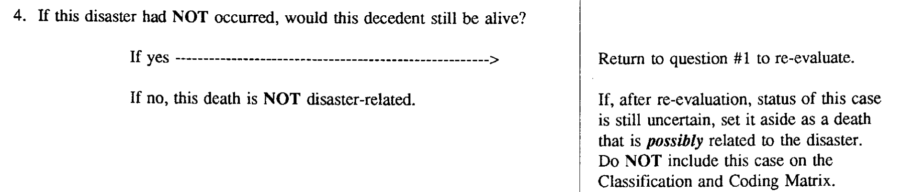

---
output:
  beamer_presentation:
    includes:
      in_header: header.tex
      before_body: anderson_beforebody.txt
fontsize: 10pt
---

```{r setup, include=FALSE}
knitr::opts_chunk$set(echo = FALSE, warning = FALSE, message = FALSE, error = TRUE)

library(tidyverse)
library(ggbeeswarm)
library(waffle)
library(hrbrthemes)
```

# Ideal vs. observed information

## Ideal vs. observed information

> "All the business of war, and indeed all the business of life, is to endeavor to find out what you don't know by what you do; that's what I called 'guess what was at the other side of the hill'."
\flushright --Attributed to the Duke of Wellington


## Role of epidemiology in disasters

```{r out.width = "\\textwidth", fig.align = "center"}
knitr::include_graphics("figures/dis_epi_process.png")
```

\small \textit{Source:} Malilay et al., 2014, "The Role of Applied Epidemiology Methods in the Disaster Management Cycle", \textit{American Journal of Public Health}

## A disaster's mortality impact

\vspace{0.5cm}

\center 
Following a disaster, we are interested in determining the number of deaths that occurred in the disaster-affected area that would not have occurred **but for** the disaster.

\vspace{0.7cm}

```{r out.width = "\\textwidth", fig.align = "center"}

```
\vspace{-0.2cm}
\textcolor{gray}{Last question on a flow chart for determining and classifying disaster-related deaths.}

\small \textit{Source:} Combs et al., 1999, "Assessing disaster-attributed mortality: Development and application of a definition and classification matrix", \textit{International Journal of Epidemiology}


## Mortality information from a disaster

\begin{columns}
\begin{column}{0.6\textwidth}
```{r fig.width = 3.8, out.height = "\\textheight"}
tribble(
  ~ scenario, ~n, 
  "Reality:\nStorm hits", 248
  ) %>% 
  mutate(
    scenario = fct_relevel(scenario, 
                           "Reality:\nStorm hits", 
                           "Counterfactual:\nStorm misses")
  ) -> ex_death_numbers

ex_death_numbers %>% 
  ggplot(aes(fill = scenario, values = n)) + 
  geom_waffle(color = "white", size = 0.25, n_rows = 15, flip = TRUE) + 
  scale_x_discrete() + 
  labs(
    title = "Deaths during disaster period",
    y = "# of deaths"
  ) +
  scale_fill_manual(name = NULL, 
                    values = c("#a3aabd", "#a3aabd")) + 
  scale_y_continuous(labels = function(x) x * 15,
                     expand = c(0,0)) +
  theme_minimal() +
  coord_equal() + 
  theme(panel.grid = element_blank(), axis.ticks.y = element_line(), 
        legend.position = "none")
```
\end{column}
\begin{column}{0.3\textwidth}
Each square represents a death during the disaster period in a disaster-affected community.
\end{column}
\end{columns}

## A disaster's mortality impact

```{r out.width = "\\textwidth", fig.align = "center"}

```

\small \textit{Source:} AccuWeather


## Ideal information

```{r fig.width = 5.75}
tribble(
  ~ scenario, ~n, 
  "Counterfactual:\nStorm misses", 180,
  "Reality:\nStorm hits", 248
  ) %>% 
  mutate(
    scenario = fct_relevel(scenario, 
                           "Reality:\nStorm hits", 
                           "Counterfactual:\nStorm misses")
  ) -> ex_death_numbers

ex_death_numbers %>% 
  ggplot(aes(fill = scenario, values = n)) + 
  geom_waffle(color = "white", size = 0.25, n_rows = 15, flip = TRUE) + 
  facet_wrap(~ scenario, nrow = 1, strip.position = "bottom") + 
  scale_x_discrete() + 
  labs(
    title = "Scenarios of deaths during disaster period",
    y = "# of deaths"
  ) +
  scale_fill_manual(name = NULL, 
                    values = c("#a3aabd", "#a3aabd")) + 
  scale_y_continuous(labels = function(x) x * 15,
                     expand = c(0,0)) +
  theme_minimal() +
  coord_equal() + 
  theme(panel.grid = element_blank(), axis.ticks.y = element_line(), 
        legend.position = "none")
```

## Ideal information

```{r fig.width = 5.75}
tribble(
  ~ scenario, ~ type, ~n, 
  "Counterfactual:\nStorm misses", "Death regardless of storm", 176,
  "Counterfactual:\nStorm misses", "Death only without storm", 4,
  "Reality:\nStorm hits", "Death regardless of storm", 176,
  "Reality:\nStorm hits", "Death only with storm", 72) %>% 
  mutate(
    type = as_factor(type),
    type = fct_relevel(type, "Death regardless of storm", 
                       "Death only without storm", 
                       "Death only with storm")
  ) %>% 
  mutate(
    scenario = fct_relevel(scenario, 
                           "Reality:\nStorm hits", 
                           "Counterfactual:\nStorm misses")
  ) -> ex_death_numbers

ex_death_numbers %>% 
  ggplot(aes(fill = type, values = n)) + 
  geom_waffle(color = "white", size = 0.25, n_rows = 15, flip = TRUE) + 
  facet_wrap(~ scenario, nrow = 1, strip.position = "bottom") + 
  scale_x_discrete() + 
  labs(
    title = "Scenarios of deaths during disaster period",
    y = "# of deaths"
  ) +
  scale_fill_manual(name = NULL, 
                    values = c("#a3aabd", "#c7d4b6", "#97b5cf")) + 
  scale_y_continuous(labels = function(x) x * 15,
                     expand = c(0,0)) +
  theme_minimal() +
  coord_equal() + 
  theme(panel.grid = element_blank(), axis.ticks.y = element_line(), 
        legend.position = "bottom") 

```

## Figuring out what you don't know from what you do

> "All the business of war, and indeed all the business of life, is to endeavor to find out what you don't know by what you do; that's what I called 'guess what was at the other side of the hill'."
\flushright --Attributed to the Duke of Wellington

\bigskip

1. **Counting cases** of disaster-attributable mortality
2. **Estimating excess** community-wide mortality during the disaster period compared to the counterfactual that the disaster didn't happen

# Counting cases


## Counting cases

\begin{columns}
\begin{column}{0.6\textwidth}
```{r fig.width = 3.8, fig.align = "center", out.height = "0.8\\textheight"}
tribble(
  ~ scenario, ~ type, ~n, 
  "Reality:\nStorm hits", "Unlinked deaths", 230,
  "Reality:\nStorm hits", "Linked deaths", 18) %>% 
  mutate(
    type = as_factor(type),
    type = fct_relevel(type, "Unlinked deaths", 
                       "Linked deaths")
  ) -> ex_death_numbers

ex_death_numbers %>% 
  ggplot(aes(fill = type, values = n)) + 
  geom_waffle(color = "white", size = 0.25, n_rows = 15, flip = TRUE) + 
  facet_wrap(~ scenario, nrow = 1, strip.position = "bottom") + 
  scale_x_discrete() + 
  labs(
    title = "Counting cases of deaths from disaster",
    y = "# of deaths"
  ) +
  scale_fill_manual(name = NULL, 
                    values = c("#a3aabd", "red")) + 
  scale_y_continuous(labels = function(x) x * 15,
                     expand = c(0,0)) +
  theme_minimal() +
  coord_equal() + 
  theme(panel.grid = element_blank(), axis.ticks.y = element_line(), 
        legend.position = "bottom",
        plot.title = element_text(hjust = 0.38)) 
```
\end{column}
\begin{column}{0.3\textwidth}
Investigate each death, case-by-case. Use information from the death certificate and other sources to determined if that specific death can be linked to the disaster.
\end{column}
\end{columns}

## Direct and indirect deaths

- **Direct deaths:** "Caused by environmental forces of the hurricane and direct consequences of these forces."

- **Indirect deaths:** "Caused by unsafe or unhealthy conditions because of loss or disruption of usual services, personal loss, or lifestyle disruption."

\bigskip

\small \textit{Source:} Issa et al., 2018, "Deaths Related to Hurricane Irma — Florida, Georgia, and North Carolina, September 4–October 10, 2017", \textit{Morbidity and Mortality Weekly Report}

## Direct and indirect deaths

\begin{columns}
\begin{column}{0.6\textwidth}
```{r fig.width = 3.8, fig.align = "center", out.height = "0.8\\textheight"}
tribble(
  ~ scenario, ~ type, ~n, 
  "Reality:\nStorm hits", "Unlinked", 230,
  "Reality:\nStorm hits", "Indirect", 2,
  "Reality:\nStorm hits", "Direct", 16) %>% 
  mutate(
    type = as_factor(type),
    type = fct_relevel(type, "Unlinked", 
                       "Indirect",
                       "Direct")
  ) -> ex_death_numbers

ex_death_numbers %>% 
  ggplot(aes(fill = type, values = n)) + 
  geom_waffle(color = "white", size = 0.25, n_rows = 15, flip = TRUE) + 
  facet_wrap(~ scenario, nrow = 1, strip.position = "bottom") + 
  scale_x_discrete() + 
  labs(
    title = "Counting cases of deaths from disaster",
    y = "# of deaths"
  ) +
  scale_fill_manual(name = NULL, 
                    values = c("#a3aabd", "rosybrown1", "red")) + 
  scale_y_continuous(labels = function(x) x * 15,
                     expand = c(0,0)) +
  theme_minimal() +
  coord_equal() + 
  theme(panel.grid = element_blank(), axis.ticks.y = element_line(), 
        legend.position = "bottom",
        plot.title = element_text(hjust = 0.38)) 
```
\end{column}
\begin{column}{0.3\textwidth}
Investigations of each case can help determine if the death was directly or indirectly attributable to the disaster.
\end{column}
\end{columns}

## US CDC Morbidity and Mortality Weekly Report 

\begin{columns}
\begin{column}{0.3\textwidth}
For many American disasters, results from this approach 
are reported in the US CDC's Morbidity and Mortality Weekly Report 
(MMWR).
\end{column}
\begin{column}{0.7\textwidth}
```{r out.width = "\\textwidth", fig.align = "center"}
knitr::include_graphics("figures/mmwr.png")
```
\end{column}
\end{columns}

## Hurricane Floyd, 1999

\center In September 1999, Hurricane Floyd caused extensive damage---especially from widespread flooding---in eastern North Carolina.

```{r out.width = "0.9\\textwidth", fig.align = "center"}

```

\small \textit{Source:} US Army Corps of Engineers

## Hurricane Floyd, 1999

\center in May 2000, a report on the storm's health impacts in North Carolina, including attributable mortality, was published in the CDC's MMWR.

```{r out.width = "0.9\\textwidth", fig.align = "center"}
knitr::include_graphics("figures/floyd_table.png")
```

\small \textit{Source:} US CDC, 2000, "Morbidity and Mortality Associated With Hurricane Floyd---North Carolina, September--October 1999", \textit{Morbidity and Mortality Weekly Report}

## Hurricane Floyd, 1999

> "The medical examiner determined that 52 deaths were associated directly with the storm. Decedents ranged in age from 1 to 96 years (median: 43 years); 38 (73%) were males. \ldots \ Seven deaths occurred during transport by boat; flotation devices were not worn by any of the decedents."

\small \textit{Source:} US CDC, 2000, "Morbidity and Mortality Associated With Hurricane Floyd---North Carolina, September--October 1999", \textit{Morbidity and Mortality Weekly Report}

## Hurricane Katrina, 2005

```{r out.width = "0.9\\textwidth", fig.align = "center"}
knitr::include_graphics("figures/katrina_table.png")
```

\small \textit{Source:} US CDC, 2006, "Mortality Associated with Hurricane Katrina --- Florida and Alabama, August--October 2005", \textit{Morbidity and Mortality Weekly Report}


# Estimating excess mortality


## Estimating excess mortality

```{r fig.width = 5.75}
tribble(
  ~ scenario, ~ type, ~n, 
  "Counterfactual:\nStorm misses", "Baseline deaths", 180,
  "Reality:\nStorm hits", "Baseline deaths", 180,
  "Reality:\nStorm hits", "Excess deaths", 68) %>% 
  mutate(
    type = as_factor(type),
    type = fct_relevel(type, "Baseline deaths", 
                       "Excess deaths")
  ) %>% 
  mutate(
    scenario = fct_relevel(scenario, 
                           "Reality:\nStorm hits", 
                           "Counterfactual:\nStorm misses")
  ) -> ex_death_numbers

ex_death_numbers %>% 
  ggplot(aes(fill = type, color = type, values = n)) + 
  geom_waffle(size = 0.25, n_rows = 15, flip = TRUE) + 
  facet_wrap(~ scenario, nrow = 1, strip.position = "bottom") + 
  scale_x_discrete() + 
  labs(
    title = "Estimating excess deaths during disaster period",
    y = "# of deaths"
  ) +
  scale_fill_manual(name = NULL, 
                    values = c("#a3aabd", "rosybrown1")) + 
  scale_color_manual(name = NULL, 
                    values = c("#a3aabd", "rosybrown1")) + 
  scale_y_continuous(labels = function(x) x * 15,
                     expand = c(0,0)) +
  theme_minimal() +
  coord_equal() + 
  theme(panel.grid = element_blank(), axis.ticks.y = element_line(), 
        legend.position = "bottom") + 
  geom_hline(yintercept = (180 / 15) + 0.5, 
             color = "red")


```

## Covid-19

```{r out.width = "\\textwidth", fig.align = "center"}
knitr::include_graphics("figures/excess_deaths_fin_times3.jpeg")
```

\vspace{-0.1cm}

\small \textit{Source:} Financial Times

## 1995 Chicago heat wave

```{r out.width = "0.9\\textwidth", fig.align = "center"}
knitr::include_graphics("figures/chic_1995_excess_epa.png")
```

\vspace{-0.1in}
\small \textit{Source:} US EPA, "Climate Change Indicators in the United States: Heat-Related Deaths"

## Hurricane Maria, 2017

```{r out.width = "0.9\\textwidth", fig.align = "center"}
knitr::include_graphics("figures/maria_timeseries.png")
```

\small \textit{Source:} New York Times

## 2012 Beijing flood 

```{r out.width = "0.7\\textwidth", fig.align = "center"}

```

\medskip

> "We compared community-wide mortality rates on the peak flood day and the four following days to seasonally matched nonflood days in previous years (2008--2011), controlling for potential confounders, to estimate the relative risks (RRs) of daily mortality among Beijing residents associated with this flood."

\small \textit{Sources:} Yan et al., 2020, "Community-wide Mortality Rates in Beijing, China, During the July 2012 Flood Compared with Unexposed Periods," *Epidemiology*; CNN

# Comparing measurements from the two methods

## 1995 Chicago heatwave

```{r out.width = "0.9\\textwidth", fig.align = "center"}
knitr::include_graphics("figures/chic_1995_excess_epa.png")
```

\vspace{-0.1in}
\small \textit{Source:} US EPA, "Climate Change Indicators in the United States: Heat-Related Deaths"

## 2012 Beijing flood 

> "For the flood period of 21--22 July 2012, we estimated a total of 79 excess deaths among Beijing residents; by contrast, only 34 deaths were reported among Beijing residents in a study using a traditional surveillance approach."

\small \textit{Source:} Yan et al., 2020, "Community-wide Mortality Rates in Beijing, China, During the July 2012 Flood Compared with Unexposed Periods," \textit{Epidemiology}

## 2004 Florida hurricane season

\center Comparison of observed storm-dependent mortality and official mortality for the 2004 hurricane season in Florida

```{r out.width = "\\textwidth", fig.align = "center"}

```

\small \textit{Source:} McKinney et al., 2011, "Direct and indirect mortality in Florida during the 2004 hurricane season," \textit{International Journal of Biometeorology}

## Hurricane Maria, 2017

```{r out.width = "0.9\\textwidth", fig.align = "center"}
knitr::include_graphics("figures/maria_excess_deaths.png")
```

*Source:* New York Times

## Comparing measurements 

\begin{columns}
\begin{column}{0.5\textwidth}
```{r out.width = "\\textwidth", fig.align = "center"}

``` 
\end{column}
\begin{column}{0.5\textwidth}
\small
\begin{quotation}
Normally, mortality counts are the function of governments, which collect death certificates and keep the public informed.
A death toll should theoretically be as straightforward as tallying those
who have perished. Nothing about disasters, however, is simple.
\end{quotation}
\footnotesize \textit{Source:} Arnold, 2019, "Death Counters," \textit{Nature}
\end{column}
\end{columns}

# Complementary approaches

## Estimating excess---methodological objective

\begin{columns}
\begin{column}{0.5\textwidth}
```{r fig.width = 3.8, fig.align = "center", out.height = "0.8\\textheight"}
tribble(
  ~ scenario, ~ type, ~n, 
  "Reality:\nStorm hits", "Baseline deaths", 180,
  "Reality:\nStorm hits", "Excess deaths", 68) %>% 
  mutate(
    type = as_factor(type),
    type = fct_relevel(type, "Baseline deaths", 
                       "Excess deaths")
  ) %>% 
  mutate(
    scenario = fct_relevel(scenario, 
                           "Reality:\nStorm hits", 
                           "Counterfactual:\nStorm misses")
  ) -> ex_death_numbers

ex_death_numbers %>% 
  ggplot(aes(fill = type, color = type, values = n)) + 
  geom_waffle(size = 0.25, n_rows = 15, flip = TRUE) + 
  facet_wrap(~ scenario, nrow = 1, strip.position = "bottom") + 
  scale_x_discrete() + 
  labs(
    title = "Estimating excess deaths during disaster period",
    y = "# of deaths"
  ) +
  scale_fill_manual(name = NULL, 
                    values = c("#a3aabd", "rosybrown1")) + 
  scale_color_manual(name = NULL, 
                    values = c("#a3aabd", "rosybrown1")) + 
  scale_y_continuous(labels = function(x) x * 15,
                     expand = c(0,0)) +
  theme_minimal() +
  coord_equal() + 
  theme(panel.grid = element_blank(), axis.ticks.y = element_line(), 
        legend.position = "bottom") + 
  geom_hline(yintercept = (180 / 15) + 0.5, 
             color = "red")
```
\end{column}
\begin{column}{0.5\textwidth}
\textbf{Strength:} \\
Minimize \textit{error} in estimating number of \textcolor{red}{excess deaths}. \\
\medskip \pause
\textbf{Compromise:} \\
\begin{itemize}
\item Excess deaths are estimated with some uncertainty (variance)
because number of \textcolor{gray}{baseline deaths} is estimated with 
some uncertainty.
\item Individual deaths aren't identified as linked or unlinked.
\end{itemize}
\end{column}
\end{columns}


## Counting cases---methodological objective

\begin{columns}
\begin{column}{0.5\textwidth}
```{r fig.width = 3.8, fig.align = "center", out.height = "0.8\\textheight"}
tribble(
  ~ scenario, ~ type, ~n, 
  "Reality:\nStorm hits", "Unlinked deaths", 230,
  "Reality:\nStorm hits", "Linked deaths", 18) %>% 
  mutate(
    type = as_factor(type),
    type = fct_relevel(type, "Unlinked deaths", 
                       "Linked deaths")
  ) -> ex_death_numbers

ex_death_numbers %>% 
  ggplot(aes(fill = type, values = n)) + 
  geom_waffle(color = "white", size = 0.25, n_rows = 15, flip = TRUE) + 
  facet_wrap(~ scenario, nrow = 1, strip.position = "bottom") + 
  scale_x_discrete() + 
  labs(
    title = "Counting cases of deaths from disaster",
    y = "# of deaths"
  ) +
  scale_fill_manual(name = NULL, 
                    values = c("#a3aabd", "red")) + 
  scale_y_continuous(labels = function(x) x * 15,
                     expand = c(0,0)) +
  theme_minimal() +
  coord_equal() + 
  theme(panel.grid = element_blank(), axis.ticks.y = element_line(), 
        legend.position = "bottom",
        plot.title = element_text(hjust = 0.38)) 
```
\end{column}
\begin{column}{0.5\textwidth}
\textbf{Strength:} \\
Maximize \textit{sensitivity}---the probability that if a death is classified as \textcolor{red}{"linked"}, it really would not have happened without the disaster. \\
\medskip \pause
\textbf{Compromise:} 
\begin{itemize}
\item Maximizing \textit{sensitivity} may decrease \textit{specificity}---the probability that if a death is classified as \textcolor{gray}{"unlinked"}, it really would still have happened without the disaster. 
\end{itemize}
\end{column}
\end{columns}

<!-- \item Criteria for classifying as "linked" may vary -->

## Chicago, 1995

```{r out.width = "0.8\\textwidth", fig.align = "center"}

```

\small \textit{Source:} Kaiser et al., 2007, "The Effect of the 1995 Heat Wave in Chicago on All-Cause and Cause-Specific Mortality", \textit{American Journal of Public Health}

## Hurricane Irma, 2017

```{r out.width = "0.6\\textwidth", fig.align = "center"}

```

\vspace{-0.2cm}
\small \textit{Source:} Issa et al., 2018, "Deaths Related to Hurricane Irma — Florida, Georgia, and North Carolina, September 4–October 10, 2017," \textit{Morbidity and Mortality Weekly Report}

## Hurricane Irma, 2017

```{r out.width = "0.6\\textwidth", fig.align = "center"}

```

\vspace{-0.2cm}
\small \textit{Source:} Issa et al., 2018, "Deaths Related to Hurricane Irma — Florida, Georgia, and North Carolina, September 4–October 10, 2017," \textit{Morbidity and Mortality Weekly Report}

## Comparing measurements 

\begin{columns}
\begin{column}{0.5\textwidth}
```{r out.width = "\\textwidth", fig.align = "center"}

``` 
\end{column}
\begin{column}{0.5\textwidth}
\small
\begin{quotation}
Normally, mortality counts are the function of governments, which collect death certificates and keep the public informed.
A death toll should theoretically be as straightforward as tallying those
who have perished. \textbf{Nothing about disasters, however, is simple}.
\end{quotation}
\footnotesize \textit{Source:} Arnold, 2019, "Death Counters," \textit{Nature}
\end{column}
\end{columns}