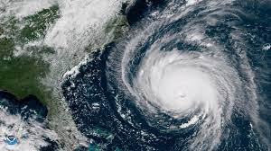

---
output:
  beamer_presentation:
    includes:
      in_header: header.tex
      before_body: anderson_beforebody.txt
fontsize: 10pt
---

```{r setup, include=FALSE}
knitr::opts_chunk$set(echo = FALSE, warning = FALSE, message = FALSE, error = TRUE)

library(tidyverse)
library(knitr)
library(kableExtra)

library(hurricaneexposuredata)
library(hurricaneexposure)
```


## Tropical cyclones 

\begin{center} 
Hurricane Florence, 2018
\end{center}

```{r fig.align = "center", out.width = "\\textwidth", fig.align = "center"}

```

\footnotesize Source: NOAA

## Tropical cyclones 

\begin{center}
Tropical cyclones worldwide
\end{center}

```{r echo = FALSE, out.width = "\\textwidth", fig.align = "center"}

```

\footnotesize
Source: Deutsche Wetterdienst

<!-- ## Tropical cyclones -->

<!-- \begin{center} -->
<!-- North Atlantic-basin tropical cyclones in 2020 -->
<!-- \end{center} -->

<!-- ```{r echo = FALSE, out.width = "0.85\\textwidth", fig.align = "center"} -->
<!--  -->
<!-- ``` -->

<!-- \footnotesize -->
<!-- Source: NOAA -->

## `hurricaneexposure` package

The `hurricaneexposure` R package is an open-source software to explore and map county-level hurricane exposure in the United States.

Key goals: 

1. Incorporate measures of **different hazards** of each storm.
2. Create exposure data for tropical cyclones in the US at the 
**county level**.
3. Share the data in a way that is easy to use **efficiently** and **reproducibly**.

## Getting started with the `hurricaneexposure` package

We have an article in *Environmental Health Perspectives* that describes 
the data.

```{r fig.align = "center", out.width = "\\textwidth"}
include_graphics("figures/ehp_article.png")
```

\url{https://ehp.niehs.nih.gov/doi/pdf/10.1289/EHP6976}

## Getting started with the `hurricaneexposure` package

We have an online tutorial that describes how to work with the data using 
the `hurricaneexposure` R package.

```{r fig.align = "center", out.width = "\\textwidth"}

```

\url{https://cran.r-project.org/web/packages/hurricaneexposure/vignettes/hurricaneexposure.html}

## Tropical cyclone hazards

```{r echo = FALSE, fig.align = "center", out.width = "0.9\\textwidth"}
knitr::include_graphics("figures/Hurricane-Florence-Hazards-Summary-Chart-9-11-18.png")
```


## Different patterns in hazards

```{r echo = FALSE, out.width = "0.95\\textwidth", fig.align = "center"}
knitr::include_graphics("figures/ivanonly.pdf")
```

## Alignment between weather and human impacts data 

Human impacts data are often aggregated by **geopolitical boundaries**.

```{r fig.align = "center", out.width = "\\textwidth"}
include_graphics("figures/us_eia_power_outage_irma.png")
```

\footnotesize
Source: US Energy Information Administration

## Alignment between weather and human impacts data 

<!-- spatial misalignment, change of support, modifiable areal unit problem -->

North American Land Data Assimilation System (NLDAS) 12-km grid of
maximum temperature (C) in New York State for July 21, 2010.

```{r fig.align = "center", out.width = "0.7\\textwidth"}
include_graphics("figures/adeyeye_2019_nldas.png")
```

\footnotesize Source: Adeyeye et al, 2019

## Alignment between weather and human impacts data 

National Weather Service regions and locations of Florida Climate Center monitors within Florida.

```{r fig.align = "center", out.width = "0.6\\textwidth"}

```

\footnotesize
Source: Learry et al., 2017

## County-level exposure assessment

We used a wind model to assess county-level exposure.

```{r fig.align = "center", out.width = "\\textwidth"}
include_graphics("figures/exposure_assessment.pdf")
```

\footnotesize Adapted from Yan et al., *Epidemiology*, 2021.

## County-level exposure assessment

Identifying date of storm's closest approach to each county.

```{r echo = FALSE, out.width = "0.9\\textwidth", fig.align = "center"}

```

## County-level exposure assessment

Precipitation during Hurricane Floyd, 1999, for three day windows surrounding 
the storm's closest approach to each county. 

```{r fig.align = "center", out.width = "\\textwidth"}
include_graphics("figures/rain_lags.pdf")
```

\footnotesize From Yan et al., *Epidemiology*, 2021.

## County-level exposure assessment

Use `map_counties` with `metric = "wind"` to map county-level peak sustained
wind from a storm:

```{r echo = TRUE, fig.height = 4, out.height = "0.6\\textheight", fig.align = "center"}
map_counties(storm = "Ike-2008", metric = "wind")
```

## All wind exposures for a specific county 

If you want to get values for a specific county, you can identify all 
exposures that match a certain threshold for those counties.

\footnotesize

```{r echo = TRUE}
county_wind(counties = "12086", wind_limit = 17.5,
            start_year = 1990, end_year = 2000)
```

<!-- ## County-level exposure assessment -->

<!-- The `hurricaneexposure` package can be used to map exposures for specific storms: -->

<!-- ```{r fig.align = "center", echo = TRUE, fig.width = 5, out.width="0.9\\textwidth"} -->
<!-- map_counties(storm = "Floyd-1999", metric = "rainfall") -->
<!-- ``` -->

<!-- ## County-level exposure assessment -->

<!-- The `hurricaneexposure` package can also be used to identify all exposures  -->
<!-- meeting specific criteria: -->

<!-- \bigskip -->

<!-- \small -->

<!-- ```{r echo = TRUE, eval = FALSE} -->
<!-- county_rain(counties = c("22071", "51700"), rain_limit = 100,  -->
<!--             start_year = 1995, end_year = 2005, dist_limit = 100, -->
<!--             days_included = c(-1, 0, 1)) -->
<!-- ``` -->

<!-- ```{r echo = FALSE} -->
<!-- county_rain(counties = c("22071", "51700"), rain_limit = 100,  -->
<!--             start_year = 1995, end_year = 2005, dist_limit = 100, -->
<!--             days_included = c(-1, 0, 1)) %>% -->
<!--   slice(1:4) %>% -->
<!--   select(storm_id, fips, closest_date, storm_dist, tot_precip) -->
<!-- ``` -->

## Sharing data through an R package

1. Data access is **scripted**---easy to reproduce and adapt later.
2. Dataset is **versioned**---the version of the data package changes
as the dataset is updated. The version number can be included as part
of Methods section of studies.
3. Data can be **easily integrated** with other tools available through R.
These include mapping and statistical tools.
4. Data creation is **documented and reproducible** on GitHub
starting from public data and software.

## Recent and ongoing research with this exposure assessment data

This tool is being used to study how tropical cyclone wind exposures are associated with:

1. Risk of pre-term birth
2. Risk of hospitalizations among Medicare beneficiaries
3. Risk of broad-cause mortality
4. Risk of death among those on dialysis 

<!-- ## Future directions -->

<!-- 1. Create exposure datasets for human impacts data at other geopolitical -->
<!-- spatial scales (e.g., ZIP codes). -->
<!-- 2. Expand to measure some hazards outside the US.  -->
<!-- 3. Continue updates with new years of data. -->

## Questions?

<!-- Today, NWS launches weather balloons twice daily from 92 stations across the U.S. to observe the upper atmosphere and provide valuable data for weather forecasting. -->

<!-- Across the entire planet twice a day at midnight and noon Zulu time ( Greenwich, England), weather balloons with radiosondes attached under them are launched to sample the global atmosphere. -->

```{r fig.align = "center", out.width = "0.9\\textwidth"}

```

\small

**Acknowledgments:** This project was supported This work was supported in part by grants from the National Institute of Environmental Health Sciences (R00ES022631), the National Science Foundation (1331399), and a NASA Applied Sciences Program/Public Health Program Grant (NNX09AV81G).
