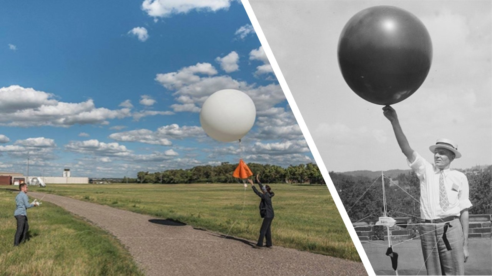

---
output:
  beamer_presentation:
    includes:
      in_header: header.tex
      before_body: anderson_beforebody.txt
fontsize: 10pt
---

```{r setup, include=FALSE}
knitr::opts_chunk$set(echo = FALSE, warning = FALSE, message = FALSE, error = TRUE)

library(tidyverse)
library(knitr)
library(kableExtra)

library(hurricaneexposuredata)
library(hurricaneexposure)
```

## Synoptic meteorology

<!-- https://www.weather.gov/dvn/armistice_day_blizzard -->
<!-- The blizzard that struck the Midwest in November 1940 was the type of snow storm that engenders legends. Fall was extremely mild and across the Upper Midwest temperatures were well above normal on the morning of November 11th. So warm that at 7:30 in the morning the temperature at Chicago was 55 degrees Fahrenheit, and at Davenport Iowa the temperature was 54. Armistice Day 1940 was a perfect opportunity for many individuals to enjoy the mild respite before winter. Little did they know the most infamous duck hunt in American history was about to unfold.  When the storm exited the region over a foot of snow had fallen, and more than 150 people and thousands of livestock were dead. -->

<!-- Until 1934 the Weather Bureau offices operated 12-15 hours a day with two basic observations taken at 8 a.m. and 8 p.m. The observations were transmitted via telegraph. There were no satellite images and few upper air observations. -->

Armistice Day Blizzard of 1940

```{r fig.align = "center", out.width = "0.8\\textwidth"}

```

\footnotesize Source: US National Weather Service

## Meteorology by telegraph

Creating synoptic charts in Bergen, Norway, November 1919.

```{r fig.align = "center", out.width = "\\textwidth"}

```

\footnotesize Source: Jewell, 1981

## Meteorology by telegraph


```{r fig.align = "center", out.width = "0.8\\textwidth"}

```

<!-- \footnotesize Source: NOAA Climate.gov -->

\small
> "To provide a picture of weather conditions across the country, the observers
made their reports as nearly simultaneous as possible."
\flushright --\textit{Getting the Message Through}, R.B. Raines

<!-- ## Synoptic meteorology -->

<!-- Creating synoptic charts in Bergen, Norway. -->

<!-- ```{r fig.align = "center", out.width = "\\textwidth"} -->
<!--  -->
<!-- ``` -->

<!-- \footnotesize Source: Jewell, 1981 -->

## Synoptic times

Weather balloons are launched every day around the world **at the same time** 
(midnight and noon Zulu time).

<!-- Today, NWS launches weather balloons twice daily from 92 stations across the U.S. to observe the upper atmosphere and provide valuable data for weather forecasting. -->

<!-- Across the entire planet twice a day at midnight and noon Zulu time ( Greenwich, England), weather balloons with radiosondes attached under them are launched to sample the global atmosphere. -->

```{r fig.align = "center", out.width = "\\textwidth"}

```

\footnotesize Source: NOAA

<!-- ## Synoptic times -->

<!-- Weather balloons are launched every day around the world **at the same time**  -->
<!-- (midnight and noon Zulu time). -->

<!-- Today, NWS launches weather balloons twice daily from 92 stations across the U.S. to observe the upper atmosphere and provide valuable data for weather forecasting. --> 

<!-- Across the entire planet twice a day at midnight and noon Zulu time ( Greenwich, England), weather balloons with radiosondes attached under them are launched to sample the global atmosphere. --> 

<!-- ```{r fig.align = "center", out.width = "0.8\\textwidth"} -->
<!-- include_graphics("figures/nws_upper_air_map.pdf") -->
<!-- ``` -->

<!-- \footnotesize Source: US National Weather Service -->


## NSF EAGER: Establishing Interface Standards for Physical Exposure and Human Impacts Data Collections and Publication in Rapid Response to Coastal Hazards

We are seeking to answer the questions: \medspace

1. For human impacts data, what are common scales of the data in **time** and 
**space**? \medspace
2. What are reasonable ways to **aggregate or extrapolate** exposure data
to these scales? \medspace
3. What are pathways and potential for **bias** from this data integration?

## Standards for human impact data integration

For human impacts data, what are common scales of the data in **time** and 
**space**? \medspace

1. Human impacts data are often aggregated by **geopolitical boundaries**.
2. Often, human impacts data has a time scale that requires **aggregation**
of exposure time series.


## Standards for human impact data integration

1. Human impacts data are often aggregated by **geopolitical boundaries**.

<!-- private property losses (and wind) for seven hurricanes -->

```{r fig.align = "center", out.width = "0.6\\textwidth"}

```

\footnotesize
Source: Done et al., 2018 

## Standards for human impact data integration

<!-- private property losses (and wind) for seven hurricanes -->

```{r fig.align = "center", out.width = "\\textwidth"}
include_graphics("figures/us_eia_power_outage_irma.png")
```

\footnotesize
Source: US Energy Information Administration

## Spatial misalignment

<!-- spatial misalignment, change of support, modifiable areal unit problem -->

North American Land Data Assimilation System (NLDAS) 12-km grid of
maximum temperature (C) in New York State for July 21, 2010.

```{r fig.align = "center", out.width = "0.7\\textwidth"}

```

\footnotesize Source: Adeyeye et al, 2019


## Spatial misalignment

<!-- spatial misalignment, change of support, modifiable areal unit problem -->

H*WIND wind band data for Hurricane Isabel.

```{r fig.align = "center", out.width = "0.9\\textwidth"}
include_graphics("figures/aoml_hwindfull.pdf")
```

\footnotesize
Source: Atlantic Oceanographic and Meteorological Laboratory

## Spatial misalignment

National Weather Service regions and locations of Florida Climate Center monitors within Florida.

```{r fig.align = "center", out.width = "0.6\\textwidth"}
include_graphics("figures/learry_florida_climate_center_monitors.jpg")
```

\footnotesize
Source: Learry et al., 2017


<!-- ## Spatial misalignment -->

<!-- <!-- spatial misalignment, change of support, modifiable areal unit problem --> -->

<!-- North American Land Data Assimilation System (NLDAS) 12-km grid of -->
<!-- maximum temperature (C) in New York State for July 21, 2010. -->

<!-- ```{r fig.align = "center", out.width = "0.7\\textwidth"} -->
<!-- include_graphics("figures/flowerdew_green_incompatible_zones.pdf") -->
<!-- ``` -->

<!-- \footnotesize Source: Flowerdew and Green, 1989. -->

## Spatial misalignment

<!-- spatial misalignment, change of support, modifiable areal unit problem -->

Types of change-of-support problems and associated strategies.

```{r fig.align = "center", out.width = "0.7\\textwidth"}
include_graphics("figures/gotway_young_types_of_cosps.png")
```

\footnotesize Source: Gotway and Young, 2002.

## Moving toward standards for human impact data integration

2. Often, human impacts data has a time scale that requires **aggregation**
of exposure time series.

```{r fig.align = "center", out.width = "0.6\\textwidth"}

```

\footnotesize
Source: Done et al., 2018 

## Aggregating exposure time series

Local storm-associated winds at the population mean center of Dare County, NC, 
at 15-minute intervals throughout the tracking period of Hurricane Floyd, 1999.

```{r fig.align = "center", out.width = "\\textwidth"}

```

Possible summaries: Peak winds; Duration of winds over 20 m/s.

## Aggregating exposure time series

Precipitation during Hurricane Floyd, 1999, for three day windows surrounding 
the storm's closest approach to each county. 

```{r fig.align = "center", out.width = "\\textwidth"}
include_graphics("figures/rain_lags.pdf")
```

<!-- ## Moving toward standards for human impact data integration -->


<!-- ```{r fig.align = "center", out.width = "\\textwidth"} -->
<!--  -->
<!-- ``` -->

<!-- Source: US Energy Information Administration -->

<!-- ## Case studies versus multi-event studies -->

<!-- [Clip of case study paper] -->

<!-- Case studies can:  -->

<!-- 1.  -->
<!-- 2.  -->
<!-- 3. -->

<!-- ## Case studies versus multi-event studies -->

<!-- Standards are particularly important for multi-event studies. -->

<!-- To supplement case studies, multi-event studies can add:  -->

<!-- 1. Estimate typical exposure-outcome associations with greater precision.  -->
<!-- 2. Estimate typical exposure-outcome associations with less bias. -->
<!-- 3. Estimate and explore heterogeneity in exposure-outcome associations across events  -->
<!-- and locations.  -->

<!-- ## Multi-event results -->

<!-- \centering Respiratory hospitalization risks during the top 10 wind-based storm exposures compared to matched unexposed days -->

<!-- \small -->

<!-- ```{r} -->
<!-- resp_hosps <- tribble( -->
<!--   ~ storm, ~ county, ~ wind, ~ percincreasenum, ~ percincrease, -->
<!--   "Wilma (2005)", "Palm Beach County, FL", 51.5,  38, "38 (-3, 95)", -->
<!--   "Charley (2004)", "Lee County, FL", 45.3, 25, "25 (-10, 73)", -->
<!--   "Charley (2004)", "Orange County, FL", 41.2, 44, "44 (4, 99)", -->
<!--   "Ike (2008)", "Harris County, TX", 38.7, 44, "44 (25, 65)", -->
<!--   "Charley (2004)", "Volusia County, FL", 37.0, 8, "8 (-15, 38)", -->
<!--   "Wilma (2005)", "Broward County, FL", 36.7, 66, "66 (36, 104)", -->
<!--   "Katrina (2005)", "Broward County, FL", 33.5, 36, "36 (19, 57)", -->
<!--   "Frances (2004)", "Palm Beach County, FL", 33.3, 35, "35 (15, 59)", -->
<!--   "Irene (1999)", "Broward County, FL", 33.3, 10, "10 (-14, 41)", -->
<!--   "Irene (1999)", "Palm Beach County, FL", 33.2, 40, "40 (-3, 100)" -->
<!-- ) -->

<!-- resp_hosps %>% -->
<!--   mutate(wind = cell_spec(round(wind), "latex", bold = TRUE, color = "white", -->
<!--                           background = spec_color(round(wind), end = 0.9, direction = -1, option = "A")), -->
<!--          percincrease = cell_spec(percincrease, "latex", bold = TRUE, -->
<!--                                    color = spec_color(percincreasenum, end = 0.9, -->
<!--                                                       direction = -1))) %>% -->
<!--   select(storm, county, wind, percincrease) %>% -->
<!--   kable("latex", booktabs = TRUE, escape = FALSE, align = "c", linesep = "", -->
<!--         col.names = linebreak(c("Tropical cyclone", "County", "Wind[note]", "Percent increase[note]"))) %>% -->
<!--   add_footnote(c("Modeled maximum sustained surface wind (m/s) at county center", -->
<!--                  "Percent increase in hospitalizations compared to matched unexposed days"), -->
<!--                escape = TRUE) -->
<!-- ``` -->

<!-- ## Multi-event results -->

<!-- ```{r fig.align = "center", out.width = "\\textwidth"} -->
<!--  -->
<!-- ``` -->

## County-level exposure assessment

Developing county-level exposure assessment for local peak sustained winds associated
with tropical cyclones, 1988--2019.

```{r fig.align = "center", out.width = "\\textwidth"}
include_graphics("figures/exposure_assessment.pdf")
```

<!-- ## Exposure assessment for multi-event studies -->

<!-- ```{r fig.align = "center", out.width = "\\textwidth"} -->
<!-- include_graphics("figures/all_storms.pdf") -->
<!-- ``` -->

## County-level exposure assessment

The `hurricaneexposure` package can be used to map exposures for specific storms:

```{r fig.align = "center", echo = TRUE, fig.width = 5, out.width="0.9\\textwidth"}
map_counties(storm = "Floyd-1999", metric = "rainfall")
```

## County-level exposure assessment

The `hurricaneexposure` package can also be used to identify all exposures 
meeting specific criteria:

\bigskip

\small

```{r echo = TRUE, eval = FALSE}
county_rain(counties = c("22071", "51700"), rain_limit = 100, 
            start_year = 1995, end_year = 2005, dist_limit = 100,
            days_included = c(-1, 0, 1))
```

```{r echo = FALSE}
county_rain(counties = c("22071", "51700"), rain_limit = 100, 
            start_year = 1995, end_year = 2005, dist_limit = 100,
            days_included = c(-1, 0, 1)) %>%
  slice(1:4) %>%
  select(storm_id, fips, closest_date, storm_dist, tot_precip)
```

## Recent and ongoing research with this exposure assessment data

This tool is being used to study how tropical cyclone wind exposures are associated with:

1. Risk of pre-term birth
2. Risk of hospitalizations among Medicare beneficiaries
3. Risk of broad-cause mortality
4. Population migration from a community

## Future directions

1. Creating exposure datasets for human impacts data at other geopolitical
spatial scales (e.g., ZIP codes).
2. Explore more and better ways to aggregate exposure data on the time scale
to provide relevant summary metrics to integrate with human impacts data. 

## Questions?

<!-- Today, NWS launches weather balloons twice daily from 92 stations across the U.S. to observe the upper atmosphere and provide valuable data for weather forecasting. -->

<!-- Across the entire planet twice a day at midnight and noon Zulu time ( Greenwich, England), weather balloons with radiosondes attached under them are launched to sample the global atmosphere. -->

```{r fig.align = "center", out.width = "\\textwidth"}

```

**Acknowledgments:** This project is supported by the National Science Foundation through 1331399.
