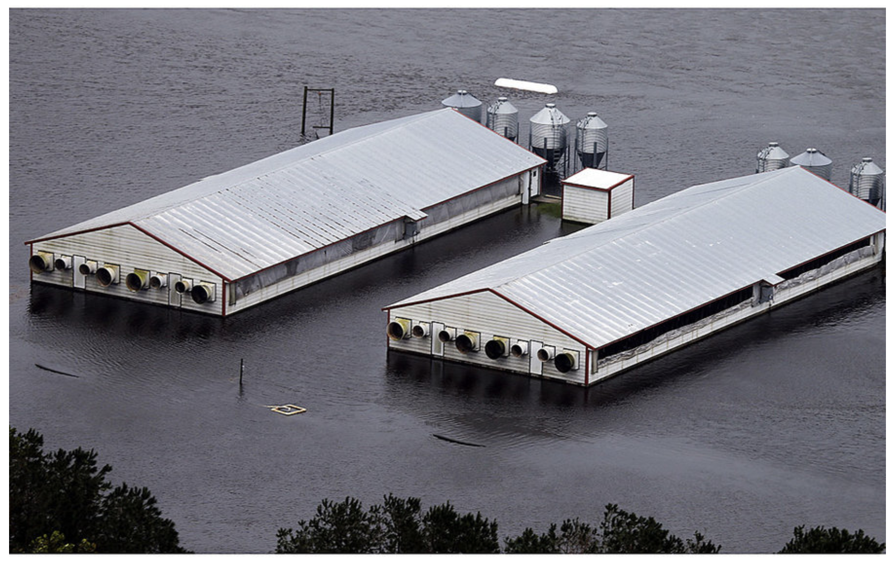

## Galveston Hurricane, 1900

\begin{center}
\includegraphics[width = 0.9\textwidth]{images/gal_hurr_path}
\end{center}

\vspace{-0.12in}
\footnotesize Source: \textit{Encyclopedia Britannica}

## Galveston Hurricane, 1900

\tikz[overlay,remember picture] \node[at=(current page.center)]{%
  \includegraphics[width = \paperwidth]{images/gal_1900_detail}};

\vspace{2.4in}
\footnotesize Source: \textit{Library of Congress}

## Advances in forecasting hurricanes

\begin{center}
\includegraphics[width = 0.7\textwidth]{images/harvey_forecast}
\end{center}

\vspace{-0.12in}
\footnotesize Source: \textit{Seattle Times}

## Advances in hurricane preparation

\begin{center}
\includegraphics[width = \textwidth]{images/evac_zone}
\end{center}

\vspace{-0.12in}
\footnotesize Source: \textit{City of Norfolk, Virginia}

## Advances in hurricane preparation

\begin{center}
\includegraphics[width = 0.75\textwidth]{images/evac_zone_2}
\end{center}

___

\begin{center}
\includegraphics[width = 0.85\textwidth]{images/fatal_hurricanes}
\end{center}

\vspace{-0.12in}
\footnotesize Source: \textit{Houston Chronicle}


## Climate-related disasters today

\begin{center}
\includegraphics[width = \textwidth]{images/climate_disasters_2018}
\end{center}

\vspace{-0.12in}
\footnotesize Source: \textit{NOAA}

## Hurricane hazards and impacts

\begin{center}
\includegraphics[width = \textwidth]{images/harvey_impacts}
\end{center}

\footnotesize

Source: The New York Times

## Hurricane Sandy event attribution 

\begin{center}
\includegraphics[width = 0.5\textwidth]{images/sandy_att_tracks}
\end{center}

\vspace{-0.4cm}
\begin{center}
\footnotesize Under conditions in the 1880s (green), at present (blue), and 2090s (red) \\
\end{center}
\vspace{-0.1cm}
\footnotesize Source: \textit{Lackmann 2015}

## Hurricane Sandy event attribution 

\begin{center}
\includegraphics[width = 0.8\textwidth]{images/sandy_att_pressure}
\end{center}

\vspace{-0.4cm}
\begin{center}
\footnotesize Under conditions in the 1880s (green), at present (blue), and 2090s (red) \\
\end{center}
\vspace{-0.1cm}
\footnotesize Source: \textit{Lackmann 2015}

## Hurricane health impacts

Hurricane health impacts that are **hard to prevent.**

Hurricane health impacts that are **hard to detect.**

## Hurricane Andrew damage

\tikz[overlay,remember picture] \node[at=(current page.center)]{%
  \includegraphics[width = \paperwidth]{images/andrew_damage_nytimes_cropped}};

\vspace{2.4in}
\footnotesize Source: \textit{New York Times}

<!-- ## Hurricane wind exposures -->

<!-- ```{r out.width = "0.7\\textwidth", fig.align = "center", echo = FALSE} -->
<!-- knitr::include_graphics("images/averagewindexposure.png") -->
<!-- ``` -->

<!-- \footnotesize -->
<!-- Average number of exposures per decade to tropical cyclone-related winds of 34 knots or higher. -->

## Cottonmouth snake range

```{r out.width = "\\textwidth", fig.align = "center", echo = FALSE}

```

\vspace{-0.1cm}
\footnotesize Source: USGS

## Snake bites

```{r out.width = "0.9\\textwidth", fig.align = "center", echo = FALSE}

```

## Snake bites

```{r out.width = "\\textwidth", fig.align = "center", echo = FALSE}

```

```{r out.width = "\\textwidth", fig.align = "center", echo = FALSE}

```

<!-- ## Exotic animals -->

<!-- ```{r out.width = "\\textwidth", fig.align = "center", echo = FALSE} -->
<!--  -->
<!-- ``` -->

<!-- \vspace{-0.1cm} -->
<!-- \footnotesize Source: New York Times -->

## Exotic animals

```{r out.width = "0.9\\textwidth", fig.align = "center", echo = FALSE}

```

\vspace{-0.1cm}
\footnotesize Source: *WTSP*

<!-- ## Exotic animals -->

<!-- ```{r out.width = "\\textwidth", fig.align = "center", echo = FALSE} -->
<!--  -->
<!-- ``` -->

<!-- \vspace{-0.1cm} -->
<!-- \footnotesize Source: *CBS News* -->

## Domestic animal bites

```{r out.width = "\\textwidth", fig.align = "center", echo = FALSE}

```

```{r out.width = "\\textwidth", fig.align = "center", echo = FALSE}

```

## West Nile neuroinvasive disease

```{r out.width = "\\textwidth", fig.align = "center", echo = FALSE}

```

## Domestic animal bites

```{r out.width = "\\textwidth", fig.align = "center", echo = FALSE}

```

## Hog farms and hurricanes

```{r out.width = "\\textwidth", fig.align = "center", echo = FALSE}

```

\vspace{-0.1cm}
\footnotesize Source: NC State College of Agriculture and Life Sciences

## Hog farms and hurricanes

```{r out.width = "\\textwidth", fig.align = "center", echo = FALSE}

```

\vspace{-0.1cm}
\footnotesize Source: Schmidt, *Environmental Health Perspectives* (2000)

## Hog farms and hurricanes

```{r out.width = "\\textwidth", fig.align = "center", echo = FALSE}

```

\vspace{-0.1cm}
\footnotesize Source: *Raleigh News and Observer*

## Hog farms and hurricanes

```{r out.width = "\\textwidth", fig.align = "center", echo = FALSE}

```

## Hog farms and hurricanes

```{r out.width = "\\textwidth", fig.align = "center", echo = FALSE}

```

\vspace{-0.1cm}
\footnotesize Source: *Christian Science Monitor*

<!-- ## Hog farms and hurricanes -->

<!-- ```{r out.width = "\\textwidth", fig.align = "center", echo = FALSE} -->
<!--  -->
<!-- ``` -->

<!-- \vspace{-0.1cm} -->
<!-- \footnotesize Source: The Christian Science Monitor -->

## Hog farms and hurricanes

\tikz[overlay,remember picture] \node[at=(current page.center)]{%
  \includegraphics[width = \paperwidth]{images/florence_hogs_wsj}};

\vspace{2.4in}
\footnotesize Source: \textit{Wall Street Journal}


## Counting tropical cyclone fatalities

```{r echo = FALSE, out.width="\\textwidth", fig.align = "center"}
knitr::include_graphics("images/icd_disaster_codes.png")
```

## Reporting cause of death

```{r echo = FALSE, out.width="\\textwidth", fig.align = "center"}
knitr::include_graphics("images/cdc_indirect_death.png")
```

\footnotesize Source: https://www.cdc.gov/nchs/data/dvs/hurricane_certification.pdf

## Counting tropical cyclone fatalities


```{r echo = FALSE, out.width="0.8\\textwidth", fig.align = "center"}

```

\vspace{-0.2cm}
\footnotesize Source: Lew et al., 1996

## Counting tropical cyclone fatalities


```{r echo = FALSE, out.width="0.7\\textwidth", fig.align = "center"}

```

\vspace{-0.2cm}
\footnotesize Source: Lew et al., 1996

## Beyond official death tolls

```{r echo = FALSE, out.width = "\\textwidth"}
knitr::include_graphics("images/maria_timeseries.png")
```

\footnotesize Source: The New York Times

## Beyond official death tolls


```{r echo = FALSE, out.width="0.9\\textwidth", fig.align = "center"}
knitr::include_graphics("images/maria_excess_deaths.png")
```

\footnotesize Source: The New York Times


## Excess deaths, Hurricane Maria

\begin{center}
\includegraphics[width = 0.85\textwidth]{images/rafa_causes}
\end{center}

## Health risks associated with Hurricane Sandy (2012)

\begin{columns}

\begin{column}{0.5\textwidth}
```{r echo = FALSE, fig.align = "center", out.width = "\\textwidth"}
knitr::include_graphics("images/sandy_satellite.jpg")
```
\vspace{-0.5cm}
\begin{center}
\scriptsize Source: NOAA / NASA GOES Project
\end{center}
\end{column}

\begin{column}{0.5\textwidth}
\scriptsize
\begin{block}{}
  Change in patterns of emergency department visits (Kim et al. 2016)
  \medskip
  
  Increased outpatient cases of food and waterborne disease among elderly (Bloom et al. 2016)
  \medskip
  
  Increased rate of myocardial infarctions (Swerdel et al. 2014) 
  \medskip
  
   Increased hospitalizations for dehydration (Lee et al. 2016) 
   \medskip
   
   Difficulty obtaining medical care, medications, and medical equipment (Davidow et al. 2016)
\end{block}
\end{column}

\end{columns}

## Medicare hospitalizations

\begin{center}
\includegraphics[width = \textwidth]{images/top_study_locations}
\end{center}

## Medicare hospitalizations

\begin{center}
\includegraphics[width = \textwidth]{images/resp_hosp_top_storms}
\end{center}


## Medicare hospitalizations

\begin{center}
\includegraphics[width = \textwidth]{images/resp_hosp_all_storms}
\end{center}

## Medicare hospitalizations

\begin{center}
\includegraphics[width = \textwidth]{images/cvd_hosp_all_storms}
\end{center}

## Open-source software

\footnotesize

```{r fig.align = "center", echo = TRUE, fig.width = 5, out.width="\\textwidth"}
library(hurricaneexposuredata)
library(hurricaneexposure)
map_counties(storm = "Floyd-1999", metric = "rainfall")
```


## Questions

\begin{center}
\includegraphics[width = 0.9\textwidth]{images/butterfly-hurricane}
\end{center}

\vspace{-0.4cm}
\footnotesize Source: \textit{The New Yorker}

