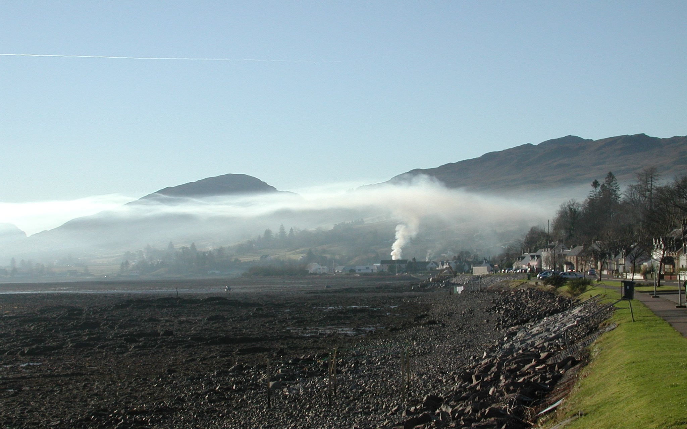
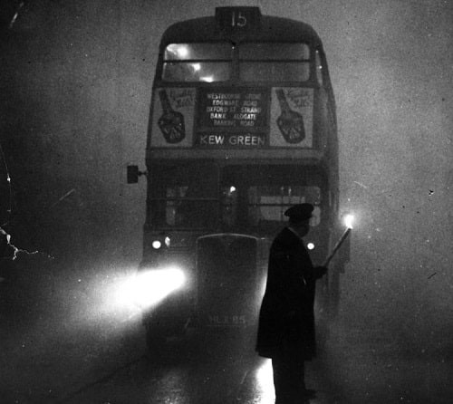
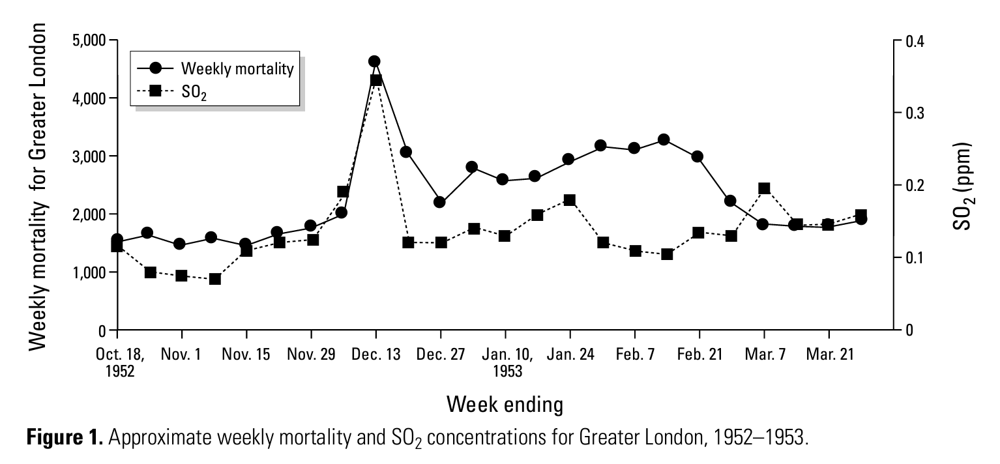

---
output:
  beamer_presentation:
    includes:
      in_header: header.tex
      before_body: anderson_beforebody.txt
fontsize: 10pt
---

```{r setup, include=FALSE}
knitr::opts_chunk$set(echo = FALSE, warning = FALSE, message = FALSE, error = TRUE)

library(tidyverse)
library(ggbeeswarm)
library(waffle)
library(hrbrthemes)
```

## Aims for today

- Share some history of scientific discoveries on air pollution and human health
- Introduce you to some basic epidemiological study methods
- Show how evidence from epidemiology and toxicology can complement
each other

# London Fog

## London Fog

> "Fog everywhere. Fog up the river where it flows among green airs and meadows; fog down the river, where it rolls defiled among the tiers of shipping, and the waterside pollutions of a great (and dirty) city.... Chance people on the bridges peeping over the parapets into a nether sky of fog, with fog all round them, as if they were up in a balloon and hanging in the misty clouds."
\flushright --Charles Dickens

## London Fog

```{r out.width = "\\textwidth", fig.align = "center"}

```

Arthur Rackham illustration for Charles Dickens' *A Christmas Carol*

## London Fog

```{r out.width = "0.75\\textwidth", fig.align = "center"}

```

Claude Monet, *Parliament: Sunlight in the Fog*

## London Fog

```{r out.width = "0.5\\textwidth", fig.align = "center"}

```

Alfred Hitchcock, poster for *The Lodger*

## London Fog

```{r out.width = "\\textwidth", fig.align = "center"}

```

John Barrymore as *Sherlock Holmes*

# The case of the fatal fog---Meuse Valley, 1930

## Meuse Valley, Belgium

```{r out.width = "\\textwidth", fig.align = "center"}
knitr::include_graphics("images/Dinant_Meuse_R01.jpg")
```

Source: Marc Ryckaert

## Meuse Valley fog

```{r out.width = "\\textwidth", fig.align = "center"}

```

Source: Albert Humblet collection

## Meuse Valley fog of 1930

- December 1--5, 1930
- More than 60 deaths (10-fold increase from normal)
- Symptoms included: coughing fits, laryngeal irritation, shortness of breath, 
chest pain, rapid breathing, cyanosis, nausea, vomiting
- Most affected: "people who were elderly, asthmatic, debilitated, or those
with cardiac disease"

Source: Nemery et al., 2001. The Meuse Valley fog of 1930: an air pollution 
disaster. *The Lancet*

## Meuse Valley---Killer on the loose

```{r out.width = "0.9\\textwidth", fig.align = "center"}

```

Source: *Brussels Times*

## Meuse Valley---Initial theories

- War gases
- Toxic sand from the Sahara desert
- Toxic gases from polluted soil

Source: Nemery et al., 2001. The Meuse Valley fog of 1930: an air pollution 
disaster. *The Lancet*

## Meuse Valley---Figuring out what happened

- Report commissioned, presented to Royal Academy of Medicine of Belgium in 1931
- Committee included experts on forensics, toxicology, meteorology, pathological
anatomy, and industrial chemistry

Source: Nemery et al., 2001. The Meuse Valley fog of 1930: an air pollution 
disaster. *The Lancet*


## Meuse Valley

\begin{columns}
\begin{column}{0.5\textwidth}
"When you have eliminated the impossible, whatever remains, however improbable, must be the truth."
\flushright ---\textit{The Sign of the Four}, Arthur Conan Doyle
\end{column}
\begin{column}{0.5\textwidth}
\includegraphics{"images/The_Sign_of_Four_cover_1892.jpg"}
\end{column}
\end{columns}

## Meuse Valley

> "[Investigators] ruled out the low temperature and the density of 
the fog, since similar weather conditions had prevailed over large parts
of Belgium. Respiratory infections were also excluded, mainly on clinical 
grounds." 
\flushright ---Nemery et al., 2001

## Evidence from necropsies

\begin{columns}
\begin{column}{0.4\textwidth}
"In all [10] necropsies, there was 'congestion of tracheal mucosa and 
large bronchi---sometimes with an exudate of mucosa and fibrin---and areas
of epithelial loss, capillary dilation of the dermis, and a slight leucocyte
exudate'." 
\flushright ---Nemery et al., 2001
\end{column}
\begin{column}{0.6\textwidth}
\includegraphics{"images/meuse_valley_histology_A.png"}
\end{column}
\end{columns}

## Meuse Valley

> "Lack of oxygen was dismissed as the cause of the victims' suffocation. 
However, 'the diffuse superficial mucosal congestion that occurred throughout
the respiratory tract down to the bronchioles and lung parenchyma ... could
be attributable to fine irritant particles.'" 
\flushright ---Nemery et al. 2001

## Evidence from necropsies

\begin{columns}
\begin{column}{0.4\textwidth}
"In lung parenchyma, 'there were foci of haemorrhage next to areas of 
moderate oedema and desquamations of alveolar epithelium.' Pure carbon 
dust particles of 0.5--1.35 micrometer diameter were seen free within the 
alveoli or engulfed in polynuclear leucocytes." 
\flushright ---Nemery et al., 2001
\end{column}
\begin{column}{0.6\textwidth}
\includegraphics{"images/meuse_valley_histology_B.png"}
\end{column}
\end{columns}

## Meuse Valley

> "The free or phagocytosed 
particles in alveoli suggested that they had been inhaled a short time
before death. However, carbon particles should have been innocuous, unless they
had adsorbed irritant acids. The report writers thus postulated that: 'fine
soot particles, onto which irritant gases had been adsorbed, had a major
role in the noxiousness of the fog.'"
\flushright ---Nemery et al. 2001

## Meuse Valley, geographic evidence

```{r out.width = "\\textwidth", fig.align = "center"}

```

Source: Nemery et al., 2001

## Meuse Valley

> "After a process of successive elimination, the 
commission concluded 'that the sulphur produced by coal burning has had a 
deleterious effect, either as sulphurous anhydride or acid, or as 
sulphuric acid; the production of which was made possible by unusual weather
conditions.'"
\flushright ---Nemery et al. 2001

## Meuse Valley legacy

> "The Meuse fog disaster provided incontrovertible evidence that air 
pollution could kill and therefore it attracted considerable attention 
from the scientific community."

\medskip

> "A weak aspect of the study was its formal epidemiological methods... 
No graphs were done or statistical tests done."
\flushright ---Nemery et al. 2001

# Why was the fog so bad?

## Air pollution sources

```{r out.width = "\\textwidth", fig.align = "center"}

```

Source: https://www.mrgscience.com/ess-topic-63-photochemical-smog.html 

## Smog formation---Meuse Valley

```{r out.width = "\\textwidth", fig.align = "center"}

```

Source: Nemery et al., 2001

## Temperature inversion

```{r out.width = "0.9\\textwidth", fig.align = "center"}

```

Source: Tyler Chow

## Temperature inversion---Lake District, England

```{r out.width = "0.9\\textwidth", fig.align = "center"}

```

Source: Penny Johnson

## Temperature inversion---Lochcarron, Scotland

```{r out.width = "\\textwidth", fig.align = "center"}

```

Source: S/V Moonrise

## Temperature inversion---Almaty, Kazakhstan

```{r out.width = "\\textwidth", fig.align = "center"}
knitr::include_graphics("images/Smog_over_Almaty.jpg")
```

Source: Igors Jefimovs

## Smog formation---Meuse Valley

```{r out.width = "\\textwidth", fig.align = "center"}

```

Source: Albert Humblet collection

# The return of the sinister smog---London, 1952

## Smog formation---London

```{r out.width = "0.85\\textwidth", fig.align = "center"}

```

Source: Historic England Archive

## Smog formation---London

```{r out.width = "0.8\\textwidth", fig.align = "center"}

```

Source: Alan Farrow 

## Great Smog of 1952

```{r out.width = "\\textwidth", fig.align = "center"}

```

Source: Keystone via Getty Images

## Great Smog of 1952

```{r out.width = "0.9\\textwidth", fig.align = "center"}

```

Public Domain

## The Crown, "Act of God", Season 1 Episode 4

```{r out.width = "\\textwidth", fig.align = "center"}

```

Source: Netflix

## Great Smog of 1952

- December 5--9, 1952
- Visibility below 10 meters (33 feet)
- Birds flew into buildings
- Cars crashed
- People drowned in the Thames River
- Couldn't see across a ward indoors in a hospital

Source: Polivka, 2018. The Great London Smog of 1952. *American Journal of Nursing*

## Great Smog of 1952

- Peak sulphur dioxide concentration of 4,000 micrograms per cubic meter
- 4,000 immediate estimated deaths
- Doubling of sickness claims
- Substantial increase in hospitalizations
- Susceptible populations: older adults (65 years and older), young children

Source: Godlee, 1991. Air pollution: I---From pea souper to photochemical smog. 
*BMJ*

## Great Smog of 1952

> "The smog event of 1952 was, in terms of human health effects, the most 
calamitous of the century. It is the sentinel event of the century linking
PM exposure to excess mortality and morbidity."
\flushright ---Hunt et al., 2003

## Missing information

> "The 1952 smog stimulated extensive expansion of aerosol sampling in 
London and elsewhere, but actual sampling of the PM comprising the December
1952 aerosol was minimal, and to our knowledge no archival samples are 
available for analysis using modern techniques." 
\flushright ---Hunt et al., 2003

## Missing information

> "... by characterizing the form and composition of the PM ... we might 
obtain otherwise unavailable information relevant to exposures related to 
the high mortality observed." 
\flushright ---Hunt et al., 2003

## Great Smog of 1952

> "We consider it unlikely that London residents were exposed to some new
PM source during the smog event; rather, they were subject to an increased
dose of the typical exposure aerosol. However, increased levels of diesel PM 
were probably present in the London aerosol following the final conversion
of public transportation from trams to diesel buses in the summer of 1952."
\flushright ---Hunt et al., 2003

## Data, data, data

\begin{columns}
\begin{column}{0.5\textwidth}
"'Data! data! data!' he cried impatiently. 'I can't make bricks without clay.'"
\flushright ---The Adventure of the Copper Beeches, Arthur Conan Doyle
\end{column}
\begin{column}{0.5\textwidth}
\includegraphics{"images/Copp03.jpg"}
\end{column}
\end{columns}

## Data from the Great Smog of 1952

```{r out.width = "\\textwidth", fig.align = "center"}

```

\medskip

> "We hypothesized that the archived preserved lung tissues from persons
dying at the time of the epidemic would contain inhaled and retained
PM representative of the December 1952 PM (the lung record)."
\flushright ---Hunt et al., 2003

## Data from the Great Smog of 1952

\begin{columns}
\begin{column}{0.5\textwidth}
In interstitial-macrophages, "inorganic particles of various compositions were found interspersed in the carbonaceous matrix"
\flushright ---Hunt et al., 2003
\end{column}
\begin{column}{0.5\textwidth}
\includegraphics{"images/tox_clues3.png"}
\end{column}
\end{columns}

## Data from the Great Smog of 1952

\begin{columns}
\begin{column}{0.5\textwidth}
In interstitial-macrophages, they found "a heavy PM loading and inorganic particle content consistent with the airspace- and lymph node--macrophage compartments"
\flushright ---Hunt et al., 2003
\end{column}
\begin{column}{0.5\textwidth}
\includegraphics{"images/tox_clues4.png"}
\end{column}
\end{columns}

## Data from the Great Smog of 1952

*In situ* lung compartment approach targeted four lung compartments: 
 
- Airways
- Airspace macrophages 
- Interstitial macrophages
- Lymph node macrophages

"This compartmentalization allowed inhaled PM to be separated on 
retention time, with lung residence time increasing [from top to bottom]."

Source: Hunt et al., 2003

## Data from the Great Smog of 1952

```{r out.width = "0.7\\textwidth", fig.align = "center"}

```

Source: Hunt et al., 2003

## Data from the Great Smog of 1952

> "Certain heavy metal–bearing particle types that are abundant in the most recent retention compartment (e.g., Pb, ZnSn in the airway aggregates) are almost totally absent from the longer-term storage compartments." 

\medskip

> "We suggest that such changes in PM content are a response to variations in metal solubility. If soluble components of PM affect physiologic processes, metal solubility may be a factor in PM-mediated mortality and morbidity."
\flushright ---Hunt et al., 2003


# Ideal vs. observed information


## Mortality information from a disaster

\begin{columns}
\begin{column}{0.6\textwidth}
```{r fig.width = 3.8, out.height = "\\textheight"}
tribble(
  ~ scenario, ~n, 
  "Reality:\nStorm hits", 248
  ) %>% 
  mutate(
    scenario = fct_relevel(scenario, 
                           "Reality:\nStorm hits", 
                           "Counterfactual:\nStorm misses")
  ) -> ex_death_numbers

ex_death_numbers %>% 
  ggplot(aes(fill = scenario, values = n)) + 
  geom_waffle(color = "white", size = 0.25, n_rows = 15, flip = TRUE) + 
  scale_x_discrete() + 
  labs(
    title = "Deaths during disaster period",
    y = "# of deaths"
  ) +
  scale_fill_manual(name = NULL, 
                    values = c("#a3aabd", "#a3aabd")) + 
  scale_y_continuous(labels = function(x) x * 15,
                     expand = c(0,0)) +
  theme_minimal() +
  coord_equal() + 
  theme(panel.grid = element_blank(), axis.ticks.y = element_line(), 
        legend.position = "none")
```
\end{column}
\begin{column}{0.3\textwidth}
Each square represents a death during the disaster period in a disaster-affected community.
\end{column}
\end{columns}

## A disaster's mortality impact

```{r out.width = "\\textwidth", fig.align = "center"}
knitr::include_graphics("figures/hit_vs_miss.jpg")
```

\small \textit{Source:} AccuWeather


## Ideal information

```{r fig.width = 5.75}
tribble(
  ~ scenario, ~n, 
  "Counterfactual:\nStorm misses", 180,
  "Reality:\nStorm hits", 248
  ) %>% 
  mutate(
    scenario = fct_relevel(scenario, 
                           "Reality:\nStorm hits", 
                           "Counterfactual:\nStorm misses")
  ) -> ex_death_numbers

ex_death_numbers %>% 
  ggplot(aes(fill = scenario, values = n)) + 
  geom_waffle(color = "white", size = 0.25, n_rows = 15, flip = TRUE) + 
  facet_wrap(~ scenario, nrow = 1, strip.position = "bottom") + 
  scale_x_discrete() + 
  labs(
    title = "Scenarios of deaths during disaster period",
    y = "# of deaths"
  ) +
  scale_fill_manual(name = NULL, 
                    values = c("#a3aabd", "#a3aabd")) + 
  scale_y_continuous(labels = function(x) x * 15,
                     expand = c(0,0)) +
  theme_minimal() +
  coord_equal() + 
  theme(panel.grid = element_blank(), axis.ticks.y = element_line(), 
        legend.position = "none")
```

## Ideal information

```{r fig.width = 5.75}
tribble(
  ~ scenario, ~ type, ~n, 
  "Counterfactual:\nStorm misses", "Death regardless of storm", 176,
  "Counterfactual:\nStorm misses", "Death only without storm", 4,
  "Reality:\nStorm hits", "Death regardless of storm", 176,
  "Reality:\nStorm hits", "Death only with storm", 72) %>% 
  mutate(
    type = as_factor(type),
    type = fct_relevel(type, "Death regardless of storm", 
                       "Death only without storm", 
                       "Death only with storm")
  ) %>% 
  mutate(
    scenario = fct_relevel(scenario, 
                           "Reality:\nStorm hits", 
                           "Counterfactual:\nStorm misses")
  ) -> ex_death_numbers

ex_death_numbers %>% 
  ggplot(aes(fill = type, values = n)) + 
  geom_waffle(color = "white", size = 0.25, n_rows = 15, flip = TRUE) + 
  facet_wrap(~ scenario, nrow = 1, strip.position = "bottom") + 
  scale_x_discrete() + 
  labs(
    title = "Scenarios of deaths during disaster period",
    y = "# of deaths"
  ) +
  scale_fill_manual(name = NULL, 
                    values = c("#a3aabd", "#c7d4b6", "#97b5cf")) + 
  scale_y_continuous(labels = function(x) x * 15,
                     expand = c(0,0)) +
  theme_minimal() +
  coord_equal() + 
  theme(panel.grid = element_blank(), axis.ticks.y = element_line(), 
        legend.position = "bottom") 

```

## Figuring out what you don't know from what you do

> "All the business of war, and indeed all the business of life, is to endeavor to find out what you don't know by what you do; that's what I called 'guess what was at the other side of the hill'."
\flushright --Attributed to the Duke of Wellington

\bigskip

1. **Counting cases** of disaster-attributable mortality
2. **Estimating excess** community-wide mortality during the disaster period compared to the counterfactual that the disaster didn't happen

# Counting cases


## Counting cases

\begin{columns}
\begin{column}{0.6\textwidth}
```{r fig.width = 3.8, fig.align = "center", out.height = "0.8\\textheight"}
tribble(
  ~ scenario, ~ type, ~n, 
  "Reality:\nStorm hits", "Unlinked deaths", 230,
  "Reality:\nStorm hits", "Linked deaths", 18) %>% 
  mutate(
    type = as_factor(type),
    type = fct_relevel(type, "Unlinked deaths", 
                       "Linked deaths")
  ) -> ex_death_numbers

ex_death_numbers %>% 
  ggplot(aes(fill = type, values = n)) + 
  geom_waffle(color = "white", size = 0.25, n_rows = 15, flip = TRUE) + 
  facet_wrap(~ scenario, nrow = 1, strip.position = "bottom") + 
  scale_x_discrete() + 
  labs(
    title = "Counting cases of deaths from disaster",
    y = "# of deaths"
  ) +
  scale_fill_manual(name = NULL, 
                    values = c("#a3aabd", "red")) + 
  scale_y_continuous(labels = function(x) x * 15,
                     expand = c(0,0)) +
  theme_minimal() +
  coord_equal() + 
  theme(panel.grid = element_blank(), axis.ticks.y = element_line(), 
        legend.position = "bottom",
        plot.title = element_text(hjust = 0.38)) 
```
\end{column}
\begin{column}{0.3\textwidth}
Investigate each death, case-by-case. Use information from the death certificate and other sources to determined if that specific death can be linked to the disaster.
\end{column}
\end{columns}

## Direct and indirect deaths

- **Direct deaths:** "Caused by environmental forces of the hurricane and direct consequences of these forces."

- **Indirect deaths:** "Caused by unsafe or unhealthy conditions because of loss or disruption of usual services, personal loss, or lifestyle disruption."

\bigskip

\small \textit{Source:} Issa et al., 2018, "Deaths Related to Hurricane Irma — Florida, Georgia, and North Carolina, September 4–October 10, 2017", \textit{Morbidity and Mortality Weekly Report}

## Direct and indirect deaths

\begin{columns}
\begin{column}{0.6\textwidth}
```{r fig.width = 3.8, fig.align = "center", out.height = "0.8\\textheight"}
tribble(
  ~ scenario, ~ type, ~n, 
  "Reality:\nStorm hits", "Unlinked", 230,
  "Reality:\nStorm hits", "Indirect", 2,
  "Reality:\nStorm hits", "Direct", 16) %>% 
  mutate(
    type = as_factor(type),
    type = fct_relevel(type, "Unlinked", 
                       "Indirect",
                       "Direct")
  ) -> ex_death_numbers

ex_death_numbers %>% 
  ggplot(aes(fill = type, values = n)) + 
  geom_waffle(color = "white", size = 0.25, n_rows = 15, flip = TRUE) + 
  facet_wrap(~ scenario, nrow = 1, strip.position = "bottom") + 
  scale_x_discrete() + 
  labs(
    title = "Counting cases of deaths from disaster",
    y = "# of deaths"
  ) +
  scale_fill_manual(name = NULL, 
                    values = c("#a3aabd", "rosybrown1", "red")) + 
  scale_y_continuous(labels = function(x) x * 15,
                     expand = c(0,0)) +
  theme_minimal() +
  coord_equal() + 
  theme(panel.grid = element_blank(), axis.ticks.y = element_line(), 
        legend.position = "bottom",
        plot.title = element_text(hjust = 0.38)) 
```
\end{column}
\begin{column}{0.3\textwidth}
Investigations of each case can help determine if the death was directly or indirectly attributable to the disaster.
\end{column}
\end{columns}

## Hurricane Katrina, 2005

```{r out.width = "0.9\\textwidth", fig.align = "center"}

```

\small \textit{Source:} US CDC, 2006, "Mortality Associated with Hurricane Katrina --- Florida and Alabama, August--October 2005", \textit{Morbidity and Mortality Weekly Report}


# Estimating excess mortality


## Estimating excess mortality

```{r fig.width = 5.75}
tribble(
  ~ scenario, ~ type, ~n, 
  "Counterfactual:\nStorm misses", "Baseline deaths", 180,
  "Reality:\nStorm hits", "Baseline deaths", 180,
  "Reality:\nStorm hits", "Excess deaths", 68) %>% 
  mutate(
    type = as_factor(type),
    type = fct_relevel(type, "Baseline deaths", 
                       "Excess deaths")
  ) %>% 
  mutate(
    scenario = fct_relevel(scenario, 
                           "Reality:\nStorm hits", 
                           "Counterfactual:\nStorm misses")
  ) -> ex_death_numbers

ex_death_numbers %>% 
  ggplot(aes(fill = type, color = type, values = n)) + 
  geom_waffle(size = 0.25, n_rows = 15, flip = TRUE) + 
  facet_wrap(~ scenario, nrow = 1, strip.position = "bottom") + 
  scale_x_discrete() + 
  labs(
    title = "Estimating excess deaths during disaster period",
    y = "# of deaths"
  ) +
  scale_fill_manual(name = NULL, 
                    values = c("#a3aabd", "rosybrown1")) + 
  scale_color_manual(name = NULL, 
                    values = c("#a3aabd", "rosybrown1")) + 
  scale_y_continuous(labels = function(x) x * 15,
                     expand = c(0,0)) +
  theme_minimal() +
  coord_equal() + 
  theme(panel.grid = element_blank(), axis.ticks.y = element_line(), 
        legend.position = "bottom") + 
  geom_hline(yintercept = (180 / 15) + 0.5, 
             color = "red")


```

## Covid-19

```{r out.width = "\\textwidth", fig.align = "center"}

```

\vspace{-0.1cm}

\small \textit{Source:} Financial Times

## 1995 Chicago heat wave

```{r out.width = "0.9\\textwidth", fig.align = "center"}

```

\vspace{-0.1in}
\small \textit{Source:} US EPA, "Climate Change Indicators in the United States: Heat-Related Deaths"

## Hurricane Maria, 2017

```{r out.width = "0.9\\textwidth", fig.align = "center"}
knitr::include_graphics("figures/maria_timeseries.png")
```

\small \textit{Source:} New York Times


# Comparing measurements from the two methods

## 1995 Chicago heatwave

```{r out.width = "0.9\\textwidth", fig.align = "center"}

```

\vspace{-0.1in}
\small \textit{Source:} US EPA, "Climate Change Indicators in the United States: Heat-Related Deaths"


## Hurricane Maria, 2017

```{r out.width = "0.9\\textwidth", fig.align = "center"}

```

*Source:* New York Times

# Complementary approaches

## Estimating excess---methodological objective

\begin{columns}
\begin{column}{0.5\textwidth}
```{r fig.width = 3.8, fig.align = "center", out.height = "0.8\\textheight"}
tribble(
  ~ scenario, ~ type, ~n, 
  "Reality:\nStorm hits", "Baseline deaths", 180,
  "Reality:\nStorm hits", "Excess deaths", 68) %>% 
  mutate(
    type = as_factor(type),
    type = fct_relevel(type, "Baseline deaths", 
                       "Excess deaths")
  ) %>% 
  mutate(
    scenario = fct_relevel(scenario, 
                           "Reality:\nStorm hits", 
                           "Counterfactual:\nStorm misses")
  ) -> ex_death_numbers

ex_death_numbers %>% 
  ggplot(aes(fill = type, color = type, values = n)) + 
  geom_waffle(size = 0.25, n_rows = 15, flip = TRUE) + 
  facet_wrap(~ scenario, nrow = 1, strip.position = "bottom") + 
  scale_x_discrete() + 
  labs(
    title = "Estimating excess deaths during disaster period",
    y = "# of deaths"
  ) +
  scale_fill_manual(name = NULL, 
                    values = c("#a3aabd", "rosybrown1")) + 
  scale_color_manual(name = NULL, 
                    values = c("#a3aabd", "rosybrown1")) + 
  scale_y_continuous(labels = function(x) x * 15,
                     expand = c(0,0)) +
  theme_minimal() +
  coord_equal() + 
  theme(panel.grid = element_blank(), axis.ticks.y = element_line(), 
        legend.position = "bottom") + 
  geom_hline(yintercept = (180 / 15) + 0.5, 
             color = "red")
```
\end{column}
\begin{column}{0.5\textwidth}
\textbf{Strength:} \\
Minimize \textit{error} in estimating number of \textcolor{red}{excess deaths}. \\
\medskip \pause
\textbf{Compromise:} \\
\begin{itemize}
\item Excess deaths are estimated with some uncertainty (variance)
because number of \textcolor{gray}{baseline deaths} is estimated with 
some uncertainty.
\item Individual deaths aren't identified as linked or unlinked.
\end{itemize}
\end{column}
\end{columns}


## Counting cases---methodological objective

\begin{columns}
\begin{column}{0.5\textwidth}
```{r fig.width = 3.8, fig.align = "center", out.height = "0.8\\textheight"}
tribble(
  ~ scenario, ~ type, ~n, 
  "Reality:\nStorm hits", "Unlinked deaths", 230,
  "Reality:\nStorm hits", "Linked deaths", 18) %>% 
  mutate(
    type = as_factor(type),
    type = fct_relevel(type, "Unlinked deaths", 
                       "Linked deaths")
  ) -> ex_death_numbers

ex_death_numbers %>% 
  ggplot(aes(fill = type, values = n)) + 
  geom_waffle(color = "white", size = 0.25, n_rows = 15, flip = TRUE) + 
  facet_wrap(~ scenario, nrow = 1, strip.position = "bottom") + 
  scale_x_discrete() + 
  labs(
    title = "Counting cases of deaths from disaster",
    y = "# of deaths"
  ) +
  scale_fill_manual(name = NULL, 
                    values = c("#a3aabd", "red")) + 
  scale_y_continuous(labels = function(x) x * 15,
                     expand = c(0,0)) +
  theme_minimal() +
  coord_equal() + 
  theme(panel.grid = element_blank(), axis.ticks.y = element_line(), 
        legend.position = "bottom",
        plot.title = element_text(hjust = 0.38)) 
```
\end{column}
\begin{column}{0.5\textwidth}
\textbf{Strength:} \\
Maximize \textit{sensitivity}---the probability that if a death is classified as \textcolor{red}{"linked"}, it really would not have happened without the disaster. \\
\medskip \pause
\textbf{Compromise:} 
\begin{itemize}
\item Maximizing \textit{sensitivity} may decrease \textit{specificity}---the probability that if a death is classified as \textcolor{gray}{"unlinked"}, it really would still have happened without the disaster. 
\end{itemize}
\end{column}
\end{columns}

<!-- \item Criteria for classifying as "linked" may vary -->


# Epidemiology of the Great Smog of 1952

## Great Smog of 1952

```{r out.width = "0.5\\textwidth", fig.align = "center"}
knitr::include_graphics("images/1952_Great_London_Smog_mortality.png")
```

Source: UK Commission on Air Pollution

## Great Smog of 1952

```{r out.width = "\\textwidth", fig.align = "center"}

```

Source E.T. Watkins

## Great Smog of 1952---Reassessment

```{r out.width = "\\textwidth", fig.align = "center"}
knitr::include_graphics("images/bell_headline.png")
```

\medskip 

> "The official report on the London episode ... noted morbidity and mortality
remained elevated from December 1952 until March 1953 in the region of 
Greater London. However, the report attributed these increased rates to an 
influenza epidemic, while recognizing some deaths may have been due to 
lingering effects of the fog." 
\flushright ---Bell and Davis, 2001

## Great Smog of 1952---Reassessment

Control for potential influence of: 

- Temperature
- Relative humidity
- Season
- Autocorrelation of weekly mortality
- Influenza epidemic

## Great Smog of 1952---Reassessment

```{r out.width = "\\textwidth", fig.align = "center"}

```

## Great Smog of 1952---Reassessment

```{r out.width = "\\textwidth", fig.align = "center"}

```

# Epidemiology and Toxicology

## Epidemiology and Toxicology

Types of studies:

- Controlled animal studies with controlled exposure
- Controlled animal studies with real-world air pollution
- Autopsies of humans exposed to real-world air pollution
- Chamber studies of humans with controlled exposure
- Epidemiological studies of real-world populations exposed to 
real-world air pollution

## Controlled human studies

\begin{columns}
\begin{column}{0.5\textwidth}
"I hope that I may have the privilege of being included among the volunteers to undergo such treatment ... if the fog has to kill us, it would be better to do it under controlled conditions so that there may be of some benefit to the rest of the world."
\end{column}
\begin{column}{0.5\textwidth}
\includegraphics{"images/volunteers-for-the-tunnel.jpg"}
\end{column}
\end{columns}

Source: UK National Archives (letter from October 2, 1953)

## Animal studies of real-life exposures

> "The experiments were carried out in downtown São Paulo, in the School of Medicine's garden, which is situated at a crossroad with high traffic density."

```{r out.width = "0.9\\textwidth", fig.align = "center"}

```

Source: Pires-Neto et al., 2006. Effects of Sao Paulo air pollution on the upper airways of mice. *Environmental Research*

## Evidence from Observational Studies vs Animal Models

```{r out.width = "\\textwidth", fig.align = "center"}

```

Source: Johnson et al., 2021. *Environmental Health and Preventive Medicine*

## Toxicology-driven results

```{r out.width = "\\textwidth", fig.align = "center"}
knitr::include_graphics("images/toxicology_effects.jpg")
```

Source: Keswani et al., 2022. *NEJM Evidence*

## Epidemiology-driven results

```{r out.width = "\\textwidth", fig.align = "center"}

```

Source: Cohen et al., 2017. *The Lancet*


