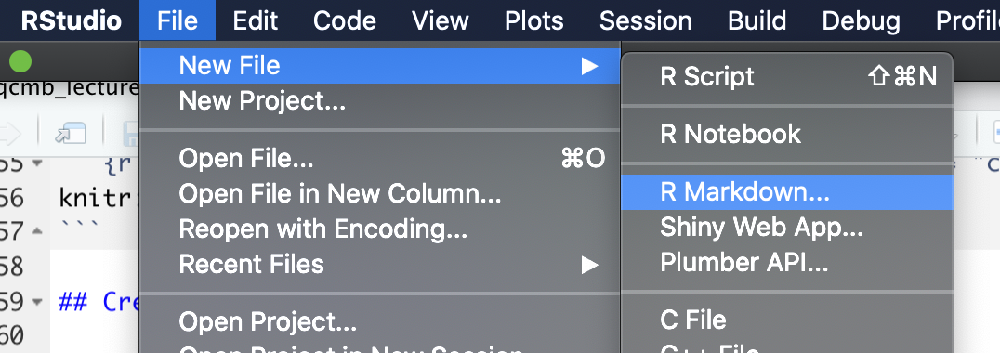
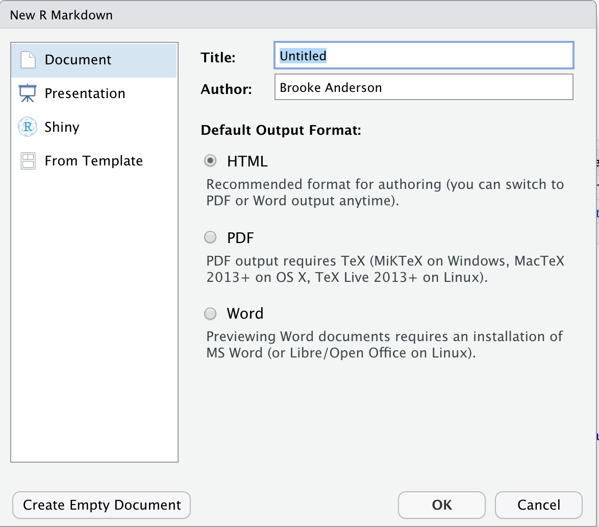
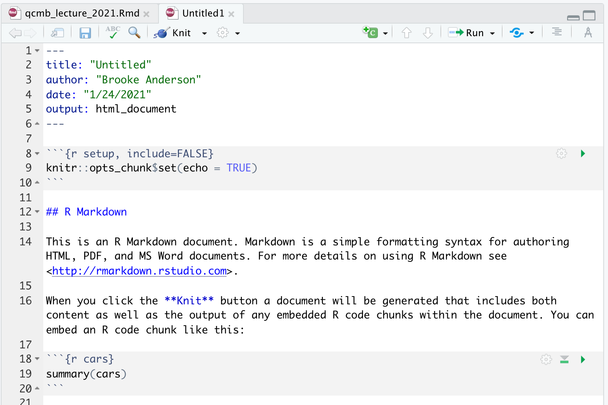
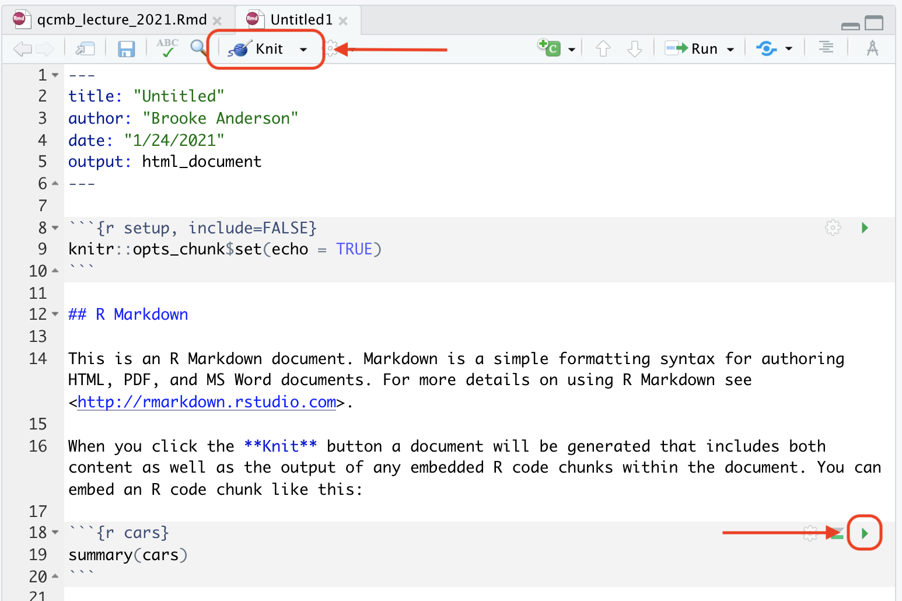
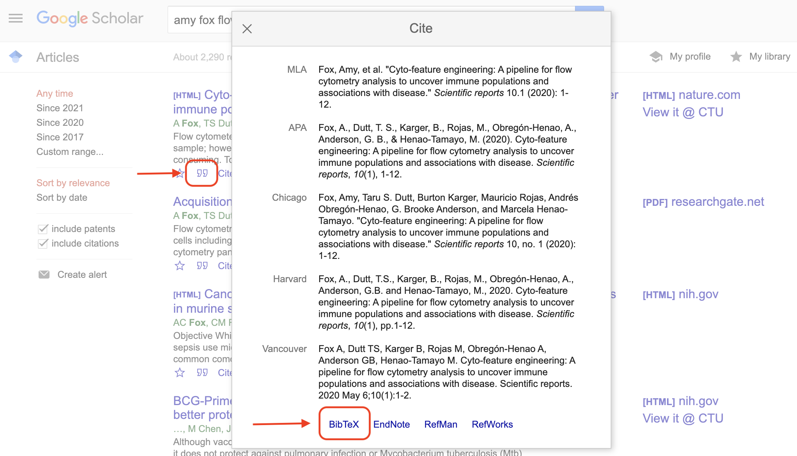

```{r setup, include=FALSE}
knitr::opts_chunk$set(echo = FALSE)
```

# Overview

## Aims for lecture

1. What are "knitted" documents?
2. How do knitted documents work?
3. How can you create knitted documents with R?
3. What is data pre-processing?

## Running example

As a running example, we will use data pre-processing with the `xcms` package,
available on Bioconductor.

Package description: 

\bigskip

> "Framework for processing and visualization of chromatographically separated
and single-spectra **mass spectral data**. Imports from AIA/ANDI NetCDF, mzXML,
mzData and mzML files. **Preprocesses data** for high-throughput, untargeted
**analyte profiling**."

# Knitted documents

## You already use knitted documents!

You have likely already seen and used examples of **knitted documents**. 

Many tutorials for R or Python packages are written as knitted documents. For
example, here's part of the [`xcms`
vignette](https://bioconductor.org/packages/devel/bioc/vignettes/xcms/inst/doc/xcms.html):

```{r echo = FALSE, out.width = "\\textwidth"}
knitr::include_graphics("figures/vignette_example.png")
```

## Definition of knitted documents

The defining characteristic of a knitted document is that it interweaves 
two elements: 

1. Executable code
2. Formatted documentation meant for humans

\bigskip

\pause

Example: 

```{r echo = FALSE, out.width = "\\textwidth"}
knitr::include_graphics("figures/vignette_example_annotated.png")
```

## Why use knitted documents?

1. Code is checked every time you render the document
(increase **reliability**)
2. Code can be re-run with updated or new datasets (increase 
**efficiency**)
3. Document is in plain text, so it can be tracked well with 
version control (increase **transparency**)
4. Code can be clearly and thoroughly documented (increase
**reproducibility**)

# How knitted documents work 

## How knitted documents work

1. Knitted documents start as plain text
2. A special section at the start of the document (**preamble**) gives some
overall directions about the document
3. Special combinations of characters indicate where the executable code starts
4. Other special combinations show where the regular text starts (and the
executable code section ends)
5. Formatting for the rest of the document is specified with a **markup language**
6. You create the final document by **rendering** the plain text document. This
process runs through two software programs.
7. The final document is attractive and **read-only**---you should never make
edits to this output, only to your initial plain text document.

## Plain text 

1. Knitted documents start as plain text

\bigskip

For example: 

\bigskip

```
# Initial data inspection 

The `OnDiskMSExp` organizes the MS data ...
```

## Plain text 

Writing plain text: 

- Only use character from the American Standard Code for Information Interchange (ASCII) 
- Use a text editor (*not* Word or similar word processing programs, instead
RStudio, Notepad, TextEdit, pico, vi/vim, emacs)
- White space is important (empty lines and spaces)
- Flexibility in file extension---choose based on the "knitting" software
(for RMarkdown, ".Rmd")

## ASCII

128 characters. Includes:

- Digits 0--9
- Lowercase and uppercase alphabet (a--z, A--Z)
- Some symbols: e.g., ! " , . + - / # * ~
- Some control codes (e.g., new line, tab, ring a bell)

```{r echo = FALSE, out.width = "\\textwidth"}
knitr::include_graphics("figures/ascii_characters.png")
```

*Image source: https://commons.wikimedia.org/wiki/File:ASCII1963-infobox-paths.svg*

## White space

To create a section header, you would write: 

```
# Initial Data Inspection
```

\bigskip

Meanwhile this: 

```
#Initial Data Inspection
```

Would render to: 

#Initial Data Inspection

## White space

This would create two paragraphs: 

```
This is a first paragraph. 

This is a second.
```

\bigskip

Meanwhile this would create one: 

```
This is a first paragraph.
This is still part of the first paragraph.
```

## Preamble

2. A special section at the start of the document  (**preamble**) gives some
overall directions about the document

In RMarkdown documents, this preamble is specified using **YAML**: 
YAML Ain’t Markup Language.

For example, here is the YAML for this presentation:

```
  ---
  title: "Reproducible Research with R"
  author: "Brooke Anderson"
  date: "1/25/2021"
  output: beamer_presentation
  ---
```

## Preamble

In this preamble, you can specify things using **keys** and **values**.

For example, you can specify the title: 

```
title: "Reproducible Research with R"
```

and the type of output: 

```
output: beamer_presentation
```

## Preamble

There are other types of knitted documents, too---they might use other
languages for the preamble and the markup. Examples of other Markup 
languages include LaTeX and HTML.

There are websites, cheatsheets, and other resources you can use to find 
out which keywords are available for the preamble in the type of 
document you're creating, as well as the range of values those 
keywords can take.

## Separating executable code 

3. Special combinations of characters indicate where the executable code starts
4. Other special combinations show where the regular text starts (and the
executable code section ends)

\pause

\bigskip

For example: 

\bigskip

```
Some text is here. And then some code: 
```

````
```{r, eval=TRUE}`r ''`
class_grades <- c(95, 98, 88)
mean(class_grades)
```
````

## Separating executable code 

This combination indicates the start of executable code: 

\bigskip
 
```` ```{r} ````

\bigskip

\pause

This combination indicates the start of regular documentation (that is, 
the end of executable code): 

\bigskip

```` ``` ```` 

\bigskip

\pause

In the starting combination, you can also add some specifications for 
how you want the code run and showed: 

\bigskip
 
```` ```{r echo = FALSE, fig.align = "center"} ````

## Formatting text

5. Formatting for the rest of the document is specified with a **markup language**

You do not have buttons to click for formatting like bold, italics, font 
size, and so on. Instead, you use **special characters or character combinations**
to specify formatting in the final document.

For example, you'll surround a word or phrase in `**` to make it bold. 

To write "**this**" in the final document, you'll write `"**this**"` in the
plain text initial document.

## Formatting text

The start of this document: 

```{r echo = FALSE, out.width = "\\textwidth"}
knitr::include_graphics("figures/vignette_example.png")
```

\pause

Is written like this: 

```
# Initial data inspection 

The `OnDiskMSExp` organizes the MS data ...
```

## Formatting text

Imagine yourself dictating everything to your computer---you have to 
say not just the words, but the formatting you want as each spot. 

```{r echo = FALSE, out.width = "\\textwidth", fig.align = "center"}
knitr::include_graphics("figures/churchill.jpg")
```

*Source: The Churchill Project*

## Rendering the document

6. You create the final document by **rendering** the plain text document. This
process runs through two software programs.
7. The final document is attractive and **read-only**---you should never make
edits to this output, only to your initial plain text document.

# Creating knitted documents in R

## RMarkdown

R has a special format for creating knitted documents, **RMarkdown**.

- **RMarkdown** files are in plain text. They use **YAML** for the
preamble and **Markdown** for the primary markup language. 
- **Code sections** are marked with ```` ```{r} ```` at the 
beginning and ```` ``` ```` at the end
- **Executable code** can be in R, but also in a number of other
languages

```{r echo = FALSE, out.width = "\\textwidth", fig.align = "center"}
knitr::include_graphics("figures/rstudio_rmarkdown_graphic.png")
```

*Source: https://rstudio.com/wp-content/uploads/2015/02/rmarkdown-cheatsheet.pdf*

## Creaing an RMarkdown document

In RStudio, you can use create a number of types of new files through the 
"File" menu. 

To create a new RMarkdown file, choose "New File" -> "RMarkdown"

```{r echo = FALSE, out.width = "0.7\\textwidth", fig.align = "center"}

```

## Creaing an RMarkdown document

This will open a window with some options. You can specify the title
of the document, for example, and its output format. 

```{r echo = FALSE, out.width = "0.7\\textwidth", fig.align = "center"}

```

## Creaing an RMarkdown document

This will open a new document. It won't be blank, though. Instead,
it will give an example document that you can test out: 

```{r echo = FALSE, out.width = "0.9\\textwidth", fig.align = "center"}

```

## Creaing an RMarkdown document

You can render the whole document using the **Knit button**. You can 
run code in specific chunks at the console using a button in the chunk. 

```{r echo = FALSE, out.width = "0.9\\textwidth", fig.align = "center"}

```

## Markdown syntax

For the main text, all format is done using **Markdown** syntax. 

Some example formatting symbols and conventions: 

- `**` for bold, `*` for italics
- `#` for first-level headers, `##` for second-level, and so on
- Double new lines for new paragraphs (blank line between paragraphs)
- Hyphens on new lines for itemized lists

For more, see the RMarkdown Reference Guide: https://rstudio.com/wp-content/uploads/2015/03/rmarkdown-reference.pdf

## Code chunk options

You can set many options for the code in a specific chunk by setting
**chunk options** for that chunk. 

- `eval`: Whether to evaluate the code
- `echo`: Whether to print the code
- `message`, `warning`: Whether to print messages and warnings in the 
document code output

For more, see the RMarkdown Cheatsheet: 
https://rstudio.com/wp-content/uploads/2015/02/rmarkdown-cheatsheet.pdf


## Useful advanced features in RMarkdown

1. **Include bibliographical references**
2. *Include math / equations*
2. Include code that executes in different languages
3. Shift to LaTeX / HTML if you can't express something 
in Markdown
4. Can output different formats (articles, presentations, 
posters)
5. Expands to create larger projects: books (`bookdown`), 
blogs (`blogdown`), online dashboards (`flexdashboard`)

## Including bibliographical references

To include references in RMarkdown documents, you can 
use something called **BibTeX**. 

This has three components: 

1. Create a plain text file with listings for each of 
your references (**BibTeX file**). Save it with the
extension `.bib`. 
2. In your RMarkdown document, include the filepath
to this BibTeX file. 
3. In the text of the RMarkdown file, include a key and special character
combination anytime you want to reference a paper.

## Including bibliographical references

Once you have a BibTeX file, you will include its
path in the YAML: 

```
  ---
  title: "Reproducible Research with R"
  author: "Brooke Anderson"
  date: "1/25/2021"
  output: beamer_presentation
  bibliography: mybibliography.bib
  ---
```

It is easiest if you save the BibTeX file in the same directory 
as the RMarkdown document.

## Including bibliographical references

You can add references in the text using a key for each paper
within special characters (`[@paper1, @paper2]`). 

\pause

For example, you would write:

```
This technique follows earlier work [@fox2020, 
@anderson2019].
```

\bigskip

To create: 

\bigskip

> ``This technique follows earlier work (Fox et al. 2020, Anderson et al. 2019)."

With full paper details included at the end of the document.

## Including bibliographical references

Put all the bibliographical details in the BibTeX file: 

You will have a file named something like `mybibliography.bib`
with entries for each paper like this: 

\footnotesize

```
@article{fox2020,
  title={Cyto-feature engineering: A pipeline for flow cytometry 
    analysis to uncover immune populations and associations with 
    disease},
  author={Fox, Amy and Dutt, Taru S and Karger, Burton and Rojas, 
    Mauricio and Obreg{\'o}n-Henao, Andr{\'e}s and 
    Anderson, G Brooke and Henao-Tamayo, Marcela},
  journal={Scientific Reports},
  volume={10},
  number={1},
  pages={1--12},
  year={2020}
}
```

## Including bibliographical references

You can get these details from Google Scholar: 

```{r echo = FALSE, out.width = "\\textwidth", fig.align = "center"}

```

## Where to develop RMarkdown skills

- RStudio RMarkdown material: https://rmarkdown.rstudio.com/
  + Tutorials
  + Gallery
  + Advanced articles
- Free online books
  + [*RMarkdown: The Definitive Guide*](https://bookdown.org/yihui/rmarkdown/)
  + [*RMarkdown Cookbook*](https://bookdown.org/yihui/rmarkdown-cookbook/)

# Pre-processing for research data

## Pre-processing research data

When we take measurements, we do so with the goal of using those
**data** (direct measurements of something) to gain **knowledge**.

Sometimes direct measurements line up very closely with a 
research question (e.g., mortality status of a test subject).

Sometimes data from measurements need a lot of **pre-processing** to 
use to gain knowledge and test meaningful hypotheses.

Often lots of pre-processing required for data from **complex equipment** that
leverage cleverness (in physics or chemistry) to see a new angle, but need more
work to interpret the resulting measurements.

## LC-MS data

**Liquid chromatography–mass spectrometry**:

- Often used for chemical analysis, including biochemical molecules, including
for metabolomics and proteomics
- Used in academic research, also in industry research (pharmaceutical, for
example)
- Leverages principles from chemistry and physics to identify 
"stuff" in a sample and how much of each type of "stuff" 

## Pre-processing LC-MS data with code

```{r echo = FALSE, out.width = "\\textwidth"}
knitr::include_graphics("figures/Liquid_chromatography_MS_spectrum_3D_analysis.png")
```

*Image source: Daniel Norena-Caro*

## Pre-processing LC-MS data 

Example tasks in pre-processing LC-MS data include: 

1. **Import data** from specialized file formats 
(NetCDF, mzML / mzXML, mzData)
2. **Filter data** (e.g., to a certain range of retention times)
3. **Explore data**
4. Perform **quality control** (e.g., identify and remove sample runs
that failed or had other major problems)
5. Ensure data from different samples are **comparable** (e.g., 
retention time correction, normalization)
6. **Detect peaks** and refine these results (e.g., diagnose and fix or 
remove overlapping peaks or incorrectly split peaks)

These pre-processing steps all come *before* any data analysis or visualization
(other than exploratory data analysis).

## Pre-processing research data: GUI vs code

- Complex equipment will often come with its own, or have available
through outside vendors, proprietary software
- This is typically based on a **GUI** (graphical user interface) 
- You can use this for your pre-processing, but there are some 
very good reasons not to if you can avoid it:
  + Code scripts are reproducible---by you or by others.
  + Well-documented code makes it much easier to write the 
    Methods section later


