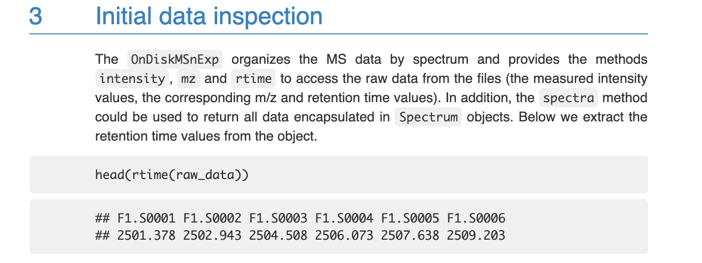
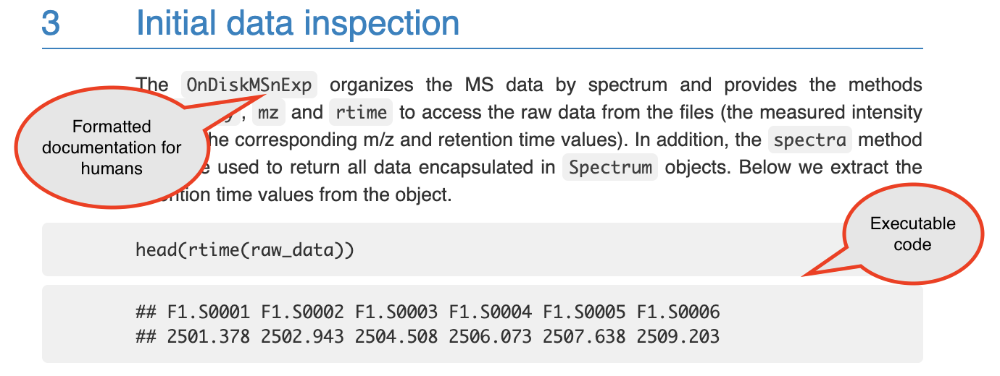
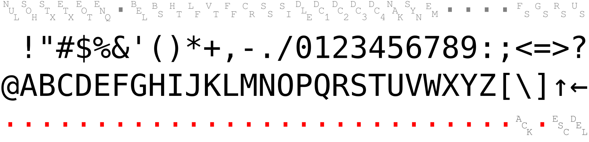
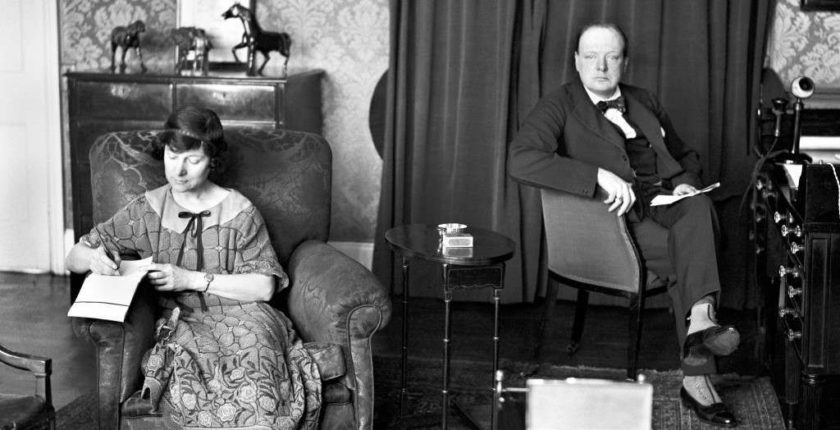
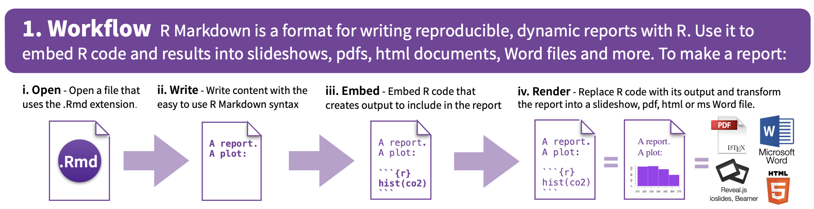
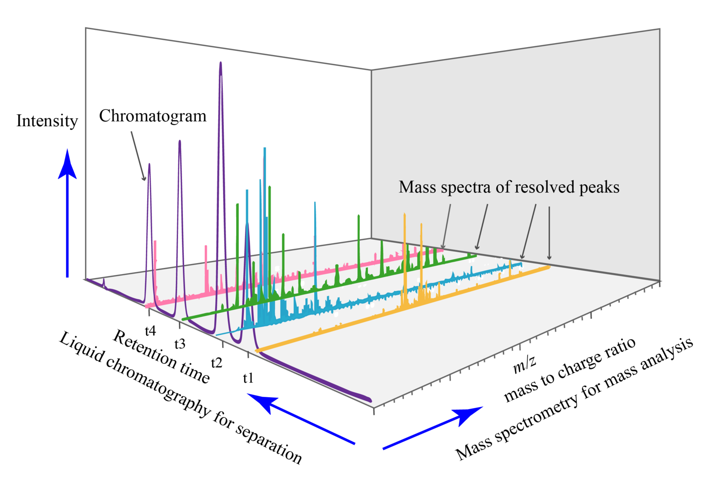

```{r setup, include=FALSE}
knitr::opts_chunk$set(echo = FALSE)
```

# Overview

## Aims for lecture

1. What are "knitted" documents?
2. How to create these with R
3. What is data pre-processing?
4. Creating reproducible data pre-processing protocols for your research

## Running example

As a running example, we will use data preprocessing with the `xcms` package,
available on Bioconductor.

Package description: 

> "Framework for processing and visualization of chromatographically separated
and single-spectra **mass spectral data**. Imports from AIA/ANDI NetCDF, mzXML,
mzData and mzML files. **Preprocesses data** for high-throughput, untargeted
**analyte profiling**."

# Knitted documents

## You already use knitted documents!

You have likely already seen and used examples of **knitted documents**. 

Many tutorials for R or Python packages are written as knitted documents. For
example, here's part of the [`xcms`
vignette](https://bioconductor.org/packages/devel/bioc/vignettes/xcms/inst/doc/xcms.html):

```{r echo = FALSE, out.width = "\\textwidth"}

```

## Definition of knitted documents

The defining characteristic of a knitted document is that it interweaves 
two elements: 

1. Executable code
2. Formatted documentation meant for humans

\bigskip

\pause

Example: 

```{r echo = FALSE, out.width = "\\textwidth"}

```

## How knitted documents work

1. Knitted documents start as plain text
2. A special section at the start of the document (**preamble**) gives some
overall directions about the document
3. Special combinations of characters indicate where the executable code starts
4. Other special combinations show where the regular text starts (and the
executable code section ends)
5. Formatting for the rest of the document is specified with a **markup language**
6. You create the final document by **rendering** the plain text document. This
process runs through two software programs.
7. The final document is attractive and **read-only**---you should never make
edits to this output, only to your initial plain text document.

## How knitted documents work

1. Knitted documents start as plain text

\bigskip

For example: 

\bigskip

```
# Initial data inspection 

The `OnDiskMSExp` organizes the MS data ...
```

## How knitted documents work

Writing plain text: 

- Use a text editor (*not* Word or similar word processing programs, instead
RStudio, Notepad, TextEdit, pico, vi/vim, emacs)
- Only use character from the American Standard Code for Information Interchange (ASCII) 
- White space is important (empty lines and spaces)
- Flexibility in file extension---choose based on the "knitting" software
(for RMarkdown, ".Rmd")

## ASCII

128 characters. Includes:

- Digits 0--9
- Lowercase and uppercase alphabet (a--z, A--Z)
- Punctuation: ...
- Some control codes (e.g., new line, tab, ring a bell)

```{r echo = FALSE, out.width = "\\textwidth"}

```

*Image source: https://commons.wikimedia.org/wiki/File:ASCII1963-infobox-paths.svg*

## How knitted documents work

2. A special section at the start of the document  (**preamble**) gives some
overall directions about the document

In RMarkdown documents, this preamble is specified using **YAML**.

For example, here is the YAML for this presentation:

```
  ---
  title: "Reproducible Research with R"
  author: "Brooke Anderson"
  date: "1/25/2021"
  output: beamer_presentation
  ---
```

## How knitted documents work

In this preamble, you can specify things using **keywords** and **values** [?].

For example, you can specify the title: 

```
title: "Reproducible Research with R"
```

and the type of output: 

```
output: beamer_presentation
```

## How knitted documents work

There are other types of knitted documents, too---they might use other
languages for the preamble and the markup. Examples of other Markup 
languages include LaTeX and HTML.

There are websites, cheatsheets, and other resources you can use to find 
out which keywords are available for the preamble in the type of 
document you're creating, as well as the range of values those 
keywords can take.

## How knitted documents work

3. Special combinations of characters indicate where the executable code starts
4. Other special combinations show where the regular text starts (and the
executable code section ends)

\pause

\bigskip

For example: 

\bigskip

```
Some text is here. And then some code: 
```

````
```{r, eval=TRUE}`r ''`
class_grades <- c(95, 98, 88)
mean(class_grades)
```
````

## How knitted documents work

This combination indicates the start of executable code: 

\bigskip
 
```` ```{r} ````

\bigskip

\pause

This combination indicates the start of regular documentation (that is, 
the end of executable code): 

\bigskip

```` ``` ```` 

\bigskip

\pause

In the starting combination, you can also add some specifications for 
how you want the code run and showed: 

\bigskip
 
```` ```{r echo = FALSE, fig.align = "center"} ````

## How knitted documents work

5. Formatting for the rest of the document is specified with a **markup language**

You do not have buttons to click for formatting like bold, italics, font 
size, and so on. Instead, you use **special characters or character combinations**
to specify formatting in the final document.

For example, you'll surround a word or phrase in `**` to make it bold. 

To write "**this**" in the final document, you'll write `"**this**"` in the
plain text initial document.

## How knitted documents work

The start of this document: 

```{r echo = FALSE, out.width = "\\textwidth"}

```

\pause

Is written like this: 

```
# Initial data inspection 

The `OnDiskMSExp` organizes the MS data ...
```

## How knitted documents work

Imagine yourself dictating everything to your computer---you have to 
say not just the words, but the formatting you want as each spot. 

```{r echo = FALSE, out.width = "\\textwidth", fig.align = "center"}

```

*Source: The Churchill Project*

## How knitted documents work

6. You create the final document by **rendering** the plain text document. This
process runs through two software programs.
7. The final document is attractive and **read-only**---you should never make
edits to this output, only to your initial plain text document.

## Why use knitted documents?

1. Code is checked every time you render the document
2. Code is formatted without special symbols
3. Code can be re-run with updated or new datasets
4. Document is in plain text, so it can be tracked well with 
version control

## Why use knitted documents?

1. Code is checked every time you render the document

## Why use knitted documents?

2. Code is formatted without special symbols

[Example of code symbols in Word that can mess up code]

Word processors---WYSIWYG, text encoding / BOM

## Why use knitted documents?

3. Code can be re-run with updated or new datasets

## Why use knitted documents?

4. Document is in plain text, so it can be tracked well with 
version control

[Picture of diff from git tracking]

# Creating knitted documents in R

## RMarkdown

R has a special format for creating knitted documents, **RMarkdown**.

- **RMarkdown** files are in plain text. They use **YAML** for the
preamble and **Markdown** for the primary markup language. 
- **Code sections** are marked with ```` ```{r} ```` at the 
beginning and ```` ``` ```` at the end
- **Executable code** can be in R, but also in a number of other
languages

```{r echo = FALSE, out.width = "\\textwidth", fig.align = "center"}

```

*Source: https://rstudio.com/wp-content/uploads/2015/02/rmarkdown-cheatsheet.pdf*

## RMarkdown versus Notebook

Some subtle differences in how code is executed?

Can be used to created similar output files?

Write the syntax and code chunks the same way?

You can change between the two in the YAML?

In theory, easier to execute and check code as you go
(preview vs render), but it's unclear if this is different
from running RMarkdown code in the console.

# Pre-processing for research data

## Preprocessing LC-MS data with code

- Want to get from data (direct measurements of something) to 
knowledge
- Sometimes direct measurements line up very closely with a 
research question (e.g., weight of research animal, to some 
degree CFUs), sometimes they need a lot of pre-processing to 
use to gain knowledge and test meaningful hypotheses
- Often lots of preprocessing required for data from complex
equipment that do very clever things with chemistry or 
physics---leveraging cleverness to see a new angle, but need to 
work more to interpret the resulting measurements

## Preprocessing LC-MS data with code

- Complex equipment will often come with its own, or have available
through outside vendors, proprietary software
- This is typically based on a **GUI** [more on this]
- You can use this for your preprocessing, but there are some 
very good reasons not to if you can avoid it

## Preprocessing LC-MS data with code

**Liquid chromatography–mass spectrometry**: 
[Type of equipment]
[Kinds of data]
[File formats: NetCDF, mzML/mzXML, mzData]

- Often used for chemical analysis, including biochemical molecules
- Used for metabolomics and proteomics
- Used in research, also in industry research (pharmaceutical, for
example)
- Leverages principles from chemistry and physics [?] to identify 
"stuff" in a sample and how much of each type of "stuff" [?]

## Preprocessing LC-MS data with code

- [More on chromatography]
- [More on mass spec]

## Preprocessing LC-MS data with code

```{r echo = FALSE, out.width = "\\textwidth"}

```

*Image source: Daniel Norena-Caro*

## Preprocessing LC-MS data with code

Common preprocessing steps: 

- Import data (R has *loads* of packages for handling import of many 
file formats; `mzR` [?] helpful for common LC-MS file formats)
- Filter to a subset range of retention time [add why]
- Ensure files from different samples are comparable
- Identify and remove sample runs that failed or had other major problems
- Line up retention times across samples [?]
- Figure out the typical width of chromatographic peaks in a sample
(to decide on parameters for chromatographic peak detection)
- Chromatographic peak detection
- Refine results from peak detection (e.g., diagnose and fix or remove
overlapping peaks or incorrectly split peaks)
- Extract specific chromatographic peaks
- Peak alignment / retention time correction (adjusts raw retention times so 
that they're comparable across samples---analogy is tare on a scale?)
- **Correspondance**: Match peaks across samples, so intensities can be 
compared?
- Data normalization, to correct technical bias?
- Normalize the intensity of feature signals

## Preprocessing LC-MS data with code

These preprocessing steps all come *before* any data analysis or visualization
(other than exploratory data analysis). Data analysis *after* this preprocessing
could include things like checking which features [?] / peaks [?] are significantly 
different between two experimental groups. 

## Preprocessing choices: GUI or script

You will have choices about how you preprocess the data. For example, when doing
chromotographic peak detection, there will be choices in the algorithm that is
used (the `centWave` algorithm in `xcms`). These include the expected range of
chromatographic peak widths and the deviation of mass to charge values that will 
are expected, as a maximum, for chromatographic peaks [?]. 

In the `centWave` function, these two choices can be specified with 
`peakwidth` and `ppm`, respectively.

## Preprocessing choices: GUI or script

- Reproducible---by you or by others.
- Much easier to write the Methods section later!

# Reproducible data pre-processing protocols

# In-course exercise

## In-course exercise

- Recreate a document's formatting by looking up Markdown syntax 
(focuses on Markdown syntax to format text in document)
- Create data preprocessing protocol for CFU data---data at 
different dilutions, pick good dilution, convert back to 
bacterial load in original sample (Amy's package?)
- Render a document to Word. Change something in the ".docx" 
document. Re-render (knit again) the RMarkdown document. Is you 
change in the new version of the ".docx"? Why or why not? 
How does this relate to the idea of "read only"?
