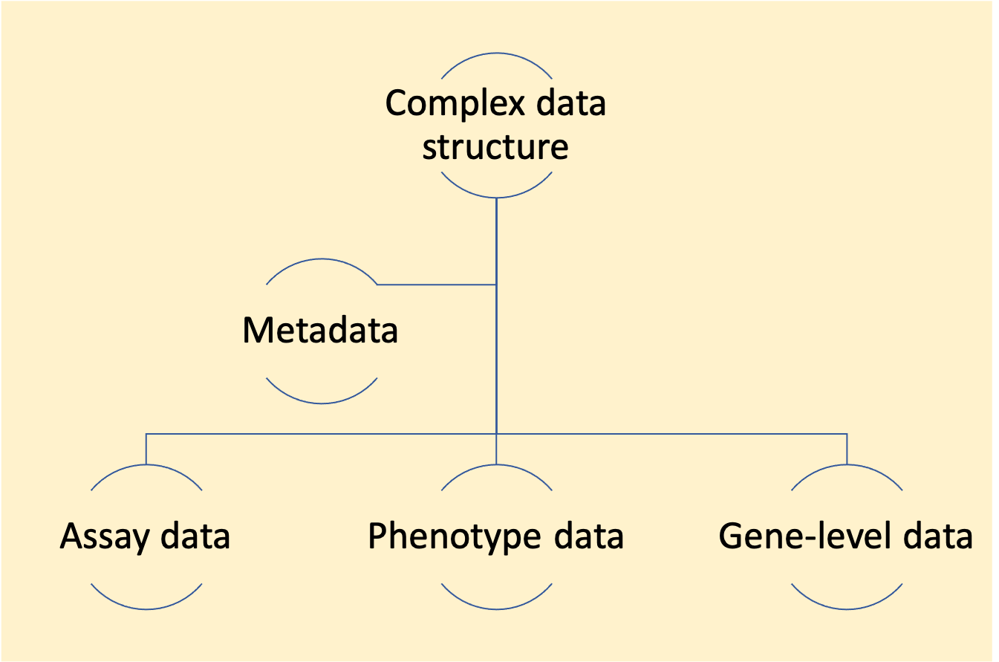
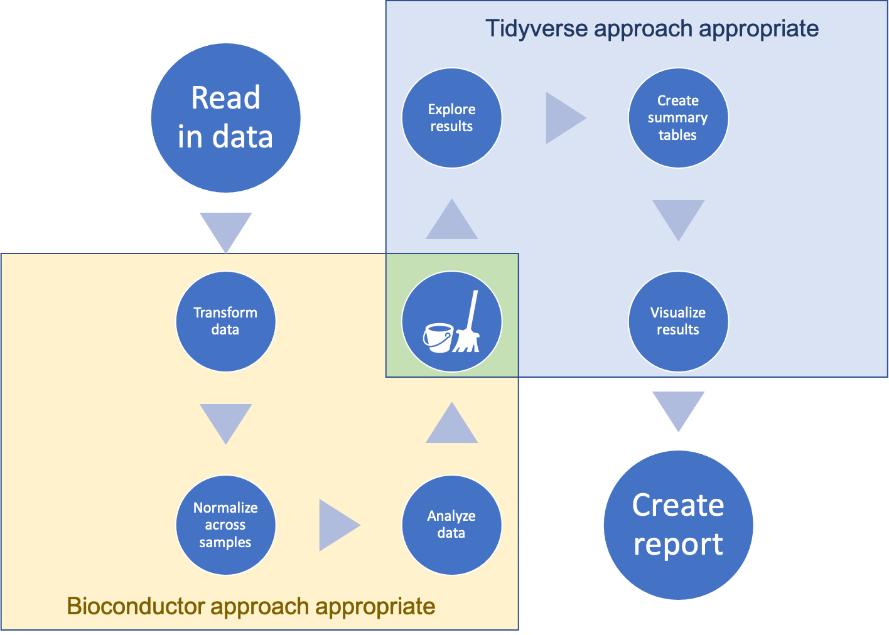
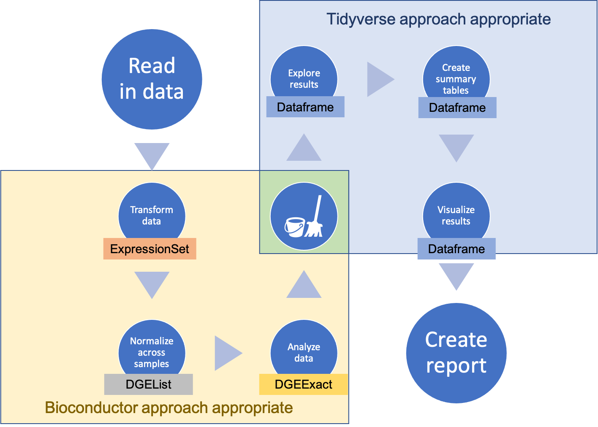

```{r setup, include=FALSE}
knitr::opts_chunk$set(echo = FALSE)
```

## Overview

1. Data structures in R
2. The tidyverse approach
3. The Bioconductor approach
4. Transitioning across approaches in a workflow

Slides are available at: [link]

# Data structures

## Where do you keep your data?

To work with data in R, you typically read it into memory. 

**Data structures** help define the format in which you store your data.

## Types of data structures in R: Simple

[Dataframe as a datastructure---very simple format. Rules: same data type within
each column (each is essentially a vector), can have different data types across
columns, each row is an observation, columns give values for each observation, 
each column has the same length]

## Types of data structures in R: Complex

More complex data structures in R are all, at heart based on lists. This format
allows each object to collect different pieces of data, with different types and
dimensions.

```{r out.width = "0.9\\textwidth", fig.align = "center"}

```


## Data structures in Bioconductor

[Examples of some of the main object classes used for data structure in 
Bioconductor work]

- `ExpressionSet`
- `DGEList`
- `DGEExact`


## Data structures across a workflow

```{r out.width = "\\textwidth"}

```

## Data structures across a workflow

You can move your data among different structures across a workflow, including from more complex data to simpler data structures.

```{r out.width = "0.9\\textwidth"}

```

# Tidyverse approach

## Tidyverse data structure

[Visualization of a tidy dataframe]

## Tidyverse approach

[It is built on the use of a common structure for storing data---almost all 
functions take data in this structure and almost all return data in 
this structure. In other words, it is built on the idea of a common interface
across all its functions. Think Legos.]

## Advantage of the tidyverse approach

[The common interface idea turns out to be very powerful. It allows you to 
not have to rely on large functions that do a lot all at once. Instead, this
idea allows for lots of small functions that each do one small thing, but that
can be chained together in lots of different configurations to do very 
flexible and powerful things. Again, think Legos.]

## Advantage of the tidyverse approach

[This allows you to learn a single set of tools---most of which can be learned
in a few months. These work across all your data, as long as it's in a tidy
dataframe structure while you're working on it. By contrast, if you use a 
variety of data structures, you often have to learn different tools (functions)
for each data structure, rather than being able to use a single set of 
tools for all your data.]

## Advantage of the tidyverse approach

[It is hard to overemphasize how powerful this approach is. It has quickly 
moved from its initial development to being the primary way that R programming
is taught and used among most R programmers. Even many people who have worked
extensively in the past with a more "base R" approach have now adapted and
celebrated this approach to R programming.]

## More resources on the tidyverse approach

[Links to: my coursebook, R for Data Science, RStudio::conf recordings, other resources for tidyverse]

# Bioconductor approach

## Bioconductor data structures

[These tend to be more complex. They are built on S4 objects, which is
one of R's object-oriented programming systems. They often will include
several elements.]

## Bioconductor data structures

[Visualization of a Bioconductor data structure]

## Why use more complex data structures?

[1. To get lots of differently structured things out of a function]

## Why use more complex data structures?

[2. To work with large data]

## Why use more complex data structures?

[3. To validate data when an object's created]

## Why use more complex data structures?

[4. To facilitate software development across large and diverse
groups of contributors]

## More resources on the Bioconductor approach

[Links to: Bioconductor page, with vignettes / tutorials, BioC conference, BioC articles and book]

# Connecting the two approaches

## Example data

The `hammer` dataset is available through the `biobroom` package. It 
provides data from an RNA-Seq experiment for a study on nervous system
transcriptomics (Hammer et al., 2010).

## Example data

The data are stored in an `ExpressionSet` data structure, a common class
used in Bioconductor work. Different elements of the data structure store
data from the assay (intensities of different ...) as well as phenotype 
data.

## Example data

\footnotesize

```{r echo = TRUE, message = FALSE, warning = FALSE}
library(Biobase); library(biobroom)
data(hammer)
print(hammer)
```

## Connecting the two approaches

There are several ways you can connect the two approaches: 

- Generic functions from the `biobroom` package
- *Accessor functions* written for specific Bioconductor data 
structures
- Elemental tools for extracting parts of data from R objects

## `biobroom` package

[If you're lucky, you can make the connection very easily using the 
`biobroom` package. This package allows you to extract elements from 
several types of Bioconductor data structures. It has generic functions
that pull out elements and format them as tidy dataframes.]

## `biobroom` package

[Bioconductor data structures that currently work with `biobroom`]

- `ExpressionSet`


## `biobroom` example

You can use the `tidy` function to extract a tidy dataframe with assay data
from an `ExpressionSet` object in R:

\footnotesize

```{r echo = TRUE, message = FALSE, warning = FALSE}
tidy(hammer, addPheno = TRUE)
```


## `biobroom` example

[Example of being able to do tidyverse stuff with that output]

```{r message = FALSE, warning = FALSE}
library(tidyverse)
```


## Accessor functions

[What are accessor functions]

## Accessor function example

You can extract the assay data (in a matrix format) from an `ExpressionSet`
object using the `exprs` accessor function:

\footnotesize

```{r echo = TRUE}
exprs(hammer)[1:6, 1:4]
```
## Accessor function example

You can use the `pData` accessor function to extract the phenotype data
(as a "messy" dataframe) from an `ExpressionSet` object:

```{r echo = TRUE}
pData(hammer)[1:6, 1:3]
```


## Extracting from R objects

The most elemental way of extracting data from R objects is to use the `$` or
`@` operators.

For S4 objects (most Bioconductor objects), `@` is used for this extraction:

```{r echo = TRUE}
hammer@phenoData@data[1:4, 1:3]
```

## Extracting from R objects

You can use the `str` function (short for "structure") to investigate
what's stored in any type of R object, to figure out what you can extract:

\footnotesize

```{r echo = TRUE}
str(hammer@phenoData)
```

## Extracting from R objects

In some cases, especially for large data, a slot in an object might just
point to an environment---it might be trickier in these cases to extract the
data directly from the object.

For example, the `assayData` slot in the example `ExpressionSet` object 
points to an environment, rather than directly storing the assay data:

```{r echo = TRUE}
hammer@assayData
```

## Future directions: `ggbio` package

The `ggbio` package allows you to coordinate Bioconductor-style analysis
with the tidyverse style of visualization, which is based on the `ggplot2`
package.

This package enables the use of "layers" of small simple functions to build 
up a plot, aligning with the general tidyverse approach of combining small, 
simple tools to do complex things.

## Future directions: `ggbio` package

Here is an example from the [`ggbio` vignette](https://www.bioconductor.org/packages/release/bioc/vignettes/ggbio/inst/doc/ggbio.pdf), using data stored in a `GRanges` data structure:

```{r out.width = "\\textwidth"}
knitr::include_graphics("figures/ggbio_vignette_example.png")
```

## Future directions: List-columns

[In some areas, there is a movement to allow a tidyverse approach even in the
context of very complex data that doesn't fit naturally into a dataframe. One 
example is with spatial data. More complex "tidy" dataframes are being 
developed that allow some columns to be *list-columns* and store pretty 
complex data within a cell of the dataframe. These are being powerfully 
used, for example, within the `sf` package, for geospatial data in R. It's
allowing a tidyverse approach to be used from early stages with a type of 
data for which R-based analysis traditionally relied heavily on much more
complex S4? objects for data structures. It seems likely that a similar 
approach might be adapted at some point for Bioconductor-style work.]

