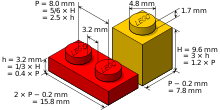
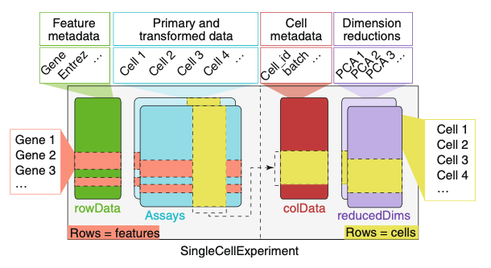
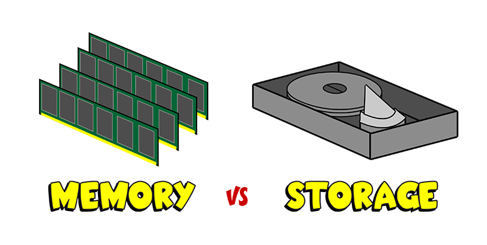
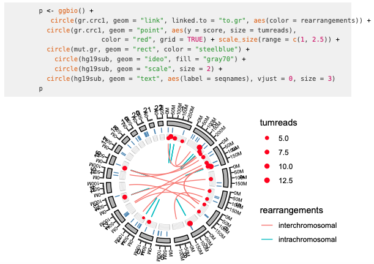

```{r setup, include=FALSE}
knitr::opts_chunk$set(echo = FALSE)
```

## Overview

1. Data structures in R
2. The tidyverse approach
3. The Bioconductor approach
4. Transitioning across approaches in a workflow

Slides are available at: \url{bit.ly/complex_tidy}

# Data structures

## Where do you keep your data?

To work with data in R, you typically read it into memory. 

**Data structures** help define the format in which you store your data.

## Types of data structures in R: Simple

One simple data structure in R is the **dataframe**. This is the structure
used extensively in the **tidyverse approach**.

```{r out.width = "\\textwidth"}
knitr::include_graphics("figures/dataframe.png")
```

## Types of data structures in R: Complex

More complex data structures in R are all, at heart based on lists. This format
allows each object to collect different pieces of data, with different types and
dimensions.

```{r out.width = "0.9\\textwidth", fig.align = "center"}
knitr::include_graphics("figures/complex_data_structure.png")
```


## Data structures across a workflow

Work with research data will typically require a series of steps for
pre-processing, analysis, exploration, and visualization. Collectively, 
these form a **workflow** for the data.

```{r out.width = "0.9\\textwidth", fig.align = "center"}
knitr::include_graphics("figures/workflow.png")
```

## Data structures across a workflow

You can move your data among different structures across a workflow, including from more complex data to simpler data structures.

```{r out.width = "0.9\\textwidth", fig.align = "center"}

```

# Tidyverse approach

## Tidyverse data structure

The key data structure in the tidyverse approach is the **dataframe**:

```{r out.width = "\\textwidth"}
knitr::include_graphics("figures/dataframe.png")
```

## Tidyverse approach

The tidyverse approach is built on the use of a common structure for storing
data---almost all functions take data in this structure and almost all return
data in this structure.

In other words, it is built on the idea of a **common interface** across all its
functions.

## Advantage of the tidyverse approach

This is similar to Legos: there are set dimensions for all blocks, so they
can easily snap together in any order:

\bigskip

```{r out.width = "0.9\\textwidth", fig.align = "center"}

```

\footnotesize

Image source: https://en.wikipedia.org/wiki/Lego#/media/File:Lego_dimensions.svg


## Advantage of the tidyverse approach

The common interface idea turns out to be very powerful. It allows you to 
not have to rely on large functions that do a lot all at once. 

Instead, this idea allows for lots of **small functions** that each do **one
small thing**, but that can be chained together in lots of different
configurations to do very flexible and powerful things.

## Advantage of the tidyverse approach

It is hard to overemphasize how powerful this approach is. Simple tools that
can be connected together in different ways can be used to create very 
complex things: 

```{r out.width = "0.9\\textwidth", fig.align = "center"}

```

\footnotesize

Image source: *Architectural Digest*

## Advantage of the tidyverse approach

This allows you to learn a single set of tools---most of which can be learned
in a few months. 

These work across all your data, as long as it's in a **tidy dataframe structure**
while you're working on it.

By contrast, if you use a variety of data structures, you often have to learn
different tools (functions) for each data structure, rather than being able to
use a single set of tools for all your data.

## Advantage of the tidyverse approach

The tidyverse approach has quickly moved from its initial development to being
the primary way that R programming is taught and used among most R programmers.

Even many people who have worked extensively in the past with a more "base R"
approach have now adapted and celebrated this approach to R programming.

## More resources on the tidyverse approach

[Links to: my coursebook, R for Data Science, RStudio::conf recordings, other resources for tidyverse]

# Bioconductor approach

## Bioconductor data structures

Bioconductor data structures tend to be more complex. 

They are built on **S4 object classes**, which is one of R's **object-oriented
programming** systems. 

## Bioconductor data structures

They often will include several elements. The elements might have different
data types or different dimensions, but the data structure stores these
disparate parts together in one object.

```{r out.width = "0.9\\textwidth", fig.align = "center"}
knitr::include_graphics("figures/complex_data_structure.png")
```

## Types of data structures in R: Complex

You can start to see these levels in a complex data object by using the
`str` function. 

For example, here's a peak at the structure of data stored in an `ExpressionSet`
data structure from Bioconductor:

\footnotesize

```{r echo = TRUE, warning = FALSE, message = FALSE}
library(Biobase); library(biobroom); data(hammer)
str(hammer, max.level = 3)
```

## Data structures in Bioconductor

Examples of data structures in Bioconductor include:

- `SummarizedExperiment`
- `GRanges`
- `ExpressionSet`
- `MSnExp`
- `SingleCellExperiment`
- `MultiAssayExperiment`
- `DGEList`
- `DGEExact`

## Why use more complex data structures?

1. To keep together lots of differently structured things 

```{r out.width = "\\textwidth", fig.align = "center"}

```

\footnotesize

Image source: Amezquita et al., 2020

## Why use more complex data structures?

2. To work with large data

Complex data structures can help ensure that data are efficiently 
stored. In some cases, they can also allow for data storage formats
where part of the data stay on disk, rather than being read into memory.

```{r out.width = "0.9\\textwidth", fig.align = "center"}

```

\footnotesize

Image source: callnerds.com

## Why use more complex data structures?

One example is the `OnDiskMSnExp` data structure from the `MSnbase` package:

\bigskip

> "The distinction between MSnExp and OnDiskMSnExp is often not explicitly
stated as **it should not matter, from a user’s perspective, which data structure
they are working with**, as both behave in equivalent ways. Often, they are
referred to as in-memory and on-disk MSnExp implementations."
(Gatto et al. 2013)

## Why use more complex data structures?

3. To validate data when an object's created

```{r out.width = "\\textwidth", fig.align = "center"}

```

\footnotesize

Image source: Amezquita et al., 2020

## Why use more complex data structures?

4. To facilitate software development across large and diverse
groups of contributors

\bigskip

> "S4 is a rigorous system that forces you to thing carefully about program
design. **It's particularly well-suited for building large systems that evolve
over time and will receive contributions from many programmers.** This is why it's
used by the Bioconductor project, so another reason to learn S4 is to equip you
to contribute to that project." (Wickham, *Advanced R*)

## More resources on the Bioconductor approach

[Links to: Bioconductor page, with vignettes / tutorials, BioC conference, BioC articles and book]

# Connecting the two approaches

## Example data

The `hammer` dataset is available through the `biobroom` package. It 
provides data from an RNA-Seq experiment for a study on nervous system
transcriptomics (Hammer et al., 2010).

The data are stored in an `ExpressionSet` data structure, a common class
used in Bioconductor work. Different elements of the data structure store
data from the assay (intensities of different ...) as well as phenotype 
data.

## Example data

\footnotesize

```{r echo = TRUE, message = FALSE, warning = FALSE}
library(Biobase); library(biobroom)
data(hammer)
print(hammer)
```

## Connecting the two approaches

There are several ways you can connect the two approaches: 

- Generic functions from the **`biobroom` package**
- **Accessor functions** written for specific Bioconductor data 
structures
- **Elemental tools** for extracting parts of data from R objects

## `biobroom` package

If you're lucky, you can make the connection very easily using the 
**`biobroom` package**. 

This package allows you to extract elements from 
several types of Bioconductor data structures. 

It has generic functions
that pull out elements and format them as tidy dataframes.

## `biobroom` package

Bioconductor data structures that currently work with `biobroom`
include: 

- `ExpressionSet`
- ...


## `biobroom` example

You can use the `tidy` function to extract a tidy dataframe with assay data
from an `ExpressionSet` object in R:

\footnotesize

```{r echo = TRUE, message = FALSE, warning = FALSE}
tidy(hammer, addPheno = TRUE)
```

## `biobroom` example

This allows you to use tidyverse functions to explore and visualize the data. 
For example, to explore the values for a single gene: 

\footnotesize

```{r echo = TRUE, message = FALSE, warning = FALSE}
library(tidyverse); library(ggbeeswarm); library(ggrepel)
one_gene <- tidy(hammer, addPheno = TRUE) %>% 
        filter(gene == "ENSRNOG00000004805")
one_gene
```

## `biobroom` example

\footnotesize

```{r echo = TRUE, message = FALSE, warning = FALSE, fig.width = 5, fig.height = 3, out.width = "0.9\\textwidth", fig.align = "center"}

one_gene %>% 
        ggplot(aes(x = protocol, y = value)) + 
        geom_beeswarm() +
        geom_label_repel(aes(label = sample)) + 
        ggtitle("Values by sample for gene ENSRNOG00000004805", 
                subtitle = "Samples are labeled with their sample ID")
```


## Accessor functions

**Accessor functions** are written to allow you to extract specific elements
from complex data structures. 

For example, you can extract the assay data (in a
matrix format) from an `ExpressionSet` object using the `exprs` accessor
function:

\bigskip

\footnotesize

```{r echo = TRUE}
exprs(hammer)[1:6, 1:4]
```
## Accessor function example

You can use the `pData` accessor function to extract the phenotype data
(as a "messy" dataframe) from an `ExpressionSet` object:

```{r echo = TRUE}
pData(hammer)[1:6, 1:3]
```
## Accessor functions

Accessor functions are meant to be more robust than more elemental tools.

Developers are meant to consider these a "contract" with users, so their changes
"under the hood" shouldn't affect code that uses these functions.

## Extracting from R objects

The most elemental way of extracting data from R objects is to use the `$` or
`@` operators.

For S4 objects (most Bioconductor objects), `@` is used for this extraction:

```{r echo = TRUE}
hammer@phenoData@data[1:4, 1:3]
```

## Extracting from R objects

You can use the `str` function (short for "structure") to investigate
what's stored in any type of R object, to figure out what you can extract:

\footnotesize

```{r echo = TRUE}
str(hammer@phenoData)
```

## Extracting from R objects

In some cases, especially for large data, a slot in an object might just
point to an environment---it might be trickier in these cases to extract the
data directly from the object.

For example, the `assayData` slot in the example `ExpressionSet` object 
points to an environment, rather than directly storing the assay data:

```{r echo = TRUE}
hammer@assayData
```

# Future directions in connecting workflows

## Future directions: `ggbio` package

The `ggbio` package allows you to coordinate Bioconductor-style analysis
with the tidyverse style of visualization, which is based on the `ggplot2`
package.

This package enables the use of "layers" of small simple functions to build 
up a plot, aligning with the general tidyverse approach of combining small, 
simple tools to do complex things.

## Future directions: `ggbio` package

Here is an example from the [`ggbio` vignette](https://www.bioconductor.org/packages/release/bioc/vignettes/ggbio/inst/doc/ggbio.pdf), using data stored in a `GRanges` data structure:

```{r out.width = "\\textwidth"}

```

## Future directions: List-columns

In some areas, there is a movement to allow a tidyverse approach even in the
context of very complex data that doesn't fit naturally into a dataframe.  

More complex "tidy" dataframes are being developed that allow some columns to be
**list-columns** and store pretty complex data within a cell of the dataframe.

## Future directions: List-columns

One example is with spatial data. List-columns are being powerfully used, for
example, within the `sf` package for geospatial data in R.

\bigskip

```{r out.width = "\\textwidth", fig.align = "center"}
knitr::include_graphics("figures/sf_example.png")
```

\footnotesize

Image source: https://r-spatial.github.io/sf/articles/sf1.html

## Future directions: List-columns

This allows a tidyverse approach to be used from early stages with a type of
data for which R-based analysis traditionally relied heavily on much more
complex data structures.

It seems likely that this approach might be adapted at some point for
Bioconductor-style work.
