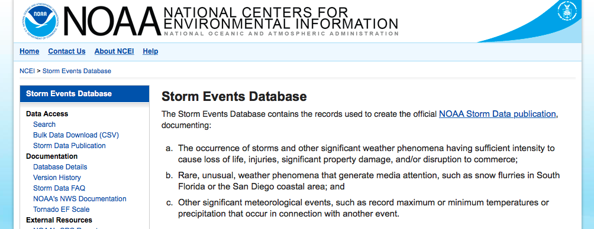

```{r echo = FALSE, message = FALSE, warning = FALSE}
library(knitr)
library(dplyr)
library(pander)
library(htmltools)
library(tidyr)
library(lubridate)
library(stringr)
```

## Getting the slides and data

The slides (as HTML), data, and code for this talk are all available on GitHub: 

https://github.com/geanders/GuestLectures/tree/master/soars_tutorial

```{r echo = FALSE, fig.align = "center", out.width = "80%"}

```

## What are htmlWidgets?

The `htmlWidgets` family of packages wrap Javascript visualization libraries. In practice, that means that you can create interactive visualizations from R in which code run by the viewer's web browser allows the interaction. 

These packages can be used to create interactive visualizations that can be added to several outputs: 

- RStudio's Viewer
- RMarkdown documents rendered to HTML (including presentations)
- Books or blogs developed using RMarkdown tools (`bookdown` and `blogdown`, respectively)
- Package vignettes
- Shiny web applications

## Example data

```{r echo = FALSE, fig.align = "center", out.width = "90%"}

```

For example data, I've pulled listings from NOAA's Storm Events Database. I've pulled all listings of flood and tornado events in Colorado between 2013 and 2015. (Note: I used the [`noaastormevents` package](https://github.com/zailchen/noaastormevents), with development lead by Ziyu Chen, to do this directly from R.)

## Example data

I've created two datasets, `co_floods` and `co_tornados`. Each row represents an event. Columns include the event's date, location, damage, and a few other details.

```{r}
load("data/co_floods.Rdata")
colnames(co_floods)
co_floods %>% select(event_type, cz_name, fips) %>% slice(1:3)
```

## Example data

One of the variables gives longer text descriptions of the event (and can be missing):

```{r}
co_floods %>% select(begin_date, event_narrative) %>% sample_n(4) %>% 
  pander(split.cells = c(5, 50))
```

## Mapping Colorado floods

It's pretty straightforward to use R functions to create a static map with this data:

```{r message = FALSE, fig.width = 4, fig.height = 3.25, fig.align = "center"}
library(ggplot2)
map_data("county", region = "colorado") %>% 
  ggplot(aes(x = long, y = lat, group = group)) + 
  geom_polygon(color = "darkgray", fill = "white") + 
  geom_point(data = co_floods, aes(x = begin_lon, y = begin_lat, group = NULL),
             color = "red", alpha = 0.5) +
  coord_map() + theme_void()
```

## Mapping Colorado floods and tornadoes

However, we might prefer sometimes to create something interactive:

```{r echo = FALSE, message = FALSE, warning = FALSE, fig.align = "center"}
library(leaflet)
load("data/co_tornadoes.RData")
co_tornadoes <- co_tornadoes %>% 
  mutate(popup_text = paste0("<div class='leaflet-popup-scrolled' style='max-height:150px'>",
                             "<b>County:  </b>", cz_name, "<br/>", 
                             "<b>Dates:  </b>", begin_date, " to ", end_date, "<br/>", 
                             "<b># deaths:  </b>", deaths_direct, "<br/>", 
                             "<b># injuries:  </b>", injuries_direct, "<br/>", 
                             "<b>Property damage:  </b>$", damage_property, "<br/>", 
                             "<b>Crop damage:  </b>$", damage_crops, "<br/>", 
                             event_narrative))

co_floods %>% 
  mutate(popup_text = paste0("<div class='leaflet-popup-scrolled' style='max-height:150px'>",
                             "<b>County:  </b>", cz_name, "<br/>", 
                             "<b>Dates:  </b>", begin_date, " to ", end_date, "<br/>", 
                             "<b># deaths:  </b>", deaths_direct, "<br/>", 
                             "<b># injuries:  </b>", injuries_direct, "<br/>", 
                             "<b>Property damage:  </b>$", damage_property, "<br/>", 
                             "<b>Crop damage:  </b>$", damage_crops, "<br/>", 
                             event_narrative)) %>% 
  leaflet() %>% 
  setView(lng = -105.0844, lat = 40.5853, zoom = 10) %>%  
  addProviderTiles("OpenStreetMap.Mapnik") %>%  
  addCircleMarkers(~ begin_lon, ~ begin_lat, color = "blue", radius = 3, 
                   popup = ~ popup_text) %>% 
  addCircleMarkers(data = co_tornadoes, ~ begin_lon, ~ begin_lat,
                   color = "red", radius = 3, popup = ~ popup_text) %>% 
  addMiniMap()
```

## Creating a basic leaflet map

The three basic components of a leaflet map are: 

- Leaflet widget
- Background (tiles)
- Mapping of data to locations

```{r fig.width = 8, fig.height = 2.75}
co_floods %>% leaflet() %>% 
  addProviderTiles("OpenStreetMap.Mapnik") %>% 
  addCircleMarkers(lng = ~ begin_lon, lat = ~begin_lat, radius = 3, color = "blue")
```

## Choices for map tiles

With `addProviderTiles`, you can pick from many different background map tiles. Visit [this provider preview page](https://leaflet-extras.github.io/leaflet-providers/preview/) to see options and get the provider names to use in the R call. Here is the same map using different map tiles: 

```{r fig.width = 8, fig.height = 3}
co_floods %>% leaflet() %>% 
  addProviderTiles("NASAGIBS.ViirsEarthAtNight2012") %>% 
  addProviderTiles("CartoDB.DarkMatterOnlyLabels") %>%
  addCircleMarkers(lng = ~ begin_lon, lat = ~ begin_lat, radius = 3, color = "green")
```

## Choices for mapping data to locations

There are various things you can add to the map to map data to locations. Several are listed here, and all can be add using `add` plus the item name (for example, `addMarkers`).

- `Markers`: "Push pin" style markers
- `CircleMarkers`: The circle markers shown in examples so far
- `LabelOnlyMarkers`
- `Polylines`
- `Circles`
- `Rectangles`
- `Polygons`

You can layer several of these on the same leaflet map (e.g., roads with `Polylines`, counties with `Polygons`, exact locations with one of the markers).

## Choices for mapping data to locations

Data can be mapped from a dataframe with columns for longitude and latitude. In this case, the names of the correct columns for longitude and latitude should be specified with the `lng` and `lat` arguments: 

```{r fig.width = 8, fig.height = 2.75}
leaflet() %>% 
  addProviderTiles("OpenStreetMap.Mapnik") %>% 
  addCircleMarkers(data = co_floods, lng = ~ begin_lon, ~ begin_lat, 
                   radius = 3, color = "blue") %>% 
  addMarkers(data = co_tornadoes, lng = ~ begin_lon, ~ begin_lat)
```

## Choices for mapping data to locations

Alternatively, if you have data saved as a spatial object, you can map that directly without specifying latitude and longitude columns. 

The [`tigris` package](https://github.com/walkerke/tigris) allows you to pull US Census TIGER shapefiles directly from R. The following call pulls a shape file with Colorado county boundaries (the `cb` options is so we pull a lower-resolution version):

```{r warning = FALSE, message = FALSE}
library(tigris)
co_counties <- counties(state = 'CO', cb = TRUE)
class(co_counties)
```

## Choices for mapping data to locations

This spatial object can be used when mapping data to location with the `data` option:

```{r fig.width = 8, fig.height = 2.75}
leaflet() %>% 
  addProviderTiles("Stamen.TonerBackground") %>% 
  addPolygons(data = co_counties) %>% 
  addCircleMarkers(data = co_floods, lng = ~ begin_lon, ~ begin_lat, 
                   radius = 3, color = "green") 
```

## Customizing icons

You can use a custom icon for the map markers. For example, [this tornado icon](https://thenounproject.com/term/tornado/11563/) was created by Gilad Fried and is under a Creative Commons license. You can use the following code to use it to mark the Colorado tornados (this assumes it's been saved locally as "figures/tornado.png"):

```{r fig.width = 7, fig.height = 3}
co_tornadoes %>% 
  leaflet() %>% addProviderTiles("OpenStreetMap.Mapnik") %>%  
  addMarkers(~ begin_lon, ~ begin_lat, 
             icon = makeIcon("figures/tornado.png", iconWidth = 20, iconHeight = 20))
```

## Using cluster markers

In cases where a leaflet map has a lot of points, it can be hard to interpret until you zoom in. In this case, it often helps to use `markerClusterOptions()` to create cluster markers until the map is zoomed in.

```{r fig.width = 8, fig.height = 2.75}
leaflet() %>% 
  addProviderTiles("OpenStreetMap.Mapnik") %>% 
  addCircleMarkers(data = co_floods, lng = ~ begin_lon, ~ begin_lat, 
                   radius = 3, color = "blue", 
                   clusterOptions = markerClusterOptions()) 
```

## Adding pop-ups

For any of these data mappings, you can add "pop-ups" to show information when a person clicks on a marker or shape. To do this, specify either a column from the dataframe you're mapping or a vector of the same length for the `popup` option. For example, the following call uses the beginning date of each flood in the pop-ups:

```{r fig.width = 8, fig.height = 2.75}
leaflet() %>% 
  addProviderTiles("OpenStreetMap.Mapnik") %>% 
  addCircleMarkers(data = co_floods, lng = ~ begin_lon, ~ begin_lat, popup = ~ begin_date,
                   radius = 3, color = "green") 
```

## Adding pop-ups

Shape files will often include some information in the `data` slot that might be useful in a pop-up. For example, the `data` for `co_counties` includes county name: 

```{r}
head(co_counties@data)
```

## Adding pop-ups

You can reference values in that `data` slot when mapping data to locations from data stored in a spatial object:

```{r fig.width = 8, fig.height = 2.75}
leaflet() %>% 
  addProviderTiles("Stamen.TonerBackground") %>% 
  addPolygons(data = co_counties, popup = co_counties@data$NAME) 
```

## Adding pop-ups

Often, it can be helpful to paste together information from several columns of the dataframe to include in the pop-up:

```{r fig.width = 8, fig.height = 2.75}
co_floods %>% 
  leaflet() %>% 
  addProviderTiles("OpenStreetMap.Mapnik") %>% 
  addCircleMarkers(data = co_floods, lng = ~ begin_lon, ~ begin_lat, 
                   popup = ~ paste("Date:", begin_date, "to", end_date),
                   radius = 3, color = "green") 
```

## Adding pop-ups

If you want to get even fancier, you can include HTML tags to style the text in the pop-ups:

```{r}
co_floods <- co_floods %>% 
  mutate(popup_text = paste0("<div class='leaflet-popup-scrolled' style='max-height:150px'>",
                             "<b>County:  </b>", cz_name, "<br/>", 
                             "<b>Dates:  </b>", begin_date, " to ", end_date, "<br/>", 
                             "<b># deaths:  </b>", deaths_direct, "<br/>", 
                             "<b># injuries:  </b>", injuries_direct, "<br/>", 
                             "<b>Property damage:  </b>$", damage_property, "<br/>", 
                             "<b>Crop damage:  </b>$", damage_crops, "<br/>", 
                             event_narrative))
```

## Adding pop-ups

Here is the map using these fancier pop-ups:

```{r fig.width = 8, fig.height = 2.75}
co_floods %>% 
  leaflet() %>% 
  addProviderTiles("OpenStreetMap.Mapnik") %>% 
  addCircleMarkers(data = co_floods, lng = ~ begin_lon, ~ begin_lat, popup = ~ popup_text,
                   radius = 3, color = "green") 
```

## Setting the initial view

By default, the map will initial zoom to a point that bounds all the mappings. If you want to customize where and how much the map initially zooms, you can do that with `setView`. For example, this call sets the initial map to show the Fort Collins area rather than all of Colorado:

```{r fig.width = 8, fig.height = 2.75}
co_floods %>% 
  leaflet() %>% setView(lng = -105.0844, lat = 40.5853, zoom = 9) %>% 
  addProviderTiles("OpenStreetMap.Mapnik") %>% 
  addCircleMarkers(data = co_floods, lng = ~ begin_lon, ~ begin_lat, popup = ~ popup_text,
                   radius = 3, color = "blue") 
```

## Adding a minimap

If you set a tighter zoom like this, but also have data for a wider area, you may want to include a mini-map to help users navigate the map. You can do this with `addMinimap`:

```{r fig.width = 8, fig.height = 2.75}
co_floods %>% 
  leaflet() %>% setView(lng = -105.0844, lat = 40.5853, zoom = 9) %>% 
  addMiniMap(position = "topright") %>% 
  addProviderTiles("OpenStreetMap.Mapnik") %>% 
  addCircleMarkers(data = co_floods, lng = ~ begin_lon, ~ begin_lat, popup = ~ popup_text,
                   radius = 3, color = "blue") 
```

## The `plotly` library

The `plotly` library is another library in the `htmlWidgets` family. It is more general-purpose, with functions for creating lots of different types of interactive plots.

One particular appeal is that it can be used to wrap `ggplot` objects, to create interactive visualizations very efficiently from code you already have to create static plots. 

For example, you can create a static time series of number of flood events by date in Colorado using this code:

```{r message = FALSE, warning = FALSE, out.width = "90%", out.height = "25%"}
flood_ts <- co_floods %>% count(begin_date) %>% 
  full_join(data_frame(begin_date = seq(ymd("2013-01-01"), 
                                        ymd("2015-12-31"), by = 1))) %>% 
  mutate(n = ifelse(is.na(n), 0, n)) %>% arrange(begin_date) %>% 
  ggplot(aes(x = begin_date, y = n)) + 
  geom_line() + theme_classic() + 
  labs(x = "Date", y = "# of flood events\nin Colorado") +
  facet_wrap(~ year(begin_date), ncol = 1, scales = "free_x")
```

## Flood timeseries

```{r message = FALSE, warning = FALSE, out.width = "80%", out.height = "15%"}
flood_ts 
```

## Flood timeseries

Then you can use `ggplotly` to transform that `ggplot` object to an interactive graphic:

```{r message = FALSE, warning = FALSE}
library(plotly)
ggplotly(flood_ts)
```

## Tornado count vs. county population

You can also create plotly graphics "from scratch". This uses a similar piping method as `ggplot2`.

As an example, we might want to figure out: 

- Are more tornadoes are reported in counties with larger populations? and 
- Are total tornado property damages higher in counties with larger populations?

The `choroplethr` package includes a dataset with US county populations (`df_pop_county`). (You could also pull this through `acs` or something similar, but you'd need an API key.)

```{r}
data(df_pop_county, package = "choroplethr")
head(df_pop_county)
```

## Tornado count vs. county population

Property damages are in a weird format: 

```{r}
head(co_tornadoes$damage_property, 20)
```

But there's a function in `noaastormevents` we can use to parse those to numeric values: 

```{r}
head(noaastormevents::parse_damage(co_tornadoes$damage_property), 20)
```


## Tornado count vs. county population

You can count the number of tornadoes in each county and join with this population data:

```{r}
county_tornadoes <- co_tornadoes %>% 
  mutate(damage_property = noaastormevents::parse_damage(damage_property)) %>% 
  group_by(cz_name) %>% 
  summarize(fips = first(fips), 
            tornado_count = n(),
            damage_property = sum(damage_property)) %>% 
  right_join(df_pop_county %>% mutate(is_co = str_detect(region, "^8")) %>% 
               filter(is_co) %>% rename(population = value) %>% select(-is_co), 
             by = c("fips" = "region")) %>% 
  mutate(tornado_count = ifelse(is.na(tornado_count), 0, tornado_count),
         damage_property = ifelse(is.na(damage_property), 1, damage_property + 1))
head(county_tornadoes, 5)
```

## Tornado count vs. county population

You can use piping to create a `plotly` object, map attributes of the plot to elements of the data, and then add and change elements of the object (add markers, adjust axes, etc.).

```{r message = FALSE, warning = FALSE}
co_plot <- county_tornadoes %>% 
  plot_ly(x = ~ population, y = ~ tornado_count) %>% 
  add_markers(color = ~ log10(damage_property), 
              alpha = 0.6,
              text = ~ paste0(cz_name, " (FIPS: ", fips, ")"), 
              hoverinfo = c("x", "y", "text")) %>% 
  colorbar(title = "Log of property damage") %>% 
  layout(title = "Colorado tornadoes by county",
         xaxis = list(title = "Population", showgrid = F, type = "log"),
         yaxis = list(title = "# of tornados (2013-2015)", showgrid = F))
```

## Tornado count vs. county population

```{r message = FALSE, warning = FALSE}
co_plot 
```

## Tornado count vs. county population

You can also create 3-D scatterplots with `plotly`:

```{r warning = FALSE, message = FALSE, fig.height = 4, fig.width = 6, fig.align = "center"}
county_tornadoes %>% 
  plot_ly(x = ~ log10(population), y = ~ tornado_count, 
          z = ~ log10(damage_property)) %>% 
  add_markers(size = I(4), text = ~ paste0(cz_name, " (FIPS: ", fips, ")"), 
              hoverinfo = c("x", "y", "text"))
```


## Difference between Shiny and htmlWidgets

Shiny allows you to power web applications with R code run on a Server. The interactive graphics created with `htmlWidgets`, on the other hand, are interactive through Javascript code run on the viewer's web browser. 

```{r echo = FALSE, out.width = "80%", fig.align = "center"}
knitr::include_graphics("figures/ServerSideClientSide.jpg")
```

Image source: http://mi-linux.wlv.ac.uk/

This means that `htmlWidgets` graphs can be viewed without creating something linked to a Shiny server. (It also can mean that the data behind the graphic is passed to the viewers, so be careful if using sensitive data.) 

## Sources / Find out more

Many of the packages in the `htmlWidgets` family were developed at RStudio. Both the overall documentation for `htmlWidgets` and documentation for specific packages in the family are typically exceptional. 

These sources were used in developing these slides and are also excellent references for finding out more:

- Website for R `leaflet` package: http://rstudio.github.io/leaflet/
- Website for R `plotly` book: https://cpsievert.github.io/plotly_book/
- Website for `htmlWidgets`: http://www.htmlwidgets.org/
- Website for `htmlWidgets` Showcase: http://www.htmlwidgets.org/showcase_leaflet.html

## More widgets

- `htmlWidgets` gallery: http://gallery.htmlwidgets.org
- Make your own: http://www.htmlwidgets.org/develop_intro.html
- Find out more about the Javascript libraries: http://leafletjs.com/, https://plot.ly/javascript/
- Widgets within widgets (within widgets): http://seankross.com/2017/03/02/Mise-en-Abyme.html
- Interactive Periodic Table CV: http://www.masalmon.eu/2017/02/03/chemist/
- Crosstalk: https://rstudio.github.io/crosstalk/using.html 
- Using htmlWidgets in Shiny: Several examples in the [Shiny Gallery](https://shiny.rstudio.com/gallery/)
