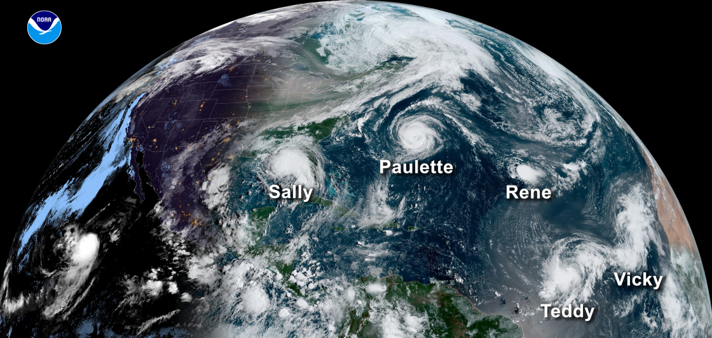
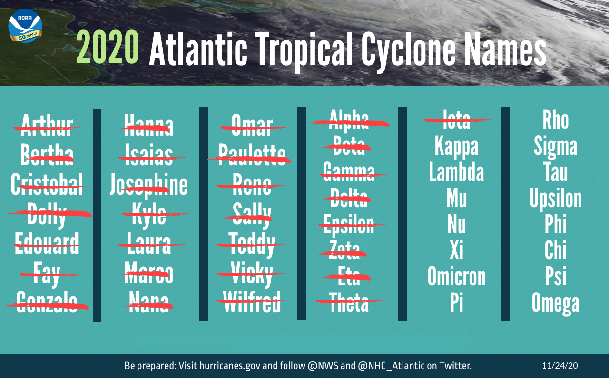
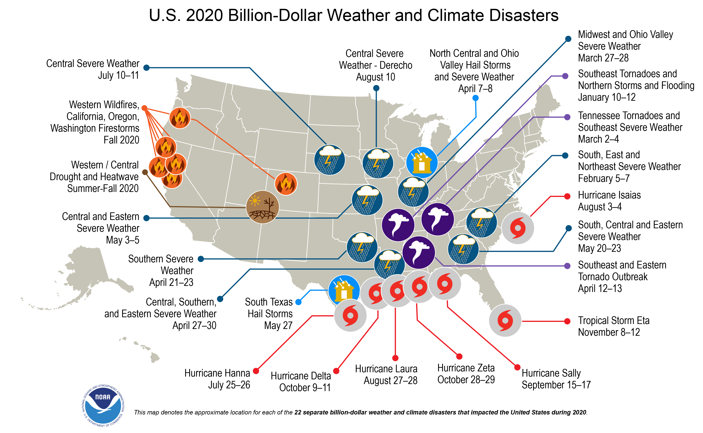
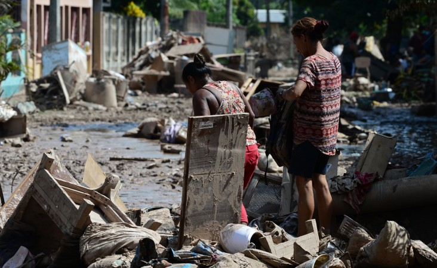
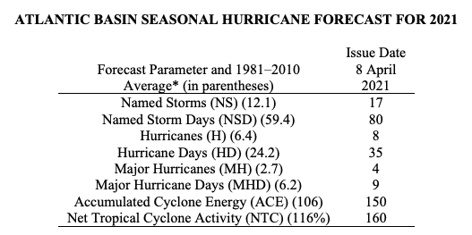
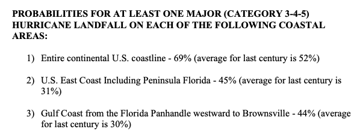

---
output:
  beamer_presentation:
    includes:
      in_header: header.tex
      before_body: anderson_beforebody.txt
fontsize: 10pt
---

## 2020's record-breaking hurricane season

```{r echo = FALSE, out.width = "\\textwidth"}

```

\centering{Five concurrent storms during the North Atlantic basin's record-breaking 2020 season.}

\footnotesize Source: NOAA


## 2020's record-breaking hurricane season

```{r echo = FALSE, out.width = "\\textwidth"}

```

\centering{Storm names from the North Atlantic basin's record-breaking 2020 season.}

\footnotesize Source: NOAA

## 2020's record-breaking hurricane season

```{r echo = FALSE, out.width = "\\textwidth"}

```

\centering{Billion-dollar weather and climate disasters in the US in 2020.}

\footnotesize Source: NOAA

## 2020's record-breaking hurricane season

```{r echo = FALSE, out.width = "\\textwidth"}

```

\centering{Cleaning up after Hurricane Eta in Honduras.}

\footnotesize Source: USAID

<!-- ## Colorado State University 2021 Atlantic seasonal forecast -->

<!-- ```{r echo = FALSE, out.width = "\\textwidth"} -->
<!--  -->
<!-- ``` -->

<!-- \footnotesize Source: Colorado State University, https://tropical.colostate.edu/Forecast/2021-04.pdf -->

<!-- ## Colorado State University 2021 Atlantic seasonal forecast -->

<!-- ```{r echo = FALSE, out.width = "\\textwidth"} -->
<!--  -->
<!-- ``` -->

<!-- \footnotesize Source: Colorado State University, https://tropical.colostate.edu/Forecast/2021-04.pdf -->

<!-- ## Human impacts of tropical cyclones -->

<!-- (recent relevant papers from participants) -->

## Health Impacts of Hurricanes in the Atlantic Basin

**Panelist talks:**

- Andrea Schumacher, *Using meteorological and health data to determine hurricane exposure*
- James Done, *The changing character of hurricanes and their impacts*
- Kate Weinberger, *Long-term health impacts of hurricanes in the eastern United States*
- Robbie M. Parks, *Tropical cyclone exposure is associated with increased hospitalization rates in older adults*
- Rachel Nethery, *Integrated causal-predictive machine learning models for tropical cyclone epidemiology*
- Greg Cohen, *Hurricanes and population mental health*


**Questions and Answers**, Marianthi-Anna Kioumourtzoglou, moderator 
