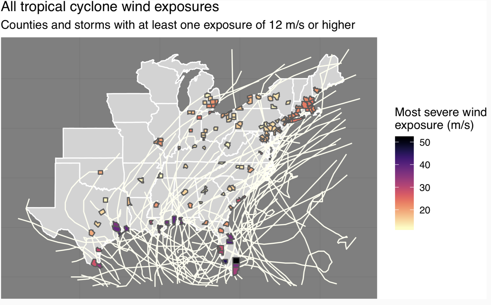
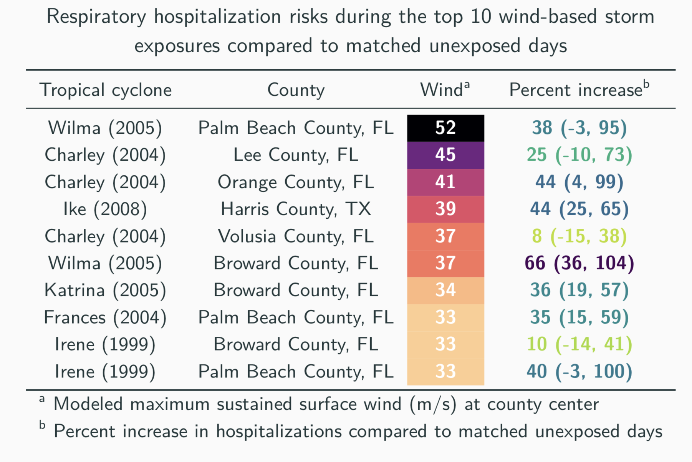
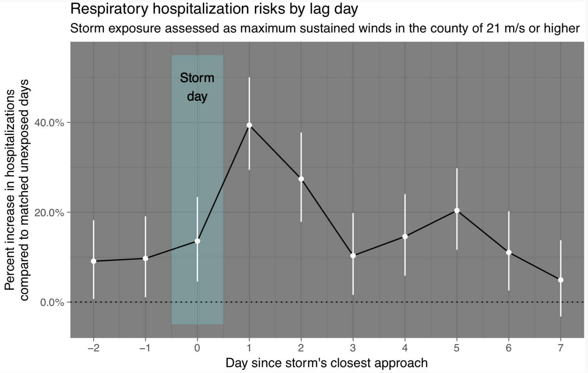
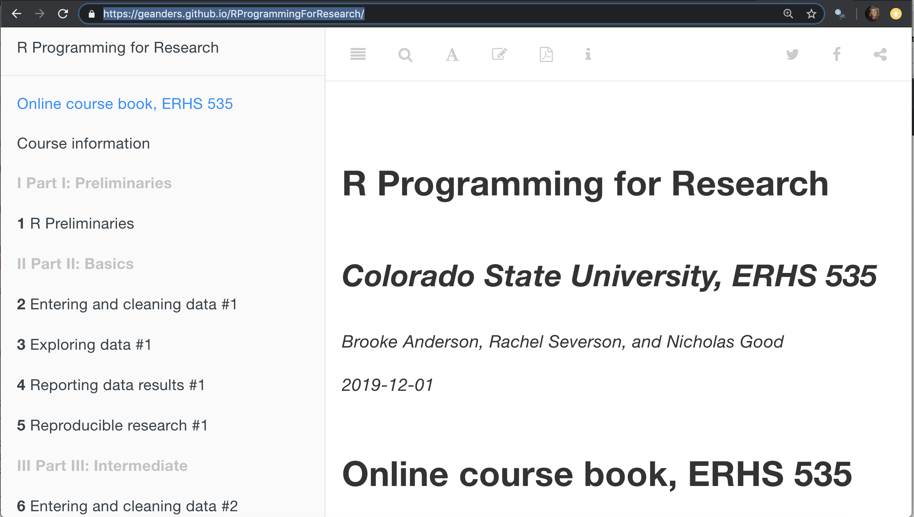
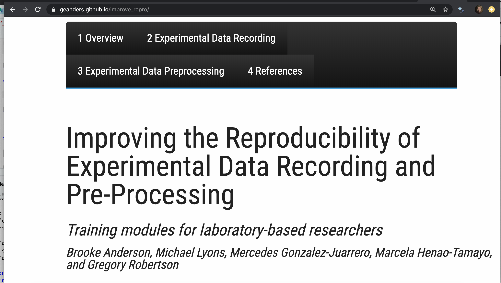

```{r setup, include=FALSE}
knitr::opts_chunk$set(echo = FALSE)
```

## Education and Position

B.S. in Chemical Engineering \newline
*North Carolina State University*

Ph.D. in Environmental Engineering \newline
*Yale University*

PostDoc in Biostatistics \newline
*Johns Hopkins Bloomberg School of Public Health*

Asst. Prof. of Environmental Epidemiology \newline
*Dept. of Environmental & Radiological Health Sciences, CSU*

## Environmental epidemiology

```{r echo = FALSE, out.width = "\\textwidth"}

```

## Environmental epidemiology

```{r echo = FALSE, out.width = "\\textwidth"}

```

## Environmental epidemiology

```{r echo = FALSE, out.width = "\\textwidth"}

```

## R Programming

```{r echo = FALSE, out.width = "\\textwidth"}

```

https://geanders.github.io/RProgrammingForResearch/

## R Programming

```{r echo = FALSE, out.width = "\\textwidth"}

```

https://www.coursera.org/specializations/r

## Reproducible research

```{r echo = FALSE, out.width = "\\textwidth"}

```

https://geanders.github.io/improve_repro/

## Statistics for biology course

```{r echo = FALSE, out.width = "\\textwidth"}

```

https://kind-neumann-789611.netlify.com/

## Statistics for biology course

Topics include: 

Clustering \newline
Mixture Models  \newline
Testing \newline
Networks and Trees \newline
High-Throughput Count Data  \newline
Image Data \newline
Supervised Data  \newline
Design of High-Throughput Experiments


